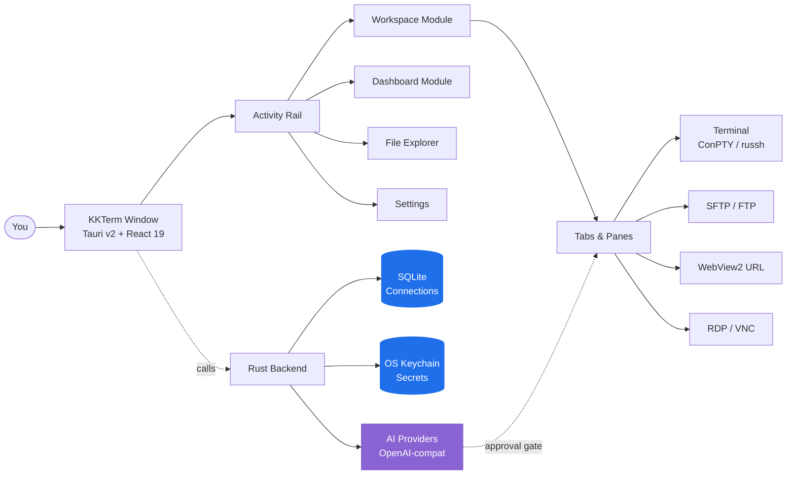

<p align="center">
  
</p>

<h1 align="center">KKTerm</h1>

<p align="center">
  <strong>Der native Windows-Admin-Workspace, den das KI-Tools-Zeitalter zu bauen vergessen hat — Terminals, SSH, SFTP, RDP/VNC, Dashboards und eine KI, die deine eigenen Tool-Widgets baut.</strong>
</p>

<p align="center">
  <em>Weil deine Taskleiste nicht wie ein Spielautomat aussehen sollte.</em>
</p>

<p align="center">
  <sub>Benannt nach <strong>乖乖 (Kuāi Kuāi)</strong>, dem grünen Kokos-Snack, den taiwanische Sysadmins auf ihre Server stellen, damit die sich ordentlich benehmen. Wir hoffen, dass diese App ihren Platz im Rack verdient.</sub>
</p>

<p align="center">
  <a href="https://github.com/ryantsai/KKTerm/stargazers">
    
  </a>
  <a href="https://github.com/ryantsai/KKTerm/network/members">
    
  </a>
  <a href="https://github.com/ryantsai/KKTerm/issues">
    
  </a>
  <a href="https://github.com/ryantsai/KKTerm/blob/main/LICENSE">
    
  </a>
  <br />
  
  
  
  
  
  <br />
  <sub>
    <a href="README.md">English</a> ·
    <a href="README.zh-TW.md">繁體中文</a> ·
    <a href="README.zh-CN.md">简体中文</a> ·
    <a href="README.ja.md">日本語</a> ·
    <a href="README.ko.md">한국어</a> ·
    <a href="README.fr.md">Français</a> ·
    <strong>Deutsch</strong> ·
    <a href="README.es.md">Español</a> ·
    <a href="README.es-MX.md">Español (MX)</a> ·
    <a href="README.it.md">Italiano</a> ·
    <a href="README.pt-BR.md">Português (BR)</a> ·
    <a href="README.th.md">ไทย</a> ·
    <a href="README.id.md">Bahasa Indonesia</a> ·
    <a href="README.vi.md">Tiếng Việt</a>
  </sub>
</p>

---

## Das Versprechen (45 Sekunden)

Du bist Sysadmin / DevOps / Homelab-Bastler / Vibe-Coder. Gerade hast du:

- Einen Terminal-Emulator
- Einen separaten SSH-Client (mit einer Profilliste, die dich ein Wochenende gekostet hat)
- Einen SFTP-Client von 2007, der irgendwie immer noch ausgeliefert wird
- Remote Desktop in einem Fenster, das du ständig auf dem falschen Monitor verlierst
- Einen VNC-Viewer für diese eine Linux-Kiste
- Einen Browser-Tab für die Router-Admin-UI
- Eine `aider`- / `claude`- / `codex`-Session auf einer Remote-Dev-Box, die abbricht, sobald dein WLAN auch nur niesen muss
- Einen Zettel mit Passwörtern *(keine Sorge, wir sagen nichts)*

**KKTerm ist ein einziges Fenster für all das.** Nativ unter Windows — *mit Absicht, während der Rest der Dev-Tools-Welt alles zuerst für Mac ausliefert und dein Betriebssystem wie eine Fußnote behandelt* — geschrieben in Rust + Tauri v2, kommt als einzelnes Installer-Paket und telefoniert nicht nach Hause.

Dazu ein paar Dinge, von denen du nicht wusstest, dass du sie willst:

- Ein **Dashboard**, auf dem du einer KI sagst *„Bau mir ein Widget, das meinen Router alle 30 Sekunden anpingt"* — und es erscheint, sandboxed, in deinem Grid.
- **SSH-Panes, die sich automatisch an benannte tmux-Sessions anhängen**, damit deine Remote-`claude`- / `codex`- / `aider`-Session jeden WLAN-Aussetzer deines Laptops übersteht.
- Neun **animierte Canvas-Hintergründe** (ja, inklusive `matrix`) für das Dashboard, weil wir uns für nichts zu schade sind.

Und die KI-Assistentin kann aus einem Satz ein kleines Dashboard-Tool machen, das du tatsächlich weiterbenutzt.

> ⭐ **Wenn das nach der App klingt, die du seit sechs Jahren bauen wolltest — vergib dem Repo einen Stern, damit wir wissen, dass jemand zuschaut. Das hilft wirklich.**

---

## Warum "KKTerm"?

Geh in ein taiwanisches Rechenzentrum und schau auf die Oberseite der Racks. Hinter TSMC-Fabs, Taipeis Metro-Leitständen, Cathay-Bank-Serverräumen, Chunghwa-Telecom-Vermittlungstechnik — du wirst immer eine kleine grüne Tüte 乖乖 (Kuāi Kuāi) entdecken, einen kokosnussgewürzten Corn-Snack aus den 1960ern.

Der Name bedeutet wörtlich **„sei brav"**, **„benimm dich"**. Die IT-Tradition ist klar und vollkommen ernst gemeint:

- **Muss grüne Sorte sein (Kokos).** Gelb (Curry) bedeutet *krank zur Arbeit kommen*; Rot (scharf) macht den Server zornig. Nur Grün.
- **Darf nicht abgelaufen sein.** Ein alter Kuai Kuai wirkt gegen dich. Engineers wechseln ihn gewissenhaft aus.
- **Muss sichtbar sein.** Der Server muss wissen, dass er da ist.
- **Nicht essen.** Diese Tüte ist im Dienst.

Einige der größten, langweiligsten, obsessiv-uptime-besessenen Systeme Asiens laufen mit einer Tüte Puffmais am Gehäuse. Es funktioniert, weil die Menschen, die sie warten, daran glauben — eine erstaunlich ehrliche Beschreibung der meisten IT-Kultur.

**KKTerm** ist **Kuai Kuai Term** — ein Admin-Workspace, der denselben Job anstrebt wie der Snack: still neben deinen wichtigen Maschinen sitzen und ihnen helfen, sich ordentlich zu benehmen. Local-first. Kein Telemetrie. KI hinter einer Freigabeschranke. Die langweilige, verlässliche Art von Software.

Wir haben es noch nicht geschafft, eine echte Tüte Kuai Kuai mit dem Installer zu liefern. Das steht auf der v2-Liste.

---

## In Aktion sehen

<!--
  TODO: Replace this placeholder with a real demo GIF.
  Recommended:
    - 5-10 seconds, looped
    - Show: open a Connection -> split a pane -> SFTP upload -> AI proposes a command
    - Target ~5 MB so GitHub renders it inline without lazy-loading
  Suggested path: docs/assets/demo.gif
  Then change the  below to: src="docs/assets/demo.gif"
-->

<p align="center">
  <a href="https://github.com/ryantsai/KKTerm">
    
  </a>
</p>

<p align="center"><sub><em>(Demo-GIF kommt hier hin. Ein Bild sagt mehr als tausend Bullet-Points, und uns sind die Bullet-Points ausgegangen.)</em></sub></p>

---

## Warum Leute es den ganzen Tag offen lassen

### Windows-first — mit Absicht

Schau dich in der Dev-Tooling-Landschaft von 2026 um. Claude Code: zuerst für Mac/Linux, Windows heißt „nimm WSL." Codex CLI: genauso. `aider`, `gemini-cli`, die Hälfte von Homebrew, jede glänzende neue TUI: Mac/Linux zuerst, Windows-Nutzer bekommen einen `# Windows: contributions welcome`-Kommentar im README und ein Fish-Completion-Skript, das nicht läuft.

Dabei sitzen die Menschen, die Unternehmen wirklich am Laufen halten — Corporate IT, MSPs, alle, die Hyper-V, AD, SCCM, IIS oder einen Domain Controller betreiben, der älter ist als manche Praktikanten — vor Windows-Maschinen und fragen sich, warum jedes neue Tool ihr Betriebssystem wie eine Zumutung behandelt.

**KKTerm macht das Gegenteil.** Wir bauen zuerst nativ für Windows, macOS- und Linux-Ports folgen. Das bedeutet, wir können die Windows-APIs nutzen, die wirklich wichtig sind, anstatt sie mit einer Portabilitätsschicht zu überkleistern:

- **ConPTY** für lokale Shells — die echte Windows-Pseudokonsole, kein Übersetzungs-Shim. PowerShell, `cmd.exe`, WSL-Distros, alle als echte PTYs mit Focus, Resize und VT-Sequence-Handling, das dem Plattformverhalten entspricht.
- **WebView2** für die gesamte UI und eingebettete URL-**Connections** — In-Process-Chromium mit der System-Runtime, was unter anderem der Grund ist, warum der Installer klein ist und schnell startet.
- **Microsoft RDP ActiveX (`mstscax.dll`)** für RDP — *der echte, von Microsoft ausgelieferte*. Dasselbe Steuerelement wie Remote Desktop Connection (`mstsc.exe`). Keine Drittanbieter-Reimplementierung, kein FreeRDP in einer Wrapper-Schicht. RDP-Profis merken den Unterschied in fünf Sekunden.
- **Windows Credential Manager** für alle Geheimnisse. SSH-Passwörter, FTP-Passwörter, API-Keys, URL-Connection-Credentials — sie leben im OS keychain, und `credwiz.exe` kann sie auditieren.
- **NSIS-Installer für aktuelle Nutzer** mit passendem SHA-256, nativem Tray-Menü, Don't-Sleep-Stromsperre, Host-CPU/RAM/Netzwerk-Sampling, nativen Tauri-Kontextmenüs mit echten PNG-Icons, nativen Öffnen/Speichern-Dialogen. Keines davon ist gemockt.
- **WSL ist eine erstklassige Shell, kein Workaround.** Starte Ubuntu neben einem PowerShell-Pane neben einer SSH-Session neben einem RDP-**Tab** — alles im selben Fenster.

Die macOS- und Linux-Builds stehen auf der Roadmap und werden dieselbe Sorgfalt bekommen. Aber wenn du darauf gewartet hast, dass jemand das *gute* Windows-Admin-Tool zuerst statt zuletzt baut — das ist das Angebot.

### Local-first bedeutet wirklich lokal

Deine gespeicherten **Connections** leben in einer SQLite-Datei auf deiner Maschine. Passwörter leben im **Windows Credential Manager**, nicht in einem JSON neben der Binary. Die App liefert keine Analytics, ruft beim Start nicht nach Hause und braucht keinen Cloud-Account zum Starten. Es gibt kein „Anmelden zum Synchronisieren", weil es keine Synchronisierung gibt.

Wenn dein Netzwerkkabel Feuer fängt, öffnet KKTerm trotzdem.

### Ein Workspace, jede Verbindungsart

| Du wolltest… | KKTerm hat |
| --- | --- |
| Eine lokale PowerShell / cmd / WSL-Shell öffnen | ConPTY-gestützte lokale Terminal-**Sessions** |
| Per SSH auf einen Server | Natives `russh` mit Agent- / Key- / Passwort-Auth, Host-Key-Trust-Flow, ProxyJump, Port-Forwarding |
| Dateien auf diesem Server durchsuchen | SFTP gestartet aus der SSH-**Connection**, Doppelscheibe, rekursive Transfers, chmod/chown |
| FTP zu einem NAS von 2012 | FTP / FTPS-**Connections** im selben SFTP-artigen Browser |
| Telnet zu alter Hardware | Ja, gut, Telnet ist auch drin |
| Mit einem seriellen Port reden | Serial-**Connection**-Art, COM-Port + Baud, kein Zusatz-Tooling |
| Remote auf eine Windows-Maschine | Natives RDP via Microsoft-ActiveX-Steuerelement (das echte, kein Klon) |
| VNC zu einem Pi | Rust `vnc-rs` framebuffer direkt in den Workspace gerendert |
| Die Router-Web-UI öffnen | Eingebettete WebView2-**URL Connection** mit Credential-Fill |
| CPU des Hosts beobachten | Live-Statusleiste + ein **Dashboard**-Modul mit Drag/Resize-Widgets |

Alles dieselbe App. Dasselbe Fenster. Dieselben Hotkeys. Dasselbe hoffentlich-nicht-augenblutende Theme.

### Terminals, die nicht den Verstand verlieren

- Geteilte Panes innerhalb eines **Tabs**.
- WebGL-beschleunigtes xterm.js-Rendering, mit graceful Fallback wenn nötig.
- Scrollback-Suche.
- tmux-gestützte SSH-Panes, die sich an stabile per-Pane-Sessions anhängen können — Wiederverbinden bedeutet wirklich *Wiederverbinden*, nicht „von vorne anfangen und so tun, als wäre die letzte Stunde nie gewesen."
- **Tabs** wechseln **tötet die Session nicht**. Den **Tab** schließen schon. Diese Unterscheidung war intern ein Glaubenskrieg; wir haben gewonnen.

### Ein KI-Assistent, der deine Tools baut

Die meisten „KI in deinem Terminal"-Demos bleiben beim Chat stehen. KKTerms Assistent kann auch kleine, dauerhafte Dashboard-Widgets für deine echte Arbeitsweise bauen. Gefährliche Dinge bleiben trotzdem hinter zwei Schaltern:

- **Tool-Familien** (Dashboard / Connections / Live Sessions) — ein- oder ausschalten pro Kategorie.
- **Berechtigungsmodus** im Composer — `Prompt` (Standard, fragt jedes Mal) oder `Allow All` (du bist erwachsen, du hast den Haftungsausschluss unterschrieben).

Sprich mit OpenAI, Anthropic, OpenRouter, DeepSeek, Grok, Azure OpenAI, LiteLLM, GitHub Copilot, Ollama, NVIDIA oder allem, was OpenAI-kompatibel ist. API-Keys gehen in den OS keychain. Modelle, die `rm -rf` vorschlagen, werden als gefährlich eingestuft und erfordern explizite menschliche Genehmigung. Die KI kann nicht still einen destruktiven Befehl ausführen, weil jemand clever mit einem Prompt-Injection in einer Man-Page war.

### Ein Dashboard, das nicht so tut, als wäre es Grafana

Das **Dashboard**-Modul ist ein 12-spaltiges Drag/Resize-Grid aus Widget-Instanzen. Es ist nicht für Petabyte-Observability — es ist für „Ich will einen Button, um meine fünf Lieblingsapps zu starten, und ein Panel mit der Uptime meines SSH-Hosts, *neben* meinem Chat."

#### KI-erstellte Widgets — beschreibe es, bekomme es

Das ist der Teil, über den wir uns wirklich freuen. Du suchst dir nichts aus einem Marktplatz aus und du schreibst kein JavaScript. Du **sagst dem KI-Assistenten, was du willst**, und er baut das Widget direkt auf deinem Dashboard:

> *„Füge ein Widget hinzu, das die letzten 5 Commits meines Haupt-Repos als Liste zeigt."*
> *„Mach mir ein Haftnotiz-Widget, das mein Bereitschafts-Spickzettel hält."*
> *„Bau ein Widget, das meinen Heimrouter alle 30 Sekunden anpingt und Grün/Rot zeigt."*
> *„Ich brauche eine Stoppuhr. Überrasch mich beim Styling."*

Zwei Varianten:

- **Content-Widgets** — deklaratives JSON: Markdown, KV-Listen, Checklisten, einzelne große Zahl. Sicher von Haus aus, kein Script. Die meisten „Ich brauche das einfach auf meinem Dashboard"-Anfragen landen hier.
- **Script-Widgets** — JavaScript, gehostet in einem isolierten `iframe srcdoc`-Sandbox mit explizit deklarierten Berechtigungen (`network`-Allowlist, `pollSeconds`-Budget). Die KI schreibt das Script, du genehmigst die Berechtigungen, das Widget läuft in einer Box, die den Rest der App nicht erreichen kann.

Jedes Widget, das du behältst, gehört dir. Es persistiert in SQLite neben deinen **Connections**, mit eigenem visuellem Preset (`panel` / `ambient` / `hero`), Akzentfarbe, Icon und Titel. Mehrere Instanzen desselben Widgets können nebeneinander existieren, mit völlig unterschiedlichen Größen und Stilen. Per Rechtsklick löschen, wenn der Zauber verblasst.

#### Animierte Dashboard-Hintergründe (weil wir es wollten)

Das Dashboard hat neun canvas-animierte Hintergründe, die du pro **Dashboard View** auswählen kannst:

| Stimmung | Hintergründe |
| --- | --- |
| Ruhig | `aurora`, `raindrops` |
| Weltraum | `starfield`, `nebula` |
| Warm | `embers`, `lava` |
| Nerd | `matrix`, `synthwave` |
| Chaotisch | `confetti` |

Sie laufen auf einem einzigen gemeinsamen `requestAnimationFrame` und respektieren den Fensterfokus, sodass sie so gut wie nichts kosten, wenn du woanders bist. Kombiniere `matrix` mit deinem KI-Assistenten für eine Atmosphäre, die sagt „Ich bin extrem produktiv und möglicherweise in einem Wachowski-Film." Oder wähle `mist` und wirke wie ein ernsthafter Mensch. Wir urteilen über keine der beiden Entscheidungen.

### KI-Coding-Agents auf einem Server — richtig gemacht

Das ist das zweite Feature, in das sich die Leute verlieben. KKTerms SSH-Terminals können direkt in eine **benannte tmux-Session** auf dem Remote-Host starten — standardmäßig eine automatisch generierte freundliche ID wie `kkterm-cockpit001`, die Reconnects überlebt:

- Öffne eine SSH-**Connection** mit aktiviertem tmux.
- Starte im Pane `claude`, `codex`, `aider`, `gemini-cli`, `cursor-agent` oder welchen langlebigen Coding-Agenten du bevorzugst. Sie sind Vollbild-TUI-Apps; tmux ist genau der richtige Ort für sie.
- Klappe den Laptop zu. Mach ihn wieder auf. Der Pane hängt sich lautlos an dieselbe tmux-Session an. Der Agent läuft noch, hat seinen Scrollback noch, ist noch mitten in dem, was er tat.
- Kurzer Netzwerkausfall auf dem SSH-Transport? KKTerm versucht eine begrenzte, stille Wiederanbindung an dieselbe tmux-ID, ohne dich zu stören.
- Willst du, dass der KI-Assistent sieht, was der Agent tut? „Terminal-Buffer zum Kontext hinzufügen" ruft `capture_tmux_pane` über SSH auf und zieht den vollständigen tmux-Scrollback — nicht nur was auf dem Bildschirm ist, die gesamte Session — in das Gespräch. Dein lokaler Assistent kann jetzt über die Arbeit deines Remote-Agenten nachdenken.

Wenn du jemals eine sechsstündige `aider`-Session durch ein wackeliges Hotel-WLAN verloren hast, amortisiert dieses einzige Feature die App. Die App ist kostenlos. Das Feature ist trotzdem seinen Preis wert.

---

## Wie es zusammenpasst



Die wichtige Form: persistente gespeicherte Daten (**Connection**) sind getrennt von dem Live-Laufzeitzustand (**Session**), der wiederum getrennt vom UI-Container (**Tab**) ist. Einen **Tab** schließen beendet die **Session**. **Tabs** wechseln nicht. Das ist die Regel, die die App bei Verstand hält.

---

## Aktuelle Feature-Übersicht

| Bereich | Heute implementiert |
| --- | --- |
| **Connections** | SQLite-gestützter Baum, Ordner/Unterordner, Suche, Drag/Drop-Reihenfolge, Umbenennen, Duplizieren, Löschen, **Quick Connect**, benutzerdefinierte Icons, angeheftete/aktive Rail-Shortcuts |
| **Terminal** | Lokale Shells, SSH, Telnet, Serial, geteilte Panes, xterm.js + opportunistisches WebGL, Scrollback-Suche, lokales Startverzeichnis/-skript |
| **SSH** | Natives `russh`, Agent-/Key-/Passwort-Auth, Host-Key-Trust-Flow, optionaler System-SSH-Fallback, ProxyJump, Port-Forwarding, **automatisch benannte tmux-Sessions (`kkterm-<scifi-name><n>`) mit stillem Wiederanhängen bei Transport-Unterbrechung** — perfekt für langlebige Remote-Coding-Agents (Claude Code, Codex, aider usw.) |
| **SFTP / FTP** | SSH-gestartetes SFTP plus FTP/FTPS-**Connections**, Doppelscheiben-Browser, rekursive Transfers, Warteschlange/Abbruch/Verlauf löschen, Konflikte, Eigenschaften, chmod/chown wo unterstützt |
| **URL WebView** | Eingebettete WebView2-URL-**Sessions**, Navigations-Toolbar, Favicon-Erfassung, gespeicherte Website-Credential-Metadaten/-Fill, Datenpartitions-Metadaten |
| **Remote Desktop** | RDP über Windows ActiveX mit geometriebegrenztem Overlay-Parking; VNC über `vnc-rs`-Framebuffer im Workspace-Canvas gerendert |
| **Dashboard** | Dauerhafte Views, Widget-Instanzen, Bearbeitungsmodus, Drag/Resize, App Launcher, **KI-authored Content-/Script-Widgets** (deklaratives JSON oder sandboxed iframe JS mit Berechtigungen), per-Widget-Presets / Akzent / Icon / Titel, **9 animierte Canvas-Hintergründe** (aurora, raindrops, starfield, nebula, embers, lava, matrix, synthwave, confetti) |
| **AI Assistant** | Streaming-Chat, OpenAI-kompatibler Runtime, Provider-Registry, Sicherheitsklassifikation für Befehlsvorschläge, Screenshot-/Kontext-Anhänge, **Dashboard-Widget-Authoring (Content + sandboxed Script)**, **tmux-Pane-Capture** als Gesprächskontext für Remote-Sessions, **Connection**-Management-Tools und Live-**Session**-Tools für Terminal, RDP/VNC und SFTP/FTP |
| **Settings** | Allgemein, Darstellung, Credentials, KI, SSH, Terminal, URL, RDP, VNC, Dashboard, Über; benutzerdefinierte UI-Schriften; Minimieren in Tray; Don't Sleep; Backup/Import |
| **Localization** | i18next-UI mit englischer Quelle und dynamischen Locale-Bundles: zh-TW, zh-CN, ja, ko, fr, de, es, es-MX, it, pt-BR, th, id, vi |

### KI-Provider

OpenAI · Anthropic · OpenRouter · DeepSeek · Grok · Azure OpenAI · LiteLLM · GitHub Copilot · Ollama · NVIDIA · jeder OpenAI-kompatible Endpunkt.

Provider-Metadaten liegen in [`src/ai/providerRegistry/`](src/ai/providerRegistry/); Rust-Adapter in [`src-tauri/src/ai/providers/`](src-tauri/src/ai/providers/). API-Keys gehen durch den OS keychain, niemals SQLite.

---

## Schnellstart

Du brauchst:

- **Windows** (primär unterstützte Plattform)
- **Node.js + npm**
- **Rust toolchain**
- **Tauri v2-Voraussetzungen für Windows** inklusive **WebView2**

```bash
npm install
npm run tauri dev
```

Das sollte ein echtes natives Fenster erzeugen. Wenn es stattdessen einen Stack Trace produziert, melde bitte ein Issue — wir lieben eine gute Repro.

### Häufige Checks

```bash
npm run check                                              # TypeScript
npm run build                                              # Vite build
cargo check --manifest-path src-tauri/Cargo.toml           # Rust
cargo test  --manifest-path src-tauri/Cargo.toml           # Rust tests
```

### Den Windows-Installer bauen

```bash
npm run package:installer
```

Das Installer-Skript schreibt `artifacts/kkterm-<version>-windows-x64-setup.exe` und eine passende `.sha256`-Datei. Der Installer ist derzeit **unsigniert** — Release-Signierung steht auf der Roadmap, bis dahin wird dein Antivirusprogramm dich möglicherweise streng anschauen. Das ist normal.

---

## Was KKTerm nicht ist

Eine kurze Liste, weil Ehrlichkeit Vertrauen schafft:

- **Kein Cloud-Produkt.** Kein Sync, keine Team-Accounts, keine SaaS-Stufe. Wenn du jemals einen „Bei KKTerm anmelden"-Dialog siehst, ist etwas katastrophal schiefgelaufen.
- **Gibt nicht vor, plattformübergreifend zu sein.** Wir sind bewusst Windows-first; macOS- und Linux-Ports stehen auf der Roadmap und werden dieselbe Tauri-v2-Shell nutzen. Wenn du heute ein Mac-first-Tool brauchst, hast du Hunderte von Optionen. Wir bauen das Tool, auf das Windows-Admins still gewartet haben.
- **Kein autonomer KI-Agent.** Der Assistent schlägt vor; der Mensch entscheidet. `Allow All` ist eine Wahl, die du triffst, kein Standard.
- **Kein Grafana- / Datadog-Ersatz.** Das Dashboard ist für persönliche Steueroberflächen, nicht für 10.000-Host-Observability.
- **Keine Kubernetes-IDE.** Es ist ein terminal-first-Admin-Workspace. Bitte frag ihn nicht, ein Helm-Chart zu rendern.

Wenn eines davon ein Dealbreaker war — fair genug, wir sehen uns in v2.

---

## Natives Debugging

Verwende die echte Tauri-Runtime zur Validierung:

```bash
npm run tauri dev
```

Eine Vite-Browser-Vorschau ist für einige Frontend-Inspektionen nützlich, hostet aber **keine** echte WebView2-, ConPTY-, RDP-ActiveX-, VNC-Framebuffer-, Keychain- oder native Menüoberfläche. Wenn ein Feature eines davon berührt, validiere es in der echten Desktop-Runtime.

VS-Code-Nutzer: Die `Run KKTerm exe`-Launch-Config startet `src-tauri/target/debug/kkterm.exe` mit `RUST_BACKTRACE=1`. Die dazu passende `Attach KKTerm WebView2`-Config gibt dir DevTools innerhalb des echten WebView2-Hosts.

---

## Bekannte Grenzen (ja, wir wissen es)

- Der Installer ist derzeit unsigniert. Update-Checks sind deaktiviert, bis die Release-Signierung konfiguriert ist.
- SFTP über ProxyJump wird im nativen SFTP-Pfad noch nicht unterstützt.
- Transfer-Wiederaufnahme, Ordner-Sync/-Diff, Archiv-/Extrahieren und Remote-Bearbeitung sind zurückgestellt.
- SSH-Config-Import ist implementiert, aber der benutzerseitige Eintrag in Settings ist noch nicht verfügbar.
- RDP und VNC werden ausgeliefert; reichhaltigere Clipboard-/Geräte-Sync- und Qualitätssteuerungen entwickeln sich noch.
- macOS- und Linux-Builds stehen auf der Roadmap. Sie kommen, und sie werden ordentlich gemacht — nicht als „wir laufen irgendwie auch da drüben"-Port herausgestürzt.
- Der KI-Assistent schlägt vor und kann aktivierte Tools innerhalb der konfigurierten Berechtigungsgrenze bedienen — bitte behandle ihn nicht als unbeaufsichtigten Roboter. Er weiß tatsächlich nicht, was dein CEO will.

---

## Roadmap (die Kurzfassung)

- macOS + Linux-Builds
- Signierter Installer + Auto-Update
- SFTP über ProxyJump im nativen Pfad
- Transfer-Wiederaufnahme, Ordner-Sync, Archiv/Extrahieren
- Reichhaltigere RDP-Clipboard-/Geräteumlenkung
- Mehr eingebaute **Dashboard**-Widgets (und ein öffentliches Schema für KI-authored ones)

Vollständige und häufig aktualisierte Version: [`docs/ROADMAP.md`](docs/ROADMAP.md).

---

## Mitwirken

Wir würden uns freuen über jede Hilfe. Wirklich. Auch kleine Dinge zählen:

- **Probiere den Dev-Build aus** und melde ein Issue, wenn etwas sich falsch anfühlt. „Es fühlte sich falsch an" ist ein legitimer Bug-Report; wir graben gemeinsam.
- **Übersetze eine Locale.** Englisch ist die Source of Truth in [`src/i18n/locales/en.json`](src/i18n/locales/en.json); 12 weitere Locales liegen daneben und laden on demand. Ausstehende Strings werden per Key unter [`docs/localization_todo/`](docs/localization_todo/) verfolgt — nimm einen, übersetze ihn, lösch die Datei.
- **Füge ein Dashboard-Widget hinzu.** Eingebaute Widgets liegen in [`src/dashboard/widgets/`](src/dashboard/widgets/). Nimm eine kleine Idee, liefere sie aus, lern das Muster.
- **Verschlanke die KI-Tool-Oberfläche.** Provider-Adapter liegen in [`src-tauri/src/ai/providers/`](src-tauri/src/ai/providers/); die Frontend-Registry ist in [`src/ai/providerRegistry/`](src/ai/providerRegistry/).
- **Verbessere das Handbuch.** Endbenutzer-Docs liegen in [`docs/manual/`](docs/manual/). Ein Kapitel pro UI-Modul. Wenn du ein Feature benutzt hast und die Docs nicht halfen, ist ein PR, der das behebt, Gold wert.

Vollständiges Setup, Projektlayout, PR-Checkliste und die Liste der „bitte das nicht kaputt machen"-Regeln liegen in [`CONTRIBUTING.md`](CONTRIBUTING.md). Die 30-Sekunden-Highlights:

- **Lies [`CONTEXT.md`](CONTEXT.md) bevor du benutzerseitige Begriffe umbenennst.** **Connection**, **Session**, **Tab** und **Quick Connect** bedeuten spezifische Dinge; bitte nicht verwässern.
- **Jeder benutzersichtbare String geht durch `t()`.** Kein nackter englischer Text in JSX.
- **Keine Frontend-Close-Hooks.** Tauri v2s Titelleisten-Schließen wurde durch `onCloseRequested`-Muster ein halbes Dutzend Mal kaputt gemacht. Wir haben endlich eine funktionierende Form; bitte nicht wieder einführen.
- **Führe die Checks aus** (`npm run check && npm run build && cargo check && cargo test`) bevor du einen PR öffnest.

Suchst du einen Einstiegspunkt? Filtere offene Issues nach [`good first issue`](https://github.com/ryantsai/KKTerm/issues?q=is%3Aissue+is%3Aopen+label%3A%22good+first+issue%22) oder [`help wanted`](https://github.com/ryantsai/KKTerm/issues?q=is%3Aissue+is%3Aopen+label%3A%22help+wanted%22). Wenn noch keine getaggt sind, öffne ein Issue, das beschreibt, woran du arbeiten möchtest, und wir helfen beim Scopen.

---

## Projektdokumentation

- [Produktkontext](CONTEXT.md) — die Domänensprache, die du treffen solltest
- [Architektur](docs/ARCHITECTURE.md) — Modul-Map, wo neuer Code hingehört
- [Roadmap](docs/ROADMAP.md)
- [Dashboard-Architektur](docs/DASHBOARD.md)
- [KI-Provider-Leitfaden](docs/AI_PROVIDERS.md)
- [Performance-Notizen](docs/PERFORMANCE.md)
- [Release-Notes und -Gates](docs/RELEASE.md)

---

## Stack

Rust · Tauri v2 · React 19 · TypeScript · Vite · Tailwind CSS · Zustand · xterm.js · SQLite · WebView2 · `russh` · `russh-sftp` · `vnc-rs` · `suppaftp` · OS keychain storage.

---

## Star-Verlauf

<a href="https://www.star-history.com/#ryantsai/KKTerm&Date">
  <picture>
    <source media="(prefers-color-scheme: dark)" srcset="https://api.star-history.com/svg?repos=ryantsai/KKTerm&type=Date&theme=dark" />
    <source media="(prefers-color-scheme: light)" srcset="https://api.star-history.com/svg?repos=ryantsai/KKTerm&type=Date" />
    
  </picture>
</a>

Wenn du bis hier gelesen hast und noch keinen Stern vergeben hast — worauf wartest du noch, eine persönliche Einladung? Das hier ist die persönliche Einladung.

⭐ **[KKTerm auf GitHub einen Stern geben](https://github.com/ryantsai/KKTerm)** — kostet einen Klick und macht dem Maintainer die ganze Woche. Stell es dir vor als digitales 乖乖 auf dem Rack.

---

## Lizenz

MIT. Siehe [LICENSE](LICENSE). Nutze es, forke es, shippe es, bau es in ein Homelab, das sonst niemand findet — das ist der Deal.
