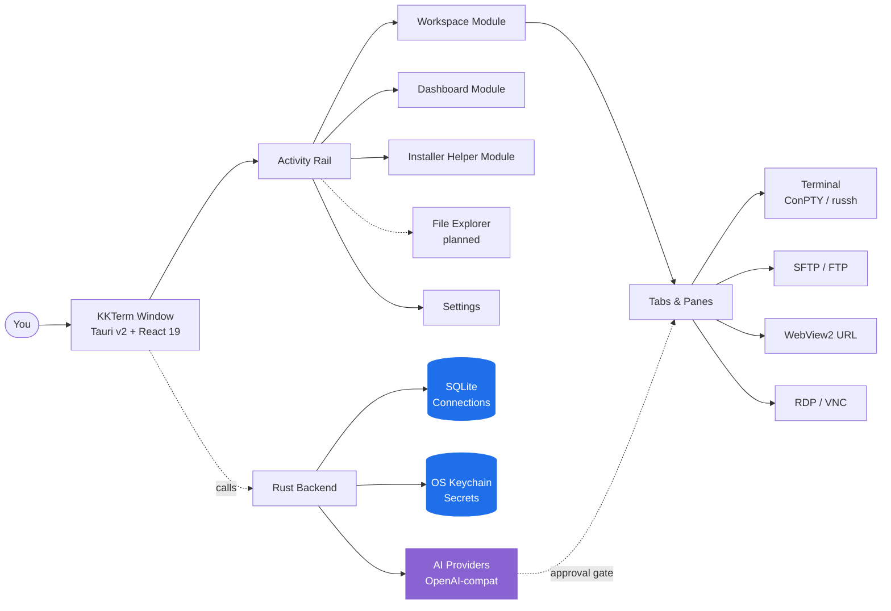

<p align="center">
  
</p>

<h1 align="center">KKTerm</h1>

<p align="center">
  <strong>El workspace de administración nativo para Windows que la era de las herramientas de IA se olvidó de construir — terminales, SSH, SFTP, RDP/VNC, dashboards, y una IA que crea tus propios widgets de herramientas.</strong>
</p>

<p align="center">
  <em>Porque tu barra de tareas no debería parecer una máquina tragamonedas.</em>
</p>

<p align="center">
  <sub>Su nombre viene de <strong>乖乖 (Kuāi Kuāi)</strong>, el snack de coco verde que los sysadmins taiwaneses ponen encima de sus servidores para que se porten bien. Esperamos que esta app se gane su lugar en el rack.</sub>
</p>

<p align="center">
  <strong><a href="https://github.com/ryantsai/KKTerm/releases/latest">Descargar el instalador más reciente para Windows (.exe)</a></strong>
</p>

<p align="center">
  <a href="https://github.com/ryantsai/KKTerm/stargazers">
    
  </a>
  <a href="https://github.com/ryantsai/KKTerm/network/members">
    
  </a>
  <a href="https://github.com/ryantsai/KKTerm/releases">
    
  </a>
  <a href="https://github.com/ryantsai/KKTerm/issues">
    
  </a>
  <a href="https://github.com/ryantsai/KKTerm/blob/main/LICENSE">
    
  </a>
  <br />
  
  
  
  
  
  <br />
  <sub><a href="README.zh-TW.md">繁體中文</a></sub>
</p>

<p align="center">
  <sub>
    <a href="README.md">English</a> ·
    <a href="README.zh-TW.md">繁體中文</a> ·
    <a href="README.zh-CN.md">简体中文</a> ·
    <a href="README.ja.md">日本語</a> ·
    <a href="README.ko.md">한국어</a> ·
    <a href="README.fr.md">Français</a> ·
    <a href="README.de.md">Deutsch</a> ·
    <a href="README.es.md">Español</a> ·
    <strong>Español (MX)</strong> ·
    <a href="README.it.md">Italiano</a> ·
    <a href="README.pt-BR.md">Português (BR)</a> ·
    <a href="README.th.md">ไทย</a> ·
    <a href="README.id.md">Bahasa Indonesia</a> ·
    <a href="README.vi.md">Tiếng Việt</a>
  </sub>
</p>

---

## El Argumento (45 segundos)

Eres sysadmin / DevOps / homelab / vibe-coder. Ahorita mismo tienes abierto:

- Un emulador de terminal
- Un cliente SSH aparte (con una lista de perfiles que te costó un fin de semana armar)
- Un cliente SFTP del 2007 que de alguna forma todavía existe
- El Escritorio Remoto en una ventana que siempre pierdes en el monitor equivocado
- Un visor VNC para ese único servidor Linux
- Una pestaña del navegador para la interfaz del router
- Una sesión de `claude` / `codex` corriendo en un servidor remoto que se cae cada vez que tu Wi-Fi estornuda
- Un papelito con contraseñas *(no te preocupes, aquí no decimos nada)*

**KKTerm es una sola ventana para todo eso.** Nativa en Windows — *a propósito, mientras el resto del mundo de herramientas para devs lanza primero en Mac y trata tu sistema operativo como nota al pie* — escrita en Rust + Tauri v2, se instala con un solo archivo y nunca llama a casa.

Y de pilón, unas cosas que no sabías que querías:

- Un **Dashboard** donde le dices a una IA *"hazme un widget que haga ping a mi router cada 30 segundos"* y aparece, en sandbox, en tu cuadrícula.
- **Paneles SSH que se re-conectan automáticamente a sesiones tmux con nombre fijo** para que tu sesión remota de `claude` / `codex` sobreviva cada berrinche de Wi-Fi que aventé tu laptop.
- Un **widget de uso de IA para codear** que muestra tus cuotas de Claude Code y Codex — ventana de 5 horas, ventana semanal, plan actual, email de la cuenta — en el **Dashboard** y en la barra de estado, para que dejes de chocar con la pared del rate-limit a las 3 de la mañana.
- Un módulo **Installer Helper** que detecta, instala, actualiza, desinstala y lanza un catálogo curado de herramientas de desarrollo para Windows — Node, Python, Docker, WSL, CLIs de coding con IA y esas utilerías pequeñas que normalmente acabas cazando entre pestañas del navegador.
- Un **servidor MCP integrado** (`kkterm-cli`) que deja que agentes de coding externos (Claude Code, Codex, Copilot, Antigravity, OpenCode) manejen tu Workspace y Dashboard — listar Connections, leer buffers de terminal, colocar widgets — sobre una superficie de herramientas curada y con aprobación. IA-a-IA, en tu máquina, sin relay en la nube.
- Veintiuno **fondos animados con canvas** (sí, incluyendo `matrix`) para el dashboard, porque no somos tan serios como aparentamos.

Ah, y el asistente de IA puede convertir una frase en una pequeña herramienta de dashboard que de verdad sigues usando.

> ⭐ **Si esto suena como la app que llevas seis años pensando en construir — ponle estrella al repo para que sepamos que alguien está mirando. De verdad ayuda.**

---

## ¿Por qué "KKTerm"?

Entra a cualquier centro de datos en Taiwán y mira la parte de arriba de los racks. Desde las fábricas de TSMC, las salas de control del Metro de Taipei, los servidores del Banco Cathay, el equipo de telecomunicaciones de Chunghwa — vas a ver una bolsita verde de 乖乖 (Kuāi Kuāi), un snack de maíz con sabor a coco de los años 60.

El nombre literalmente significa **"pórtate bien"**, **"obedece"**. La tradición de IT es directa y absolutamente seria:

- **Tiene que ser de sabor verde (coco).** El amarillo (curry) significa *quédate en casa*; el rojo (picante) enoja al servidor. Solo verde.
- **Tiene que estar vigente.** Un Kuai Kuai vencido trabaja en tu contra. Los ingenieros los cambian diligentemente.
- **Tiene que ser visible.** El servidor necesita saber que está ahí.
- **No te lo comas.** Esa bolsa está de guardia.

Algunos de los sistemas más grandes, más aburridos y más obsesionados con el uptime en Asia corren con una bolsa de palomitas de maíz pegada al chasis. Funciona porque la gente que los mantiene cree que funciona, lo cual es una descripción sorprendentemente honesta de la mayoría de la cultura de IT.

**KKTerm** es **Kuai Kuai Term** — un workspace de administración que aspira al mismo trabajo que el snack: sentarse tranquilamente junto a tus máquinas importantes y ayudarlas a portarse bien. Local-first. Sin telemetría. IA con aprobación requerida. El tipo de software aburrido y confiable.

Todavía no hemos podido incluir una bolsa real de Kuai Kuai con el instalador. Eso es un ítem para la v2.

---

## Míralo en Acción

<!--
  TODO: Reemplazar este placeholder con un GIF de demostración real.
  Recomendado:
    - 5-10 segundos, en loop
    - Mostrar: abrir una Connection -> dividir un pane -> subir por SFTP -> la IA propone un comando
    - Apunta a ~5 MB para que GitHub lo muestre en línea sin lazy-loading
  Ruta sugerida: docs/assets/demo.gif
  Luego cambia el  de abajo a: src="docs/assets/demo.gif"
-->

<p align="center">
  <a href="https://github.com/ryantsai/KKTerm">
    
  </a>
</p>

<p align="center"><sub><em>(Aquí va el GIF de demo. Una imagen vale más que mil bullets, y ya nos quedamos sin bullets.)</em></sub></p>

---

## Por Qué la Gente lo Tiene Abierto Todo el Día

### Windows primero, a propósito

Voltea a ver el panorama de herramientas para devs en 2026. Claude Code: lanza primero en Mac/Linux, Windows es "usa WSL." Codex CLI: igual. `gemini-cli`, la mitad de Homebrew, cada TUI reluciente nueva: Mac/Linux primero, y los usuarios de Windows reciben un comentario de `# Windows: se aceptan contribuciones` en el README y un script de fish-completion que no corre.

Mientras tanto, la gente que de verdad mantiene a las empresas en línea — IT corporativa, MSPs, cualquiera que corra Hyper-V o AD o SCCM o IIS o un domain controller más viejo que algunos practicantes — está frente a máquinas Windows preguntándose por qué cada nueva herramienta trata su sistema operativo como un estorbo.

**KKTerm es la apuesta contraria.** Construimos nativamente para Windows primero, y los ports de macOS / Linux vienen después. Eso significa que podemos usar las APIs de Windows que de verdad importan, en vez de tapar hoyos con capas de portabilidad:

- **ConPTY** para shells locales — la verdadera pseudo-consola de Windows, no un shim de traducción. PowerShell, `cmd.exe`, distros de WSL, todas alojadas como PTYs de verdad con foco, redimensionado y manejo de secuencias VT que coinciden con el comportamiento de la plataforma.
- **WebView2** para toda la interfaz y las **Connections** de URL embebidas — Chromium en proceso usando el runtime del sistema, que es una de las razones por las que el instalador es pequeño y arranca rápido.
- **Microsoft RDP ActiveX (`mstscax.dll`)** para RDP — *el de verdad, el que Microsoft incluye*. El mismo control que Remote Desktop Connection (`mstsc.exe`). No es una reimplementación de terceros, no es FreeRDP envuelto en algo. Los que usan RDP van a notar la diferencia en cinco segundos.
- **Windows Credential Manager** para todos los secretos. Contraseñas SSH, contraseñas FTP, API keys, credenciales de URL Connection — viven en el OS keychain y `credwiz.exe` las puede auditar.
- **Instalador NSIS para usuario actual** con su SHA-256 correspondiente, menú de bandeja nativo, aserción de encendido Don't-Sleep, muestreo de CPU/RAM/red del host, menús contextuales nativos de Tauri con íconos PNG reales, diálogos nativos de Abrir/Guardar. Ninguno de estos está simulado.
- **WSL es un shell de primera clase, no un parche.** Levanta Ubuntu junto a un pane de PowerShell junto a una sesión SSH junto a un **Tab** de RDP, todo en la misma ventana.

Los builds para macOS y Linux están en el roadmap y recibirán el mismo cuidado. Pero si llevas tiempo esperando que alguien construyera *la buena* herramienta de administración para Windows, en vez de construirla de última — ese es el trato.

### Local-first significa realmente local

Tus **Connections** guardadas viven en un archivo SQLite en tu máquina. Las contraseñas viven en el **Windows Credential Manager**, no en un JSON junto al binario. La app no incluye analíticas, no llama a casa al arrancar, y no necesita una cuenta en la nube para abrir. No hay "inicia sesión para sincronizar" porque no hay sincronización.

Si se incendia el cable de red, KKTerm sigue abriendo.

### Un workspace, todos los tipos de conexión

| Querías… | KKTerm tiene |
| --- | --- |
| Abrir un shell local de PowerShell / cmd / WSL | **Sessions** de terminal local respaldadas por ConPTY |
| Conectarte por SSH a un servidor | `russh` nativo con auth por agente / llave / contraseña, flujo de confianza de host-key, ProxyJump, port forwarding |
| Explorar archivos en ese servidor | SFTP lanzado desde la **Connection** SSH, doble panel, transferencias recursivas, chmod/chown |
| FTP a un NAS del 2012 | **Connections** de FTP / FTPS en el mismo explorador estilo SFTP |
| Telnet a equipo antiguo | Sí, bueno, Telnet también está |
| Hablar con un puerto serial | Tipo **Connection** Serial, COM port + baud, sin herramientas extra |
| Conectarte remotamente a una máquina Windows | RDP nativo vía el control ActiveX de Microsoft (el de verdad, no un clon) |
| VNC a una Raspberry Pi | Framebuffer de `vnc-rs` en Rust renderizado directo en el workspace |
| Abrir la interfaz web del router | **URL Connection** embebida con WebView2 y llenado de credenciales |
| Ver la CPU del host | Barra de estado en vivo + un módulo **Dashboard** con widgets de drag/resize |

Todo es la misma app. La misma ventana. Los mismos atajos de teclado. El mismo tema que esperamos no lastime los ojos.

### Terminales que no se vuelven locas

- Paneles divididos dentro de un **Tab**.
- Rendering de xterm.js acelerado por WebGL, con fallback elegante cuando no puede.
- Búsqueda en el scrollback.
- Paneles SSH respaldados por tmux que pueden re-conectarse a sesiones estables por pane, para que reconectar de verdad signifique *reconectar*, y no "empezar de cero y fingir que la última hora no existió."
- Cambiar de **Tab** **no** mata la **Session**. Cerrar el **Tab** sí. Esta distinción fue una guerra religiosa internamente; ganamos.

### Un asistente de IA que crea tus herramientas

La mayoría de las demos de "IA en tu terminal" se quedan en chat. El asistente de KKTerm también puede crear pequeños widgets de dashboard, duraderos, para tu forma real de trabajar. Aun así, mantiene lo peligroso detrás de dos controles:

- **Familias de herramientas** (Dashboard / Connections / Live Sessions) — actívalas o desactívalas por categoría.
- **Modo de permiso** en el compositor — `Prompt` (por defecto, pregunta cada vez) o `Allow All` (eres adulto, firmaste el waiver).

Habla con OpenAI, Anthropic, OpenRouter, DeepSeek, Grok, Azure OpenAI, LiteLLM, GitHub Copilot, Ollama, NVIDIA, o cualquier cosa compatible con OpenAI. Las API keys van al OS keychain. Los modelos que proponen `rm -rf` se clasifican como peligrosos y requieren aprobación humana explícita. La IA no puede ejecutar silenciosamente un comando destructivo porque alguien se puso listo con un prompt injection en una página de manual.

### Un Dashboard que no pretende ser Grafana

El módulo **Dashboard** es una cuadrícula de 12 columnas con drag/resize de instancias de widgets. No es para observabilidad de petabytes — es para "quiero un botón que lance mis cinco apps favoritas y un panel mostrando el uptime de mi servidor SSH, *junto a* mi chat."

#### Widgets Creados por IA — descríbelo, aparece

Esta es la parte que de verdad nos emociona. No escoges de un marketplace y no escribes JavaScript. **Le dices al asistente de IA lo que quieres**, y construye el widget ahí mismo en tu dashboard:

> *"Agrega un widget que muestre los últimos 5 commits de mi repo principal como lista."*
> *"Hazme un widget de post-it que guarde mis notas de guardia."*
> *"Crea un widget que haga ping a mi router de casa cada 30 segundos y muestre verde/rojo."*
> *"Necesito un cronómetro. Sorpréndeme con el estilo."*

Dos sabores:

- **Content widgets** — JSON declarativo: markdown, listas clave-valor, checklists, un solo stat grande. Seguro de construcción, sin script. La mayoría de las solicitudes de "solo necesito esto en mi dashboard" caen aquí.
- **Script widgets** — JavaScript alojado dentro de un sandbox aislado de `iframe srcdoc` con permisos explícitos y declarados (allowlist de `network`, presupuesto de `pollSeconds`). La IA escribe el script, tú apruebas los permisos, el widget corre en una caja que no puede alcanzar el resto de la app.

Cada widget que conservas es tuyo. Persisten en SQLite junto a tus **Connections**, con su propio preset visual (`panel` / `ambient` / `hero`), color de acento, ícono y título. Pueden coexistir múltiples instancias del mismo widget con tamaños y estilos completamente distintos. Bórralos con clic derecho cuando la magia se acabe.

#### Fondos animados para el dashboard (porque quisimos)

El dashboard tiene veintiuno fondos animados con canvas que puedes elegir por **Dashboard View**:

| Mood | Fondos |
| --- | --- |
| Tranquilo | `aurora`, `clouds`, `ocean`, `raindrops`, `snow`, `sakura`, `fireflies`, `bubbles`, `ricefield`, `lanterns` |
| Espacial | `starfield`, `nebula` |
| Cálido | `embers`, `lava` |
| Geek | `matrix`, `topo`, `synthwave` |
| Caótico | `cyberpunk`, `taipei101`, `thunderstorm`, `confetti` |

Corren en un solo `requestAnimationFrame` compartido y respetan el foco de la ventana, así que no cuestan casi nada cuando estás haciendo otra cosa. Combina `matrix` con tu asistente de IA para un vibe que dice "soy extremadamente productivo y posiblemente estoy en una película de los Wachowski." O elige `ocean` y parece una persona seria. No juzgamos ninguna opción.

### Correr agentes de IA en un servidor, como debe ser

Esta es la segunda funcionalidad de la que la gente se enamora. Las terminales SSH de KKTerm pueden lanzarse directamente a una **sesión tmux con nombre fijo** en el host remoto — por defecto, un id amigable autogenerado como `kkterm-cockpit001` que sobrevive las reconexiones:

- Abre una **Connection** SSH con tmux habilitado.
- Dentro del pane, arranca `claude`, `codex`, `gemini-cli`, `cursor-agent`, o el agente de coding de larga duración que prefieras. Son apps TUI de pantalla completa; tmux es exactamente donde quieren vivir.
- Cierra la laptop. Ábrela de nuevo. El pane se re-conecta silenciosamente a la misma sesión tmux. El agente sigue corriendo, sigue teniendo su scrollback, sigue a la mitad de lo que estaba haciendo.
- ¿Tirones en la red del transporte SSH? KKTerm hace un intento silencioso y acotado de re-conexión al mismo tmux id sin molestarte.
- ¿Quieres que el asistente de IA vea qué está haciendo el agente? "Agregar buffer del terminal al contexto" llama a `capture_tmux_pane` por SSH y jala el scrollback completo de tmux — no solo lo que está en pantalla, toda la sesión — a la conversación. Tu asistente local ahora puede razonar sobre el trabajo de tu agente remoto.

Si alguna vez perdiste una sesión de seis horas de `claude` o `codex` por el Wi-Fi pacheco de un hotel, esta sola función justifica la app. La app es gratis. La función sigue valiendo la pena.

### Saber cuánta IA te queda

Los agentes de coding cobran por ventana de plan, no por mes. Claude Code tiene una ventana de 5 horas y una semanal. Codex hace su propia versión. Los dos se pueden comer tu cuota muy a gusto en segundo plano mientras estás en una junta.

El widget de **Uso de IA para codear** mantiene eso a la vista:

- Un widget de Dashboard que muestra **Claude Code** y **Codex** lado a lado: cuenta conectada, plan, porcentaje usado en la ventana de 5 horas actual, porcentaje usado esta semana, próxima hora de reset.
- Un **indicador compacto en la barra de estado** que refleja los mismos números, para que aunque tengas el Dashboard cerrado puedas saber de un vistazo si todavía te alcanza para arrancar el siguiente refactor grande.
- El estado de auth se muestra directo (`connected` / `expired` / `error`) para que te enteres *antes* de una tarea larga de que necesitas re-loguearte, y no a la mitad.
- La política de refresh respeta los rate limits; el widget hace polling a su propio ritmo en lugar de aporrear las APIs cada que lo miras.

### Un servidor MCP integrado — deja que otras IAs manejen KKTerm

Tu terminal también es donde Claude Code, Codex, el modo agente de Copilot, Antigravity y el resto del mundo MCP quieren trabajar. Por eso KKTerm trae su propio **servidor MCP por stdio**, [`kkterm-cli`](docs/MCP.md), que expone una rebanada curada de la app:

- **Módulo Workspace** (`kkterm.workspace.*`): listar **Connections** guardadas, abrir una Connection por id, listar **Sessions** vivas, mandar input a un pane de terminal, leer un snapshot del buffer.
- **Módulo Dashboard** (`kkterm.dashboard.*`): cargar el estado del Dashboard, leer la fuente de un widget creado por IA, crear / actualizar / borrar vistas, colocar / mover / quitar instancias de widget, aplicar layouts en bulto.
- **Sub-namespaces peligrosos** (`kkterm.<module>.dangerous.*`): mutar la superficie ejecutable — crear widgets de script, hacer clic en escritorios remotos, vaciar el Dashboard — está protegido detrás de un solo setting (`built_in_mcp_allow_all_dangerous`), apagado por default.

`kkterm-cli` es un forwarder ligerito. Habla stdio JSON-RPC con tu cliente MCP y se comunica con la ventana de KKTerm corriendo por un named pipe de Windows autenticado por lanzamiento. Con KKTerm cerrado, `tools/list` sigue funcionando (los clientes pueden hacer introspección de la superficie), pero `tools/call` regresa un error estructurado de `app_not_running` en lugar de hacer algo.

Conéctalo con tu cliente favorito y tu IA ahora usa KKTerm igual que tú:

```json
{
  "mcpServers": {
    "kkterm": { "command": "<ruta-a-kkterm-cli>", "args": [] }
  }
}
```

Settings → AI Assistant → **Servidor MCP integrado** tiene un diálogo "Mostrar config" de un clic con snippets JSON y TOML ya rellenados con la ruta del binario resuelta, más comandos `claude mcp add` / `codex mcp add` copiables.

---

## Cómo Encaja Todo



La forma que importa: los datos guardados duraderos (**Connection**) son independientes del estado de ejecución en vivo (**Session**), que es independiente del contenedor de la interfaz (**Tab**). Cerrar un **Tab** termina la **Session**. Cambiar de **Tab** no. Esta es la regla que mantiene la app en sus cabales.

---

## Mapa de Funcionalidades Actuales

| Área | Implementado hoy |
| --- | --- |
| **Connections** | Árbol respaldado por SQLite, carpetas/subcarpetas, búsqueda, orden por drag/drop, renombrar, duplicar, eliminar, **Quick Connect**, íconos personalizados, atajos fijados/activos en el rail |
| **Terminal** | Shells locales, SSH, Telnet, Serial, paneles divididos, xterm.js + WebGL oportunista, búsqueda en scrollback, directorio/script de inicio local |
| **SSH** | `russh` nativo, auth por agente/llave/contraseña, flujo de confianza de host-key, fallback opcional al SSH del sistema, ProxyJump, port forwarding, **sesiones tmux con nombre automático (`kkterm-<nombre-scifi><n>`) con re-conexión silenciosa en caída del transporte** — perfecto para agentes de coding de larga duración (Claude Code, Codex, gemini-cli, etc.) |
| **SFTP / FTP** | SFTP lanzado desde SSH más **Connections** de FTP/FTPS, explorador de doble panel, transferencias recursivas, cola/cancelar/historial, conflictos, propiedades, chmod/chown donde esté soportado |
| **URL WebView** | **Sessions** de URL embebidas con WebView2, barra de navegación, captura de favicon, metadatos/llenado de credenciales de sitios web guardados, metadatos de partición de datos |
| **Remote Desktop** | RDP a través de Windows ActiveX con parking de overlay con scope de geometría; VNC a través del framebuffer de `vnc-rs` renderizado en el canvas del workspace |
| **Dashboard** | Vistas duraderas, instancias de widgets, modo edición, drag/resize, App Launcher, **widgets de contenido/script creados por IA** (JSON declarativo o JS en iframe en sandbox con permisos), presets por widget / acento / ícono / título, **23 fondos animados con canvas** (aurora, clouds, ocean, raindrops, rainywindow, snow, sakura, fireflies, bubbles, ricefield, lanterns, starfield, nebula, embers, lava, matrix, topo, synthwave, cyberpunk, taipei101, thunderstorm, confetti, particleCursor) |
| **AI Assistant** | Chat en streaming, runtime compatible con OpenAI, registro de proveedores, clasificación de seguridad de propuestas de comandos, adjuntos de captura de pantalla/contexto, **creación de widgets para Dashboard (contenido + script en sandbox)**, **captura de pane tmux** como contexto de conversación para sesiones remotas, herramientas de gestión de **Connection**, y herramientas de **Session** en vivo para terminal, RDP/VNC, y SFTP/FTP |
| **Uso de IA para codear** | **Widget de Dashboard + indicador en barra de estado** que rastrea el uso de cuotas de **Claude Code** y **Codex**: cuenta conectada, plan, porcentajes de ventanas de 5 horas y semanal, próxima hora de reset, estado de auth (`connected` / `expired` / `error`), política de refresh consciente del rate-limit |
| **Servidor MCP integrado** | Servidor MCP por stdio (`kkterm-cli`) que expone herramientas curadas de Workspace y Dashboard a agentes externos de coding (Claude Code, Codex, Copilot, Antigravity, OpenCode); bridge de named pipe autenticado; sub-namespaces `dangerous.*` por Módulo protegidos detrás de un solo toggle de seguridad; diálogo en Settings con snippets JSON / TOML de un clic y comandos `claude mcp add` / `codex mcp add` |
| **Installer Helper** | Módulo del Activity Rail para un catálogo incluido de herramientas de desarrollo de Windows: detectar herramientas instaladas, comparar últimas versiones, instalar/actualizar/desinstalar, excluir herramientas de Update all, transmitir logs de comandos y lanzar apps administradas compatibles |
| **Settings** | General, Apariencia, Credenciales, IA, SSH, Terminal, fondos de terminal, URL, RDP, VNC, Dashboard, Installer Helper, Acerca de; fuentes de interfaz personalizadas; minimizar a bandeja; Don't Sleep; respaldo/importar |
| **Localización** | Interfaz con i18next, inglés como fuente de verdad y bundles de idioma dinámicos: zh-TW, zh-CN, ja, ko, fr, de, es, es-MX, it, pt-BR, th, id, vi |

### Proveedores de IA

OpenAI · Anthropic · OpenRouter · DeepSeek · Grok · Azure OpenAI · LiteLLM · GitHub Copilot · Ollama · NVIDIA · cualquier endpoint compatible con OpenAI.

Los metadatos de proveedores viven en [`src/ai/providerRegistry/`](src/ai/providerRegistry/); los adaptadores de Rust en [`src-tauri/src/ai/providers/`](src-tauri/src/ai/providers/). Las API keys pasan por el OS keychain, nunca por SQLite.

---

## Quick Start

Necesitas:

- **Windows** (plataforma principal soportada)
- **Node.js + npm**
- **Toolchain de Rust**
- **Prerrequisitos de Tauri v2 para Windows**, incluyendo **WebView2**

```bash
npm install
npm run tauri dev
```

Eso debería producir una ventana nativa de verdad. Si en cambio produce un stack trace, por favor abre un issue — nos encanta un buen repro.

### Verificaciones comunes

```bash
npm run check                                              # TypeScript
npm run build                                              # Vite build
cargo check --manifest-path src-tauri/Cargo.toml           # Rust
cargo test  --manifest-path src-tauri/Cargo.toml           # Rust tests
```

### Construir el instalador de Windows

```bash
npm run package:installer
```

El script del instalador escribe `artifacts/kkterm-<version>-windows-x64-setup.exe` y un archivo `.sha256` correspondiente. Actualmente está **sin firmar** — la firma para release está en el roadmap, pero hasta entonces tu antivirus puede ponerte cara de fuchi. Es normal.

---

## Lo Que KKTerm No Es

Una lista corta, porque la honestidad genera confianza:

- **No es un producto cloud.** Sin sincronización, sin cuentas de equipo, sin tier SaaS. Si alguna vez ves un diálogo de "Inicia sesión en KKTerm", algo salió catastróficamente mal.
- **No pretende ser multiplataforma.** Somos Windows-first a propósito; macOS y Linux están en el roadmap y usarán el mismo shell de Tauri v2. Si hoy necesitas una herramienta que priorice Mac, tienes cientos de opciones. Nosotros estamos construyendo la que los admins de Windows han estado esperando calladamente.
- **No es un agente de IA autónomo.** El asistente propone; el humano decide. `Allow All` es una elección que tú haces, no el default.
- **No reemplaza a Grafana / Datadog.** El Dashboard es para superficies de control personales, no para observabilidad de 10k hosts.
- **No es un IDE para Kubernetes.** Es un workspace de administración centrado en la terminal. Por favor no le pidas que renderice un Helm chart.

Si alguno de esos *era* un dealbreaker — cuídate, nos vemos en la v2.

---

## Debugging Nativo

Usa el runtime real de Tauri para validación:

```bash
npm run tauri dev
```

Una vista previa de Vite en el navegador es útil para cierta inspección de frontend, pero **no** aloja un WebView2 real, ConPTY, RDP ActiveX, framebuffer VNC, keychain, ni superficie de menú nativa. Si una funcionalidad toca cualquiera de esos, valídala en el runtime de escritorio real.

Usuarios de VS Code: la configuración de lanzamiento `Run KKTerm exe` arranca `src-tauri/target/debug/kkterm.exe` con `RUST_BACKTRACE=1`. La configuración pareada `Attach KKTerm WebView2` te da DevTools dentro del host WebView2 real.

---

## Limitaciones Actuales (sí, ya sabemos)

- El instalador actualmente no está firmado. Las actualizaciones automáticas están deshabilitadas hasta que se configure la firma para release.
- SFTP sobre ProxyJump todavía no está soportado en el path nativo de SFTP.
- La reanudación de transferencias de archivos, sincronización/diff de carpetas, compresión/extracción, y edición remota están aplazadas.
- La importación de configuración SSH está implementada pero la entrada en Settings todavía no está expuesta al usuario.
- RDP y VNC están disponibles; controles más ricos de clipboard/dispositivo y controles de calidad todavía están evolucionando.
- Los builds para macOS y Linux están en el roadmap. Vienen, y se harán bien — no apresurados como un port de "también más o menos corremos ahí".
- El asistente de IA propone y puede operar las herramientas habilitadas dentro del límite de permisos configurado — por favor no lo trates como un robot desatendido. De hecho, no sabe lo que quiere tu CEO.

---

## Roadmap (la versión corta)

- Builds para macOS + Linux
- Instalador firmado + auto-actualización
- SFTP sobre ProxyJump en el path nativo
- Reanudación de transferencias, sincronización de carpetas, compresión/extracción
- Redirección más rica de clipboard/dispositivos en RDP
- Más widgets integrados para el **Dashboard** (y un esquema público para los creados por IA)

Versión completa y actualizada frecuentemente: [`docs/ROADMAP.md`](docs/ROADMAP.md).

---

## Contribuir

Nos encantaría una mano. En serio. Hasta las cosas pequeñas importan:

- **Prueba el build de desarrollo** y abre un issue cuando algo se sienta raro. "Se sintió raro" es un reporte de bug legítimo; lo investigamos contigo.
- **Traduce un idioma.** El inglés es la fuente de verdad en [`src/i18n/locales/en.json`](src/i18n/locales/en.json); otros 12 idiomas viven a su lado y cargan bajo demanda. Los strings pendientes se rastrean por clave en [`docs/localization_todo/`](docs/localization_todo/) — escoge uno, tradúcelo, borra el archivo.
- **Agrega un widget al Dashboard.** Los widgets integrados viven en [`src/modules/dashboard/widgets/builtin/`](src/modules/dashboard/widgets/builtin/). Elige una idea pequeña, mándala, aprende el patrón.
- **Refina la superficie de herramientas de IA.** Los adaptadores de proveedores viven en [`src-tauri/src/ai/providers/`](src-tauri/src/ai/providers/); el registro del frontend está en [`src/ai/providerRegistry/`](src/ai/providerRegistry/).
- **Mejora el manual.** La documentación para usuarios finales vive en [`docs/manual/`](docs/manual/). Un capítulo por módulo de interfaz. Si usaste una funcionalidad y la documentación no te ayudó, un PR que lo arregle vale oro.

La configuración completa, la estructura del proyecto, el checklist de PRs, y la lista de reglas "por favor no rompas esto" viven en [`CONTRIBUTING.md`](CONTRIBUTING.md). Los puntos clave en 30 segundos:

- **Lee [`CONTEXT.md`](CONTEXT.md) antes de renombrar términos visibles al usuario.** **Connection**, **Session**, **Tab** y **Quick Connect** significan cosas específicas; por favor no los modifiques.
- **Todos los strings visibles al usuario van a través de `t()`.** Sin texto en inglés directamente en JSX.
- **Sin hooks de cierre en el frontend.** El cierre de la barra de título de Tauri v2 ha sido roto por los patrones `onCloseRequested` mil y un veces. Finalmente tenemos una forma que funciona; por favor no los reintroduzcas.
- **Corre las verificaciones** (`npm run check && npm run build && cargo check && cargo test`) antes de abrir un PR.

¿Buscas un punto de entrada? Filtra los issues abiertos por [`good first issue`](https://github.com/ryantsai/KKTerm/issues?q=is%3Aissue+is%3Aopen+label%3A%22good+first+issue%22) o [`help wanted`](https://github.com/ryantsai/KKTerm/issues?q=is%3Aissue+is%3Aopen+label%3A%22help+wanted%22). Si todavía no hay ninguno etiquetado, abre un issue describiendo en qué quieres trabajar y te ayudamos a delimitarlo.

---

## Documentación del Proyecto

- [Contexto del producto](CONTEXT.md) — el lenguaje del dominio que debes usar
- [Arquitectura](docs/ARCHITECTURE.md) — mapa de módulos, dónde poner código nuevo
- [Roadmap](docs/ROADMAP.md)
- [Arquitectura del Dashboard](docs/DASHBOARD.md)
- [Guía de proveedores de IA](docs/AI_PROVIDERS.md)
- [Notas de rendimiento](docs/PERFORMANCE.md)
- [Notas de release y gates](docs/RELEASE.md)

---

## Stack

Rust · Tauri v2 · React 19 · TypeScript · Vite · Tailwind CSS · Zustand · xterm.js · SQLite · WebView2 · `russh` · `russh-sftp` · `vnc-rs` · `suppaftp` · OS keychain storage.

---

## Historial de Estrellas

<a href="https://www.star-history.com/#ryantsai/KKTerm&Date">
  <picture>
    <source media="(prefers-color-scheme: dark)" srcset="https://api.star-history.com/svg?repos=ryantsai/KKTerm&type=Date&theme=dark" />
    <source media="(prefers-color-scheme: light)" srcset="https://api.star-history.com/svg?repos=ryantsai/KKTerm&type=Date" />
    
  </picture>
</a>

Si llegaste hasta aquí y todavía no le has dado estrella — ¿qué estás esperando, una invitación personal? Considera esto la invitación personal.

⭐ **[Ponle estrella a KKTerm en GitHub](https://github.com/ryantsai/KKTerm)** — cuesta un clic y le alegra la semana al mantenedor. Piénsalo como un 乖乖 digital en el rack.

---

## Licencia

MIT. Ve [LICENSE](LICENSE). Úsalo, forkéalo, despliégalo, ponlo en un homelab que nadie más puede encontrar — ese es el trato.
