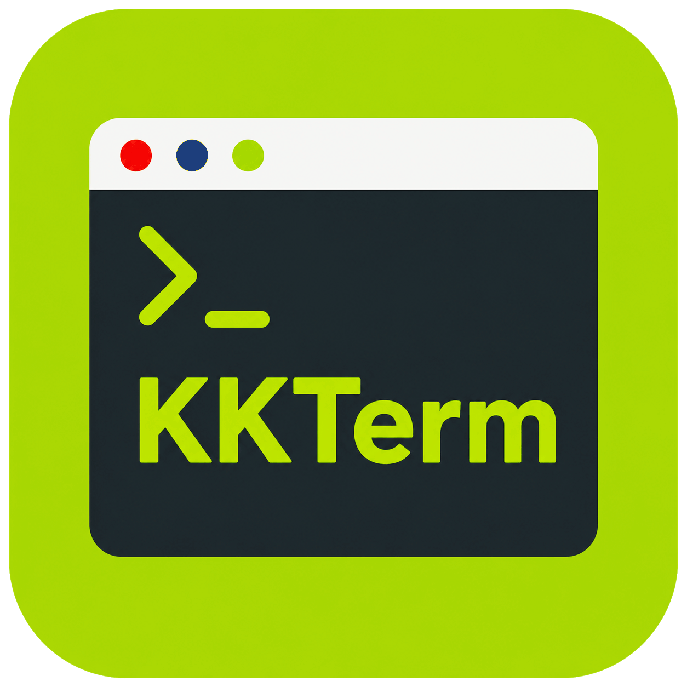
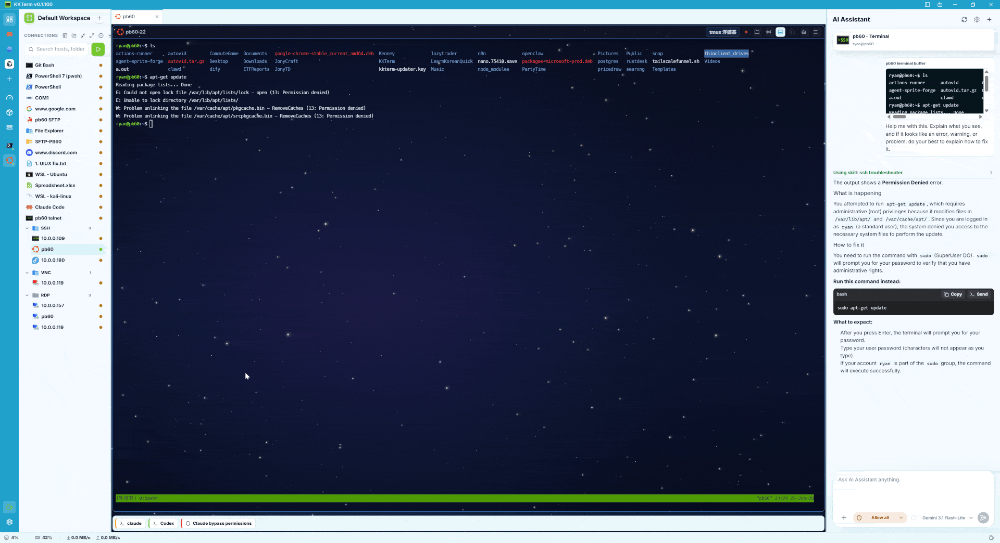
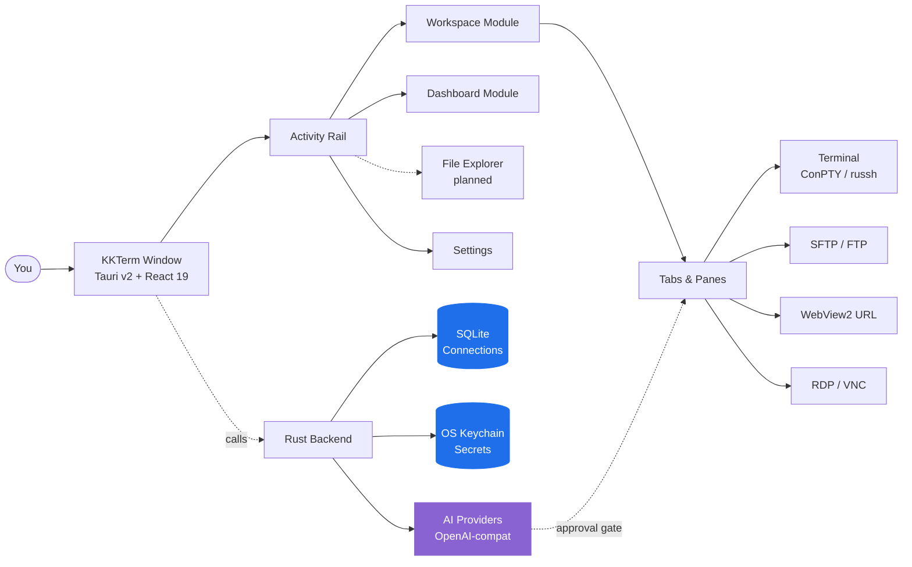

<p align="center">
  
</p>

<h1 align="center">KKTerm</h1>

<p align="center">
  <strong>El espacio de trabajo nativo para administradores Windows que la era de la IA se olvidó de construir — terminales, SSH, SFTP, RDP/VNC, dashboards, y una IA que crea tus propios widgets de herramientas.</strong>
</p>

<p align="center">
  <em>Porque tu barra de tareas no debería parecer una máquina tragaperras de Las Vegas.</em>
</p>

<p align="center">
  <sub>Nombrado en honor a <strong>乖乖 (Kuāi Kuāi)</strong>, el aperitivo de coco verde que los administradores de sistemas taiwaneses colocan sobre los servidores para que se porten bien. Esperamos que esta app se gane su sitio en el rack.</sub>
</p>

<p align="center">
  <a href="https://github.com/ryantsai/KKTerm/stargazers">
    
  </a>
  <a href="https://github.com/ryantsai/KKTerm/network/members">
    
  </a>
  <a href="https://github.com/ryantsai/KKTerm/issues">
    
  </a>
  <a href="https://github.com/ryantsai/KKTerm/blob/main/LICENSE">
    
  </a>
  <br />
  
  
  
  
  
  <br />
  <sub>
    <a href="README.md">English</a> ·
    <a href="README.zh-TW.md">繁體中文</a> ·
    <a href="README.zh-CN.md">简体中文</a> ·
    <a href="README.ja.md">日本語</a> ·
    <a href="README.ko.md">한국어</a> ·
    <a href="README.fr.md">Français</a> ·
    <a href="README.de.md">Deutsch</a> ·
    <strong>Español</strong> ·
    <a href="README.es-MX.md">Español (MX)</a> ·
    <a href="README.it.md">Italiano</a> ·
    <a href="README.pt-BR.md">Português (BR)</a> ·
    <a href="README.th.md">ไทย</a> ·
    <a href="README.id.md">Bahasa Indonesia</a> ·
    <a href="README.vi.md">Tiếng Việt</a>
  </sub>
</p>

---

## El argumento de venta (45 segundos)

Eres administrador de sistemas / DevOps / homelab / vibe-coder. Ahora mismo tienes:

- Un emulador de terminal
- Un cliente SSH aparte (con una lista de perfiles que te costó un fin de semana construir)
- Un cliente SFTP de 2007 que, de algún modo, sigue distribuyéndose
- Remote Desktop en una ventana que no encuentras nunca en el monitor correcto
- Un visor VNC para ese único servidor Linux
- Una pestaña del navegador para la interfaz web del router
- Una sesión de `claude` / `codex` corriendo en un servidor remoto que se cae cada vez que tu Wi-Fi estornuda
- Un post-it con contraseñas *(no te preocupes, no diremos nada)*

**KKTerm es una sola ventana para todo eso.** Nativo en Windows — *a propósito, mientras el resto del mundo del desarrollo lanza primero en Mac y trata tu sistema operativo como nota a pie de página* — escrito en Rust + Tauri v2, se instala con un solo ejecutable y se niega a llamar a casa.

Además, algunas cosas que no sabías que necesitabas:

- Un **Dashboard** donde le dices a la IA *"construye un widget que haga ping a mi router cada 30 segundos"* y aparece, en su sandbox, en tu cuadrícula.
- **Paneles SSH que se reconectan automáticamente a sesiones tmux con nombre**, para que tu sesión remota de `claude` / `codex` sobreviva a cada berrinche Wi-Fi que le dé a tu portátil.
- Un **Widget de uso de IA para programar** que muestra tus cuotas de Claude Code y Codex — ventana de 5 horas, ventana semanal, plan actual, email de la cuenta — en el **Dashboard** y en la barra de estado, para que dejes de chocar con el muro del rate-limit a las 3 de la madrugada.
- Un **servidor MCP integrado** (`kkterm-cli`) que permite a agentes de programación externos (Claude Code, Codex, Copilot, Antigravity, OpenCode) manejar tu Workspace y Dashboard — listar Connections, leer buffers del terminal, colocar Widgets — sobre una superficie de herramientas curada y con aprobación. IA-a-IA, en tu máquina, sin relay en la nube.
- Veintiuno **fondos animados de canvas** (sí, incluido `matrix`) para el dashboard, porque no somos de los que se reprimen.

Y el asistente de IA puede convertir una frase en una pequeña herramienta de dashboard que de verdad sigues usando.

> ⭐ **Si esto suena a la app que llevas seis años pensando en construir — dale una estrella al repositorio para que sepamos que alguien está mirando. Ayuda de verdad.**

---

## ¿Por qué "KKTerm"?

Entra en cualquier centro de datos taiwanés y mira la parte superior de los racks. En fábricas de TSMC, salas de control del Metro de Taipéi, salas de servidores de Cathay Bank, equipos de conmutación de Chunghwa Telecom — encontrarás una pequeña bolsa verde de 乖乖 (Kuāi Kuāi), un aperitivo de maíz con sabor a coco de los años sesenta.

El nombre significa literalmente **"sé bueno"**, **"compórtate"**. La tradición del sector es sencilla y absolutamente seria:

- **Tiene que ser el sabor verde (coco).** El amarillo (curry) significa *quédate en casa*; el rojo (picante) pone al servidor de mal humor. Verde obligatorio.
- **Tiene que estar sin caducar.** Un Kuai Kuai caducado juega en tu contra. Los ingenieros los cambian con diligencia.
- **Tiene que estar a la vista.** El servidor tiene que saber que está ahí.
- **No lo comas.** Esa bolsa está de guardia.

Algunos de los sistemas más grandes, más aburridos y más obsesionados con el uptime de Asia funcionan con una bolsa de palomitas de maíz pegada al chasis. Funciona porque quienes los mantienen creen que funciona, lo cual es una descripción notablemente honesta de gran parte de la cultura IT.

**KKTerm** es **Kuai Kuai Term** — un espacio de trabajo para administradores que aspira al mismo papel que el aperitivo: sentarse en silencio junto a tus máquinas importantes y ayudarlas a portarse bien. Local-first. Sin telemetría. IA con aprobación humana obligatoria. El tipo de software aburrido y fiable.

Todavía no hemos podido incluir una bolsa real de Kuai Kuai en el instalador. Eso es para la v2.

---

## Véelo en acción

<p align="center">
  <a href="https://github.com/ryantsai/KKTerm">
    
  </a>
</p>

<p align="center"><sub><em>(Aquí va el GIF de demo. Una imagen vale más que mil puntos de lista, y nos hemos quedado sin puntos de lista.)</em></sub></p>

---

## Por qué la gente lo tiene abierto todo el día

### Windows-first, a propósito

Echa un vistazo al panorama de herramientas de desarrollo en 2026. Claude Code: lanza primero en Mac/Linux, Windows es "usa WSL". Codex CLI: igual. `gemini-cli`, la mitad de Homebrew, cada TUI reluciente y nuevo: Mac/Linux primero, los usuarios de Windows reciben un comentario `# Windows: se agradecen contribuciones` en el README y un script de autocompletado para fish que no funciona.

Mientras tanto, las personas que realmente mantienen las empresas en línea — IT corporativo, MSPs, quien gestione Hyper-V, AD, SCCM, IIS o un controlador de dominio más antiguo que algunos becarios — están sentadas frente a máquinas Windows preguntándose por qué cada herramienta nueva trata su sistema operativo como un incordio.

**KKTerm es justo lo contrario.** Construimos nativamente para Windows primero, y los puertos de macOS / Linux van después. Eso nos permite usar las API de Windows que realmente importan, en lugar de cubrirlas con una capa de portabilidad:

- **ConPTY** para los shells locales — la pseudoconsola real de Windows, no un adaptador de traducción. PowerShell, `cmd.exe`, distribuciones WSL, todos alojados como PTYs auténticos con foco, redimensionado y manejo de secuencias VT que se ajustan al comportamiento de la plataforma.
- **WebView2** para toda la interfaz y las **Connections** de URL embebidas — Chromium en proceso usando el runtime del sistema, que es una de las razones por las que el instalador es pequeño y arranca rápido.
- **Microsoft RDP ActiveX (`mstscax.dll`)** para RDP — *el auténtico que distribuye Microsoft*. El mismo control que Remote Desktop Connection (`mstsc.exe`). No es una reimplementación de terceros, no es FreeRDP envuelto. Los que usen RDP notarán la diferencia en cinco segundos.
- **Windows Credential Manager** para todos los secretos. Contraseñas SSH, contraseñas FTP, claves API, credenciales de URL Connection — viven en el OS keychain y `credwiz.exe` puede auditarlos.
- **Instalador NSIS para el usuario actual** con su SHA-256 correspondiente, menú de bandeja nativo, aserción de energía Don't-Sleep, muestreo de CPU/RAM/red del host, menús contextuales nativos de Tauri con iconos PNG reales, diálogos nativos de Abrir/Guardar. Ninguno de estos está simulado.
- **WSL es un shell de primera clase, no un parche.** Lanza Ubuntu junto a un panel PowerShell junto a una sesión SSH junto a un **Tab** RDP en la misma ventana.

Las versiones de macOS y Linux están en la hoja de ruta y recibirán el mismo cuidado. Pero si llevas tiempo esperando que alguien construya la *buena* herramienta de administración para Windows primero en lugar de la última — este es el trato.

### Local-first significa realmente local

Tus **Connections** guardadas viven en un archivo SQLite en tu máquina. Las contraseñas viven en el **Windows Credential Manager**, no en un JSON junto al binario. La app no incluye analíticas, no llama a casa al arrancar y no necesita una cuenta en la nube para iniciarse. No hay "inicia sesión para sincronizar" porque no hay sincronización.

Si se te incendia el cable de red, KKTerm sigue abriendo.

### Un espacio de trabajo, cada tipo de conexión

| Querías… | KKTerm tiene |
| --- | --- |
| Abrir un shell local PowerShell / cmd / WSL | **Sessions** de terminal local respaldadas por ConPTY |
| Conectarte por SSH a un servidor | `russh` nativo con auth por agente / clave / contraseña, flujo de confianza de host-key, ProxyJump, reenvío de puertos |
| Explorar archivos en ese servidor | SFTP lanzado desde la **Connection** SSH, doble panel, transferencias recursivas, chmod/chown |
| FTP a un NAS de 2012 | **Connections** FTP / FTPS con el mismo explorador estilo SFTP |
| Telnet a equipos antiguos | Sí, Telnet también está |
| Hablar con un puerto serie | Tipo de **Connection** serial, puerto COM + baudios, sin herramientas extra |
| Conectarte remotamente a un equipo Windows | RDP nativo mediante el control ActiveX de Microsoft (el auténtico, no un clon) |
| VNC a una Raspberry Pi | Framebuffer `vnc-rs` en Rust renderizado directamente en el espacio de trabajo |
| Abrir la interfaz web del router | **URL Connection** embebida con WebView2 y relleno de credenciales |
| Ver la CPU del host | Barra de estado en vivo + un módulo **Dashboard** con widgets de arrastrar y redimensionar |

Todo en la misma app. La misma ventana. Los mismos atajos de teclado. El mismo tema que esperamos no lastime la vista.

### Terminales que no pierden el norte

- Paneles divididos dentro de un **Tab**.
- Renderizado xterm.js acelerado por WebGL, con degradación elegante cuando no puede.
- Búsqueda en el historial de desplazamiento.
- Paneles SSH respaldados por tmux que pueden conectarse a sesiones estables por panel, para que reconectarse signifique realmente *reconectarse*, y no "empezar de cero y fingir que la última hora no existió."
- Cambiar de **Tab** **no** termina la **Session**. Cerrar el **Tab** sí. Esta distinción fue una guerra religiosa interna; nosotros ganamos.

### Un asistente de IA que crea tus herramientas

La mayoría de las demos de "IA en tu terminal" se quedan en el chat. El asistente de KKTerm también puede crear pequeños widgets de dashboard, duraderos, para tu forma real de trabajar. Aun así, mantiene lo peligroso detrás de dos interruptores:

- **Familias de herramientas** (Dashboard / Connections / Live Sessions) — actívalas o desactívalas por categoría.
- **Modo de permiso** en el compositor — `Prompt` (por defecto, pregunta cada vez) o `Allow All` (eres adulto/a, ya firmaste el descargo).

Habla con OpenAI, Anthropic, OpenRouter, DeepSeek, Grok, Azure OpenAI, LiteLLM, GitHub Copilot, Ollama, NVIDIA o cualquier cosa compatible con OpenAI. Las claves API van al OS keychain. Los modelos que proponen `rm -rf` se clasifican como peligrosos y requieren aprobación humana explícita. La IA no puede ejecutar silenciosamente un comando destructivo porque alguien se puso listo con una inyección de prompt en una página man.

### Un Dashboard que no pretende ser Grafana

El módulo **Dashboard** es una cuadrícula de 12 columnas de instancias de widgets, con arrastrar y redimensionar. No es para observabilidad de petabytes — es para "quiero un botón que lance mis cinco apps favoritas y un panel con el uptime de mi host SSH, *junto a* mi chat."

#### Widgets creados por IA — descríbelo y aparece

Esta es la parte que nos entusiasma de verdad. No eliges de un marketplace y no escribes JavaScript. Le **dices al asistente de IA lo que quieres** y construye el widget ahí mismo en tu dashboard:

> *"Añade un widget con los últimos 5 commits de mi repo principal en forma de lista."*
> *"Hazme un widget de nota adhesiva que guarde mi chuleta de guardia."*
> *"Construye un widget que haga ping a mi router de casa cada 30 segundos y muestre verde/rojo."*
> *"Necesito un cronómetro. Sorpréndeme con el estilo."*

Dos tipos:

- **Content widgets** — JSON declarativo: markdown, listas clave-valor, checklists, una estadística grande. Seguros por construcción, sin scripts. La mayoría de las peticiones del tipo "solo necesito esto en mi dashboard" aterrizan aquí.
- **Script widgets** — JavaScript alojado dentro de un sandbox aislado de `iframe srcdoc` con permisos explícitos y declarados (lista de permitidos de `network`, presupuesto de `pollSeconds`). La IA escribe el script, tú apruebas los permisos, el widget corre en una caja que no puede alcanzar el resto de la app.

Cada widget que conservas es tuyo. Persisten en SQLite junto a tus **Connections**, con su propio preset visual (`panel` / `ambient` / `hero`), color de acento, icono y título. Pueden coexistir múltiples instancias del mismo widget con tamaños y estilos totalmente distintos. Elimínalos con un clic derecho cuando la magia se desvanezca.

#### Fondos animados del dashboard (porque nos apetecía)

El dashboard tiene veintiuno fondos animados de canvas que puedes elegir por cada **Dashboard View**:

| Ambiente | Fondos |
| --- | --- |
| Calma | `aurora`, `clouds`, `ocean`, `raindrops`, `snow`, `sakura`, `fireflies`, `bubbles`, `ricefield`, `lanterns` |
| Espacial | `starfield`, `nebula` |
| Cálido | `embers`, `lava` |
| Friki | `matrix`, `topo`, `synthwave` |
| Caótico | `cyberpunk`, `taipei101`, `thunderstorm`, `confetti` |

Corren sobre un único `requestAnimationFrame` compartido y respetan el foco de la ventana, así que consumen prácticamente nada cuando estás en otra parte. Combina `matrix` con tu asistente de IA para conseguir esa vibración de "soy extremadamente productivo/a y puede que también esté en una película de los Wachowski." O elige `ocean` y aparenta ser una persona seria. No juzgamos ninguna de las dos opciones.

### Agentes de codificación IA en un servidor, como es debido

Esta es la segunda función de la que la gente se enamora. Los terminales SSH de KKTerm pueden lanzarse directamente en una **sesión tmux con nombre** en el host remoto — por defecto, un identificador amigable autogenerado como `kkterm-cockpit001` que sobrevive a las reconexiones:

- Abre una **Connection** SSH con tmux activado.
- Dentro del panel, inicia `claude`, `codex`, `gemini-cli`, `cursor-agent` o cualquier agente de codificación de larga ejecución que prefieras. Son apps TUI a pantalla completa; tmux es exactamente donde quieren vivir.
- Cierra el portátil. Ábrelo de nuevo. El panel se vuelve a conectar silenciosamente a la misma sesión tmux. El agente sigue corriendo, sigue teniendo su historial, sigue en medio de lo que fuera que estaba haciendo.
- ¿Un corte en el transporte SSH? KKTerm intenta reconectarse silenciosamente al mismo tmux id sin molestarte.
- ¿Quieres que el asistente de IA vea lo que hace el agente? "Add terminal buffer to context" ejecuta `capture_tmux_pane` por SSH y trae el historial completo de tmux — no solo lo que hay en pantalla, toda la sesión — a la conversación. Tu asistente local ahora puede razonar sobre el trabajo de tu agente remoto.

Si alguna vez has perdido seis horas de sesión de `claude` o `codex` por culpa del Wi-Fi de un hotel, esta sola función amortiza la app. La app es gratuita. La función sigue valiendo la pena.

### Saber cuánta IA te queda

Los agentes de codificación cobran por ventana de plan, no por mes. Claude Code tiene una ventana de 5 horas y una ventana semanal. Codex hace su propia versión. Ambos pueden comerse tu cuota tranquilamente en segundo plano mientras estás en una reunión.

El Widget **Uso de IA para programar** mantiene eso visible:

- Un Widget de Dashboard que muestra **Claude Code** y **Codex** lado a lado: cuenta conectada, nivel de plan, porcentaje usado en la ventana de 5 horas actual, porcentaje usado esta semana, hora del próximo reset.
- Un **indicador compacto en la barra de estado** que refleja los mismos números, para que incluso con el Dashboard cerrado puedas ver de un vistazo si todavía tienes margen antes de lanzar el próximo gran refactor.
- El estado de autenticación se muestra directamente (`connected` / `expired` / `error`) para que descubras *antes* de una tarea larga que necesitas volver a iniciar sesión, no en medio.
- La política de refresco respeta los rate limits; el Widget hace polling a su propio ritmo en lugar de aporrear las APIs cada vez que lo miras.

### Un servidor MCP integrado — deja que otras IAs manejen KKTerm

Tu terminal también es donde Claude Code, Codex, el modo agente de Copilot, Antigravity y el resto del mundo MCP quieren trabajar. Por eso KKTerm trae su propio **servidor MCP por stdio**, [`kkterm-cli`](docs/MCP.md), que expone una porción curada de la app:

- **Módulo Workspace** (`kkterm.workspace.*`): listar **Connections** guardadas, abrir una Connection por id, listar **Sessions** activas, enviar entrada a un panel de terminal, leer un snapshot del buffer.
- **Módulo Dashboard** (`kkterm.dashboard.*`): cargar el estado del Dashboard, leer la fuente de un Widget creado por IA, crear / actualizar / eliminar vistas, colocar / mover / eliminar instancias de Widget, aplicar layouts en bloque.
- **Sub-namespaces peligrosos** (`kkterm.<module>.dangerous.*`): mutar la superficie ejecutable — crear Widgets de script, hacer clic en escritorios remotos, borrar el Dashboard — está protegido tras un único ajuste (`built_in_mcp_allow_all_dangerous`), desactivado por defecto.

`kkterm-cli` es un forwarder ligero. Habla stdio JSON-RPC con tu cliente MCP y se comunica con la ventana de KKTerm en ejecución por un named pipe de Windows autenticado por lanzamiento. Con KKTerm cerrado, `tools/list` sigue funcionando (los clientes pueden introspeccionar la superficie), pero `tools/call` devuelve un error estructurado `app_not_running` en vez de hacer nada.

Conéctalo a tu cliente favorito y tu IA usa KKTerm igual que tú:

```json
{
  "mcpServers": {
    "kkterm": { "command": "<ruta-a-kkterm-cli>", "args": [] }
  }
}
```

Settings → AI Assistant → **Servidor MCP integrado** tiene un diálogo "Mostrar config" de un clic con snippets JSON y TOML pre-rellenados con la ruta del binario resuelta, además de comandos `claude mcp add` / `codex mcp add` copiables.

---

## Cómo encaja todo



La forma que importa: los datos duraderos guardados (**Connection**) son distintos del estado en tiempo de ejecución (**Session**), que es distinto del contenedor de interfaz (**Tab**). Cerrar un **Tab** termina la **Session**. Cambiar de **Tab** no. Esta es la regla que mantiene la app en su sano juicio.

---

## Mapa de funcionalidades actual

| Área | Implementado hoy |
| --- | --- |
| **Connections** | Árbol respaldado por SQLite, carpetas/subcarpetas, búsqueda, orden por arrastrar y soltar, renombrar, duplicar, eliminar, **Quick Connect**, iconos personalizados, accesos directos en el rail como fijados/activos |
| **Terminal** | Shells locales, SSH, Telnet, Serial, paneles divididos, xterm.js + WebGL oportunista, búsqueda en historial, directorio/script de inicio local |
| **SSH** | `russh` nativo, auth por agente/clave/contraseña, flujo de confianza de host-key, alternativa opcional al SSH del sistema, ProxyJump, reenvío de puertos, **sesiones tmux con nombre automático (`kkterm-<nombre-scifi><n>`) con reconexión silenciosa ante corte de transporte** — perfecto para agentes de codificación remotos de larga ejecución (Claude Code, Codex, gemini-cli, etc.) |
| **SFTP / FTP** | SFTP lanzado desde SSH más **Connections** FTP/FTPS, explorador de doble panel, transferencias recursivas, cola/cancelar/limpiar historial, conflictos, propiedades, chmod/chown donde se admita |
| **URL WebView** | **Sessions** de URL embebidas con WebView2, barra de navegación, captura de favicon, metadatos/relleno de credenciales de sitios web almacenados, metadatos de partición de datos |
| **Remote Desktop** | RDP mediante ActiveX de Windows con aparcamiento de superposición por geometría; VNC mediante framebuffer `vnc-rs` renderizado en el canvas del espacio de trabajo |
| **Dashboard** | Vistas duraderas, instancias de widgets, modo de edición, arrastrar/redimensionar, App Launcher, **widgets de contenido/script creados por IA** (JSON declarativo o JS en iframe con permisos), presets / acento / icono / título por widget, **21 fondos animados de canvas** (aurora, clouds, ocean, raindrops, snow, sakura, fireflies, bubbles, ricefield, lanterns, starfield, nebula, embers, lava, matrix, topo, synthwave, cyberpunk, taipei101, thunderstorm, confetti) |
| **AI Assistant** | Chat en streaming, runtime compatible con OpenAI, registro de proveedores, clasificación de seguridad de propuestas de comandos, capturas de pantalla/contexto adjuntos, **creación de widgets del Dashboard (contenido + script en sandbox)**, **captura de panel tmux** como contexto de conversación para sesiones remotas, herramientas de gestión de **Connection** y herramientas de **Session** en vivo para terminal, RDP/VNC y SFTP/FTP |
| **Uso de IA para programar** | **Widget del Dashboard + indicador en la barra de estado** que rastrean el uso de cuotas de **Claude Code** y **Codex**: cuenta conectada, nivel de plan, porcentajes de las ventanas de 5 horas y semanal, hora del próximo reset, estado de autenticación (`connected` / `expired` / `error`), política de refresco consciente del rate-limit |
| **Servidor MCP integrado** | Servidor MCP por stdio (`kkterm-cli`) que expone herramientas curadas de Workspace y Dashboard a agentes de programación externos (Claude Code, Codex, Copilot, Antigravity, OpenCode); bridge de named pipe autenticado; sub-namespaces `dangerous.*` por Módulo protegidos tras un único toggle de seguridad; diálogo de Settings con snippets JSON / TOML de un clic y comandos `claude mcp add` / `codex mcp add` |
| **Settings** | General, Apariencia, Credenciales, IA, SSH, Terminal, URL, RDP, VNC, Dashboard, Acerca de; fuentes de interfaz personalizadas; minimizar a la bandeja; Don't Sleep; copia de seguridad/importar |
| **Localización** | Interfaz i18next con inglés como fuente y paquetes de idioma dinámicos: zh-TW, zh-CN, ja, ko, fr, de, es, es-MX, it, pt-BR, th, id, vi |

### Proveedores de IA

OpenAI · Anthropic · OpenRouter · DeepSeek · Grok · Azure OpenAI · LiteLLM · GitHub Copilot · Ollama · NVIDIA · cualquier endpoint compatible con OpenAI.

Los metadatos de proveedores viven en [`src/ai/providerRegistry/`](src/ai/providerRegistry/); los adaptadores Rust en [`src-tauri/src/ai/providers/`](src-tauri/src/ai/providers/). Las claves API pasan por el OS keychain, nunca por SQLite.

---

## Inicio rápido

Necesitas:

- **Windows** (plataforma principal admitida)
- **Node.js + npm**
- **Cadena de herramientas de Rust**
- **Prerrequisitos de Tauri v2 para Windows**, incluyendo **WebView2**

```bash
npm install
npm run tauri dev
```

Eso debería producir una ventana nativa real. Si produce un stack trace en su lugar, abre un issue — nos encantan las reproducciones bien documentadas.

### Comprobaciones habituales

```bash
npm run check                                              # TypeScript
npm run build                                              # Vite build
cargo check --manifest-path src-tauri/Cargo.toml           # Rust
cargo test  --manifest-path src-tauri/Cargo.toml           # Rust tests
```

### Construir el instalador de Windows

```bash
npm run package:installer
```

El script del instalador genera `artifacts/kkterm-<version>-windows-x64-setup.exe` y un archivo `.sha256` correspondiente. Actualmente **no está firmado** — la firma para las versiones está en la hoja de ruta, pero hasta entonces tu antivirus puede mirarte con severidad. Es normal.

---

## Lo que KKTerm no es

Una lista breve, porque la honestidad genera confianza:

- **No es un producto en la nube.** Sin sincronización, sin cuentas de equipo, sin nivel SaaS. Si alguna vez ves un diálogo de "Inicia sesión en KKTerm", algo ha ido catastróficamente mal.
- **No pretende ser multiplataforma.** Somos Windows-first a propósito; macOS y Linux están en la hoja de ruta y usarán el mismo shell de Tauri v2. Si necesitas una herramienta Mac-first hoy, tienes cientos de opciones. Nosotros construimos la que los administradores Windows llevan tiempo esperando en silencio.
- **No es un agente de IA autónomo.** El asistente propone; el humano dispone. `Allow All` es una elección que tú tomas, no un valor predeterminado.
- **No reemplaza a Grafana / Datadog.** El Dashboard es para superficies de control personales, no para observabilidad de 10.000 hosts.
- **No es un IDE para Kubernetes.** Es un espacio de trabajo de administración centrado en el terminal. Por favor, no le pidas que renderice un chart de Helm.

Si alguno de esos puntos era un factor decisivo — sin problema, nos vemos en la v2.

---

## Depuración nativa

Usa el runtime real de Tauri para la validación:

```bash
npm run tauri dev
```

Una vista previa de Vite en el navegador es útil para algunas inspecciones de frontend, pero **no** aloja un WebView2 real, ConPTY, RDP ActiveX, framebuffer VNC, keychain ni menú nativo. Si una función toca cualquiera de esos, valídala en el runtime de escritorio real.

Usuarios de VS Code: la configuración de lanzamiento `Run KKTerm exe` inicia `src-tauri/target/debug/kkterm.exe` con `RUST_BACKTRACE=1`. La configuración emparejada `Attach KKTerm WebView2` te da DevTools dentro del host WebView2 real.

---

## Limitaciones actuales (sí, lo sabemos)

- El instalador actualmente no está firmado. Las comprobaciones de actualización están desactivadas hasta que se configure la firma de versiones.
- SFTP sobre ProxyJump todavía no está disponible en la ruta SFTP nativa.
- La reanudación de transferencias de archivos, sincronización/diff de carpetas, compresión/extracción y edición remota están diferidas.
- La importación de configuración SSH está implementada pero la entrada en Settings para el usuario aún no está expuesta.
- RDP y VNC están disponibles; la sincronización de portapapeles/dispositivos y los controles de calidad más avanzados siguen evolucionando.
- Las versiones de macOS y Linux están en la hoja de ruta. Están en camino, y se harán bien — no como un puerto apresurado de "también funcionamos más o menos allí".
- El asistente de IA propone y puede operar las herramientas habilitadas dentro del límite de permisos configurado — por favor, no lo trates como un robot desatendido. En realidad, no sabe qué quiere tu CEO.

---

## Hoja de ruta (versión corta)

- Versiones para macOS + Linux
- Instalador firmado + actualización automática
- SFTP sobre ProxyJump en la ruta nativa
- Reanudación de transferencias, sincronización de carpetas, compresión/extracción
- Redirección de portapapeles/dispositivos RDP más completa
- Más widgets integrados en el **Dashboard** (y un esquema público para los creados por IA)

Versión completa y actualizada frecuentemente: [`docs/ROADMAP.md`](docs/ROADMAP.md).

---

## Contribuir

Agradeceríamos una mano. De verdad. Incluso las cosas pequeñas importan:

- **Prueba la versión de desarrollo** y abre un issue cuando algo se note raro. "Se notaba raro" es un informe de error legítimo; investigaremos contigo.
- **Traduce una variante de idioma.** El inglés es la fuente de verdad en [`src/i18n/locales/en.json`](src/i18n/locales/en.json); otros 12 idiomas viven junto a él y se cargan bajo demanda. Las cadenas pendientes se rastrean por clave en [`docs/localization_todo/`](docs/localization_todo/) — elige uno, tradúcelo, borra el archivo.
- **Añade un widget al Dashboard.** Los widgets integrados viven en [`src/modules/dashboard/widgets/builtin/`](src/modules/dashboard/widgets/builtin/). Elige una idea pequeña, impleméntala, aprende el patrón.
- **Ajusta la superficie de herramientas de IA.** Los adaptadores de proveedores viven en [`src-tauri/src/ai/providers/`](src-tauri/src/ai/providers/); el registro del frontend está en [`src/ai/providerRegistry/`](src/ai/providerRegistry/).
- **Mejora el manual.** La documentación para usuarios finales vive en [`docs/manual/`](docs/manual/). Un capítulo por módulo de interfaz. Si usaste una función y la documentación no te ayudó, un PR que lo corrija vale su peso en oro.

La configuración completa, el diseño del proyecto, la lista de verificación de PRs y las reglas de "por favor no rompas esto" viven en [`CONTRIBUTING.md`](CONTRIBUTING.md). Los puntos clave en 30 segundos:

- **Lee [`CONTEXT.md`](CONTEXT.md) antes de renombrar términos visibles para el usuario.** **Connection**, **Session**, **Tab** y **Quick Connect** significan cosas específicas; por favor, no cambies su significado.
- **Cada cadena visible para el usuario pasa por `t()`.** Nada de texto en inglés expuesto directamente en JSX.
- **Sin hooks de cierre en el frontend.** Los patrones `onCloseRequested` han roto el cierre de la barra de título de Tauri v2 media docena de veces. Finalmente tenemos una forma que funciona; por favor, no los reintroduzcas.
- **Ejecuta las comprobaciones** (`npm run check && npm run build && cargo check && cargo test`) antes de abrir un PR.

¿Buscas un punto de entrada? Filtra los issues abiertos por [`good first issue`](https://github.com/ryantsai/KKTerm/issues?q=is%3Aissue+is%3Aopen+label%3A%22good+first+issue%22) o [`help wanted`](https://github.com/ryantsai/KKTerm/issues?q=is%3Aissue+is%3Aopen+label%3A%22help+wanted%22). Si aún no hay ninguno etiquetado, abre un issue describiendo en qué quieres trabajar y te ayudaremos a definir el alcance.

---

## Documentación del proyecto

- [Contexto del producto](CONTEXT.md) — el vocabulario del dominio que debes respetar
- [Arquitectura](docs/ARCHITECTURE.md) — mapa de módulos, dónde colocar código nuevo
- [Hoja de ruta](docs/ROADMAP.md)
- [Arquitectura del Dashboard](docs/DASHBOARD.md)
- [Guía de proveedores de IA](docs/AI_PROVIDERS.md)
- [Notas de rendimiento](docs/PERFORMANCE.md)
- [Notas de versión y criterios de publicación](docs/RELEASE.md)

---

## Stack tecnológico

Rust · Tauri v2 · React 19 · TypeScript · Vite · Tailwind CSS · Zustand · xterm.js · SQLite · WebView2 · `russh` · `russh-sftp` · `vnc-rs` · `suppaftp` · OS keychain storage.

---

## Historial de estrellas

<a href="https://www.star-history.com/#ryantsai/KKTerm&Date">
  <picture>
    <source media="(prefers-color-scheme: dark)" srcset="https://api.star-history.com/svg?repos=ryantsai/KKTerm&type=Date&theme=dark" />
    <source media="(prefers-color-scheme: light)" srcset="https://api.star-history.com/svg?repos=ryantsai/KKTerm&type=Date" />
    
  </picture>
</a>

Si has llegado hasta aquí y todavía no lo has marcado con una estrella — ¿a qué estás esperando, una invitación personal? Considera esto la invitación personal.

⭐ **[Dale una estrella a KKTerm en GitHub](https://github.com/ryantsai/KKTerm)** — cuesta un clic y le alegra la semana al mantenedor. Considéralo un 乖乖 digital sobre el rack.

---

## Licencia

MIT. Véase [LICENSE](LICENSE). Úsalo, fórcalo, distribúyelo, ponlo en un homelab que nadie más pueda encontrar — ese es el trato.
