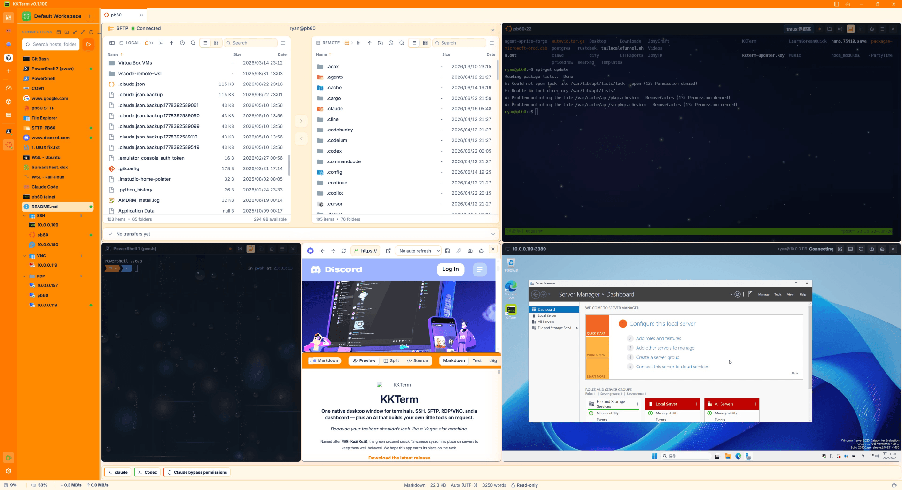
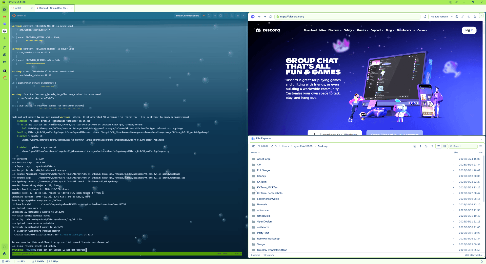
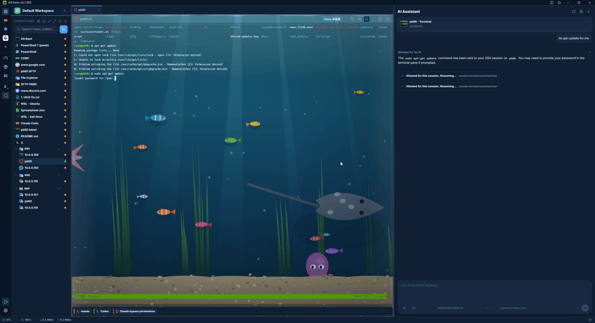
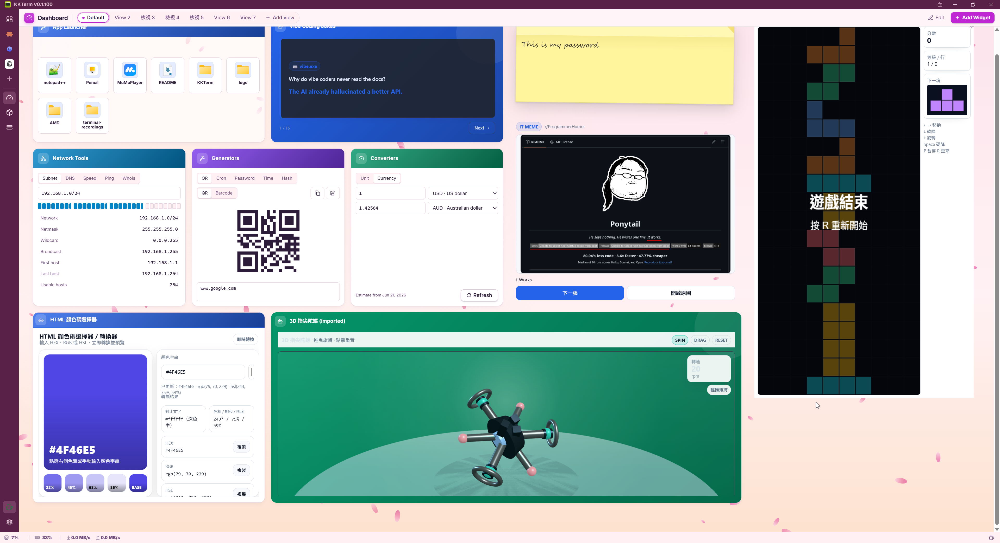
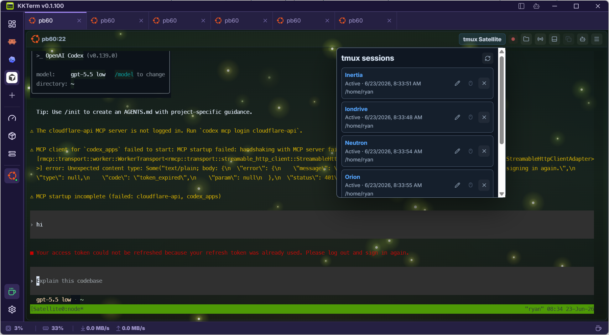
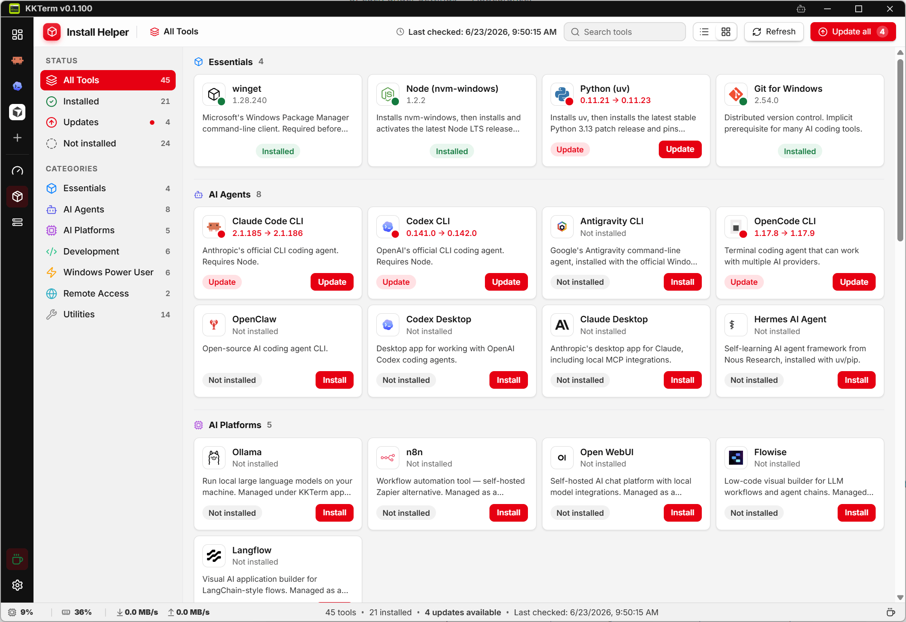

  

<h1 align="center">KKTerm</h1>

  <strong>Una sola ventana nativa de Windows para terminales, SSH, SFTP, RDP/VNC y un panel — además de una IA que te construye tus propias herramientas a petición.</strong>

  <em>Porque tu barra de tareas no debería parecer una máquina tragaperras de Las Vegas.</em>

  Llamado así por <strong>乖乖 (Kuāi Kuāi)</strong>, el aperitivo verde de coco que los administradores de sistemas taiwaneses colocan sobre los servidores para que se porten bien. Esperamos que esta app se gane su sitio en el rack.

  <strong><a href="https://github.com/ryantsai/KKTerm/releases/latest">Descargar la última versión de KKTerm</a></strong>

  
  
  
  
  
   
  
  
   
  
    <a href="README.md">English</a> ·
    <a href="README.zh-TW.md">繁體中文</a> ·
    <a href="README.zh-CN.md">简体中文</a> ·
    <a href="README.ja.md">日本語</a> ·
    <a href="README.ko.md">한국어</a> ·
    <a href="README.fr.md">Français</a> ·
    <a href="README.de.md">Deutsch</a> ·
    <strong>Español</strong> ·
    <a href="README.es-MX.md">Español (MX)</a> ·
    <a href="README.it.md">Italiano</a> ·
    <a href="README.pt-BR.md">Português (BR)</a> ·
    <a href="README.th.md">ไทย</a> ·
    <a href="README.id.md">Bahasa Indonesia</a> ·
    <a href="README.vi.md">Tiếng Việt</a>
  

---

## El argumento en 45 segundos

KKTerm reúne terminales locales, SSH/SFTP, FTP/FTPS, Telnet, conexiones serie, RDP/VNC, páginas web integradas, archivos locales y documentos en un único espacio de trabajo de escritorio. Las pestañas pueden combinar distintos tipos de panel para mantener juntos el terminal, el explorador de archivos y la pantalla remota de cada tarea.

Funciona en Windows, macOS y Linux, guarda los datos localmente y no usa telemetría. Incluye IA con aprobación humana, widgets de Dashboard personalizables, Workspaces, IT Ops y el Install Helper para Windows.

---

## ¿Por qué «KKTerm»?

Entra en cualquier centro de datos taiwanés y mira la parte de arriba de los racks. Más allá de las fábricas de TSMC, las salas de control del metro de Taipéi, las salas de servidores del banco Cathay, los equipos de conmutación de Chunghwa Telecom — verás una pequeña bolsita verde de 乖乖 (Kuāi Kuāi), un aperitivo de maíz con sabor a coco de los años 60.

**KKTerm** es **Kuai Kuai Term** — un espacio de administración que aspira al mismo trabajo que el aperitivo: sentarse en silencio junto a tus máquinas importantes y ayudarlas a portarse bien. Local primero. Sin telemetría. IA con aprobación. Ese tipo de software aburrido y fiable.

Aún no hemos podido incluir una bolsa real de Kuai Kuai con el instalador. Eso es cosa de la v2.

---

## Verlo en movimiento

  

<em>(El GIF de demostración. Una imagen vale más que mil viñetas, y se nos han acabado las viñetas.)</em>

---

## Una ventana, cada conexión

| Querías… | KKTerm lo hace |
| --- | --- |
| Abrir un shell local PowerShell / cmd / WSL | Terminales locales, lado a lado |
| SSH a un servidor | SSH con claves, agente, contraseñas, hosts de salto y reenvío de puertos |
| Explorar los archivos de ese servidor | SFTP desde la conexión SSH — doble panel, arrastra para transferir |
| FTP a un NAS de 2012 | FTP / FTPS en el mismo explorador de archivos |
| Telnet a equipos prehistóricos | Sí, Telnet también está ahí |
| Hablar con un puerto serie | Conexiones serie — elige un puerto COM y un baudaje |
| Entrar por remoto a una máquina Windows | El auténtico Escritorio remoto de Microsoft, integrado |
| VNC a una Pi | VNC, renderizado directamente en el espacio de trabajo |
| Abrir la interfaz web del router | Una pestaña de navegador integrada con inicios de sesión guardados |
| Explorar tu propio disco | Un panel de File Explorer local, el mismo doble panel que SFTP |
| Abrir un log, CSV, imagen o PDF | Un visor Document integrado con un verdadero modo de log en seguimiento (tail) |
| Vigilar la CPU del host | Una barra de estado en vivo y un panel que montas tú mismo |

La misma app. La misma ventana. Los mismos atajos. El mismo tema, que ojalá no te sangren los ojos.

  

---

## Por qué la gente lo deja abierto todo el día

### Descarga pequeña, arranque relámpago

KKTerm está pensado para sentirse como una utilidad, no como una plataforma. Las versiones de escritorio actuales pesan menos de 20 MB, se instalan rápido y arrancan lo bastante deprisa como para que abrir tu espacio de administración no se sienta como iniciar un segundo sistema operativo.

### Cuadrículas multipanel, mezcladas como trabajas

Una Tab puede contener una cuadrícula de Panes, y esos Panes no tienen que ser del mismo tipo. Pon SSH junto a SFTP, un PowerShell local debajo de una RDP Session, VNC junto a la interfaz web del router, o un explorador de archivos junto al terminal que está moviendo los archivos.

  

### Un asistente de IA que comanda tus terminales por ti

La mayoría de las demos de «IA en tu terminal» se quedan en el chat. El asistente de KKTerm trabaja *dentro* de tu sesión: le pasas contexto a partir de lo que ya está en pantalla, y actúa sobre las máquinas a las que estás conectado — con un humano en el bucle de aprobación.

  

### Un panel que no finge ser Grafana

El Dashboard es una cuadrícula de widgets que arrastras y redimensionas. No es para observabilidad a escala de petabytes — es para «quiero un botón que lance mis cinco apps favoritas y un panel que muestre el uptime de mi host SSH, *al lado* de mi chat».

  

### IT Ops para sitios, hosts y trabajo repetible

El módulo **IT Ops** agrupa conexiones en sitios, representa salas de servidores y racks, inventaría hosts y ejecuta tareas reutilizables en los equipos seleccionados. Las ejecuciones por lotes conservan los resultados por host y las automatizaciones convierten eventos y condiciones en avisos, webhooks o tareas.

> 🖼️ **Marcador de posición para la captura de IT Ops — imagen próximamente.**

### Mantén vivos a tus agentes de IA

Esta es la segunda función de la que la gente se enamora. Los terminales SSH de KKTerm pueden dejarte directamente en una **sesión tmux con nombre** en el host remoto que sobrevive a la reconexión.

  

### Separa tus mundos con los espacios de trabajo

El homelab, el trabajo y los servidores de ese cliente no pertenecen a la misma lista. Los **espacios de trabajo (Workspaces)** son contenedores de Connections con nombre y aislados entre los que cambias desde el Activity Rail. Cambiar solo reajusta el árbol de conexiones — tus Sessions abiertas, el Dashboard y los ajustes se quedan donde están — así que cambiar de contexto cuesta un clic, no un reinicio.

  

### Vístelo a tu gusto: temas de color

Los fondos son la parte divertida; los **temas de color** son lo que de verdad miras todo el día. KKTerm trae **veintiséis** esquemas de color que reestilizan todo el chrome de la app — Activity Rail, árbol de conexiones, pestañas, diálogos — con una minivista previa en vivo de cada uno en Ajustes ▸ Apariencia.

  

### Install Helper (solo Windows)

Preparar una máquina Windows nueva para desarrollar suele ser diez pestañas del navegador y mucho «siguiente, siguiente, finalizar». El **Install Helper** es un catálogo integrado que encuentra, instala, actualiza y desinstala las herramientas que de otro modo perseguirías a mano — sin salir de KKTerm.

  

---

## Lo que KKTerm no es

Una lista corta, porque la honestidad se gana la confianza:

- **No es un producto en la nube.** Sin sincronización, sin cuentas de equipo, sin plan SaaS. Si alguna vez ves un diálogo «Inicia sesión en KKTerm», algo ha salido catastróficamente mal.
- **No finge que todos los sistemas operativos son idénticos.** KKTerm publica builds para Windows, macOS y Linux, pero las funciones específicas de cada plataforma se mantienen claras y honestas.
- **No es un agente de IA autónomo.** El asistente propone; el humano dispone. `Allow All` es una elección que haces tú, no un valor por defecto.
- **No es un sustituto de Grafana / Datadog.** El Dashboard es para superficies de control personales, no para observabilidad de 10.000 hosts.
- **No es un IDE de Kubernetes.** Es un espacio de administración centrado en el terminal. Por favor, no le pidas que renderice un chart de Helm.

Si alguno de esos puntos *era* un factor decisivo — justo, nos vemos en la v2.

---

## Consigue KKTerm

**[Descarga la última versión de KKTerm](https://github.com/ryantsai/KKTerm/releases/latest)**, elige el paquete para tu plataforma y ábrelo. Los instaladores de Windows están por ahora **sin firmar** — la firma de versiones está en la hoja de ruta, así que hasta entonces tu antivirus puede mirarte con cara seria. Es normal.

¿Quieres compilar desde el código fuente o contribuir? Todo lo que necesitas está en [`CONTRIBUTING.md`](CONTRIBUTING.md).

---

## Hoja de ruta (versión corta)

- Pulido de versiones multiplataforma
- Pulido de la firma de versiones
- Más potencia en transferencia de archivos (reanudar, sincronización de carpetas, archivar/extraer)
- Portapapeles y compartición de dispositivos más rica en el Escritorio remoto
- Más widgets de panel integrados
- Más funcionalidad de automatización de IT Ops

Versión completa y actualizada con frecuencia: [`docs/ROADMAP.md`](docs/ROADMAP.md).

---

## Contribuir

Nos encantaría una mano. De verdad. Hasta las cosas pequeñas importan.

La configuración completa, la estructura del proyecto y la lista de comprobación de PR están en [`CONTRIBUTING.md`](CONTRIBUTING.md). ¿Buscas un punto de entrada? Filtra las issues abiertas por [`good first issue`](https://github.com/ryantsai/KKTerm/issues?q=is%3Aissue+is%3Aopen+label%3A%22good+first+issue%22) o [`help wanted`](https://github.com/ryantsai/KKTerm/issues?q=is%3Aissue+is%3Aopen+label%3A%22help+wanted%22).

---

## Documentos del proyecto

- [Contexto de producto](CONTEXT.md) — el lenguaje de dominio que debes respetar
- [Arquitectura](docs/ARCHITECTURE.md) — mapa de módulos, dónde poner el código nuevo
- [Manual de usuario](docs/manual/INDEX.md) — un recorrido función por función
- [Hoja de ruta](docs/ROADMAP.md)
- [Arquitectura del Dashboard](docs/DASHBOARD.md)
- [Servidor MCP integrado](docs/MCP.md)
- [Guía de proveedores de IA](docs/AI_PROVIDERS.md)

---

## Historial de estrellas

<a href="https://www.star-history.com/#ryantsai/KKTerm&Date">
  <picture>
    <source media="(prefers-color-scheme: dark)" srcset="https://api.star-history.com/svg?repos=ryantsai/KKTerm&type=Date&theme=dark" />
    <source media="(prefers-color-scheme: light)" srcset="https://api.star-history.com/svg?repos=ryantsai/KKTerm&type=Date" />
    
  </picture>
</a>

---

## Licencia

MIT. Ver [LICENSE](LICENSE). Úsalo, fórkalo, publícalo, mételo en un homelab que nadie más encuentre — ese es el trato.
