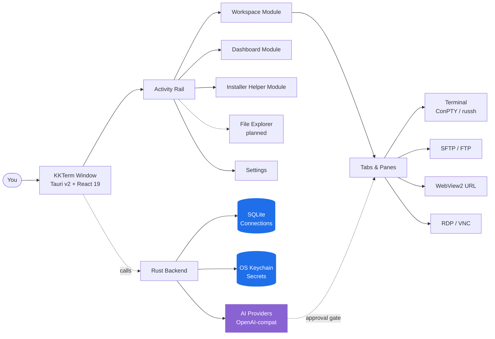

<p align="center">
  
</p>

<h1 align="center">KKTerm</h1>

<p align="center">
  <strong>L'espace de travail d'administration Windows natif que l'ère des outils IA a oublié de construire — terminaux, SSH, SFTP, RDP/VNC, dashboards, et une IA qui construit tes propres Widgets d'outils.</strong>
</p>

<p align="center">
  <em>Parce que ta barre des tâches ne devrait pas ressembler à une machine à sous de Las Vegas.</em>
</p>

<p align="center">
  <sub>Nommé d'après <strong>乖乖 (Kuāi Kuāi)</strong>, le snack à la noix de coco que les sysadmins taïwanais posent sur leurs serveurs pour qu'ils se tiennent tranquilles. On espère que cette appli mérite sa place dans le rack.</sub>
</p>

<p align="center">
  <strong><a href="https://github.com/ryantsai/KKTerm/releases/latest">Télécharger le dernier installateur Windows (.exe)</a></strong>
</p>

<p align="center">
  <a href="https://github.com/ryantsai/KKTerm/stargazers">
    
  </a>
  <a href="https://github.com/ryantsai/KKTerm/network/members">
    
  </a>
  <a href="https://github.com/ryantsai/KKTerm/releases">
    
  </a>
  <a href="https://github.com/ryantsai/KKTerm/issues">
    
  </a>
  <a href="https://github.com/ryantsai/KKTerm/blob/main/LICENSE">
    
  </a>
  <br />
  
  
  
  
  
  <br />
  <sub>
    <a href="README.md">English</a> ·
    <a href="README.zh-TW.md">繁體中文</a> ·
    <a href="README.zh-CN.md">简体中文</a> ·
    <a href="README.ja.md">日本語</a> ·
    <a href="README.ko.md">한국어</a> ·
    <strong>Français</strong> ·
    <a href="README.de.md">Deutsch</a> ·
    <a href="README.es.md">Español</a> ·
    <a href="README.es-MX.md">Español (MX)</a> ·
    <a href="README.it.md">Italiano</a> ·
    <a href="README.pt-BR.md">Português (BR)</a> ·
    <a href="README.th.md">ไทย</a> ·
    <a href="README.id.md">Bahasa Indonesia</a> ·
    <a href="README.vi.md">Tiếng Việt</a>
  </sub>
</p>

---

## Le pitch (45 secondes)

Tu es sysadmin / DevOps / homelab / vibe-coder. En ce moment, tu as ouvert :

- Un émulateur de terminal
- Un client SSH séparé (avec une liste de profils qui t'a coûté un week-end entier)
- Un client SFTP de 2007 qui tourne encore miraculeusement
- Remote Desktop dans une fenêtre que tu perds constamment sur le mauvais écran
- Un viewer VNC pour cette unique machine Linux
- Un onglet de navigateur pour l'interface d'admin du routeur
- Une session `claude` / `codex` sur un serveur distant qui coupe à chaque fois que ton Wi-Fi éternue
- Un post-it avec des mots de passe *(t'inquiète, on ne dira rien)*

**KKTerm, c'est une seule fenêtre pour tout ça.** Natif sur Windows — *volontairement, pendant que tout le reste du monde des outils de dev livre mac-first et traite ton OS comme une note de bas de page* — écrit en Rust + Tauri v2, livré en un seul installateur, et qui refuse de téléphoner à la maison.

Et quelques trucs dont tu ne savais pas encore avoir besoin :

- Un **Dashboard** où tu dis à une IA *"crée-moi un Widget qui pingue mon routeur toutes les 30 secondes"* et ça apparaît, sandboxé, sur ta grille.
- **Des panes SSH qui s'attachent automatiquement à des Sessions tmux nommées** pour que ta session `claude` / `codex` distante survive à chaque caprice Wi-Fi de ton laptop.
- Un **Widget de consommation d'IA de codage** qui affiche tes quotas Claude Code et Codex — fenêtre 5 heures, fenêtre hebdomadaire, plan en cours, e-mail du compte — sur le **Dashboard** et dans la barre d'état, pour ne plus te prendre le mur du rate-limit à 3 h du mat.
- Un module **Installer Helper** qui détecte, installe, met à jour, désinstalle et lance un catalogue curaté d'outils de développement Windows — Node, Python, Docker, WSL, CLI de codage IA et les petits utilitaires qu'on finit d'habitude par traquer dans des onglets de navigateur.
- Un **serveur MCP intégré** (`kkterm-cli`) qui permet aux agents de code externes (Claude Code, Codex, Copilot, Antigravity, OpenCode) de piloter ton Workspace et ton Dashboard — lister les Connections, lire des buffers de terminal, placer des Widgets — via une surface d'outils curatée et soumise à approbation. IA-vers-IA, sur ta machine, sans relais cloud.
- Vingt et un **fonds animés** (oui, dont `matrix`) pour le Dashboard, parce qu'on n'est pas au-dessus de ça.

Oh, et l'assistant IA peut transformer une phrase en petit outil de Dashboard que tu continues vraiment à utiliser.

> ⭐ **Si ça ressemble à l'appli que tu avais l'intention de construire depuis six ans — étoile le repo pour qu'on sache que quelqu'un regarde. Ça aide vraiment.**

---

## Pourquoi « KKTerm » ?

Entre dans n'importe quel data center taïwanais et regarde le haut des racks. Chez TSMC, dans les salles de contrôle du métro de Taipei, dans les salles serveurs de la Cathay Bank, dans les équipements de commutation de Chunghwa Telecom — tu verras un petit sachet vert de 乖乖 (Kuāi Kuāi), un snack au maïs aromatisé à la noix de coco des années 1960.

Le nom signifie littéralement **« sois sage »**, **« tiens-toi bien »**. La tradition IT est simple et absolument sérieuse :

- **Doit être la saveur verte (noix de coco).** Le jaune (curry) ça veut dire *reste chez toi* ; le rouge (pimenté) énerve le serveur. Vert uniquement.
- **Doit être non périmé.** Un Kuai Kuai périmé se retourne contre toi. Les ingénieurs les changent scrupuleusement.
- **Doit être visible.** Le serveur doit savoir qu'il est là.
- **Ne pas le manger.** Ce sachet est en service.

Certains des systèmes les plus grands, les plus ennuyeux, les plus obsédés par l'uptime en Asie tournent avec un sachet de soufflés au maïs collé au châssis. Ça marche parce que ceux qui les maintiennent croient que ça marche, ce qui est une description remarquablement honnête de la culture IT en général.

**KKTerm** est **Kuai Kuai Term** — un espace de travail d'administration qui aspire au même rôle que le snack : rester tranquillement à côté de tes machines importantes et les aider à bien se comporter. Local-first. Zéro télémétrie. IA soumise à approbation. Le genre de logiciel fiable et sans surprise.

On n'a pas encore réussi à livrer un vrai sachet de Kuai Kuai avec l'installateur. C'est prévu pour la v2.

---

## Voir ça en action

<p align="center">
  <a href="https://github.com/ryantsai/KKTerm">
    
  </a>
</p>

<p align="center"><sub><em>(Le GIF de démo vient ici. Une image vaut mille bullet points, et on a épuisé les bullet points.)</em></sub></p>

---

## Pourquoi les gens le gardent ouvert toute la journée

### Windows-first, volontairement

Regarde le paysage des outils de dev en 2026. Claude Code : livré mac/linux d'abord, Windows c'est « utilise WSL ». Codex CLI : pareil. `gemini-cli`, la moitié de Homebrew, chaque nouveau TUI qui brille : mac/linux d'abord, les utilisateurs Windows ont droit à un commentaire `# Windows: contributions welcome` dans le README et un script de complétion fish qui ne tourne pas.

Pendant ce temps, les gens qui font vraiment tourner les entreprises — l'IT corporate, les MSPs, ceux qui gèrent Hyper-V ou AD ou SCCM ou IIS ou un contrôleur de domaine plus vieux que certains stagiaires — sont assis devant des machines Windows en se demandant pourquoi chaque nouvel outil traite leur OS comme une nuisance.

**KKTerm prend le parti inverse.** On construit natif Windows en premier, et les portages macOS / Linux suivent. Ça nous permet d'utiliser les API Windows qui comptent vraiment, au lieu de les masquer derrière une couche de portabilité :

- **ConPTY** pour les shells locaux — la vraie pseudo-console Windows, pas un shim de traduction. PowerShell, `cmd.exe`, les distros WSL, tous hébergés comme de vrais PTYs avec focus, redimensionnement et gestion des séquences VT qui correspondent au comportement de la plateforme.
- **WebView2** pour toute l'UI et les **Connections** URL embarquées — Chromium en cours de processus utilisant le runtime système, ce qui explique en partie pourquoi l'installateur est petit et démarre vite.
- **Microsoft RDP ActiveX (`mstscax.dll`)** pour RDP — *le vrai, celui que Microsoft livre*. Même contrôle que Remote Desktop Connection (`mstsc.exe`). Pas une réimplémentation tierce, pas FreeRDP dans un wrapper. Les gens qui utilisent RDP verront la différence en cinq secondes.
- **Windows Credential Manager** pour tous les secrets. Mots de passe SSH, mots de passe FTP, clés API, identifiants de Connection URL — ils vivent dans l'OS keychain et `credwiz.exe` peut les auditer.
- **Installateur NSIS utilisateur courant** avec un SHA-256 correspondant, menu système natif, assertion d'alimentation Don't-Sleep, échantillonnage CPU/RAM/réseau hôte, menus contextuels Tauri natifs avec de vraies icônes PNG, dialogues Ouvrir/Enregistrer natifs. Aucun de ces éléments n'est simulé.
- **WSL est un shell de première classe, pas un palliatif.** Lance Ubuntu à côté d'un pane PowerShell à côté d'une session SSH à côté d'un **Tab** RDP dans la même fenêtre.

Les builds macOS et Linux sont sur la feuille de route et recevront le même soin. Mais si tu attendais que quelqu'un construise le *bon* outil d'admin Windows en premier plutôt qu'en dernier — c'est le deal.

### Local-first signifie vraiment local

Tes **Connections** enregistrées vivent dans un fichier SQLite sur ta machine. Les mots de passe vivent dans le **Windows Credential Manager**, pas dans un JSON à côté du binaire. L'appli ne livre pas d'analytics, ne téléphone pas à la maison au démarrage, et n'a pas besoin d'un compte cloud pour se lancer. Il n'y a pas de « se connecter pour synchroniser » parce qu'il n'y a pas de synchronisation.

Si ton câble réseau prend feu, KKTerm s'ouvre quand même.

### Un Workspace, chaque type de connexion

| Tu voulais… | KKTerm a |
| --- | --- |
| Ouvrir un shell PowerShell / cmd / WSL local | **Sessions** terminal local sur ConPTY |
| SSH sur un serveur | `russh` natif avec auth agent / clé / mot de passe, flux de confiance clé hôte, ProxyJump, redirection de port |
| Parcourir les fichiers de ce serveur | SFTP lancé depuis la **Connection** SSH, double-volet, transferts récursifs, chmod/chown |
| FTP vers un NAS de 2012 | **Connections** FTP / FTPS dans le même navigateur style SFTP |
| Telnet vers du matériel ancien | Oui, bon, Telnet est là aussi |
| Parler à un port série | Type de **Connection** Serial, port COM + baud, pas d'outillage supplémentaire |
| Contrôle à distance d'une machine Windows | RDP natif via le contrôle ActiveX Microsoft (le vrai, pas un clone) |
| VNC sur un Pi | Framebuffer Rust `vnc-rs` rendu directement dans le Workspace |
| Ouvrir l'interface web du routeur | **Connection** URL WebView2 embarquée avec remplissage d'identifiants |
| Surveiller le CPU de l'hôte | Barre de statut en direct + un module **Dashboard** avec Widgets drag/resize |

Tout ça, c'est la même appli. Même fenêtre. Mêmes raccourcis clavier. Même thème qui espère ne pas faire saigner les yeux.

### Des terminaux qui ne perdent pas la tête

- Panes découpés dans un **Tab**.
- Rendu xterm.js accéléré WebGL, avec repli gracieux quand ce n'est pas possible.
- Recherche dans le scrollback.
- Panes SSH adossés à tmux qui peuvent s'attacher à des Sessions stables par pane, pour que se reconnecter signifie vraiment *se reconnecter*, pas « repartir de zéro et faire semblant que la dernière heure n'a pas existé ».
- Changer de **Tab** ne tue **pas** la **Session**. Fermer le **Tab** oui. Cette distinction a été une guerre de religion en interne ; on a gagné.

### Un assistant IA qui construit tes outils

La plupart des démos « IA dans ton terminal » s'arrêtent au chat. L'assistant de KKTerm peut aussi construire de petits Widgets de Dashboard durables, adaptés à ta vraie façon de travailler. Il garde quand même les actions dangereuses derrière deux interrupteurs :

- **Familles d'outils** (Dashboard / Connections / Sessions en direct) — à activer ou désactiver par catégorie.
- **Mode de permission** dans le compositeur — `Prompt` (par défaut, demande à chaque fois) ou `Allow All` (tu es adulte, tu as signé la décharge).

Parle à OpenAI, Anthropic, OpenRouter, DeepSeek, Grok, Azure OpenAI, LiteLLM, GitHub Copilot, Ollama, NVIDIA, ou n'importe quoi de compatible OpenAI. Les clés API vont dans l'OS keychain. Les modèles qui proposent `rm -rf` sont classifiés comme dangereux et nécessitent une approbation humaine explicite. L'IA ne peut pas exécuter discrètement une commande destructrice parce que quelqu'un a été malin avec une injection de prompt dans une page de man.

### Un Dashboard qui ne prétend pas être Grafana

Le module **Dashboard** est une grille drag/resize de 12 colonnes d'instances de Widgets. Ce n'est pas pour l'observabilité à l'échelle du pétaoctet — c'est pour « je veux un bouton pour lancer mes cinq applis préférées et un panneau montrant l'uptime de mon hôte SSH, *à côté* de mon chat ».

#### Widgets créés par l'IA — décris-le, obtiens-le

C'est la partie qui nous enthousiasme vraiment. Tu ne choisis pas dans un marketplace et tu n'écris pas de JavaScript. Tu **dis à l'assistant IA ce que tu veux**, et il construit le Widget directement sur ton Dashboard :

> *« Ajoute un Widget montrant les 5 derniers commits de mon repo principal sous forme de liste. »*
> *« Fais-moi un Widget post-it pour garder ma fiche de permanence. »*
> *« Construis un Widget qui pingue mon routeur toutes les 30 secondes et affiche vert/rouge. »*
> *« J'ai besoin d'un chronomètre. Surprends-moi pour le style. »*

Deux saveurs :

- **Content widgets** — JSON déclaratif : markdown, listes kv, checklists, une grande stat. Sûr par construction, pas de script. La plupart des demandes « j'ai juste besoin de ça sur mon Dashboard » atterrissent ici.
- **Script widgets** — JavaScript hébergé dans un sandbox `iframe srcdoc` isolé avec des permissions explicites et déclarées (liste blanche `network`, budget `pollSeconds`). L'IA écrit le script, tu approuves les permissions, le Widget tourne dans une boîte qui ne peut pas atteindre le reste de l'appli.

Chaque Widget que tu gardes t'appartient. Ils persistent dans SQLite à côté de tes **Connections**, avec leur propre préréglage visuel (`panel` / `ambient` / `hero`), couleur d'accent, icône et titre. Plusieurs instances du même Widget peuvent coexister avec des tailles et des styles totalement différents. Supprime-les d'un clic droit quand la magie se dissipe.

#### Fonds animés pour le Dashboard (parce qu'on en avait envie)

Le Dashboard propose vingt et un fonds animés sur canvas que tu peux choisir par **Dashboard View** :

| Ambiance | Fonds |
| --- | --- |
| Calme | `aurora`, `clouds`, `ocean`, `raindrops`, `snow`, `sakura`, `fireflies`, `bubbles`, `ricefield`, `lanterns` |
| Spatial | `starfield`, `nebula` |
| Chaleureux | `embers`, `lava` |
| Geek | `matrix`, `topo`, `synthwave` |
| Erratique | `cyberpunk`, `taipei101`, `thunderstorm`, `confetti` |

Ils tournent sur un seul `requestAnimationFrame` partagé et respectent le focus de la fenêtre, donc ils ne coûtent pratiquement rien quand tu es ailleurs. Associe `matrix` à ton assistant IA pour une ambiance qui dit « je suis extrêmement productif et peut-être aussi dans un film des Wachowski. » Ou choisis `aurora` et donne l'impression d'être quelqu'un de sérieux. On ne juge ni l'un ni l'autre.

### Faire tourner des agents de code IA sur un serveur, comme il faut

C'est la deuxième fonctionnalité dont les gens tombent amoureux. Les terminaux SSH de KKTerm peuvent se lancer directement dans une **Session tmux nommée** sur l'hôte distant — par défaut, un identifiant amical auto-généré comme `kkterm-cockpit001` qui survit à la reconnexion :

- Ouvre une **Connection** SSH avec tmux activé.
- Dans le pane, lance `claude`, `codex`, `gemini-cli`, `cursor-agent`, ou n'importe quel agent de code longue durée que tu préfères. Ce sont des applis TUI plein écran ; tmux est exactement là où elles veulent vivre.
- Ferme le laptop. Rouvre-le. Le pane se réattache silencieusement à la même Session tmux. L'agent tourne encore, a toujours son scrollback, est toujours en train de faire ce qu'il faisait.
- Une coupure réseau sur le transport SSH ? KKTerm tente une réattache silencieuse bornée au même tmux id sans t'embêter.
- Tu veux que l'assistant IA voie ce que fait l'agent ? « Ajouter le buffer terminal au contexte » appelle `capture_tmux_pane` via SSH et tire le scrollback tmux complet — pas juste ce qui est à l'écran, toute la Session — dans la conversation. Ton assistant local peut maintenant raisonner sur le travail de ton agent distant.

Si tu as déjà perdu une session `claude` ou `codex` de six heures à cause d'un Wi-Fi d'hôtel défaillant, cette seule fonctionnalité justifie l'appli. L'appli est gratuite. La fonctionnalité en vaut quand même la peine.

### Savoir combien d'IA il te reste

Les agents de code facturent par fenêtre de plan, pas par mois. Claude Code a une fenêtre de 5 heures et une fenêtre hebdomadaire. Codex fait sa propre version. Tous deux peuvent dévorer ton quota en arrière-plan pendant que tu es en réunion.

Le Widget **Consommation d'IA de codage** garde ça visible :

- Un Widget de Dashboard montrant **Claude Code** et **Codex** côte-à-côte : compte connecté, niveau du plan, pourcentage utilisé dans la fenêtre 5 heures en cours, pourcentage utilisé cette semaine, prochaine heure de reset.
- Un **indicateur compact dans la barre d'état** qui reprend les mêmes chiffres, pour que même Dashboard fermé tu voies d'un coup d'œil s'il reste de la marge avant le prochain gros refactor.
- L'état d'authentification est affiché directement (`connected` / `expired` / `error`) pour que tu apprennes *avant* une tâche longue qu'il faut te reconnecter, pas en plein milieu.
- La politique de rafraîchissement respecte les rate limits ; le Widget poll à son rythme au lieu de marteler les APIs en amont chaque fois que tu le regardes.

### Un serveur MCP intégré — laisse d'autres IA piloter KKTerm

Ton terminal est aussi l'endroit où Claude Code, Codex, le mode agent de Copilot, Antigravity et le reste du monde MCP veulent travailler. Alors KKTerm livre son propre **serveur MCP stdio**, [`kkterm-cli`](docs/MCP.md), qui expose une tranche curatée de l'appli :

- **Module Workspace** (`kkterm.workspace.*`) : lister les **Connections** sauvegardées, ouvrir une Connection par id, lister les **Sessions** en cours, envoyer du texte à un pane de terminal, lire un snapshot du buffer.
- **Module Dashboard** (`kkterm.dashboard.*`) : charger l'état du Dashboard, lire la source d'un Widget créé par IA, créer / modifier / supprimer des vues, placer / déplacer / supprimer des instances de Widget, appliquer des layouts en bloc.
- **Sous-espaces dangereux** (`kkterm.<module>.dangerous.*`) : muter la surface exécutable — créer des Widgets scriptés, cliquer dans des bureaux distants, vider le Dashboard — est verrouillé derrière un unique réglage (`built_in_mcp_allow_all_dangerous`), désactivé par défaut.

`kkterm-cli` est un mince transitaire. Il parle stdio JSON-RPC à ton client MCP et communique avec la fenêtre KKTerm en cours via un named pipe Windows authentifié par lancement. Quand KKTerm est fermé, `tools/list` fonctionne toujours (les clients peuvent introspecter la surface), mais `tools/call` renvoie une erreur structurée `app_not_running` au lieu d'agir.

Branche-le à ton client préféré et ton IA utilise KKTerm comme toi :

```json
{
  "mcpServers": {
    "kkterm": { "command": "<chemin-vers-kkterm-cli>", "args": [] }
  }
}
```

Settings → AI Assistant → **Built-in MCP Server** propose un dialogue « Show config » d'un clic avec des snippets JSON et TOML pré-remplis avec le chemin du binaire résolu, plus des commandes `claude mcp add` / `codex mcp add` copiables.

---

## Comment tout s'articule



La forme qui compte : les données sauvegardées durables (**Connection**) sont séparées de l'état d'exécution en direct (**Session**), qui est séparé du conteneur UI (**Tab**). Fermer un **Tab** termine la **Session**. Changer de **Tab** non. C'est la règle qui garde l'appli saine d'esprit.

---

## Carte des fonctionnalités actuelles

| Domaine | Implémenté aujourd'hui |
| --- | --- |
| **Connections** | Arbre sur SQLite, dossiers/sous-dossiers, recherche, ordre drag/drop, renommer, dupliquer, supprimer, **Quick Connect**, icônes personnalisées, raccourcis rail épinglés/actifs |
| **Terminal** | Shells locaux, SSH, Telnet, Serial, panes découpés, xterm.js + WebGL opportuniste, recherche scrollback, répertoire/script de démarrage local |
| **SSH** | `russh` natif, auth agent/clé/mot de passe, flux de confiance clé hôte, fallback SSH système optionnel, ProxyJump, redirection de port, **Sessions tmux auto-nommées (`kkterm-<scifi-name><n>`) avec réattache silencieuse sur coupure transport** — parfait pour les agents de code distants longue durée (Claude Code, Codex, gemini-cli, etc.) |
| **SFTP / FTP** | SFTP lancé via SSH plus **Connections** FTP/FTPS, navigateur double-volet, transferts récursifs, file d'attente/annulation/historique effaçable, conflits, propriétés, chmod/chown où supporté |
| **URL WebView** | **Sessions** URL WebView2 embarquées, barre de navigation, capture favicon, métadonnées/remplissage d'identifiants de sites web stockés, métadonnées de partition de données |
| **Remote Desktop** | RDP via Windows ActiveX avec parking d'overlay délimité géométriquement ; VNC via framebuffer `vnc-rs` rendu sur le canvas du Workspace |
| **Dashboard** | Vues durables, instances de Widgets, mode édition, drag/resize, App Launcher, **Widgets contenu/script créés par IA** (JSON déclaratif ou iframe JS sandboxé avec permissions), préréglages / accent / icône / titre par Widget, **23 fonds animés sur canvas** (aurora, clouds, ocean, raindrops, rainywindow, snow, sakura, fireflies, bubbles, ricefield, lanterns, starfield, nebula, embers, lava, matrix, topo, synthwave, cyberpunk, taipei101, thunderstorm, confetti, particleCursor) |
| **AI Assistant** | Chat en streaming, runtime compatible OpenAI, registre de fournisseurs, classification de sécurité des propositions de commandes, captures d'écran/pièces jointes contextuelles, **création de Widgets Dashboard (contenu + script sandboxé)**, **capture de pane tmux** comme contexte de conversation pour les Sessions distantes, outils de gestion des **Connections**, et outils de **Session** en direct pour terminal, RDP/VNC, et SFTP/FTP |
| **Consommation d'IA de codage** | **Widget Dashboard + indicateur dans la barre d'état** suivant la consommation des quotas **Claude Code** et **Codex** : compte connecté, niveau du plan, pourcentages des fenêtres 5 heures et hebdomadaire, prochaine heure de reset, état d'auth (`connected` / `expired` / `error`), politique de rafraîchissement respectueuse des rate limits |
| **Serveur MCP intégré** | Serveur MCP stdio (`kkterm-cli`) exposant des outils Workspace et Dashboard curatés aux agents de code externes (Claude Code, Codex, Copilot, Antigravity, OpenCode) ; bridge named pipe authentifié ; sous-espaces `dangerous.*` par Module verrouillés derrière un unique toggle de sécurité ; dialogue Settings avec snippets JSON / TOML en un clic et commandes `claude mcp add` / `codex mcp add` |
| **Installer Helper** | Module Activity Rail pour un catalogue d'outils de développement Windows embarqué : détecter les outils installés, comparer les dernières versions, installer/mettre à jour/désinstaller, exclure des outils de Update all, diffuser les logs de commande et lancer les applis gérées prises en charge |
| **Settings** | Général, Apparence, Identifiants, IA, SSH, Terminal, fonds de terminal, URL, RDP, VNC, Dashboard, Installer Helper, À propos ; polices UI personnalisées ; minimiser dans la barre système ; Don't Sleep ; sauvegarde/import |
| **Localisation** | UI i18next avec source anglaise et bundles de locale dynamiques : zh-TW, zh-CN, ja, ko, fr, de, es, es-MX, it, pt-BR, th, id, vi |

### Fournisseurs IA

OpenAI · Anthropic · OpenRouter · DeepSeek · Grok · Azure OpenAI · LiteLLM · GitHub Copilot · Ollama · NVIDIA · n'importe quel endpoint compatible OpenAI.

Les métadonnées des fournisseurs vivent dans [`src/ai/providerRegistry/`](src/ai/providerRegistry/) ; les adaptateurs Rust dans [`src-tauri/src/ai/providers/`](src-tauri/src/ai/providers/). Les clés API passent par l'OS keychain, jamais SQLite.

---

## Démarrage rapide

Tu as besoin de :

- **Windows** (plateforme principale supportée)
- **Node.js + npm**
- **Chaîne d'outils Rust**
- **Prérequis Tauri v2 pour Windows** dont **WebView2**

```bash
npm install
npm run tauri dev
```

Ça devrait produire une vraie fenêtre native. Si ça produit une stack trace à la place, ouvre un ticket — on adore un bon repro.

### Vérifications courantes

```bash
npm run check                                              # TypeScript
npm run build                                              # Vite build
cargo check --manifest-path src-tauri/Cargo.toml           # Rust
cargo test  --manifest-path src-tauri/Cargo.toml           # Rust tests
```

### Construire l'installateur Windows

```bash
npm run package:installer
```

Le script d'installation écrit `artifacts/kkterm-<version>-windows-x64-setup.exe` et un fichier `.sha256` correspondant. Il est actuellement **non signé** — la signature de version est sur la feuille de route, mais d'ici là ton antivirus risque de te regarder sévèrement. C'est normal.

---

## Ce que KKTerm n'est pas

Une courte liste, parce que l'honnêteté mérite la confiance :

- **Pas un produit cloud.** Pas de sync, pas de comptes d'équipe, pas de tier SaaS. Si tu vois un jour un dialogue « Se connecter à KKTerm », quelque chose a catastrophiquement mal tourné.
- **Pas en train de prétendre être multiplateforme.** On est Windows-first volontairement ; macOS et Linux sont sur la feuille de route et utiliseront le même shell Tauri v2. Si tu as besoin d'un outil mac-first aujourd'hui, tu as des centaines d'options. On construit celui que les admins Windows attendaient silencieusement.
- **Pas un agent IA autonome.** L'assistant propose ; l'humain dispose. `Allow All` est un choix que tu fais, pas une valeur par défaut.
- **Pas un remplaçant Grafana / Datadog.** Le Dashboard est pour les surfaces de contrôle personnelles, pas pour l'observabilité à 10 000 hôtes.
- **Pas un IDE Kubernetes.** C'est un espace de travail d'admin terminal-first. Ne lui demande pas de rendre un chart Helm.

Si l'un de ces points était rédhibitoire — c'est honnête, on se revoit en v2.

---

## Débogage natif

Utilise le vrai runtime Tauri pour la validation :

```bash
npm run tauri dev
```

Un aperçu navigateur Vite est utile pour certaines inspections frontend, mais il n'héberge **pas** un vrai WebView2, ConPTY, RDP ActiveX, framebuffer VNC, keychain, ou surface de menu natif. Si une fonctionnalité touche à l'un de ceux-là, valide-la dans le vrai runtime desktop.

Utilisateurs VS Code : la configuration de lancement `Run KKTerm exe` démarre `src-tauri/target/debug/kkterm.exe` avec `RUST_BACKTRACE=1`. La configuration `Attach KKTerm WebView2` associée te donne les DevTools dans le vrai hôte WebView2.

---

## Limites actuelles (oui, on sait)

- L'installateur est actuellement non signé. Les vérifications de mise à jour sont désactivées jusqu'à la configuration de la signature de version.
- SFTP via ProxyJump n'est pas encore supporté dans le chemin SFTP natif.
- La reprise de transfert de fichiers, la synchronisation/diff de dossiers, l'archive/extraction, et l'édition distante sont reportées.
- L'import de config SSH est implémenté mais l'entrée côté utilisateur dans les Settings n'est pas encore exposée.
- RDP et VNC sont livrés ; la synchronisation plus riche du presse-papiers/périphériques et les contrôles de qualité évoluent encore.
- Les builds macOS et Linux sont sur la feuille de route. Ils arrivent, et ce sera fait correctement — pas expédié comme un portage « on tourne vaguement là-bas aussi ».
- L'assistant IA propose et peut utiliser les outils activés dans la limite de permission configurée — ne le traite pas comme un robot sans surveillance. Il ne sait pas, en fait, ce que ton PDG veut.

---

## Feuille de route (version courte)

- Builds macOS + Linux
- Installateur signé + mise à jour automatique
- SFTP via ProxyJump dans le chemin natif
- Reprise de transfert de fichiers, synchronisation de dossiers, archive/extraction
- Redirection plus riche du presse-papiers/périphériques RDP
- Plus de Widgets **Dashboard** intégrés (et un schéma public pour ceux créés par IA)

Version complète et fréquemment mise à jour : [`docs/ROADMAP.md`](docs/ROADMAP.md).

---

## Contribuer

On aimerait bien un coup de main. Vraiment. Même les petites choses comptent :

- **Essaie le build de dev** et ouvre un ticket quand quelque chose paraît bizarre. « Ça paraissait bizarre » est un rapport de bug légitime ; on creusera avec toi.
- **Traduis une locale.** L'anglais est la source de vérité dans [`src/i18n/locales/en.json`](src/i18n/locales/en.json) ; 12 autres locales vivent à côté et se chargent à la demande. Les chaînes en attente sont suivies par clé dans [`docs/localization_todo/`](docs/localization_todo/) — prends-en une, traduis-la, supprime le fichier.
- **Ajoute un Widget Dashboard.** Les Widgets intégrés vivent dans [`src/modules/dashboard/widgets/builtin/`](src/modules/dashboard/widgets/builtin/). Prends une petite idée, livre-la, apprends le pattern.
- **Resserre la surface des outils IA.** Les adaptateurs de fournisseurs vivent dans [`src-tauri/src/ai/providers/`](src-tauri/src/ai/providers/) ; le registre frontend est dans [`src/ai/providerRegistry/`](src/ai/providerRegistry/).
- **Améliore le manuel.** La doc utilisateur final vit dans [`docs/manual/`](docs/manual/). Un chapitre par module UI. Si tu as utilisé une fonctionnalité et que la doc n'a pas aidé, une PR qui corrige ça, c'est de l'or.

La configuration complète, la structure du projet, la checklist PR, et la liste des règles « ne cassez pas ça svp » vivent dans [`CONTRIBUTING.md`](CONTRIBUTING.md). Les points essentiels en 30 secondes :

- **Lis [`CONTEXT.md`](CONTEXT.md) avant de renommer des termes visibles par l'utilisateur.** **Connection**, **Session**, **Tab**, et **Quick Connect** ont des significations précises ; ne les dévie pas.
- **Toute chaîne visible par l'utilisateur passe par `t()`.** Pas de texte anglais nu dans JSX.
- **Pas de hooks de fermeture frontend.** Le bouton de fermeture de la barre de titre Tauri v2 a été cassé par les patterns `onCloseRequested` une bonne demi-douzaine de fois. On a enfin une forme qui marche ; ne les réintroduis pas.
- **Lance les vérifications** (`npm run check && npm run build && cargo check && cargo test`) avant d'ouvrir une PR.

Tu cherches un point d'entrée ? Filtre les tickets ouverts par [`good first issue`](https://github.com/ryantsai/KKTerm/issues?q=is%3Aissue+is%3Aopen+label%3A%22good+first+issue%22) ou [`help wanted`](https://github.com/ryantsai/KKTerm/issues?q=is%3Aissue+is%3Aopen+label%3A%22help+wanted%22). S'il n'y en a pas encore de tagués, ouvre un ticket décrivant ce sur quoi tu aimerais travailler et on t'aidera à le délimiter.

---

## Documentation du projet

- [Contexte produit](CONTEXT.md) — le langage du domaine que tu dois respecter
- [Architecture](docs/ARCHITECTURE.md) — carte des modules, où mettre le nouveau code
- [Feuille de route](docs/ROADMAP.md)
- [Architecture Dashboard](docs/DASHBOARD.md)
- [Guide des fournisseurs IA](docs/AI_PROVIDERS.md)
- [Notes de performance](docs/PERFORMANCE.md)
- [Notes de version et critères](docs/RELEASE.md)

---

## Stack

Rust · Tauri v2 · React 19 · TypeScript · Vite · Tailwind CSS · Zustand · xterm.js · SQLite · WebView2 · `russh` · `russh-sftp` · `vnc-rs` · `suppaftp` · stockage OS keychain.

---

## Historique des étoiles

<a href="https://www.star-history.com/#ryantsai/KKTerm&Date">
  <picture>
    <source media="(prefers-color-scheme: dark)" srcset="https://api.star-history.com/svg?repos=ryantsai/KKTerm&type=Date&theme=dark" />
    <source media="(prefers-color-scheme: light)" srcset="https://api.star-history.com/svg?repos=ryantsai/KKTerm&type=Date" />
    
  </picture>
</a>

Tu es arrivé jusqu'ici et tu n'as pas encore mis une étoile — qu'est-ce que tu attends, une invitation personnelle ? Considère ça comme l'invitation personnelle.

⭐ **[Étoile KKTerm sur GitHub](https://github.com/ryantsai/KKTerm)** — ça coûte un clic et ça fait la semaine du mainteneur. Pense-y comme un 乖乖 numérique sur le rack.

---

## Licence

MIT. Voir [LICENSE](LICENSE). Utilise-le, fork-le, livre-le, mets-le dans un homelab que personne d'autre ne peut trouver — c'est le deal.
