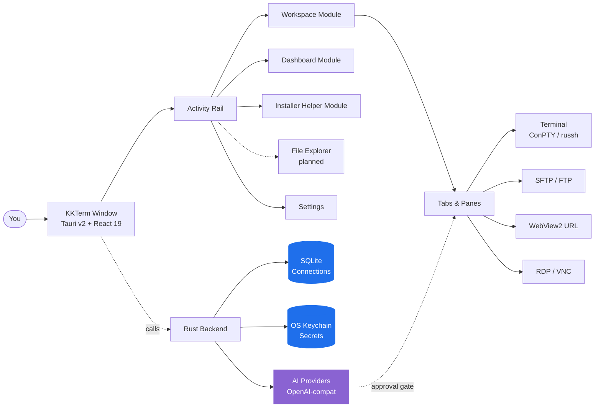

<p align="center">
  
</p>

<h1 align="center">KKTerm</h1>

<p align="center">
  <strong>Workspace admin Windows native yang lupa dibangun oleh era AI-tools — terminal, SSH, SFTP, RDP/VNC, dashboard, dan AI yang membangun widget tool milikmu sendiri.</strong>
</p>

<p align="center">
  <em>Karena taskbar kamu tidak seharusnya terlihat seperti mesin slot Vegas.</em>
</p>

<p align="center">
  <sub>Dinamai dari <strong>乖乖 (Kuāi Kuāi)</strong>, camilan kelapa hijau yang ditaruh sysadmin Taiwan di atas server supaya perangkat mereka tetap nurut. Semoga app ini layak menempati raknya.</sub>
</p>

<p align="center">
  <a href="https://github.com/ryantsai/KKTerm/stargazers">
    
  </a>
  <a href="https://github.com/ryantsai/KKTerm/network/members">
    
  </a>
  <a href="https://github.com/ryantsai/KKTerm/issues">
    
  </a>
  <a href="https://github.com/ryantsai/KKTerm/blob/main/LICENSE">
    
  </a>
  <br />
  
  
  
  
  
  <br />
  <sub>
    <a href="README.md">English</a> ·
    <a href="README.zh-TW.md">繁體中文</a> ·
    <a href="README.zh-CN.md">简体中文</a> ·
    <a href="README.ja.md">日本語</a> ·
    <a href="README.ko.md">한국어</a> ·
    <a href="README.fr.md">Français</a> ·
    <a href="README.de.md">Deutsch</a> ·
    <a href="README.es.md">Español</a> ·
    <a href="README.es-MX.md">Español (MX)</a> ·
    <a href="README.it.md">Italiano</a> ·
    <a href="README.pt-BR.md">Português (BR)</a> ·
    <a href="README.th.md">ไทย</a> ·
    <strong>Bahasa Indonesia</strong> ·
    <a href="README.vi.md">Tiếng Việt</a>
  </sub>
</p>

---

## Pitch-nya (45 detik)

Kamu seorang sysadmin / DevOps / homelab / vibe-coder. Sekarang kamu punya:

- Satu terminal emulator
- SSH client terpisah (dengan daftar profil yang butuh satu weekend buat dibangun)
- SFTP client dari tahun 2007 yang entah kenapa masih terus dipakai
- Remote Desktop di jendela yang selalu nyasar ke monitor yang salah
- VNC viewer buat satu kotak Linux itu
- Tab browser untuk admin UI router
- Sesi `claude` / `codex` yang jalan di dev box remote dan putus setiap kali Wi-Fi bersin
- Sticky note berisi password *(tenang, kita tidak akan bilang siapa-siapa)*

**KKTerm adalah satu jendela untuk semua itu.** Native di Windows — *memang sengaja, sementara semua tools developer lain rilis untuk Mac duluan dan memperlakukan OS kamu seperti catatan kaki* — ditulis dengan Rust + Tauri v2, tersedia sebagai satu installer, dan tidak pernah lapor ke mana-mana.

Plus beberapa hal yang belum kamu tahu kamu inginkan:

- Sebuah **Dashboard** tempat kamu bilang ke AI *"buatkan widget yang ping router saya setiap 30 detik"* dan langsung muncul, tersandbox, di gridmu.
- **SSH pane yang otomatis attach ke sesi tmux bernama** supaya sesi remote `claude` / `codex` kamu bertahan dari setiap tantrum Wi-Fi yang dilempar laptopmu.
- Sebuah **widget penggunaan AI Coding** yang menampilkan kuota Claude Code dan Codex kamu — jendela 5 jam, jendela mingguan, plan saat ini, email akun — di **Dashboard** dan di status bar, supaya kamu berhenti kaget kena tembok rate-limit jam 3 pagi.
- Sebuah Module **Installer Helper** yang mendeteksi, memasang, memperbarui, menghapus, dan menjalankan katalog tool developer Windows yang dikurasi — Node, Python, Docker, WSL, CLI coding AI, dan utilitas kecil yang biasanya kamu buru lewat banyak tab browser.
- Sebuah **server MCP built-in** (`kkterm-cli`) yang memungkinkan coding agent eksternal (Claude Code, Codex, Copilot, Antigravity, OpenCode) mengendalikan Workspace dan Dashboard kamu — list Connections, baca buffer terminal, place widget — lewat surface tool yang dikurasi dan di-gate dengan safety. AI-ke-AI, di mesin kamu, tanpa relay cloud.
- Dua puluh satu **latar belakang canvas beranimasi** (iya, termasuk `matrix`) untuk dashboard, karena kami memang tidak malu-malu soal itu.

Oh, dan asisten AI-nya bisa mengubah satu kalimat menjadi tool dashboard kecil yang benar-benar terus kamu pakai.

> ⭐ **Kalau ini kedengarannya seperti app yang sudah kamu rencanakan ingin bangun selama enam tahun terakhir — star repo-nya supaya kami tahu ada yang memperhatikan. Ini benar-benar membantu.**

---

## Kenapa "KKTerm"?

Masuk ke data center mana saja di Taiwan dan lihat bagian atas rak. Dari pabrik TSMC, ruang kendali Taipei Metro, ruang server Cathay Bank, perangkat switching Chunghwa Telecom — kamu akan menemukan sekantong kecil 乖乖 (Kuāi Kuāi), camilan jagung rasa kelapa dari tahun 1960-an.

Namanya secara harfiah berarti **"jadilah baik"**, **"berperilaku"**. Tradisi IT-nya sederhana dan sangat serius:

- **Harus rasa hijau (kelapa).** Kuning (kari) artinya *bolos kerja*; merah (pedas) bikin server marah. Hijau saja.
- **Harus belum kedaluwarsa.** Kuai Kuai basi justru merugikanmu. Para engineer rajin menggantinya.
- **Harus terlihat.** Server harus tahu kalau itu ada.
- **Jangan dimakan.** Kantong itu sedang bertugas.

Beberapa sistem terbesar, paling membosankan, dan paling terobsesi dengan uptime di Asia dijalankan dengan sekantong puff jagung yang ditempel di chassis. Berhasil karena orang-orang yang merawatnya percaya itu berhasil — yang merupakan deskripsi paling jujur dari sebagian besar budaya IT.

**KKTerm** adalah **Kuai Kuai Term** — workspace admin yang bercita-cita menjalankan tugas yang sama seperti camilan itu: duduk diam di samping mesin-mesin pentingmu dan membantu mereka berperilaku baik. Local-first. Tanpa telemetry. AI dengan approval-gate. Perangkat lunak yang membosankan dan bisa diandalkan.

Kami belum berhasil menyertakan kantong Kuai Kuai sungguhan dengan installer. Itu item v2.

---

## Lihat Gerakannya

<!--
  TODO: Ganti placeholder ini dengan GIF demo yang nyata.
  Rekomendasi:
    - 5-10 detik, diputar berulang
    - Tampilkan: buka Connection -> split pane -> upload SFTP -> AI mengusulkan perintah
    - Target ~5 MB supaya GitHub me-render inline tanpa lazy-loading
  Jalur yang disarankan: docs/assets/demo.gif
  Kemudian ganti  di bawah menjadi: src="docs/assets/demo.gif"
-->

<p align="center">
  <a href="https://github.com/ryantsai/KKTerm">
    
  </a>
</p>

<p align="center"><sub><em>(GIF demo ada di sini. Satu gambar bernilai seribu bullet point, dan kami kehabisan bullet point.)</em></sub></p>

---

## Kenapa Orang Membiarkannya Terbuka Sepanjang Hari

### Windows-first, memang sengaja

Lihat lanskap tooling developer 2026. Claude Code: rilis untuk mac/linux duluan, Windows adalah "pakai WSL." Codex CLI: sama. `gemini-cli`, separuh Homebrew, setiap TUI baru yang kinclong: mac/linux duluan, pengguna Windows mendapat komentar `# Windows: contributions welcome` di README dan skrip fish-completion yang tidak bisa dijalankan.

Sementara itu, orang-orang yang benar-benar menjaga perusahaan tetap online — corporate IT, MSP, siapa pun yang menjalankan Hyper-V atau AD atau SCCM atau IIS atau domain controller yang lebih tua dari beberapa intern — duduk di depan mesin Windows bertanya-tanya kenapa setiap tools baru bersikap seolah OS mereka adalah gangguan.

**KKTerm adalah kebalikannya.** Kami membangun Windows native duluan, dan port macOS / Linux menyusul. Artinya kami bisa memanfaatkan Windows API yang benar-benar penting, bukan melapisinya dengan portability layer:

- **ConPTY** untuk shell lokal — pseudo-console Windows yang asli, bukan shim terjemahan. PowerShell, `cmd.exe`, distro WSL, semua di-hosting sebagai PTY proper dengan focus, resize, dan penanganan VT sequence yang sesuai perilaku platform.
- **WebView2** untuk seluruh UI dan **Connections** URL yang ditanam — Chromium in-process menggunakan runtime sistem, yang merupakan salah satu alasan installer-nya kecil dan cepat dibuka.
- **Microsoft RDP ActiveX (`mstscax.dll`)** untuk RDP — *yang asli dari Microsoft*. Control yang sama dengan Remote Desktop Connection (`mstsc.exe`). Bukan reimplementasi pihak ketiga, bukan FreeRDP dalam wrapper. Pengguna RDP akan merasakan bedanya dalam lima detik.
- **Windows Credential Manager** untuk semua rahasia. Password SSH, password FTP, API key, kredensial URL Connection — semuanya hidup di OS keychain dan `credwiz.exe` bisa mengauditnya.
- **NSIS current-user installer** dengan SHA-256 yang matching, tray menu native, Don't-Sleep power assertion, sampling CPU/RAM/jaringan host, Tauri context menu native dengan ikon PNG sungguhan, dialog Open/Save native. Tidak ada satu pun yang dipalsukan.
- **WSL adalah shell kelas satu, bukan solusi darurat.** Jalankan Ubuntu di samping pane PowerShell di samping sesi SSH di samping **Tab** RDP dalam satu jendela yang sama.

Build untuk macOS dan Linux ada di roadmap dan akan mendapat perhatian yang sama. Tapi kalau kamu sudah lama menunggu seseorang membangun tools admin Windows yang *bagus* duluan bukan terakhir — ini dia dealnya.

### Local-first artinya benar-benar lokal

**Connections** yang tersimpan hidup dalam file SQLite di mesinmu. Password hidup di **Windows Credential Manager**, bukan di JSON di samping binary. App ini tidak menyertakan analitik, tidak melapor ke mana-mana saat startup, dan tidak butuh akun cloud untuk diluncurkan. Tidak ada "masuk untuk sync" karena tidak ada sync.

Kalau kabel jaringanmu kebakaran, KKTerm tetap bisa dibuka.

### Satu workspace, setiap jenis koneksi

| Kamu mau… | KKTerm punya |
| --- | --- |
| Buka shell PowerShell / cmd / WSL lokal | **Sessions** terminal lokal berbasis ConPTY |
| SSH ke server | `russh` native dengan auth agent / key / password, alur trust host-key, ProxyJump, port forwarding |
| Browse file di server itu | SFTP diluncurkan dari **Connection** SSH, dual-pane, transfer rekursif, chmod/chown |
| FTP ke NAS dari tahun 2012 | **Connections** FTP / FTPS dalam browser bergaya SFTP yang sama |
| Telnet ke perangkat jadul | Iya, oke, Telnet juga ada |
| Bicara ke serial port | **Connection** kind Serial, COM port + baud, tanpa tooling tambahan |
| Remote ke mesin Windows | RDP native via kontrol Microsoft ActiveX (yang asli, bukan tiruannya) |
| VNC ke Raspberry Pi | Rust `vnc-rs` framebuffer yang dirender langsung ke workspace |
| Buka web UI router | **URL Connection** WebView2 tertanam dengan pengisian kredensial |
| Pantau CPU di host | Status bar langsung + modul **Dashboard** dengan widget yang bisa di-drag/resize |

Semuanya satu app yang sama. Satu jendela yang sama. Hotkey yang sama. Tema yang mudah-mudahan tidak bikin mata perih.

### Terminal yang tidak gila-gilaan

- Split pane di dalam **Tab**.
- Rendering xterm.js berakselerasi WebGL, dengan fallback yang mulus saat tidak bisa.
- Pencarian scrollback.
- SSH pane berbasis tmux yang bisa attach ke sesi per-pane yang stabil, jadi reconnect benar-benar berarti *menyambung kembali*, bukan "mulai dari awal dan pura-pura satu jam terakhir tidak pernah terjadi."
- Berganti **Tab** **tidak** mematikan **Session**. Menutup **Tab** yang melakukannya. Perbedaan ini sempat jadi perang saudara secara internal; kami yang menang.

### Asisten AI yang membangun tool-mu

Sebagian besar demo "AI di terminal" berhenti di chat. Asisten KKTerm juga bisa membangun widget dashboard kecil yang tahan lama untuk cara kerjamu yang sebenarnya. Hal-hal berbahaya tetap dijaga di balik dua sakelar:

- **Tool families** (Dashboard / Connections / Live Sessions) — toggle on atau off per kategori.
- **Permission mode** di composer — `Prompt` (default, selalu tanya) atau `Allow All` (kamu sudah dewasa, kamu yang tanda tangan waivernya).

Bicara ke OpenAI, Anthropic, OpenRouter, DeepSeek, Grok, Azure OpenAI, LiteLLM, GitHub Copilot, Ollama, NVIDIA, atau apapun yang kompatibel dengan OpenAI. API key masuk ke OS keychain. Model yang mengusulkan `rm -rf` diklasifikasikan sebagai berbahaya dan memerlukan persetujuan manusia yang eksplisit. AI tidak bisa diam-diam menjalankan perintah destruktif hanya karena seseorang pintar melakukan prompt injection di halaman man.

### Dashboard yang tidak berpura-pura jadi Grafana

Modul **Dashboard** adalah grid drag/resize 12 kolom dari instance widget. Ini bukan untuk observabilitas petabyte — ini untuk "aku mau tombol untuk membuka lima app favorit dan panel yang menampilkan uptime SSH host, *di samping* chatku."

#### Widget Buatan AI — deskripsikan, langsung jadi

Ini bagian yang benar-benar membuat kami excited. Kamu tidak perlu pilih dari marketplace dan tidak perlu nulis JavaScript. Kamu **bilang ke asisten AI apa yang kamu mau**, dan dia membangun widget itu langsung di dashboardmu:

> *"Tambahkan widget yang menampilkan 5 commit terakhir di repo utama saya sebagai daftar."*
> *"Buatkan saya widget sticky-note yang menyimpan cheat sheet on-call saya."*
> *"Buat widget yang ping router rumah saya setiap 30 detik dan tampilkan hijau/merah."*
> *"Saya butuh stopwatch. Bebas ya soal styling-nya."*

Dua jenis:

- **Content widgets** — JSON deklaratif: markdown, kv list, checklist, satu stat besar. Aman secara konstruksi, tanpa skrip. Sebagian besar permintaan "aku hanya butuh ini di dashboard-ku" berakhir di sini.
- **Script widgets** — JavaScript yang di-hosting di dalam sandbox `iframe srcdoc` yang terisolasi dengan izin yang eksplisit dan dideklarasikan (allowlist `network`, budget `pollSeconds`). AI yang menulis skrip, kamu yang menyetujui izin, widget berjalan di kotak yang tidak bisa menjangkau sisa app.

Setiap widget yang kamu simpan adalah milikmu. Mereka bertahan di SQLite di samping **Connections**-mu, dengan preset visual mereka sendiri (`panel` / `ambient` / `hero`), warna aksen, ikon, dan judul. Beberapa instance dari widget yang sama bisa hidup berdampingan dengan ukuran dan gaya yang benar-benar berbeda. Hapus dengan klik kanan ketika magicnya sudah habis.

#### Latar belakang dashboard beranimasi (karena kami memang mau)

Dashboard punya dua puluh satu latar belakang canvas beranimasi yang bisa kamu pilih per **Dashboard View**:

| Suasana | Latar Belakang |
| --- | --- |
| Tenang | `aurora`, `clouds`, `ocean`, `raindrops`, `snow`, `sakura`, `fireflies`, `bubbles`, `ricefield`, `lanterns` |
| Luar Angkasa | `starfield`, `nebula` |
| Hangat | `embers`, `lava` |
| Geek | `matrix`, `topo`, `synthwave` |
| Ugal-ugalan | `cyberpunk`, `taipei101`, `thunderstorm`, `confetti` |

Semuanya berjalan di satu `requestAnimationFrame` bersama dan menghormati focus jendela, jadi biayanya hampir nol saat kamu ada di tempat lain. Pasangkan `matrix` dengan asisten AI untuk vibe yang terkesan "aku sangat produktif dan mungkin juga berada dalam film Wachowski." Atau pilih `ocean` dan terlihat seperti orang serius. Kami tidak menghakimi pilihan apapun.

### Menjalankan agen coding AI di server, dengan benar

Ini fitur kedua yang langsung disukai orang. Terminal SSH KKTerm bisa diluncurkan langsung ke **sesi tmux bernama** di host remote — secara default, friendly id yang auto-generated seperti `kkterm-cockpit001` yang bertahan saat reconnect:

- Buka **Connection** SSH dengan tmux diaktifkan.
- Di dalam pane, jalankan `claude`, `codex`, `gemini-cli`, `cursor-agent`, atau agen coding long-running apapun yang kamu suka. Mereka adalah app TUI full-screen; tmux persis tempat yang mereka inginkan.
- Tutup laptop. Buka lagi. Pane diam-diam re-attach ke sesi tmux yang sama. Agen masih berjalan, masih punya scrollback-nya, masih di tengah-tengah apa yang sedang dilakukannya.
- Gangguan jaringan di transport SSH? KKTerm melakukan bounded silent reattach attempt ke tmux id yang sama tanpa mengganggumu.
- Mau asisten AI melihat apa yang dilakukan agen itu? "Tambahkan terminal buffer ke context" memanggil `capture_tmux_pane` via SSH dan menarik seluruh scrollback tmux — bukan hanya yang ada di layar, seluruh sesinya — ke dalam percakapan. Asisten lokal kamu kini bisa bernalar tentang pekerjaan agen remote-mu.

Kalau kamu pernah kehilangan sesi `claude` atau `codex` enam jam karena Wi-Fi hotel yang tidak stabil, fitur tunggal ini sudah melunasi harga app-nya. App-nya gratis. Fiturnya tetap worth it.

### Tahu berapa AI kamu yang tersisa

Coding agent menagih per jendela plan, bukan per bulan. Claude Code punya jendela 5 jam dan jendela mingguan. Codex punya versinya sendiri. Keduanya bisa dengan senang hati melahap kuota kamu di background saat kamu lagi meeting.

Widget **Penggunaan AI Coding** menjaga itu tetap terlihat:

- Widget Dashboard yang menampilkan **Claude Code** dan **Codex** berdampingan: akun yang terhubung, level plan, persen yang dipakai di jendela 5 jam saat ini, persen yang dipakai minggu ini, waktu reset berikutnya.
- Indikator **status bar yang ringkas** yang memantulkan angka yang sama, jadi meski Dashboard ditutup kamu bisa lihat sekilas apakah masih ada ruang sebelum mulai refactor besar berikutnya.
- Status auth ditampilkan langsung (`connected` / `expired` / `error`) supaya kamu tahu *sebelum* tugas panjang bahwa kamu perlu re-login, bukan di tengah-tengah.
- Policy refresh menghormati rate limit; widget polling di tempo sendiri alih-alih menghantam API upstream tiap kali kamu lihat.

### Sebuah server MCP built-in — biarkan AI lain mengendalikan KKTerm

Terminal kamu juga tempat Claude Code, Codex, Copilot agent mode, Antigravity, dan sisa dunia yang ngobrol MCP ingin bekerja. Maka KKTerm membawa **server MCP stdio**-nya sendiri, [`kkterm-cli`](docs/MCP.md), yang membuka slice app yang dikurasi:

- **Modul Workspace** (`kkterm.workspace.*`): list **Connections** tersimpan, buka Connection by id, list **Sessions** yang hidup, kirim input ke pane terminal, baca snapshot buffer.
- **Modul Dashboard** (`kkterm.dashboard.*`): load state Dashboard, baca source AI-Created Widget, buat / update / hapus view, place / pindah / hapus widget instance, apply bulk layout.
- **Sub-namespace berbahaya** (`kkterm.<module>.dangerous.*`): mengubah surface yang executable — bikin widget script, klik ke remote desktop, wipe Dashboard — di-gate di balik satu setting (`built_in_mcp_allow_all_dangerous`), default **mati**.

`kkterm-cli` adalah forwarder tipis. Dia bicara stdio JSON-RPC ke MCP client kamu dan berkomunikasi dengan window KKTerm yang berjalan via Windows named pipe yang ter-authenticate per-launch. Saat KKTerm tertutup, `tools/list` tetap jalan (client bisa introspeksi surface), tapi `tools/call` mengembalikan error terstruktur `app_not_running` alih-alih melakukan apapun.

Sambungkan ke client favorit kamu dan AI kamu sekarang pakai KKTerm seperti kamu:

```json
{
  "mcpServers": {
    "kkterm": { "command": "<path-ke-kkterm-cli>", "args": [] }
  }
}
```

Settings → AI Assistant → **Built-in MCP Server** punya dialog "Show config" satu klik dengan snippet JSON dan TOML pre-filled dengan path binary yang resolved, plus command `claude mcp add` / `codex mcp add` yang bisa di-copy.

---

## Cara Kerjanya



Bentuk yang penting: data tersimpan yang tahan lama (**Connection**) terpisah dari state runtime langsung (**Session**), yang terpisah dari container UI (**Tab**). Menutup **Tab** mengakhiri **Session**. Berganti **Tab** tidak. Ini aturan yang menjaga app tetap waras.

---

## Peta Fitur Saat Ini

| Area | Sudah diimplementasikan hari ini |
| --- | --- |
| **Connections** | Pohon berbasis SQLite, folder/subfolder, pencarian, urutan drag/drop, rename, duplicate, hapus, **Quick Connect**, ikon kustom, pintasan rail yang disematkan/aktif |
| **Terminal** | Shell lokal, SSH, Telnet, Serial, split pane, xterm.js + WebGL oportunistik, pencarian scrollback, direktori/skrip startup lokal |
| **SSH** | `russh` native, auth agent/key/password, alur trust host-key, fallback SSH sistem opsional, ProxyJump, port forwarding, **sesi tmux auto-named (`kkterm-<scifi-name><n>`) dengan silent reattach saat transport blip** — sempurna untuk agen coding remote long-running (Claude Code, Codex, gemini-cli, dll.) |
| **SFTP / FTP** | SFTP yang diluncurkan via SSH plus **Connections** FTP/FTPS, browser dual-pane, transfer rekursif, antrean/batalkan/bersihkan riwayat, konflik, properti, chmod/chown jika didukung |
| **URL WebView** | **Sessions** URL WebView2 tertanam, toolbar navigasi, pengambilan favicon, metadata/isian kredensial website tersimpan, metadata partisi data |
| **Remote Desktop** | RDP melalui Windows ActiveX dengan geometry-scoped overlay parking; VNC melalui `vnc-rs` framebuffer yang dirender di canvas workspace |
| **Dashboard** | View yang tahan lama, instance widget, mode edit, drag/resize, App Launcher, **widget konten/skrip buatan AI** (JSON deklaratif atau iframe JS tersandbox dengan izin), preset / aksen / ikon / judul per-widget, **21 latar belakang canvas beranimasi** (aurora, clouds, ocean, raindrops, snow, sakura, fireflies, bubbles, ricefield, lanterns, starfield, nebula, embers, lava, matrix, topo, synthwave, cyberpunk, taipei101, thunderstorm, confetti) |
| **AI Assistant** | Chat streaming, runtime kompatibel OpenAI, registri provider, klasifikasi keamanan proposal perintah, lampiran screenshot/context, **pembuatan widget Dashboard (konten + skrip tersandbox)**, **penangkapan pane tmux** sebagai context percakapan untuk sesi remote, tools manajemen **Connection**, dan tools **Session** langsung untuk terminal, RDP/VNC, dan SFTP/FTP |
| **Penggunaan AI Coding** | **Widget Dashboard + indikator status bar** yang melacak penggunaan kuota **Claude Code** dan **Codex**: akun terhubung, level plan, persen jendela 5 jam dan mingguan, waktu reset berikutnya, status auth (`connected` / `expired` / `error`), policy refresh yang sadar rate-limit |
| **Server MCP Built-in** | Server MCP stdio (`kkterm-cli`) yang membuka tools Workspace dan Dashboard yang dikurasi ke agen coding eksternal (Claude Code, Codex, Copilot, Antigravity, OpenCode); bridge named pipe ter-authenticate; sub-namespace `dangerous.*` per-Modul di balik satu toggle safety; dialog Settings dengan snippet JSON / TOML satu klik dan command `claude mcp add` / `codex mcp add` |
| **Installer Helper** | Module Activity Rail untuk katalog tool developer Windows yang dibundel: mendeteksi tool terpasang, membandingkan versi terbaru, install/update/uninstall, mengecualikan tool dari Update all, streaming log command, dan menjalankan managed app yang didukung |
| **Settings** | Umum, Tampilan, Kredensial, AI, SSH, Terminal, URL, RDP, VNC, Dashboard, Installer Helper, Tentang; font UI kustom; minimize-to-tray; Don't Sleep; backup/import |
| **Lokalisasi** | UI i18next dengan sumber bahasa Inggris dan bundel lokal dinamis: zh-TW, zh-CN, ja, ko, fr, de, es, es-MX, it, pt-BR, th, id, vi |

### AI Providers

OpenAI · Anthropic · OpenRouter · DeepSeek · Grok · Azure OpenAI · LiteLLM · GitHub Copilot · Ollama · NVIDIA · endpoint apapun yang kompatibel dengan OpenAI.

Metadata provider ada di [`src/ai/providerRegistry/`](src/ai/providerRegistry/); adapter Rust ada di [`src-tauri/src/ai/providers/`](src-tauri/src/ai/providers/). API key melewati OS keychain, tidak pernah SQLite.

---

## Quick Start

Yang kamu butuhkan:

- **Windows** (platform yang didukung utama)
- **Node.js + npm**
- **Rust toolchain**
- **Prasyarat Tauri v2 untuk Windows** termasuk **WebView2**

```bash
npm install
npm run tauri dev
```

Itu seharusnya menghasilkan jendela native yang sungguhan. Kalau malah menghasilkan stack trace, silakan buat issue — kami suka repro yang bagus.

### Pengecekan umum

```bash
npm run check                                              # TypeScript
npm run build                                              # Vite build
cargo check --manifest-path src-tauri/Cargo.toml           # Rust
cargo test  --manifest-path src-tauri/Cargo.toml           # Rust tests
```

### Build installer Windows

```bash
npm run package:installer
```

Skrip installer menulis `artifacts/kkterm-<version>-windows-x64-setup.exe` dan file `.sha256` yang matching. Saat ini **belum ditandatangani** — penandatanganan rilis ada di roadmap, tapi sampai saat itu antivirus kamu mungkin akan menatap dengan tatapan serius. Itu normal.

---

## Apa yang KKTerm Bukan

Daftar singkat, karena kejujuran membangun kepercayaan:

- **Bukan produk cloud.** Tidak ada sync, tidak ada akun tim, tidak ada tier SaaS. Kalau kamu pernah melihat dialog "Masuk ke KKTerm", ada yang salah secara katastrofis.
- **Tidak berpura-pura lintas platform.** Kami Windows-first secara sengaja; macOS dan Linux ada di roadmap dan akan menggunakan shell Tauri v2 yang sama. Kalau kamu butuh tools mac-first hari ini, kamu punya ratusan pilihan. Kami sedang membangun yang selama ini diam-diam ditunggu oleh admin Windows.
- **Bukan agen AI otonom.** Asisten mengusulkan; manusia yang memutuskan. `Allow All` adalah pilihan yang kamu buat, bukan default.
- **Bukan pengganti Grafana / Datadog.** Dashboard ini untuk control surface personal, bukan observabilitas 10k host.
- **Bukan Kubernetes IDE.** Ini adalah workspace admin yang mengutamakan terminal. Tolong jangan minta dia me-render Helm chart.

Kalau ada dari itu yang *jadi dealbreaker* — tidak apa-apa, kita ketemu di v2.

---

## Debugging Native

Gunakan runtime Tauri yang sesungguhnya untuk validasi:

```bash
npm run tauri dev
```

Preview browser Vite berguna untuk beberapa inspeksi frontend, tapi **tidak** meng-hosting WebView2, ConPTY, RDP ActiveX, VNC framebuffer, keychain, atau permukaan menu native yang sesungguhnya. Kalau sebuah fitur menyentuh salah satu dari itu, validasi di runtime desktop yang asli.

Pengguna VS Code: konfigurasi launch `Run KKTerm exe` memulai `src-tauri/target/debug/kkterm.exe` dengan `RUST_BACKTRACE=1`. Konfigurasi berpasangan `Attach KKTerm WebView2` memberikanmu DevTools di dalam host WebView2 yang sesungguhnya.

---

## Batasan Saat Ini (iya, kami tahu)

- Installer saat ini belum ditandatangani. Pemeriksaan update dinonaktifkan sampai penandatanganan rilis dikonfigurasi.
- SFTP melalui ProxyJump belum didukung di jalur SFTP native.
- Resume transfer file, sync/diff folder, archive/extract, dan pengeditan remote ditunda.
- Impor SSH config sudah diimplementasikan tapi entri yang menghadap pengguna di Settings belum terekspos.
- RDP dan VNC sedang dirilis; sinkronisasi clipboard/perangkat yang lebih kaya dan kontrol kualitas masih berkembang.
- Build macOS dan Linux ada di roadmap. Mereka akan datang, dan akan dikerjakan dengan benar — tidak terburu-buru sebagai port "kami juga agak bisa di sana."
- Asisten AI mengusulkan dan dapat mengoperasikan tools yang diaktifkan dalam batas izin yang dikonfigurasi — tolong jangan perlakukan dia sebagai robot tanpa pengawasan. Dia sebenarnya tidak tahu apa yang diinginkan CEO kamu.

---

## Roadmap (versi singkat)

- Build macOS + Linux
- Installer bertanda tangan + auto-update
- SFTP melalui ProxyJump di jalur native
- Resume transfer file, sync folder, archive/extract
- Pengalihan clipboard/perangkat RDP yang lebih kaya
- Lebih banyak widget **Dashboard** bawaan (dan skema publik untuk yang dibuat AI)

Versi lengkap dan sering diperbarui: [`docs/ROADMAP.md`](docs/ROADMAP.md).

---

## Berkontribusi

Kami sangat butuh bantuan. Sungguh. Bahkan hal kecil pun berarti:

- **Coba dev build** dan buat issue ketika ada yang terasa aneh. "Rasanya aneh" adalah laporan bug yang sah; kami akan menggali bersama kamu.
- **Terjemahkan satu lokal.** Bahasa Inggris adalah sumber kebenaran di [`src/i18n/locales/en.json`](src/i18n/locales/en.json); 12 lokal lainnya ada di sebelahnya dan dimuat sesuai permintaan. String yang tertunda dilacak per-key di bawah [`docs/localization_todo/`](docs/localization_todo/) — pilih satu, terjemahkan, hapus file-nya.
- **Tambahkan widget Dashboard.** Widget bawaan ada di [`src/modules/dashboard/widgets/builtin/`](src/modules/dashboard/widgets/builtin/). Pilih ide kecil, kirim, pelajari polanya.
- **Sempurnakan tool surface AI.** Adapter provider ada di [`src-tauri/src/ai/providers/`](src-tauri/src/ai/providers/); registri frontend ada di [`src/ai/providerRegistry/`](src/ai/providerRegistry/).
- **Tingkatkan manual.** Dokumen pengguna akhir ada di [`docs/manual/`](docs/manual/). Satu bab per modul UI. Kalau kamu menggunakan sebuah fitur dan dokumennya tidak membantu, PR yang memperbaiki itu sangat berharga.

Setup lengkap, tata letak proyek, checklist PR, dan daftar aturan "tolong jangan rusak ini" ada di [`CONTRIBUTING.md`](CONTRIBUTING.md). Highlights 30 detik:

- **Baca [`CONTEXT.md`](CONTEXT.md) sebelum mengganti nama istilah yang menghadap pengguna.** **Connection**, **Session**, **Tab**, dan **Quick Connect** punya arti spesifik; tolong jangan melenceng.
- **Setiap string yang terlihat pengguna melewati `t()`.** Tidak ada teks bahasa Inggris polos di JSX.
- **Tidak ada frontend close hooks.** Close title-bar Tauri v2 sudah beberapa kali rusak oleh pola `onCloseRequested`. Kami akhirnya punya bentuk yang berfungsi; tolong jangan diperkenalkan kembali.
- **Jalankan pengecekan** (`npm run check && npm run build && cargo check && cargo test`) sebelum membuka PR.

Mencari titik masuk? Filter issue terbuka dengan [`good first issue`](https://github.com/ryantsai/KKTerm/issues?q=is%3Aissue+is%3Aopen+label%3A%22good+first+issue%22) atau [`help wanted`](https://github.com/ryantsai/KKTerm/issues?q=is%3Aissue+is%3Aopen+label%3A%22help+wanted%22). Kalau belum ada yang ditag, buat issue yang mendeskripsikan apa yang ingin kamu kerjakan dan kami akan membantu menentukan cakupannya.

---

## Dokumentasi Proyek

- [Konteks produk](CONTEXT.md) — bahasa domain yang harus kamu cocokkan
- [Arsitektur](docs/ARCHITECTURE.md) — peta modul, di mana menaruh kode baru
- [Roadmap](docs/ROADMAP.md)
- [Arsitektur Dashboard](docs/DASHBOARD.md)
- [Panduan AI provider](docs/AI_PROVIDERS.md)
- [Catatan performa](docs/PERFORMANCE.md)
- [Catatan rilis dan gates](docs/RELEASE.md)

---

## Stack

Rust · Tauri v2 · React 19 · TypeScript · Vite · Tailwind CSS · Zustand · xterm.js · SQLite · WebView2 · `russh` · `russh-sftp` · `vnc-rs` · `suppaftp` · OS keychain storage.

---

## Riwayat Star

<a href="https://www.star-history.com/#ryantsai/KKTerm&Date">
  <picture>
    <source media="(prefers-color-scheme: dark)" srcset="https://api.star-history.com/svg?repos=ryantsai/KKTerm&type=Date&theme=dark" />
    <source media="(prefers-color-scheme: light)" srcset="https://api.star-history.com/svg?repos=ryantsai/KKTerm&type=Date" />
    
  </picture>
</a>

Kalau kamu sudah sampai sejauh ini dan belum bintangin — apa yang kamu tunggu, undangan pribadi? Anggap ini sebagai undangan pribadinya.

⭐ **[Bintangi KKTerm di GitHub](https://github.com/ryantsai/KKTerm)** — butuh satu klik dan membuat minggu maintainer-nya jadi lebih bermakna. Anggap saja sebagai 乖乖 digital di raknya.

---

## Lisensi

MIT. Lihat [LICENSE](LICENSE). Gunakan, fork, kirim, taruh di homelab yang tidak bisa ditemukan siapapun — begitulah dealnya.
