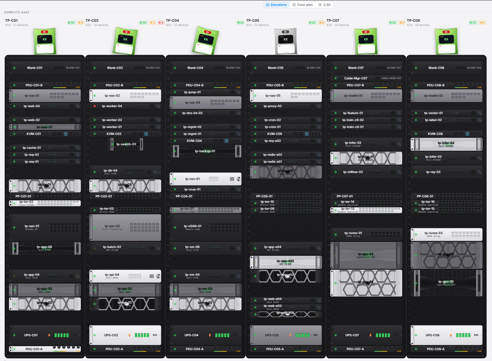

  

<h1 align="center">KKTerm</h1>

  <strong>Un'unica finestra nativa Windows per terminali, SSH, SFTP, RDP/VNC e una dashboard — più un'IA che ti costruisce i tuoi piccoli strumenti su richiesta.</strong>

  <em>Perché la tua barra delle applicazioni non dovrebbe sembrare una slot machine di Las Vegas.</em>

  Prende il nome da <strong>乖乖 (Kuāi Kuāi)</strong>, lo snack verde al cocco che i sysadmin taiwanesi posano sui server perché si comportino bene. Speriamo che questa app si guadagni il suo posto sul rack.

  <strong><a href="https://github.com/ryantsai/KKTerm/releases/latest">Scarica l'ultima release di KKTerm</a></strong>

  
  
  
  
  
   
  
  
   
  
    <a href="README.md">English</a> ·
    <a href="README.zh-TW.md">繁體中文</a> ·
    <a href="README.zh-CN.md">简体中文</a> ·
    <a href="README.ja.md">日本語</a> ·
    <a href="README.ko.md">한국어</a> ·
    <a href="README.fr.md">Français</a> ·
    <a href="README.de.md">Deutsch</a> ·
    <a href="README.es.md">Español</a> ·
    <a href="README.es-MX.md">Español (MX)</a> ·
    <strong>Italiano</strong> ·
    <a href="README.pt-BR.md">Português (BR)</a> ·
    <a href="README.th.md">ไทย</a> ·
    <a href="README.id.md">Bahasa Indonesia</a> ·
    <a href="README.vi.md">Tiếng Việt</a>
  

---

## Il pitch in 45 secondi

KKTerm riunisce terminali locali, SSH/SFTP, FTP/FTPS, Telnet, connessioni seriali, RDP/VNC, pagine web integrate, file locali e documenti in un unico spazio di lavoro desktop. Le schede possono combinare diversi tipi di pannello, mantenendo insieme terminale, browser dei file e schermo remoto della stessa attività.

Funziona su Windows, macOS e Linux, salva i dati localmente e non usa telemetria. Include IA soggetta ad approvazione, widget Dashboard personalizzabili, Workspace, IT Ops e Install Helper per Windows.

---

## Perché «KKTerm»?

Entra in un qualunque data center taiwanese e guarda la cima dei rack. Oltre le fab di TSMC, le sale di controllo della metro di Taipei, le sale server della banca Cathay, gli apparati di commutazione di Chunghwa Telecom — scorgerai un sacchettino verde di 乖乖 (Kuāi Kuāi), uno snack di mais al gusto di cocco degli anni '60.

**KKTerm** è **Kuai Kuai Term** — uno spazio di amministrazione che aspira allo stesso lavoro dello snack: sedersi in silenzio accanto alle tue macchine importanti e aiutarle a comportarsi bene. Local-first. Niente telemetria. IA con approvazione. Quel genere di software noioso e affidabile.

Non siamo ancora riusciti a spedire un vero sacchetto di Kuai Kuai con l'installer. È roba da v2.

---

## Vederlo in movimento

  

<em>(La GIF dimostrativa. Un'immagine vale più di mille punti elenco, e i punti elenco li abbiamo finiti.)</em>

---

## Una finestra, ogni connessione

| Volevi… | KKTerm lo fa |
| --- | --- |
| Aprire una shell locale PowerShell / cmd / WSL | Terminali locali, affiancati |
| SSH verso un server | SSH con chiavi, agent, password, jump host e port forwarding |
| Sfogliare i file su quel server | SFTP dalla connessione SSH — doppio pannello, trascina per trasferire |
| FTP verso un NAS del 2012 | FTP / FTPS nello stesso file browser |
| Telnet verso ferraglia antica | Sì, c'è anche Telnet |
| Parlare con una porta seriale | Connessioni seriali — scegli porta COM e baud |
| Entrare in remoto su una macchina Windows | Il vero Desktop remoto Microsoft, integrato |
| VNC su un Pi | VNC, renderizzato direttamente nello spazio di lavoro |
| Aprire l'interfaccia web del router | Una scheda di browser integrata con login salvati |
| Sfogliare il tuo disco | Un pannello File Explorer locale, lo stesso doppio pannello di SFTP |
| Aprire un log, CSV, immagine o PDF | Un visualizzatore Document integrato con una vera modalità log a inseguimento (tail) |
| Tenere d'occhio la CPU dell'host | Una barra di stato dal vivo e una dashboard che costruisci tu |

La stessa app. La stessa finestra. Le stesse scorciatoie. Lo stesso tema, si spera non sanguinoso per gli occhi.

  

---

## Perché la gente lo tiene aperto tutto il giorno

### Download piccolo, avvio fulmineo

KKTerm è costruito per sembrare un'utilità, non una piattaforma. Le build desktop attuali pesano meno di 20 MB, si installano in fretta e si avviano abbastanza rapidamente da non far sembrare l'apertura del tuo spazio di amministrazione l'avvio di un secondo sistema operativo.

### Griglie multi-pannello, mescolate come lavori

Un Tab può contenere una griglia di Panes, e quei Panes non devono essere dello stesso tipo. Metti SSH accanto a SFTP, una PowerShell locale sotto una RDP Session, VNC accanto alla UI web del router, o un file browser vicino al terminale che sta spostando i file.

  

### Un assistente IA che comanda i tuoi terminali per te

Gran parte delle demo «IA nel terminale» si ferma alla chat. L'assistente di KKTerm lavora *dentro* la tua sessione: gli passi il contesto da ciò che è già a schermo, e agisce sulle macchine a cui sei connesso — con un umano nel ciclo di approvazione.

  

### Una dashboard che non finge di essere Grafana

La Dashboard è una griglia di widget che trascini e ridimensioni. Non è per l'osservabilità su scala petabyte — è per «voglio un pulsante che lanci le mie cinque app preferite e un pannello che mostra l'uptime del mio host SSH, *accanto* alla mia chat».

  

### IT Ops per siti, host e attività ripetibili

Il Modulo **IT Ops** raggruppa le connessioni in siti, rappresenta sale server e rack, cataloga gli host ed esegue attività riutilizzabili sulle macchine selezionate. Le esecuzioni batch conservano i risultati per host, mentre le automazioni collegano eventi e condizioni a notifiche, webhook o attività.

  

### Tieni vivi i tuoi agenti IA

Questa è la seconda funzione di cui la gente s'innamora. I terminali SSH di KKTerm possono catapultarti direttamente in una **sessione tmux con nome** sull'host remoto che sopravvive alla riconnessione.

  

### Tieni separati i tuoi mondi con i Workspace

L'homelab, il lavoro e i server di quel cliente non appartengono alla stessa lista. I **Workspace** sono contenitori di Connections con nome e isolati tra cui commuti dall'Activity Rail. Commutare riassegna l'ambito solo all'albero delle connessioni — le tue Sessions aperte, la Dashboard e le impostazioni restano dove sono — quindi cambiare contesto costa un clic, non un riavvio.

  

### Vestilo come vuoi: temi di colore

Gli sfondi sono la parte divertente; i **temi di colore** sono quello che fissi davvero tutto il giorno. KKTerm porta **ventisei** schemi di colore che ridisegnano tutta la cornice dell'app — Activity Rail, albero delle connessioni, schede, finestre — con una mini-anteprima dal vivo di ciascuno in Impostazioni ▸ Aspetto.

  

### Install Helper (solo Windows)

Preparare una macchina Windows nuova per lo sviluppo di solito significa dieci schede del browser e un sacco di «avanti, avanti, fine». L'**Install Helper** è un catalogo integrato che trova, installa, aggiorna e disinstalla i tool che altrimenti inseguiresti a mano — senza uscire da KKTerm.

  

---

## Cosa KKTerm non è

Una lista breve, perché l'onestà conquista fiducia:

- **Non è un prodotto cloud.** Niente sync, niente account di team, niente piano SaaS. Se mai vedi una finestra «Accedi a KKTerm», qualcosa è andato catastroficamente storto.
- **Non finge che tutti i sistemi operativi siano identici.** KKTerm pubblica build per Windows, macOS e Linux, mantenendo chiare le funzioni specifiche di ogni piattaforma.
- **Non è un agente IA autonomo.** L'assistente propone; l'umano dispone. `Allow All` è una scelta che fai tu, non un default.
- **Non è un sostituto di Grafana / Datadog.** La Dashboard è per superfici di controllo personali, non per l'osservabilità di 10.000 host.
- **Non è un IDE per Kubernetes.** È uno spazio di amministrazione incentrato sul terminale. Per favore non chiedergli di renderizzare un chart Helm.

Se uno di questi punti *era* un dealbreaker — giusto così, ci vediamo in v2.

---

## Ottieni KKTerm

**[Scarica l'ultima release di KKTerm](https://github.com/ryantsai/KKTerm/releases/latest)**, scegli il pacchetto per la tua piattaforma e aprilo. Gli installer per Windows al momento sono **non firmati** — la firma delle release è nella roadmap, quindi fino ad allora il tuo antivirus potrebbe guardarti storto. È normale.

Vuoi compilare dai sorgenti o contribuire? Tutto ciò che serve è in [`CONTRIBUTING.md`](CONTRIBUTING.md).

---

## Roadmap (versione breve)

- Rifinitura delle release multipiattaforma
- Rifinitura della firma delle release
- Trasferimento file più potente (ripresa, sync di cartelle, archivia/estrai)
- Condivisione di appunti e dispositivi più ricca per il Desktop remoto
- Più widget da dashboard integrati
- Più funzionalità di automazione IT Ops

Versione completa e aggiornata di frequente: [`docs/ROADMAP.md`](docs/ROADMAP.md).

---

## Contribuire

Ci farebbe piacere una mano. Davvero. Anche le piccole cose contano.

Setup completo, struttura del progetto e checklist per le PR sono in [`CONTRIBUTING.md`](CONTRIBUTING.md). Cerchi un punto d'ingresso? Filtra le issue aperte per [`good first issue`](https://github.com/ryantsai/KKTerm/issues?q=is%3Aissue+is%3Aopen+label%3A%22good+first+issue%22) o [`help wanted`](https://github.com/ryantsai/KKTerm/issues?q=is%3Aissue+is%3Aopen+label%3A%22help+wanted%22).

---

## Documenti del progetto

- [Contesto di prodotto](CONTEXT.md) — il linguaggio di dominio da rispettare
- [Architettura](docs/ARCHITECTURE.md) — mappa dei moduli, dove mettere il nuovo codice
- [Manuale utente](docs/manual/INDEX.md) — un giro funzione per funzione
- [Roadmap](docs/ROADMAP.md)
- [Architettura della Dashboard](docs/DASHBOARD.md)
- [Server MCP integrato](docs/MCP.md)
- [Guida ai provider IA](docs/AI_PROVIDERS.md)

---

## Cronologia delle stelle

<a href="https://www.star-history.com/#ryantsai/KKTerm&Date">
  <picture>
    <source media="(prefers-color-scheme: dark)" srcset="https://api.star-history.com/svg?repos=ryantsai/KKTerm&type=Date&theme=dark" />
    <source media="(prefers-color-scheme: light)" srcset="https://api.star-history.com/svg?repos=ryantsai/KKTerm&type=Date" />
    
  </picture>
</a>

---

## Licenza

MIT. Vedi [LICENSE](LICENSE). Usalo, forkalo, spediscilo, mettilo in un homelab che nessun altro troverà — questo è l'accordo.
