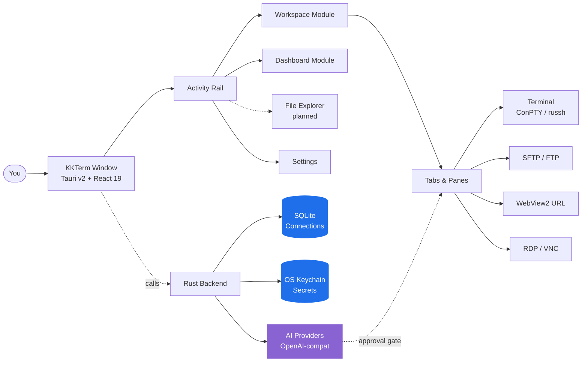

<p align="center">
  
</p>

<h1 align="center">KKTerm</h1>

<p align="center">
  <strong>Il workspace di amministrazione nativo per Windows che l'era degli AI-tool si è dimenticata di costruire — terminali, SSH, SFTP, RDP/VNC, dashboard, e un'AI che costruisce i tuoi widget-strumento.</strong>
</p>

<p align="center">
  <em>Perché la tua barra delle applicazioni non dovrebbe sembrare una slot machine di Las Vegas.</em>
</p>

<p align="center">
  <sub>Prende il nome da <strong>乖乖 (Kuāi Kuāi)</strong>, lo snack al cocco verde che i sysadmin taiwanesi posizionano sui server per tenerli a bada. Speriamo che questa app si guadagni il suo posto nel rack.</sub>
</p>

<p align="center">
  <a href="https://github.com/ryantsai/KKTerm/stargazers">
    
  </a>
  <a href="https://github.com/ryantsai/KKTerm/network/members">
    
  </a>
  <a href="https://github.com/ryantsai/KKTerm/issues">
    
  </a>
  <a href="https://github.com/ryantsai/KKTerm/blob/main/LICENSE">
    
  </a>
  <br />
  
  
  
  
  
  <br />
  <sub>
    <a href="README.md">English</a> ·
    <a href="README.zh-TW.md">繁體中文</a> ·
    <a href="README.zh-CN.md">简体中文</a> ·
    <a href="README.ja.md">日本語</a> ·
    <a href="README.ko.md">한국어</a> ·
    <a href="README.fr.md">Français</a> ·
    <a href="README.de.md">Deutsch</a> ·
    <a href="README.es.md">Español</a> ·
    <a href="README.es-MX.md">Español (MX)</a> ·
    <strong>Italiano</strong> ·
    <a href="README.pt-BR.md">Português (BR)</a> ·
    <a href="README.th.md">ไทย</a> ·
    <a href="README.id.md">Bahasa Indonesia</a> ·
    <a href="README.vi.md">Tiếng Việt</a>
  </sub>
</p>

---

## Il Discorso (45 secondi)

Sei un sysadmin / DevOps / homelab / vibe-coder. Adesso hai:

- Un emulatore di terminale
- Un client SSH separato (con una lista di profili che hai impiegato un weekend intero a costruire)
- Un client SFTP del 2007 che per qualche motivo viene ancora distribuito
- Remote Desktop in una finestra che continui a perdere sul monitor sbagliato
- Un viewer VNC per quella macchina Linux
- Una scheda del browser per l'interfaccia admin del router
- Una sessione `claude` / `codex` su un server di sviluppo remoto che si disconnette ogni volta che il tuo Wi-Fi starnutisce
- Un post-it con le password *(non ti preoccupare, non lo diciamo a nessuno)*

**KKTerm è una finestra sola per tutto questo.** Nativo su Windows — *apposta, mentre il resto del mondo degli strumenti per sviluppatori distribuisce prima su Mac e tratta il tuo OS come una nota a piè di pagina* — scritto in Rust + Tauri v2, si installa con un singolo installer, e si rifiuta categoricamente di telefonare a casa.

Più qualche cosa di cui non sapevi di aver bisogno:

- Una **Dashboard** dove dici a un'AI *"costruiscimi un widget che fa ping al mio router ogni 30 secondi"* e appare, in sandbox, sulla tua griglia.
- **Pane SSH che si collegano automaticamente a sessioni tmux con nome** così la tua sessione remota `claude` / `codex` sopravvive a ogni capriccio Wi-Fi che il tuo laptop si inventa.
- Un **widget di utilizzo AI Coding** che mostra le tue quote di Claude Code e Codex — finestra da 5 ore, finestra settimanale, piano attuale, email account — sulla **Dashboard** e nella status bar, così smetti di sbatterti contro il muro del rate-limit alle 3 del mattino.
- Un **server MCP integrato** (`kkterm-cli`) che permette agli agenti di coding esterni (Claude Code, Codex, Copilot, Antigravity, OpenCode) di pilotare il tuo Workspace e la Dashboard — elencare Connections, leggere buffer di terminale, posizionare widget — su una superficie di tool curata e gated da safety. AI-a-AI, sulla tua macchina, senza relay cloud.
- Ventuno **sfondi canvas animati** (sì, incluso `matrix`) per la dashboard, perché non siamo al di sopra di queste cose.

E l'assistente AI può trasformare una frase in un piccolo strumento da dashboard che continui davvero a usare.

> ⭐ **Se questa sembra l'app che stavi pensando di costruire da sei anni — metti una stella al repo così sappiamo che qualcuno sta guardando. Aiuta davvero.**

---

## Perché "KKTerm"?

Entra in qualsiasi data center taiwanese e guarda in cima ai rack. Passando per le fabbriche TSMC, le sale controllo della metropolitana di Taipei, i server hall della Cathay Bank, gli apparati di commutazione di Chunghwa Telecom — vedrai un sacchettino verde di 乖乖 (Kuāi Kuāi), uno snack al mais e cocco degli anni '60.

Il nome significa letteralmente **"stai buono"**, **"comportati bene"**. La tradizione IT è semplice e assolutamente seria:

- **Deve essere il gusto verde (cocco).** Il giallo (curry) significa *resta a casa dal lavoro*; il rosso (piccante) fa arrabbiare il server. Solo verde.
- **Non deve essere scaduto.** Un Kuai Kuai stantio lavora contro di te. I tecnici li sostituiscono diligentemente.
- **Deve essere visibile.** Il server deve sapere che c'è.
- **Non mangiarlo.** Quel sacchetto è in servizio.

Alcuni dei sistemi più grandi, più noiosi, più ossessionati dall'uptime in Asia girano con un sacchetto di soffietti al mais attaccato allo chassis. Funziona perché le persone che li gestiscono credono che funzioni, il che è una descrizione sorprendentemente onesta della maggior parte della cultura IT.

**KKTerm** è **Kuai Kuai Term** — un workspace da amministratore che aspira allo stesso compito dello snack: stare silenziosamente vicino alle tue macchine importanti e aiutarle a comportarsi bene. Local-first. Nessuna telemetria. AI con approvazione obbligatoria. Il tipo di software noioso e affidabile.

Non siamo ancora riusciti a includere un vero sacchetto di Kuai Kuai nell'installer. È un elemento della v2.

---

## Guardalo in Azione

<p align="center">
  <a href="https://github.com/ryantsai/KKTerm">
    
  </a>
</p>

<p align="center"><sub><em>(Qui ci va la GIF dimostrativa. Un'immagine vale mille punti elenco, e noi abbiamo esaurito i punti elenco.)</em></sub></p>

---

## Perché la Gente lo Tiene Aperto Tutto il Giorno

### Windows-first, apposta

Guarda il panorama degli strumenti per sviluppatori nel 2026. Claude Code: distribuisce prima su mac/linux, Windows è "usa WSL." Codex CLI: uguale. `gemini-cli`, metà di Homebrew, ogni nuovo TUI scintillante: prima mac/linux, gli utenti Windows ricevono un commento `# Windows: contributions welcome` nel README e uno script di fish-completion che non gira.

Nel frattempo, le persone che tengono davvero le aziende online — IT aziendale, MSP, chiunque gestisca Hyper-V o AD o SCCM o IIS o un domain controller più vecchio di alcuni stagisti — è seduta davanti a macchine Windows a chiedersi perché ogni nuovo strumento si comporta come se il loro OS fosse un fastidio.

**KKTerm è la scelta opposta.** Costruiamo prima per Windows nativo, e i port per macOS / Linux vengono dopo. Questo significa che possiamo usare le API Windows che contano davvero, invece di coprirle con uno strato di portabilità:

- **ConPTY** per le shell locali — la vera pseudo-console Windows, non uno shim di traduzione. PowerShell, `cmd.exe`, distro WSL, tutti ospitati come PTY autentici con gestione di focus, ridimensionamento e sequenze VT coerenti con il comportamento della piattaforma.
- **WebView2** per l'intera interfaccia utente e le **Connection** URL incorporate — Chromium in-process che usa il runtime di sistema, il che è uno dei motivi per cui l'installer è piccolo e si avvia velocemente.
- **Microsoft RDP ActiveX (`mstscax.dll`)** per RDP — *quello vero distribuito da Microsoft*. Lo stesso controllo di Remote Desktop Connection (`mstsc.exe`). Non una reimplementazione di terze parti, non FreeRDP-in-un-wrapper. Chi usa RDP lo noterà in cinque secondi.
- **Windows Credential Manager** per tutti i segreti. Password SSH, password FTP, chiavi API, credenziali per le Connection URL — vivono nell'OS keychain e `credwiz.exe` può verificarle.
- **Installer NSIS current-user** con SHA-256 corrispondente, menu nella tray nativo, asserzione di potenza Don't-Sleep, campionamento CPU/RAM/rete dell'host, menu contestuali Tauri nativi con icone PNG reali, dialoghi nativi di apertura/salvataggio. Nemmeno uno di questi è simulato.
- **WSL è una shell di prima classe, non un workaround.** Avvia Ubuntu accanto a un Pane PowerShell accanto a una sessione SSH accanto a un **Tab** RDP nella stessa finestra.

Le build per macOS e Linux sono nella roadmap e riceveranno la stessa cura. Ma se hai aspettato che qualcuno costruisse il *buon* strumento di amministrazione Windows per primo invece che per ultimo — questo è l'accordo.

### Local-first significa davvero locale

Le tue **Connection** salvate vivono in un file SQLite sulla tua macchina. Le password vivono nel **Windows Credential Manager**, non in un JSON accanto al binario. L'app non distribuisce analytics, non telefona a casa all'avvio, e non ha bisogno di un account cloud per avviarsi. Non c'è "accedi per sincronizzare" perché non c'è sincronizzazione.

Se il tuo cavo di rete prende fuoco, KKTerm si apre lo stesso.

### Un workspace, ogni tipo di Connection

| Volevi… | KKTerm ha |
| --- | --- |
| Aprire una shell PowerShell / cmd / WSL locale | **Session** terminal locali basate su ConPTY |
| Fare SSH su un server | `russh` nativo con auth agent / chiave / password, flusso di fiducia host-key, ProxyJump, port forwarding |
| Sfogliare i file su quel server | SFTP avviato dalla **Connection** SSH, doppio pannello, trasferimenti ricorsivi, chmod/chown |
| FTP su un NAS del 2012 | **Connection** FTP / FTPS nello stesso browser in stile SFTP |
| Telnet su dispositivi antichi | Sì, va bene, Telnet c'è anche quello |
| Parlare con una porta seriale | Tipo di **Connection** Serial, porta COM + baud, nessun tooling extra |
| Connettersi da remoto a una macchina Windows | RDP nativo tramite il controllo Microsoft ActiveX (quello vero, non un clone) |
| VNC su un Pi | Framebuffer Rust `vnc-rs` renderizzato direttamente nel workspace |
| Aprire l'interfaccia web del router | **URL Connection** WebView2 incorporato con riempimento delle credenziali |
| Monitorare la CPU dell'host | Barra di stato live + un modulo **Dashboard** con widget drag/resize |

È tutta la stessa app. Stessa finestra. Stesse scorciatoie da tastiera. Stesso tema che si spera non faccia sanguinare gli occhi.

### Terminali che non perdono la testa

- Pane divisi all'interno di un **Tab**.
- Rendering xterm.js accelerato WebGL, con fallback elegante quando non è possibile.
- Ricerca nello scrollback.
- Pane SSH con tmux che possono collegarsi a sessioni stabili per pane, così riconnettersi significa davvero *riconnettersi*, non "ricominciare da capo fingendo che l'ultima ora non sia mai esistita."
- Cambiare **Tab** **non** uccide la **Session**. Chiudere il **Tab** sì. Questa distinzione è stata una guerra di religione internamente; abbiamo vinto noi.

### Un Assistente AI che costruisce i tuoi strumenti

La maggior parte delle demo "AI nel tuo terminale" si ferma alla chat. L'assistente di KKTerm può anche costruire piccoli widget dashboard persistenti per il tuo modo reale di lavorare. Mantiene comunque le cose pericolose dietro due interruttori:

- **Famiglie di strumenti** (Dashboard / Connections / Session Live) — attivale o disattivale per categoria.
- **Modalità permesso** nel compositore — `Prompt` (predefinita, chiede ogni volta) o `Allow All` (sei un adulto, hai firmato il modulo di esonero).

Parla con OpenAI, Anthropic, OpenRouter, DeepSeek, Grok, Azure OpenAI, LiteLLM, GitHub Copilot, Ollama, NVIDIA, o qualsiasi cosa compatibile con OpenAI. Le chiavi API vanno nell'OS keychain. I modelli che propongono `rm -rf` vengono classificati come pericolosi e richiedono l'approvazione esplicita di un essere umano. L'AI non può eseguire silenziosamente un comando distruttivo perché qualcuno era furbo con un'iniezione di prompt in una man page.

### Una Dashboard che non finge di essere Grafana

Il modulo **Dashboard** è una griglia drag/resize a 12 colonne di istanze di widget. Non è per l'osservabilità a petabyte — è per "voglio un pulsante per avviare le mie cinque app preferite e un pannello che mostra l'uptime del mio host SSH, *accanto* alla mia chat."

#### Widget Creati dall'AI — descrivilo, ottienilo

Questa è la parte di cui siamo genuinamente entusiasti. Non scegli da un marketplace e non scrivi JavaScript. **Dici all'assistente AI cosa vuoi**, e costruisce il widget direttamente sulla tua dashboard:

> *"Aggiungi un widget che mostra gli ultimi 5 commit sul mio repo principale come lista."*
> *"Fammi un widget sticky-note che tiene il mio cheat sheet di on-call."*
> *"Costruisci un widget che fa ping al mio router di casa ogni 30 secondi e mostra verde/rosso."*
> *"Ho bisogno di un cronometro. Sorprendimi con lo stile."*

Due varianti:

- **Widget di contenuto** — JSON dichiarativo: markdown, liste kv, checklist, singola statistica grande. Sicuri per costruzione, nessuno script. La maggior parte delle richieste "ho solo bisogno di questo sulla mia dashboard" finisce qui.
- **Widget script** — JavaScript ospitato all'interno di una sandbox `iframe srcdoc` isolata con permessi espliciti e dichiarati (allowlist `network`, budget `pollSeconds`). L'AI scrive lo script, tu approvi i permessi, il widget gira in una scatola che non può raggiungere il resto dell'app.

Ogni widget che mantieni è tuo. Persistono in SQLite accanto alle tue **Connection**, con il loro preset visivo (`panel` / `ambient` / `hero`), colore d'accento, icona e titolo. Più istanze dello stesso widget possono coesistere con dimensioni e stili completamente diversi. Eliminali con un clic destro quando la magia svanisce.

#### Sfondi animati per la dashboard (perché ne avevamo voglia)

La dashboard ha ventuno sfondi animati su canvas che puoi scegliere per ogni **Dashboard View**:

| Umore | Sfondi |
| --- | --- |
| Calmo | `aurora`, `clouds`, `ocean`, `raindrops`, `snow`, `sakura`, `fireflies`, `bubbles`, `ricefield`, `lanterns` |
| Spaziale | `starfield`, `nebula` |
| Caldo | `embers`, `lava` |
| Nerd | `matrix`, `topo`, `synthwave` |
| Caotico | `cyberpunk`, `taipei101`, `thunderstorm`, `confetti` |

Girano su un singolo `requestAnimationFrame` condiviso e rispettano il focus della finestra, quindi costano praticamente zero quando sei altrove. Abbina `matrix` al tuo assistente AI per un'atmosfera che dice "sono estremamente produttivo e forse anche in un film dei Wachowski." Oppure scegli `ocean` e sembrare una persona seria. Non giudichiamo nessuna delle due scelte.

### Eseguire agenti AI di coding su un server, nel modo giusto

Questa è la seconda funzionalità di cui le persone si innamorano. I terminali SSH di KKTerm possono avviarsi direttamente in una **sessione tmux con nome** sull'host remoto — per impostazione predefinita, un id amichevole generato automaticamente come `kkterm-cockpit001` che sopravvive alla riconnessione:

- Apri una **Connection** SSH con tmux abilitato.
- All'interno del pane, avvia `claude`, `codex`, `gemini-cli`, `cursor-agent`, o qualsiasi agente di coding a lunga esecuzione che preferisci. Sono app TUI a schermo intero; tmux è esattamente dove vogliono vivere.
- Chiudi il laptop. Riaprilo. Il pane si ricollegherà silenziosamente alla stessa sessione tmux. L'agente è ancora in esecuzione, ha ancora il suo scrollback, ancora nel mezzo di qualsiasi cosa stava facendo.
- Interruzione di rete nel trasporto SSH? KKTerm effettua un tentativo di riaggancio silenzioso limitato allo stesso tmux id senza disturbarti.
- Vuoi che l'assistente AI veda cosa sta facendo l'agente? "Aggiungi il buffer del terminale al contesto" chiama `capture_tmux_pane` tramite SSH e porta l'intero scrollback tmux — non solo quello sullo schermo, l'intera sessione — nella conversazione. Il tuo assistente locale può ora ragionare sul lavoro del tuo agente remoto.

Se hai mai perso una sessione `claude` o `codex` di sei ore a causa di un Wi-Fi alberghiero instabile, questa singola funzionalità vale l'intero prezzo dell'app. L'app è gratuita. La funzionalità vale comunque.

### Sapere quanta AI ti resta

Gli agenti di coding fatturano per finestra di piano, non per mese. Claude Code ha una finestra da 5 ore e una settimanale. Codex fa la sua versione. Entrambi possono divorarti la quota in background mentre sei in una riunione.

Il widget **Utilizzo AI Coding** lo tiene visibile:

- Un widget di Dashboard che mostra **Claude Code** e **Codex** affiancati: account connesso, livello del piano, percentuale usata nella finestra 5 ore corrente, percentuale usata questa settimana, prossimo reset.
- Un **indicatore compatto nella status bar** che riflette gli stessi numeri, così anche con la Dashboard chiusa vedi a colpo d'occhio se hai ancora margine prima di lanciare il prossimo grosso refactor.
- Lo stato di auth è in chiaro (`connected` / `expired` / `error`), così scopri *prima* di una task lunga che devi rifare login, non a metà.
- La policy di refresh rispetta i rate limit; il widget fa polling al proprio ritmo invece di martellare le API a monte ogni volta che lo guardi.

### Un server MCP integrato — lascia che altre AI pilotino KKTerm

Il tuo terminale è anche dove Claude Code, Codex, la modalità agente di Copilot, Antigravity e il resto del mondo MCP-parlante vogliono lavorare. Quindi KKTerm spedisce il proprio **server MCP stdio**, [`kkterm-cli`](docs/MCP.md), che espone una fetta curata dell'app:

- **Modulo Workspace** (`kkterm.workspace.*`): elenca **Connections** salvate, apre una Connection per id, elenca **Sessions** vive, invia input a un pane di terminale, legge uno snapshot del buffer.
- **Modulo Dashboard** (`kkterm.dashboard.*`): carica lo stato della Dashboard, legge il source di un widget creato da AI, crea / aggiorna / elimina view, posiziona / sposta / rimuove istanze di widget, applica layout in blocco.
- **Sub-namespace pericolosi** (`kkterm.<module>.dangerous.*`): mutare la superficie eseguibile — creare widget script, cliccare in remote desktop, azzerare la Dashboard — è dietro a un singolo settaggio (`built_in_mcp_allow_all_dangerous`), **off** di default.

`kkterm-cli` è un forwarder sottile. Parla stdio JSON-RPC con il tuo client MCP e comunica con la finestra KKTerm in esecuzione tramite una named pipe di Windows autenticata per lancio. A KKTerm chiusa, `tools/list` continua a funzionare (i client possono fare introspection), ma `tools/call` restituisce un errore strutturato `app_not_running` invece di fare qualcosa.

Cablalo nel tuo client preferito e la tua AI ora usa KKTerm come fai tu:

```json
{
  "mcpServers": {
    "kkterm": { "command": "<percorso-a-kkterm-cli>", "args": [] }
  }
}
```

Settings → AI Assistant → **Server MCP integrato** ha un dialog "Mostra config" a un clic con snippet JSON e TOML pre-compilati con il path del binario risolto, più comandi `claude mcp add` / `codex mcp add` copiabili.

---

## Come si Incastra Tutto



La struttura che conta: i dati salvati durevoli (**Connection**) sono separati dallo stato runtime live (**Session**), che è separato dal contenitore UI (**Tab**). Chiudere un **Tab** termina la **Session**. Cambiare **Tab** no. Questa è la regola che mantiene l'app sana.

---

## Mappa delle Funzionalità Attuali

| Area | Implementato oggi |
| --- | --- |
| **Connections** | Albero basato su SQLite, cartelle/sottocartelle, ricerca, ordine drag/drop, rinomina, duplica, elimina, **Quick Connect**, icone personalizzate, scorciatoie rail pinnate/attive |
| **Terminal** | Shell locali, SSH, Telnet, Serial, pane divisi, xterm.js + WebGL opportunistico, ricerca scrollback, directory/script di avvio locale |
| **SSH** | `russh` nativo, auth agent/chiave/password, flusso di fiducia host-key, fallback SSH di sistema opzionale, ProxyJump, port forwarding, **sessioni tmux con nome automatico (`kkterm-<scifi-name><n>`) con riaggancio silenzioso in caso di interruzione del trasporto** — perfetto per agenti di coding remoti a lunga esecuzione (Claude Code, Codex, gemini-cli, ecc.) |
| **SFTP / FTP** | SFTP avviato da SSH più **Connection** FTP/FTPS, browser a doppio pannello, trasferimenti ricorsivi, coda/annulla/cancella cronologia, conflitti, proprietà, chmod/chown dove supportato |
| **URL WebView** | **Session** URL WebView2 incorporate, barra di navigazione, acquisizione favicon, metadati/riempimento credenziali sito web memorizzate, metadati partizione dati |
| **Remote Desktop** | RDP tramite Windows ActiveX con parcheggio overlay con scope geometrico; VNC tramite framebuffer `vnc-rs` renderizzato nel canvas del workspace |
| **Dashboard** | Viste durevoli, istanze widget, modalità modifica, drag/resize, App Launcher, **widget di contenuto/script creati dall'AI** (JSON dichiarativo o JS iframe sandboxed con permessi), preset / accento / icona / titolo per widget, **21 sfondi canvas animati** (aurora, clouds, ocean, raindrops, snow, sakura, fireflies, bubbles, ricefield, lanterns, starfield, nebula, embers, lava, matrix, topo, synthwave, cyberpunk, taipei101, thunderstorm, confetti) |
| **AI Assistant** | Chat in streaming, runtime compatibile OpenAI, registro provider, classificazione sicurezza proposte comandi, allegati screenshot/contesto, **creazione widget Dashboard (contenuto + script sandboxed)**, **cattura pane tmux** come contesto di conversazione per sessioni remote, strumenti di gestione **Connection**, e strumenti **Session** live per terminale, RDP/VNC, e SFTP/FTP |
| **Utilizzo AI Coding** | **Widget Dashboard + indicatore in status bar** che tracciano l'utilizzo delle quote di **Claude Code** e **Codex**: account connesso, livello del piano, percentuali finestra 5 ore e settimanale, prossimo reset, stato di auth (`connected` / `expired` / `error`), policy di refresh rate-limit aware |
| **Server MCP integrato** | Server MCP stdio (`kkterm-cli`) che espone tool curati di Workspace e Dashboard ad agenti di coding esterni (Claude Code, Codex, Copilot, Antigravity, OpenCode); bridge named pipe autenticato; sub-namespace `dangerous.*` per Modulo dietro un singolo toggle di sicurezza; dialog in Settings con snippet JSON / TOML a un clic e comandi `claude mcp add` / `codex mcp add` |
| **Settings** | Generale, Aspetto, Credenziali, AI, SSH, Terminal, URL, RDP, VNC, Dashboard, Info; font UI personalizzati; minimizza nella tray; Don't Sleep; backup/importa |
| **Localizzazione** | UI i18next con sorgente inglese e bundle locale dinamici: zh-TW, zh-CN, ja, ko, fr, de, es, es-MX, it, pt-BR, th, id, vi |

### Provider AI

OpenAI · Anthropic · OpenRouter · DeepSeek · Grok · Azure OpenAI · LiteLLM · GitHub Copilot · Ollama · NVIDIA · qualsiasi endpoint compatibile OpenAI.

I metadati dei provider si trovano in [`src/ai/providerRegistry/`](src/ai/providerRegistry/); gli adattatori Rust in [`src-tauri/src/ai/providers/`](src-tauri/src/ai/providers/). Le chiavi API passano attraverso l'OS keychain, mai SQLite.

---

## Quick Start

Ti serve:

- **Windows** (piattaforma supportata primaria)
- **Node.js + npm**
- **Toolchain Rust**
- **Prerequisiti Tauri v2 per Windows** incluso **WebView2**

```bash
npm install
npm run tauri dev
```

Questo dovrebbe produrre una vera finestra nativa. Se produce uno stack trace, apri un issue — adoriamo un buon repro.

### Controlli comuni

```bash
npm run check                                              # TypeScript
npm run build                                              # Vite build
cargo check --manifest-path src-tauri/Cargo.toml           # Rust
cargo test  --manifest-path src-tauri/Cargo.toml           # Rust tests
```

### Costruire l'installer Windows

```bash
npm run package:installer
```

Lo script dell'installer scrive `artifacts/kkterm-<version>-windows-x64-setup.exe` e un file `.sha256` corrispondente. È attualmente **non firmato** — la firma per il rilascio è nella roadmap, ma nel frattempo il tuo antivirus potrebbe guardarti storto. È normale.

---

## Cosa KKTerm Non È

Un elenco breve, perché l'onestà guadagna fiducia:

- **Non è un prodotto cloud.** Nessuna sincronizzazione, nessun account team, nessun livello SaaS. Se mai vedi un dialogo "Accedi a KKTerm", qualcosa è andato catastroficamente storto.
- **Non finge di essere cross-platform.** Siamo Windows-first apposta; macOS e Linux sono nella roadmap e useranno lo stesso shell Tauri v2. Se hai bisogno di uno strumento mac-first oggi, hai centinaia di opzioni. Stiamo costruendo quello che gli admin Windows stavano aspettando in silenzio.
- **Non è un agente AI autonomo.** L'assistente propone; l'essere umano decide. `Allow All` è una scelta che fai tu, non un'impostazione predefinita.
- **Non è un sostituto di Grafana / Datadog.** La Dashboard è per superfici di controllo personali, non per l'osservabilità di 10.000 host.
- **Non è un Kubernetes IDE.** È un workspace di amministrazione terminale-first. Per favore non chiedergli di renderizzare un Helm chart.

Se qualcuno di questi *era* un motivo per non usarlo — capito, ci vediamo nella v2.

---

## Debug Nativo

Usa il vero runtime Tauri per la validazione:

```bash
npm run tauri dev
```

Un'anteprima browser Vite è utile per alcune ispezioni frontend, ma **non** ospita un vero WebView2, ConPTY, RDP ActiveX, framebuffer VNC, keychain, o superficie di menu nativa. Se una funzionalità tocca uno di questi, validala nell'effettivo runtime desktop.

Utenti VS Code: la configurazione di lancio `Run KKTerm exe` avvia `src-tauri/target/debug/kkterm.exe` con `RUST_BACKTRACE=1`. La configurazione abbinata `Attach KKTerm WebView2` ti dà DevTools all'interno del vero host WebView2.

---

## Limiti Attuali (sì, lo sappiamo)

- L'installer è attualmente non firmato. I controlli di aggiornamento sono disabilitati fino a quando la firma per il rilascio non sarà configurata.
- SFTP tramite ProxyJump non è ancora supportato nel percorso SFTP nativo.
- La ripresa dei trasferimenti file, la sincronizzazione/diff di cartelle, l'archiviazione/estrazione e la modifica remota sono rimandati.
- L'importazione della configurazione SSH è implementata ma la voce nell'interfaccia utente di Settings non è ancora esposta.
- RDP e VNC sono in distribuzione; sincronizzazione più ricca degli appunti/dispositivi e controlli di qualità sono ancora in evoluzione.
- Le build per macOS e Linux sono nella roadmap. Arriveranno, e saranno fatte bene — non distribuite di corsa come un port "funzioniamo anche lì più o meno."
- L'assistente AI propone e può operare gli strumenti abilitati entro il confine di permesso configurato — per favore non trattarlo come un robot incustodito. Non sa, di fatto, cosa vuole il tuo CEO.

---

## Roadmap (la versione breve)

- Build per macOS + Linux
- Installer firmato + auto-aggiornamento
- SFTP tramite ProxyJump nel percorso nativo
- Ripresa trasferimento file, sincronizzazione cartelle, archiviazione/estrazione
- Reindirizzamento più ricco degli appunti/dispositivi RDP
- Più widget **Dashboard** integrati (e uno schema pubblico per quelli creati dall'AI)

Versione completa e aggiornata frequentemente: [`docs/ROADMAP.md`](docs/ROADMAP.md).

---

## Contribuire

Ci farebbe piacere un aiuto. Davvero. Anche le piccole cose contano:

- **Prova la build dev** e apri un issue quando qualcosa sembra sbagliato. "Sembrava sbagliato" è un bug report legittimo; scaveremo insieme.
- **Traduci una locale.** L'inglese è la fonte di verità su [`src/i18n/locales/en.json`](src/i18n/locales/en.json); 12 altre locale si trovano accanto ad essa e si caricano on demand. Le stringhe in sospeso sono tracciate per chiave in [`docs/localization_todo/`](docs/localization_todo/) — scegline una, traducila, elimina il file.
- **Aggiungi un widget Dashboard.** I widget integrati si trovano in [`src/modules/dashboard/widgets/builtin/`](src/modules/dashboard/widgets/builtin/). Scegli un'idea piccola, distribuiscila, impara il pattern.
- **Affina la superficie degli strumenti AI.** Gli adattatori provider si trovano in [`src-tauri/src/ai/providers/`](src-tauri/src/ai/providers/); il registro frontend è in [`src/ai/providerRegistry/`](src/ai/providerRegistry/).
- **Migliora il manuale.** La documentazione per l'utente finale si trova in [`docs/manual/`](docs/manual/). Un capitolo per modulo UI. Se hai usato una funzionalità e la documentazione non ti ha aiutato, una PR che lo corregge è oro.

Setup completo, struttura del progetto, checklist PR e lista delle regole "per favore non rompere queste" si trovano in [`CONTRIBUTING.md`](CONTRIBUTING.md). I punti salienti in 30 secondi:

- **Leggi [`CONTEXT.md`](CONTEXT.md) prima di rinominare termini rivolti all'utente.** **Connection**, **Session**, **Tab** e **Quick Connect** hanno significati specifici; per favore non deviare.
- **Ogni stringa visibile all'utente passa attraverso `t()`.** Nessun testo inglese diretto in JSX.
- **Nessun hook di chiusura frontend.** Il pulsante di chiusura della barra del titolo di Tauri v2 è stato rotto dai pattern `onCloseRequested` mezza dozzina di volte. Finalmente abbiamo una forma funzionante; per favore non reintroducili.
- **Esegui i controlli** (`npm run check && npm run build && cargo check && cargo test`) prima di aprire una PR.

Cerchi un punto di ingresso? Filtra le issue aperte per [`good first issue`](https://github.com/ryantsai/KKTerm/issues?q=is%3Aissue+is%3Aopen+label%3A%22good+first+issue%22) o [`help wanted`](https://github.com/ryantsai/KKTerm/issues?q=is%3Aissue+is%3Aopen+label%3A%22help+wanted%22). Se non ce ne sono ancora etichettate, apri un issue descrivendo su cosa vorresti lavorare e ti aiuteremo a definirlo.

---

## Documentazione del Progetto

- [Contesto del prodotto](CONTEXT.md) — il linguaggio del dominio che dovresti seguire
- [Architettura](docs/ARCHITECTURE.md) — mappa dei moduli, dove mettere il nuovo codice
- [Roadmap](docs/ROADMAP.md)
- [Architettura Dashboard](docs/DASHBOARD.md)
- [Guida ai provider AI](docs/AI_PROVIDERS.md)
- [Note sulle prestazioni](docs/PERFORMANCE.md)
- [Note di rilascio e gate](docs/RELEASE.md)

---

## Stack

Rust · Tauri v2 · React 19 · TypeScript · Vite · Tailwind CSS · Zustand · xterm.js · SQLite · WebView2 · `russh` · `russh-sftp` · `vnc-rs` · `suppaftp` · archiviazione OS keychain.

---

## Cronologia delle Stelle

<a href="https://www.star-history.com/#ryantsai/KKTerm&Date">
  <picture>
    <source media="(prefers-color-scheme: dark)" srcset="https://api.star-history.com/svg?repos=ryantsai/KKTerm&type=Date&theme=dark" />
    <source media="(prefers-color-scheme: light)" srcset="https://api.star-history.com/svg?repos=ryantsai/KKTerm&type=Date" />
    
  </picture>
</a>

Se sei arrivato fin qui e non hai ancora messo la stella — cosa stai aspettando, un invito personale? Considera questo l'invito personale.

⭐ **[Metti una stella a KKTerm su GitHub](https://github.com/ryantsai/KKTerm)** — costa un click e fa passare all'amministratore tutta la settimana. Pensala come un 乖乖 digitale sul rack.

---

## Licenza

MIT. Vedi [LICENSE](LICENSE). Usalo, forkalo, distribuiscilo, mettilo in un homelab che nessun altro riesce a trovare — questo è l'accordo.
