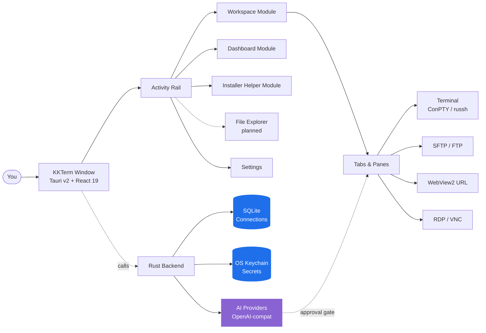

<p align="center">
  
</p>

<h1 align="center">KKTerm</h1>


<p align="center">
  <strong>ターミナル、SSH、SFTP、RDP/VNC、Dashboard、そして自分専用のツールWidgetを作るAI——AIツール時代に誰も作らなかった、Windowsネイティブの管理者向けワークスペース。</strong>
</p>

<p align="center">
  <em>タスクバーをラスベガスのスロットマシンにしなくていい。</em>
</p>

<p align="center">
  <sub>名前の由来は<strong>乖乖 (グァイグァイ / Kuāi Kuāi)</strong>——台湾のサーバー管理者がサーバーの上に置く、緑色のココナッツ味コーンスナック。このアプリもラックに置いてもらえる存在でありたい。</sub>
</p>

<p align="center">
  <strong><a href="https://github.com/ryantsai/KKTerm/releases/latest">最新の Windows インストーラー (.exe) をダウンロード</a></strong>
</p>

<p align="center">
  <a href="https://github.com/ryantsai/KKTerm/stargazers">
    
  </a>
  <a href="https://github.com/ryantsai/KKTerm/network/members">
    
  </a>
  <a href="https://github.com/ryantsai/KKTerm/issues">
    
  </a>
  <a href="https://github.com/ryantsai/KKTerm/blob/main/LICENSE">
    
  </a>
  <br />
  
  
  
  
  
  <br />
  <sub>
    <a href="README.md">English</a> ·
    <a href="README.zh-TW.md">繁體中文</a> ·
    <a href="README.zh-CN.md">简体中文</a> ·
    <strong>日本語</strong> ·
    <a href="README.ko.md">한국어</a> ·
    <a href="README.fr.md">Français</a> ·
    <a href="README.de.md">Deutsch</a> ·
    <a href="README.es.md">Español</a> ·
    <a href="README.es-MX.md">Español (MX)</a> ·
    <a href="README.it.md">Italiano</a> ·
    <a href="README.pt-BR.md">Português (BR)</a> ·
    <a href="README.th.md">ไทย</a> ·
    <a href="README.id.md">Bahasa Indonesia</a> ·
    <a href="README.vi.md">Tiếng Việt</a>
  </sub>
</p>

---

## はじめに（45秒で読める）

あなたはサーバー管理者・DevOps・ホームラボ勢・バイブコーダー、その類の人間だ。今の環境はこんな感じではないか：

- ターミナルエミュレーター
- 別のSSHクライアント（プロファイル一覧を作るのに週末を1回潰した）
- 2007年製のSFTPクライアント（なぜかまだ現役）
- どこか別のモニターに消えているリモートデスクトップのウィンドウ
- 某Linuxマシン専用のVNCビューア
- ルーター管理UIを開いたブラウザのタブ
- リモートの開発サーバーで動いている `claude` / `codex` のセッション（Wi-Fiがくしゃみをするたびに切れる）
- パスワードを書いた付箋 *（言わない、絶対言わない）*

**KKTerm はそのすべてを1つのウィンドウにまとめる。** Windowsネイティブ——*他のdevツールがmacファーストで出荷しながらWindowsをおまけ扱いにしている中で、意図的に*——Rust + Tauri v2で書かれ、シングルインストーラーで配布、テレメトリーなし。

さらに、あなたがまだ気づいていなかったものも：

- **Dashboard** でAIに *「ルーターを30秒おきにpingするWidget を作って」* と言えば、サンドボックス化されたグリッドの上にそれが現れる。
- **SSHのPane が名前付きtmux Sessionに自動アタッチ**されるので、ラップトップのWi-Fiがどれだけ癇癪を起こしても、リモートの `claude` / `codex` のセッションは生き続ける。
- **AIコーディング使用量Widget** が、Claude Code と Codex のクォータ（5時間ウィンドウ・週次ウィンドウ・現在のプラン・アカウントメール）を **Dashboard** とステータスバーに表示。深夜3時にレートリミットの壁に突き当たって驚かなくなる。
- **Installer Helper Module**。Node、Python、Docker、WSL、AIコーディングCLI、そして普段ならブラウザータブを渡り歩いて探す小さなユーティリティまで、厳選されたWindows開発ツールカタログを検出・インストール・更新・アンインストール・起動できる。
- **ビルトインMCPサーバー**（`kkterm-cli`）。外部コーディングエージェント（Claude Code、Codex、Copilot、Antigravity、OpenCode）が、キュレートされた安全ゲート付きツール経由で、あなたのWorkspaceとDashboardを操作できる——Connection一覧、ターミナルバッファ読み取り、Widget配置など。AIからAIへ、ローカルマシン上で、クラウドリレーなし。
- Dashboard用のアニメーションキャンバス背景が23種類（そう、`matrix` もある）。やりすぎかもしれないが、後悔はしていない。

それと、AIアシスタントは一文から、実際に使い続けられる小さなDashboardツールを作れる。

> ⭐ **「俺が6年間ずっと作ろうと思ってたやつだ」と思ったなら——リポジトリにスターをつけて、誰かが見ていることを教えてほしい。本当に力になる。**

---

## なぜ「KKTerm」なのか

台湾のデータセンターに行って、ラックの上を見てみてほしい。TSMCの工場、台北メトロの制御室、国泰銀行のサーバーホール、中華電信の交換機——どこかに必ず小さな緑色の袋が置いてある。**乖乖 (グァイグァイ / Kuāi Kuāi)**、1960年代から続くコーナッツ味のコーンスナックだ。

名前の意味はそのまま**「おりこうにしなさい」**、**「ちゃんと動きなさい」**。IT業界の慣習はシンプルで、かつ至って本気だ：

- **緑（ coconut味）でなければならない。** 黄色（カレー味）は「家で休め」を意味し、赤（辛口）はサーバーを怒らせる。緑だけ。
- **賞味期限内でなければならない。** 古い乖乖は逆効果。エンジニアはこまめに交換する。
- **見える場所に置かなければならない。** サーバーがそこにあることを認識できるように。
- **食べてはいけない。** その袋は今、任務中だ。

アジア最大規模の、退屈なくらい稼働率にこだわるシステムの一部が、シャーシにコーンスナックの袋をテープで貼り付けて動いている。それが機能するのは、管理する人間がそれを信じているからだ——これは、ITカルチャーの大半についての、驚くほど正直な説明でもある。

**KKTerm** は **Kuai Kuai Term**——そのスナックと同じ役割を目指す管理者ワークスペース。大事なマシンの隣に静かに座って、それが素直に動くのを助ける。ローカルファースト。テレメトリーなし。承認必須のAI。退屈で、信頼できる種類のソフトウェア。

インストーラーに実際の乖乖の袋を同梱することはまだできていない。それはv2の課題だ。

---

## 動いている様子を見る

<p align="center">
  <a href="https://github.com/ryantsai/KKTerm">
    
  </a>
</p>

<p align="center"><sub><em>（デモGIFをここに置く予定。百聞は一見に如かず——でも今は百個の箇条書きで勘弁してほしい。）</em></sub></p>

---

## なぜ一日中開いておくのか

### Windowsファースト、意図的に

2026年のdevツール界隈を見回してほしい。Claude Code：mac/linuxファーストで出荷、Windowsは「WSLを使え」。Codex CLI：同じ。`gemini-cli`、Homebrewの半分、ピカピカの新しいTUIの数々：mac/linuxファースト、WindowsユーザーはREADMEに `# Windows: contributions welcome` のコメントと、動かないfish補完スクリプトをもらう。

一方、実際に会社のネットワークを維持している人々——企業IT、MSP、Hyper-VやADやSCCMやIISや一部のインターンより年上のドメインコントローラーを運用している人々——はWindowsマシンの前に座って、なぜ新しいツールがことごとく自分たちのOSを邪魔者扱いするのか、首をかしげている。

**KKTerm は逆の選択をした。** ネイティブWindowsをまず作り、macOS/Linuxはそれに続く。そのおかげで、移植性レイヤーで誤魔化すことなく、本当に重要なWindows APIを使える：

- **ConPTY** によるローカルシェル——本物のWindowsの疑似コンソール、変換シムではない。PowerShell、`cmd.exe`、WSLディストリビューション、すべてフォーカス・リサイズ・VTシーケンス処理がプラットフォームの動作に合致した正規のPTYとしてホストされる。
- **WebView2** によるUI全体および埋め込みURL Connection——システムランタイムを使ったインプロセスのChromiumで、インストーラーが小さく起動が速い理由の一つだ。
- **Microsoft RDP ActiveX (`mstscax.dll`)** によるRDP——*Microsoftが出荷している本物*。Remote Desktop Connection (`mstsc.exe`) と同じコントロール。サードパーティの再実装でも、FreeRDPをラップしたものでもない。RDPを使う人間は5秒で違いに気づく。
- **Windows Credential Manager** によるすべてのシークレット管理。SSHパスワード、FTPパスワード、APIキー、URL Connection の認証情報——すべてOS keychainに保存され、`credwiz.exe` で監査できる。
- **NSSIのcurrent-userインストーラー**、SHA-256照合、ネイティブトレイメニュー、Don't-Sleep電源アサーション、ホストCPU/RAM/ネットワークのサンプリング、本物のPNGアイコン付きネイティブTauriコンテキストメニュー、ネイティブOpen/Saveダイアログ。これらのどれもモックではない。
- **WSLはファーストクラスのシェルであり、回避策ではない。** 同じウィンドウの中で、UbuntuをPowerShell Paneの隣に、SSH Sessionの隣に、RDP Tabの隣に立ち上げられる。

macOSとLinuxのビルドはロードマップにあり、同じ丁寧さで作る。しかし、最後ではなく最初にまともなWindows管理ツールを誰かが作るのをずっと待っていたなら——これがそれだ。

### ローカルファーストとは、本当にローカルということ

保存した Connection は自分のマシン上のSQLiteファイルに保存される。パスワードはバイナリの隣のJSONではなく、**Windows Credential Manager** に保存される。アプリは起動時に外部通信せず、アナリティクスを送らず、クラウドアカウントなしで起動できる。「ログインして同期」は存在しない。なぜなら同期機能がないからだ。

ネットワークケーブルが燃えても、KKTerm は起動する。

### 1つのWorkspace、あらゆる接続タイプ

| やりたいこと | KKTerm にあるもの |
| --- | --- |
| ローカルのPowerShell / cmd / WSLシェルを開く | ConPTYバックのローカルターミナル Session |
| サーバーにSSH接続する | ネイティブ `russh`、agent/key/passwordによる認証、ホストキー信頼フロー、ProxyJump、ポートフォワーディング |
| そのサーバーのファイルを参照する | SSH Connection から起動するSFTP、デュアルペイン、再帰転送、chmod/chown |
| 2012年製NASにFTP接続する | 同じSFTPスタイルブラウザのFTP/FTPS Connection |
| 古い機器にTelnet接続する | そう、Telnetも入っている |
| シリアルポートと通信する | Serial Connection、COMポート＋ボーレート、追加ツール不要 |
| Windowsマシンにリモート接続する | Microsoft ActiveXコントロール経由のネイティブRDP（本物）|
| RaspberryにVNC接続する | Rust `vnc-rs` フレームバッファをWorkspaceに直接レンダリング |
| ルーターのWeb UIを開く | 認証情報の自動入力付き埋め込みWebView2 URL Connection |
| ホストのCPUを監視する | ライブステータスバー＋ドラッグ/リサイズWidget付きの Dashboard モジュール |

すべて同じアプリ。同じウィンドウ。同じホットキー。できれば目が痛くない同じテーマ。

### 理性を失わないターミナル

- Tab 内でPaneを分割できる。
- WebGLアクセラレーションによるxterm.jsレンダリング、できない場合はグレースフルフォールバック。
- スクロールバック検索。
- tmuxバックのSSH Paneは安定した1Pane-1Sessionにアタッチできるので、再接続は本当の意味での*再接続*であり、「また最初からやり直して、この1時間は無かったことにする」ではない。
- Tabを切り替えても Session は**終了しない**。Tabを閉じると終了する。この区別は社内で宗教戦争になった。我々が勝った。

### ツールを作るAIアシスタント

「ターミナルにAI」系のデモの多くはチャットで止まる。KKTermのアシスタントは、あなたの実際の作業に合わせた小さく永続的なDashboard Widgetも作れる。それでも危険な操作は2つのスイッチの後ろに置かれている：

- **Toolファミリー**（Dashboard / Connections / Live Sessions）——カテゴリごとにオン/オフ切り替え可能。
- コンポーザーの**パーミッションモード**——`Prompt`（デフォルト、毎回確認）または `Allow All`（大人の選択、免責事項に署名済み）。

OpenAI、Anthropic、OpenRouter、DeepSeek、Grok、Azure OpenAI、LiteLLM、GitHub Copilot、Ollama、NVIDIA、またはOpenAI互換の任意のエンドポイントと通信できる。APIキーはOS keychainに保存される。`rm -rf` を提案するモデルは危険と分類され、明示的な人間の承認が必要になる。manページへのプロンプトインジェクションで誰かが巧みに仕掛けたとしても、AIが静かに破壊的なコマンドを実行することはない。

### Grafanaのふりをしないダッシュボード

**Dashboard** モジュールは、Widgetインスタンスの12カラムドラッグ/リサイズグリッドだ。ペタバイト規模のオブザーバビリティツールではない——「お気に入りの5つのアプリを起動するボタンと、SSHホストのアップタイムを表示するパネルが、チャットの*隣に*欲しい」というためのものだ。

#### AI作成Widget——説明するだけで手に入る

ここが我々が本当に興奮している部分だ。マーケットプレイスから選ぶ必要も、JavaScriptを書く必要もない。**AIアシスタントに何が欲しいかを伝えれば**、ダッシュボードにWidgetを作ってくれる：

> *「メインリポジトリの最新5コミットをリスト表示するWidgetを追加して。」*
> *「オンコールのチートシートを保持する付箋Widgetを作って。」*
> *「ホームルーターを30秒おきにpingして緑/赤で表示するWidgetを作って。」*
> *「ストップウォッチが欲しい。スタイリングはおまかせで。」*

2種類のフレーバー：

- **Content Widget** ——宣言的JSON：マークダウン、kvリスト、チェックリスト、大きな単一スタット。スクリプトなしで安全な構造。「ダッシュボードにこれが欲しい」というリクエストの大半はここに収まる。
- **Script Widget** ——明示的に宣言されたパーミッション（`network` の許可リスト、`pollSeconds` の上限）を持つ、隔離された `iframe srcdoc` サンドボックス内でホストされるJavaScript。AIがスクリプトを書き、あなたがパーミッションを承認し、Widgetはアプリの他の部分に届かないボックスの中で動く。

保存したWidgetはすべてあなたのものだ。Connectionと同じSQLiteに、自分のビジュアルプリセット（`panel` / `ambient` / `hero`）、アクセントカラー、アイコン、タイトルとともに保存される。同じWidgetの複数インスタンスが、まったく異なるサイズとスタイルで共存できる。飽きたら右クリックで削除すればいい。

#### アニメーションダッシュボード背景（作りたかったから作った）

ダッシュボードには、**Dashboard View** ごとに選べる23種類のキャンバスアニメーション背景がある：

| 気分 | 背景 |
| --- | --- |
| 落ち着き | `aurora`, `clouds`, `ocean`, `raindrops`, `rainywindow`, `snow`, `sakura`, `fireflies`, `bubbles`, `ricefield`, `lanterns` |
| 宇宙的 | `starfield`, `nebula` |
| 温かみ | `embers`, `lava` |
| ギーク | `matrix`, `topo`, `synthwave` |
| カオス | `cyberpunk`, `taipei101`, `thunderstorm`, `confetti`, `particleCursor` |

単一共有の requestAnimationFrame で動作し、ウィンドウのフォーカスを尊重するので、別の作業中はほぼコストゼロ。`matrix` とAIアシスタントを組み合わせれば「めちゃくちゃ生産的でしかもウォシャウスキー兄弟（姉妹）の映画の登場人物みたい」というバイブになる。真面目な人に見せたければ `ocean` を選ぶといい。どちらの選択も我々は支持する。

### サーバー上でAIコーディングエージェントを動かす、正しい方法

これが2番目に人が惚れ込む機能だ。KKTermのSSHターミナルは、リモートホスト上の**名前付きtmux Session**に直接起動できる——デフォルトでは `kkterm-cockpit001` のような、再接続後も生き続ける自動生成のフレンドリーIDが使われる：

- tmuxを有効にしてSSH Connection を開く。
- Pane内で `claude`、`codex`、`gemini-cli`、`cursor-agent`、またはお好みの長時間稼働型コーディングエージェントを起動する。これらはフルスクリーンのTUIアプリ——tmuxはまさに彼らが住みたい場所だ。
- ラップトップを閉じる。また開く。Paneは静かに同じtmux Sessionに再アタッチされる。エージェントはまだ動いていて、スクロールバックも残っていて、やっていた作業の途中にいる。
- SSH転送でネットワークが瞬断した？KKTermはあなたを煩わせることなく、同じtmux IDへの限定的な再アタッチを試みる。
- AIアシスタントにエージェントの作業を見せたい？「ターミナルバッファをコンテキストに追加」するとSSH越しに `capture_tmux_pane` を呼び出して、画面に見えている部分だけでなく、セッション全体のtmuxスクロールバックを会話に取り込む。ローカルのアシスタントがリモートエージェントの作業を把握して推論できるようになる。

不安定なホテルのWi-Fiで6時間の `claude` や `codex` セッションを失ったことがあるなら、この1機能だけでこのアプリを使う価値がある。アプリは無料だ。機能はそれでも価値がある。

### 残りAIクォータを把握する

コーディングエージェントは月額ではなく「プランウィンドウ」単位で課金する。Claude Codeには5時間ウィンドウと週次ウィンドウがある。Codexにも独自版がある。どちらも会議中に気付かないうちにクォータを食い尽くしてくれる。

**AIコーディング使用量** Widgetがそれを見える化する：

- Claude CodeとCodexを横並びで表示するDashboard Widget：接続済みアカウント、プラン階層、現在の5時間ウィンドウ使用率、今週使用率、次回リセット時刻。
- 同じ数字を映すコンパクトな**ステータスバーインジケータ**。Dashboardを閉じていても、次の大きなリファクタを始める前に余裕があるか一目で分かる。
- 認証状態（`connected` / `expired` / `error`）も直接表示。長時間タスクの途中ではなく、開始前に再ログインが必要だと分かる。
- リフレッシュ方針はレートリミットを尊重し、Widgetを見るたびに上流APIを叩かない独自ペースでポーリング。

### ビルトインMCPサーバー — 他のAIにKKTermを操作させる

あなたのターミナルは、Claude Code、Codex、CopilotエージェントモードやAntigravityなど、MCPを話す世界が仕事をしたい場所でもある。だからKKTermは独自の**stdio MCPサーバー**、[`kkterm-cli`](docs/MCP.md) を同梱し、アプリの一部をキュレート公開する：

- **Workspace Module**（`kkterm.workspace.*`）: 保存済み **Connection** 一覧、idでConnectionを開く、ライブ **Session** 一覧、ターミナルPaneへの入力送信、ターミナルバッファのスナップショット読み取り。
- **Dashboard Module**（`kkterm.dashboard.*`）: Dashboard状態のロード、AI作成Widgetのソース読み取り、Viewの作成 / 更新 / 削除、Widgetインスタンスの配置 / 移動 / 削除、一括レイアウト適用。
- **危険サブネームスペース**（`kkterm.<module>.dangerous.*`）: 実行可能サーフェスの変更——スクリプトWidget作成、リモートデスクトップへのクリック、Dashboardのワイプ——は単一の設定（`built_in_mcp_allow_all_dangerous`）の背後でゲート、デフォルト **オフ**。

`kkterm-cli` は薄いフォワーダ。MCPクライアントとはstdio JSON-RPCで対話し、起動中のKKTermウィンドウとは起動ごとに認証されるWindows名前付きパイプで通信する。KKTermが閉じている時も `tools/list` は動作（クライアントが内省できる）、しかし `tools/call` は構造化された `app_not_running` エラーを返す。

お気に入りのクライアントに接続すれば、AIはあなたと同じようにKKTermを使える：

```json
{
  "mcpServers": {
    "kkterm": { "command": "<path-to-kkterm-cli>", "args": [] }
  }
}
```

Settings → AI Assistant → **ビルトインMCPサーバー** にはワンクリック「設定を表示」ダイアログがあり、解決済みバイナリパス入りのJSON / TOMLスニペットと、コピー可能な `claude mcp add` / `codex mcp add` コマンドが揃っている。

---

## どう組み合わさっているか



重要な構造：永続保存されるデータ（**Connection**）はライブのランタイム状態（**Session**）と分離されており、さらにUIコンテナ（**Tab**）とも分離されている。**Tab** を閉じると **Session** が終了する。**Tab** を切り替えても終了しない。これがアプリを正気に保つルールだ。

---

## 現在の機能マップ

| エリア | 現在の実装内容 |
| --- | --- |
| **Connections** | SQLiteバックのツリー、フォルダ/サブフォルダ、検索、ドラッグ/ドロップ並び替え、リネーム、複製、削除、**Quick Connect**、カスタムアイコン、固定/アクティブなRailショートカット |
| **Terminal** | ローカルシェル、SSH、Telnet、Serial、分割Pane、xterm.js＋機会的WebGL、スクロールバック検索、ローカル起動ディレクトリ/スクリプト |
| **SSH** | ネイティブ `russh`、agent/key/password認証、ホストキー信頼フロー、オプションのシステムSSHフォールバック、ProxyJump、ポートフォワーディング、**自動命名tmux Session（`kkterm-<scifi-name><n>`）と転送瞬断時のサイレント再アタッチ**——長時間稼働リモートコーディングエージェント（Claude Code、Codex、gemini-cliなど）に最適 |
| **SFTP / FTP** | SSH起動SFTP＋FTP/FTPS Connection、デュアルペインブラウザ、再帰転送、キュー/キャンセル/クリア履歴、競合処理、プロパティ、サポートされている場合のchmod/chown |
| **URL WebView** | 埋め込みWebView2 URL Session、ナビゲーションツールバー、ファビキャプチャ、保存されたWebサイト認証情報メタデータ/自動入力、データパーティションメタデータ |
| **Remote Desktop** | ジオメトリスコープのオーバーレイパーキングを持つWindows ActiveX経由のRDP；`vnc-rs` フレームバッファをWorkspaceキャンバスにレンダリングするVNC |
| **Dashboard** | 永続View、Widgetインスタンス、編集モード、ドラッグ/リサイズ、App Launcher、**AI作成のcontent/script Widget**（宣言的JSONまたはパーミッション付きサンドボックスiframe JS）、Widget毎のプリセット/アクセント/アイコン/タイトル、**23種類のアニメーションキャンバス背景**（aurora, clouds, ocean, raindrops, rainywindow, snow, sakura, fireflies, bubbles, ricefield, lanterns, starfield, nebula, embers, lava, matrix, topo, synthwave, cyberpunk, taipei101, thunderstorm, confetti, particleCursor）|
| **AI Assistant** | ストリーミングチャット、OpenAI互換ランタイム、プロバイダーレジストリ、コマンド提案の安全分類、スクリーンショット/コンテキスト添付、**Dashboard Widgetオーサリング（contentおよびサンドボックスscript）**、リモートSession用会話コンテキストとしての **tmux Paneキャプチャ**、**Connection** 管理ツール、ターミナル・RDP/VNC・SFTP/FTP用ライブ **Session** ツール |
| **AIコーディング使用量** | **Claude Code** と **Codex** のクォータ使用量を追跡する **Dashboard Widget + ステータスバーインジケータ**：接続済みアカウント、プラン階層、5時間および週次ウィンドウの使用率、次回リセット時刻、認証状態（`connected` / `expired` / `error`）、レートリミットを意識したリフレッシュ方針 |
| **ビルトインMCPサーバー** | 外部コーディングエージェント（Claude Code、Codex、Copilot、Antigravity、OpenCode）にキュレート版のWorkspaceおよびDashboardツールを公開するstdio MCPサーバー（`kkterm-cli`）；認証付き名前付きパイプブリッジ；モジュール毎の `dangerous.*` ネームスペースは単一の安全トグルの背後でゲート；解決済みバイナリパス入りJSON / TOMLスニペットと `claude mcp add` / `codex mcp add` コマンドのSettingsダイアログ |
| **Installer Helper** | バンドル済みWindows開発ツールカタログ用のActivity Rail Module。インストール済みツールの検出、最新版比較、インストール/更新/アンインストール、Update allからの除外、コマンドログのストリーミング、対応する管理対象アプリの起動を行う |
| **Settings** | 一般、外観、認証情報、AI、SSH、ターミナル、ターミナル背景、URL、RDP、VNC、Dashboard、Installer Helper、About；カスタムUIフォント；最小化してトレイへ；Don't Sleep；バックアップ/インポート |
| **ローカライゼーション** | i18next UIと英語ソース、動的ロケールバンドル：zh-TW、zh-CN、ja、ko、fr、de、es、es-MX、it、pt-BR、th、id、vi |

### AIプロバイダー

OpenAI · Anthropic · OpenRouter · DeepSeek · Grok · Azure OpenAI · LiteLLM · GitHub Copilot · Ollama · NVIDIA · OpenAI互換の任意エンドポイント。

プロバイダーのメタデータは [`src/ai/providerRegistry/`](src/ai/providerRegistry/) に保存され、Rustアダプターは [`src-tauri/src/ai/providers/`](src-tauri/src/ai/providers/) にある。APIキーはSQLiteではなくOS keychainを通じて管理される。

---

## クイックスタート

必要なもの：

- **Windows**（主要サポートプラットフォーム）
- **Node.js + npm**
- **Rustツールチェーン**
- **WebView2** を含む **Tauri v2のWindows前提条件**

```bash
npm install
npm run tauri dev
```

本物のネイティブウィンドウが表示されるはずだ。スタックトレースが出た場合は、Issueを立ててほしい——良い再現ケースは大歓迎だ。

### よくある確認事項

```bash
npm run check                                              # TypeScript
npm run build                                              # Vite build
cargo check --manifest-path src-tauri/Cargo.toml           # Rust
cargo test  --manifest-path src-tauri/Cargo.toml           # Rust tests
```

### Windowsインストーラーのビルド

```bash
npm run package:installer
```

インストーラースクリプトは `artifacts/kkterm-<version>-windows-x64-setup.exe` と対応する `.sha256` ファイルを出力する。現時点では**署名なし**——リリース署名はロードマップ上にあるが、それまではウイルス対策ソフトから厳しい目で見られるかもしれない。正常な動作だ。

---

## KKTerm ではないもの

正直さは信頼を生む。簡潔に：

- **クラウド製品ではない。** 同期なし、チームアカウントなし、SaaSティアなし。もし「KKTermにサインイン」ダイアログが表示されたら、何か壊滅的なことが起きている。
- **クロスプラットフォームのふりをしない。** 意図的にWindowsファーストで作っており、macOSとLinuxはロードマップにある。同じTauri v2シェルを使う。今日macファーストのツールが必要なら、選択肢は山ほどある。我々は、Windows管理者が静かに待ち続けていたものを作っている。
- **自律型AIエージェントではない。** アシスタントが提案し、人間が判断する。`Allow All` はあなたが下す選択であり、デフォルトではない。
- **Grafana / Datadogの代替ではない。** Dashboardは個人のコントロールサーフェス用であり、1万ホストのオブザーバビリティ用ではない。
- **KubernetesのIDEではない。** ターミナルファーストの管理者ワークスペースだ。Helmチャートのレンダリングを頼まないでほしい。

それらが本当に必要なら——なるほど、v2で会おう。

---

## ネイティブデバッグ

検証には本物のTauriランタイムを使うこと：

```bash
npm run tauri dev
```

Viteのブラウザプレビューはフロントエンドの一部の検査に役立つが、本物のWebView2、ConPTY、RDP ActiveX、VNCフレームバッファ、keychain、ネイティブメニューサーフェスは**ホストしない**。これらのいずれかに触れる機能は、実際のデスクトップランタイムで検証すること。

VS Codeユーザー：`Run KKTerm exe` 起動設定は `RUST_BACKTRACE=1` で `src-tauri/target/debug/kkterm.exe` を起動する。対の `Attach KKTerm WebView2` 設定で、本物のWebView2ホスト内でDevToolsが使える。

---

## 現在の制限（分かっている）

- インストーラーは現時点で署名なし。リリース署名が設定されるまで更新チェックは無効。
- ネイティブSFTPパスでのProxyJump経由SFTPはまだ未サポート。
- ファイル転送の再開、フォルダ同期/差分、アーカイブ/展開、リモート編集は保留中。
- SSHコンフィグのインポートは実装済みだが、Settings上のユーザー向けエントリはまだ公開されていない。
- RDPとVNCは提供中；クリップボード/デバイス同期の強化と品質コントロールは引き続き改善中。
- macOSとLinuxのビルドはロードマップにある。「そこでも一応動きます」的なポートではなく、きちんと作る——急いで出すつもりはない。
- AIアシスタントは設定されたパーミッション境界内で提案・操作できる——無人ロボットとして扱わないこと。CEOが何を求めているかはAIには分からない。

---

## ロードマップ（短縮版）

- macOS + Linuxビルド
- 署名済みインストーラー＋自動更新
- ネイティブパスでのProxyJump経由SFTP
- ファイル転送再開、フォルダ同期、アーカイブ/展開
- RDPクリップボード/デバイスリダイレクトの強化
- より多くの組み込み **Dashboard** Widget（AIが作成したものの公開スキーマも）

完全版・頻繁更新版：[`docs/ROADMAP.md`](docs/ROADMAP.md)。

---

## コントリビューション

本当に助けてほしい。小さなことでも重要だ：

- **devビルドを試して**、何かおかしいと感じたらIssueを立ててほしい。「なんか変だった」は正当なバグレポートだ；一緒に掘り下げる。
- **ロケールを翻訳する。** [`src/i18n/locales/en.json`](src/i18n/locales/en.json) が英語のソース；12の他のロケールが隣にあってオンデマンドで読み込まれる。未翻訳の文字列は [`docs/localization_todo/`](docs/localization_todo/) にキーごとに記録されている——ひとつ選んで、翻訳して、ファイルを削除する。
- **Dashboard Widgetを追加する。** 組み込みWidgetは [`src/modules/dashboard/widgets/builtin/`](src/modules/dashboard/widgets/builtin/) にある。小さなアイデアを選んで、出荷して、パターンを学ぶ。
- **AIのtoolサーフェスを改善する。** プロバイダーアダプターは [`src-tauri/src/ai/providers/`](src-tauri/src/ai/providers/) に、フロントエンドレジストリは [`src/ai/providerRegistry/`](src/ai/providerRegistry/) にある。
- **マニュアルを改善する。** エンドユーザー向けのドキュメントは [`docs/manual/`](docs/manual/) にある。UIモジュールごとに1チャプター。機能を使ってドキュメントが役に立たなかったなら、それを修正するPRは金だ。

完全なセットアップ手順、プロジェクト構成、PRチェックリスト、「これは壊さないで」ルールの一覧は [`CONTRIBUTING.md`](CONTRIBUTING.md) にある。30秒のハイライト：

- **ユーザー向けの用語をリネームする前に [`CONTEXT.md`](CONTEXT.md) を読む。** **Connection**、**Session**、**Tab**、**Quick Connect** は特定の意味を持つ；ブレないように。
- **ユーザーに見えるすべての文字列は `t()` を通す。** JSXにベタ書き英語テキストを書かない。
- **フロントエンドのcloseフックを追加しない。** Tauri v2のタイトルバークローズは `onCloseRequested` パターンで何度も壊れてきた。ようやく機能する形に落ち着いた；それを再導入しないこと。
- **PRを開く前にチェックを実行する**（`npm run check && npm run build && cargo check && cargo test`）。

取っかかりを探しているなら、Issueを [`good first issue`](https://github.com/ryantsai/KKTerm/issues?q=is%3Aissue+is%3Aopen+label%3A%22good+first+issue%22) または [`help wanted`](https://github.com/ryantsai/KKTerm/issues?q=is%3Aissue+is%3Aopen+label%3A%22help+wanted%22) でフィルタしてみてほしい。まだタグ付けされていない場合は、取り組みたいことを書いてIssueを立ててくれれば、一緒にスコープを決める。

---

## プロジェクトドキュメント

- [プロダクトコンテキスト](CONTEXT.md) — 合わせるべきドメイン言語
- [アーキテクチャ](docs/ARCHITECTURE.md) — モジュールマップ、新しいコードを置く場所
- [ロードマップ](docs/ROADMAP.md)
- [Dashboardアーキテクチャ](docs/DASHBOARD.md)
- [AIプロバイダーガイド](docs/AI_PROVIDERS.md)
- [パフォーマンスノート](docs/PERFORMANCE.md)
- [リリースノートとゲート](docs/RELEASE.md)

---

## スタック

Rust · Tauri v2 · React 19 · TypeScript · Vite · Tailwind CSS · Zustand · xterm.js · SQLite · WebView2 · `russh` · `russh-sftp` · `vnc-rs` · `suppaftp` · OS keychain ストレージ。

---

## Star履歴

<a href="https://www.star-history.com/#ryantsai/KKTerm&Date">
  <picture>
    <source media="(prefers-color-scheme: dark)" srcset="https://api.star-history.com/svg?repos=ryantsai/KKTerm&type=Date&theme=dark" />
    <source media="(prefers-color-scheme: light)" srcset="https://api.star-history.com/svg?repos=ryantsai/KKTerm&type=Date" />
    
  </picture>
</a>

ここまで読んでまだスターをつけていないなら——何を待っているの？これが個人的な招待状だ。

⭐ **[GitHubでKKTermにスターをつける](https://github.com/ryantsai/KKTerm)** — 1クリックのコストで、メンテナーの1週間が輝く。ラックに置くデジタルな乖乖だと思って。

---

## ライセンス

MIT。[LICENSE](LICENSE) を参照。使って、フォークして、出荷して、誰も辿り着けないホームラボに置いて——それがこのアプリとの約束だ。
