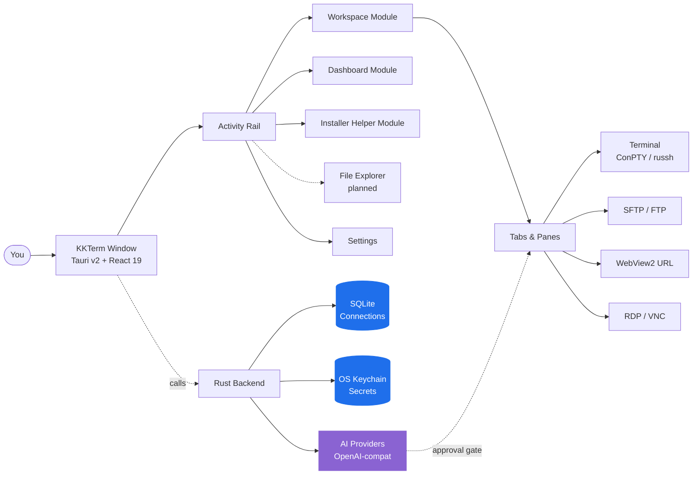

<p align="center">
  
</p>

<h1 align="center">KKTerm</h1>

<p align="center">
  <strong>AI 도구 시대가 깜빡 잊고 만들지 않은, 진짜 Windows 네이티브 관리자 Workspace — 터미널, SSH, SFTP, RDP/VNC, Dashboard, 그리고 나만의 도구 Widget을 만들어 주는 AI.</strong>
</p>

<p align="center">
  <em>작업 표시줄이 슬롯머신처럼 보여서는 안 되니까요.</em>
</p>

<p align="center">
  <sub><strong>乖乖 (Kuāi Kuāi, 괴괴/쿠아이쿠아이)</strong>의 이름을 따왔습니다. 대만 시스템 관리자들이 서버 위에 올려 두는 초록색 코코넛 맛 과자인데, 서버가 말 잘 듣도록 해 준다고 합니다. 이 앱도 랙 위의 한자리를 차지할 자격을 얻었으면 좋겠습니다.</sub>
</p>

<p align="center">
  <strong><a href="https://github.com/ryantsai/KKTerm/releases/latest">최신 Windows 설치 프로그램(.exe) 다운로드</a></strong>
</p>

<p align="center">
  <a href="https://github.com/ryantsai/KKTerm/stargazers">
    
  </a>
  <a href="https://github.com/ryantsai/KKTerm/network/members">
    
  </a>
  <a href="https://github.com/ryantsai/KKTerm/issues">
    
  </a>
  <a href="https://github.com/ryantsai/KKTerm/blob/main/LICENSE">
    
  </a>
  <br />
  
  
  
  
  
  <br />
</p>

<p align="center">
  <sub>
    <a href="README.md">English</a> ·
    <a href="README.zh-TW.md">繁體中文</a> ·
    <a href="README.zh-CN.md">简体中文</a> ·
    <a href="README.ja.md">日本語</a> ·
    <strong>한국어</strong> ·
    <a href="README.fr.md">Français</a> ·
    <a href="README.de.md">Deutsch</a> ·
    <a href="README.es.md">Español</a> ·
    <a href="README.es-MX.md">Español (MX)</a> ·
    <a href="README.it.md">Italiano</a> ·
    <a href="README.pt-BR.md">Português (BR)</a> ·
    <a href="README.th.md">ไทย</a> ·
    <a href="README.id.md">Bahasa Indonesia</a> ·
    <a href="README.vi.md">Tiếng Việt</a>
  </sub>
</p>

---

## 45초 요약

당신은 시스템 관리자 / DevOps / 홈랩 / 바이브 코더입니다. 지금 이 순간 당신의 화면에는:

- 터미널 에뮬레이터
- 별도의 SSH 클라이언트 (주말 한 번 다 바쳐서 만든 프로필 목록 포함)
- 어떻게든 아직 살아 있는 2007년산 SFTP 클라이언트
- 항상 엉뚱한 모니터에서 사라지는 창에 띄워 둔 원격 데스크톱
- 리눅스 박스 한 대를 위한 VNC 뷰어
- 공유기 관리 UI를 위한 브라우저 탭
- Wi-Fi가 재채기를 할 때마다 끊기는, 원격 개발 서버의 `claude` / `codex` Session
- 비밀번호가 적힌 포스트잇 *(괜찮아요, 아무한테도 말 안 합니다)*

**KKTerm은 이 모든 것을 하나의 창으로 해결합니다.** Windows 네이티브로 설계했습니다 — *나머지 개발 도구 세계가 Mac 먼저 출시하고 Windows는 각주 취급할 때, 우리는 의도적으로 반대 방향을 택했습니다* — Rust + Tauri v2로 작성되었고, 단일 인스톨러로 배포되며, 어디에도 전화하지 않습니다.

그리고 몰랐지만 원하게 될 기능들도 있습니다:

- AI에게 *"30초마다 공유기에 핑을 보내는 Widget을 만들어 줘"* 라고 말하면 Dashboard 그리드 위에 샌드박스 환경으로 나타나는 **Dashboard**.
- Wi-Fi가 몇 번을 끊겨도 원격 `claude` / `codex` Session이 살아남는, **named tmux session에 자동 연결되는 SSH 창**.
- Claude Code와 Codex의 쿼터를 **Dashboard**와 상태 표시줄에 보여주는 **AI 코딩 사용량 Widget** — 5시간 윈도우, 주간 윈도우, 현재 플랜, 계정 이메일. 새벽 3시에 레이트 리밋 벽에 부딪히고 놀라는 일이 없어집니다.
- Node, Python, Docker, WSL, AI 코딩 CLI와 평소 브라우저 탭을 뒤져 찾던 작은 유틸리티까지, 큐레이션된 Windows 개발 도구 카탈로그를 감지, 설치, 업데이트, 제거, 실행하는 **Installer Helper Module**.
- 외부 코딩 에이전트(Claude Code, Codex, Copilot, Antigravity, OpenCode)가 큐레이션·안전 게이트 처리된 툴 표면을 통해 당신의 Workspace와 Dashboard를 조작할 수 있게 해주는 **내장 MCP 서버**(`kkterm-cli`) — Connection 목록 조회, 터미널 버퍼 읽기, Widget 배치 등. AI와 AI 간의 소통이, 당신의 머신 위에서, 클라우드 릴레이 없이.
- 예, `matrix` 포함, 스물한 가지 **애니메이션 캔버스 배경**. 우리도 그 정도 취향은 있습니다.

그리고 AI 어시스턴트는 한 문장을 실제로 계속 쓰게 되는 작은 Dashboard 도구로 바꿀 수 있습니다.

> ⭐ **이게 지난 6년 동안 직접 만들어야겠다고 생각해 왔던 앱처럼 느껴진다면 — 누군가 보고 있다는 걸 알 수 있게 별을 눌러 주세요. 진심으로 도움이 됩니다.**

---

## 왜 "KKTerm"인가요?

대만 데이터 센터에 가면 랙 맨 위를 한번 봐 보세요. TSMC 팹, 타이베이 지하철 관제실, 국태은행 서버실, 중화전신 교환 장비 — 어디서든 작은 초록색 봉투를 발견할 수 있습니다. 바로 乖乖 (Kuāi Kuāi, 괴괴/쿠아이쿠아이), 1960년대부터 이어져 온 코코넛 맛 옥수수 과자입니다.

이름의 뜻은 그야말로 **"착하게 굴어라"**, **"얌전히 있어라"**입니다. IT 업계의 이 전통은 단순하고, 완전히 진지합니다:

- **반드시 초록색(코코넛 맛)이어야 합니다.** 노란색(카레)은 *결근 예보*; 빨간색(매운맛)은 서버를 화나게 합니다. 초록색만 허용.
- **유통기한이 남아 있어야 합니다.** 상한 괴괴는 오히려 역효과가 납니다. 엔지니어들은 성실하게 교체합니다.
- **눈에 잘 보여야 합니다.** 서버가 거기 있다는 걸 알아야 합니다.
- **먹으면 안 됩니다.** 그 봉투는 지금 근무 중입니다.

아시아에서 가장 크고 지루하고 업타임에 집착하는 시스템들이 섀시에 테이프로 붙인 과자 봉투와 함께 돌아가고 있습니다. 효과가 있는 이유는, 그것을 관리하는 사람들이 효과가 있다고 믿기 때문입니다 — 대부분의 IT 문화를 정직하게 묘사하는 말이기도 합니다.

**KKTerm**은 **Kuai Kuai Term** — 그 과자와 똑같은 역할을 지향하는 관리자 Workspace입니다: 중요한 기계 옆에 조용히 자리 잡고 그것들이 얌전히 작동하도록 돕는 것. 로컬 우선. 원격 측정 없음. 승인이 필요한 AI. 지루하고 믿음직스러운 소프트웨어.

인스톨러에 실제 괴괴 봉투를 동봉하는 것은 아직 구현하지 못했습니다. v2 항목입니다.

---

## 실제로 움직이는 모습

<p align="center">
  <a href="https://github.com/ryantsai/KKTerm">
    
  </a>
</p>

<p align="center"><sub><em>(데모 GIF가 들어갈 자리입니다. 이미지 하나가 글머리표 천 개의 가치를 지닌다는데, 글머리표가 이미 바닥났습니다.)</em></sub></p>

---

## 사람들이 하루 종일 켜 두는 이유

### Windows 우선, 의도적으로

2026년 개발 도구 생태계를 둘러보세요. Claude Code: Mac/Linux 우선, Windows는 "WSL을 쓰세요." Codex CLI: 마찬가지. `gemini-cli`, Homebrew의 절반, 반짝이는 새 TUI들: Mac/Linux 우선, Windows 사용자는 README에 달린 `# Windows: contributions welcome` 주석과 실행도 안 되는 fish 자동완성 스크립트만 받습니다.

그런데 실제로 기업을 온라인 상태로 유지하는 사람들 — 기업 IT, MSP, Hyper-V, AD, SCCM, IIS, 혹은 일부 인턴보다 오래된 도메인 컨트롤러를 운영하는 사람들 — 은 Windows 앞에 앉아서 왜 새로운 도구마다 자신의 OS를 불편함 취급하는지 의아해하고 있습니다.

**KKTerm은 반대 방향의 선택입니다.** 우리는 Windows 네이티브를 먼저 만들고, macOS / Linux 포팅은 그 다음입니다. 덕분에 이식성 레이어로 덮는 대신 실제로 중요한 Windows API를 사용할 수 있습니다:

- **ConPTY** 로컬 셸용 — 번역 심이 아닌 진짜 Windows 의사 콘솔. PowerShell, `cmd.exe`, WSL 배포판이 모두 포커스, 리사이즈, 플랫폼 동작에 맞는 VT 시퀀스 처리를 갖춘 올바른 PTY로 실행됩니다.
- **WebView2** 전체 UI 및 내장 URL **Connection**용 — 시스템 런타임을 사용하는 인프로세스 Chromium. 이것이 인스톨러가 작고 빠르게 시작하는 이유 중 하나입니다.
- **Microsoft RDP ActiveX (`mstscax.dll`)** RDP용 — *Microsoft가 실제로 배포하는 바로 그것*. 원격 데스크톱 연결(`mstsc.exe`)과 같은 컨트롤. 서드파티 재구현이 아니고, FreeRDP-in-a-wrapper도 아닙니다. RDP를 쓰는 사람은 5초 만에 차이를 느낄 것입니다.
- **Windows Credential Manager** 모든 비밀 정보용. SSH 비밀번호, FTP 비밀번호, API 키, URL Connection 자격 증명 — OS keychain에 저장되며 `credwiz.exe`로 감사할 수 있습니다.
- **NSIS 현재 사용자 인스톨러** (SHA-256 포함), 네이티브 트레이 메뉴, 절전 방지 전원 어설션, 호스트 CPU/RAM/네트워크 샘플링, 실제 PNG 아이콘이 있는 네이티브 Tauri 컨텍스트 메뉴, 네이티브 열기/저장 대화상자. 이 중 모의 구현은 단 하나도 없습니다.
- **WSL은 우회 방법이 아닌 일급 셸입니다.** 같은 창에서 PowerShell 창 옆에 Ubuntu, 그 옆에 SSH Session, 그 옆에 RDP **Tab**을 나란히 열 수 있습니다.

macOS와 Linux 빌드는 로드맵에 있으며 같은 수준의 정성을 기울일 것입니다. 하지만 누군가 먼저가 아닌 *처음부터* 제대로 된 Windows 관리 도구를 만들어 주기를 기다려 왔다면 — 바로 이겁니다.

### 로컬 우선이란 진짜 로컬을 의미합니다

저장된 **Connection**은 내 기기의 SQLite 파일에 있습니다. 비밀번호는 바이너리 옆 JSON이 아닌 **Windows Credential Manager**에 있습니다. 앱은 분석 데이터를 보내지 않고, 시작 시 외부에 연결하지 않으며, 실행하는 데 클라우드 계정이 필요하지 않습니다. "동기화하려면 로그인하세요"가 없는 이유는, 동기화 자체가 없기 때문입니다.

네트워크 케이블에 불이 붙어도 KKTerm은 열립니다.

### 하나의 Workspace, 모든 연결 유형

| 하고 싶은 것 | KKTerm이 제공하는 것 |
| --- | --- |
| 로컬 PowerShell / cmd / WSL 셸 열기 | ConPTY 기반 로컬 터미널 **Session** |
| 서버에 SSH 접속 | 에이전트 / 키 / 비밀번호 인증, 호스트 키 신뢰 흐름, ProxyJump, 포트 포워딩을 지원하는 네이티브 `russh` |
| 해당 서버의 파일 탐색 | SSH **Connection**에서 실행되는 SFTP, 듀얼 패널, 재귀 전송, chmod/chown |
| 2012년산 NAS에 FTP 연결 | 동일한 SFTP 스타일 브라우저의 FTP / FTPS **Connection** |
| 오래된 장비에 Telnet | 네, 맞습니다, Telnet도 들어 있습니다 |
| 시리얼 포트 통신 | Serial **Connection** 종류, COM 포트 + 보율, 추가 도구 불필요 |
| Windows 박스에 원격 접속 | Microsoft ActiveX 컨트롤을 통한 네이티브 RDP (진짜입니다, 클론이 아닙니다) |
| 파이에 VNC 접속 | Workspace에 직접 렌더링되는 Rust `vnc-rs` framebuffer |
| 공유기 웹 UI 열기 | 자격 증명 자동 입력이 있는 내장 WebView2 **URL Connection** |
| 호스트 CPU 모니터링 | 실시간 상태 표시줄 + 드래그/리사이즈 Widget이 있는 **Dashboard** 모듈 |

모두 같은 앱입니다. 같은 창. 같은 단축키. 눈이 아프지 않기를 바라는 같은 테마.

### 정신을 잃지 않는 터미널

- **Tab** 안에서 창 분할.
- WebGL 가속 xterm.js 렌더링, 불가능할 때는 우아하게 폴백.
- 스크롤백 검색.
- tmux 기반 SSH 창: 창별 안정적인 Session에 연결하여 재연결이 진짜 *재연결*을 의미하게 합니다 — "지난 한 시간을 없었던 일로 하고 다시 시작"이 아닙니다.
- **Tab** 전환이 **Session**을 종료하지 **않습니다**. **Tab**을 닫아야 종료됩니다. 내부적으로 종교 전쟁 수준의 논쟁이 있었습니다. 우리가 이겼습니다.

### 내 도구를 만들어 주는 AI 어시스턴트

"터미널에 AI를" 데모 대부분은 채팅에서 멈춥니다. KKTerm의 어시스턴트는 실제 작업 방식에 맞는 작고 지속되는 Dashboard Widget도 만들 수 있습니다. 위험한 작업은 여전히 두 가지 스위치 뒤에 둡니다:

- **도구 패밀리** (Dashboard / Connections / Live Sessions) — 카테고리별로 켜고 끄기.
- **작성기의 권한 모드** — `Prompt` (기본값, 매번 확인) 또는 `Allow All` (성인임을 선언하고 면책 동의서에 서명한 분).

OpenAI, Anthropic, OpenRouter, DeepSeek, Grok, Azure OpenAI, LiteLLM, GitHub Copilot, Ollama, NVIDIA, 또는 OpenAI 호환 엔드포인트와 대화할 수 있습니다. API 키는 OS keychain으로. `rm -rf`를 제안하는 모델은 위험으로 분류되어 명시적인 인간 승인이 필요합니다. AI는 맨 페이지의 프롬프트 인젝션에 누군가가 영리한 짓을 해도 파괴적인 명령을 조용히 실행할 수 없습니다.

### Grafana인 척하지 않는 Dashboard

**Dashboard** 모듈은 12열 드래그/리사이즈 그리드의 Widget 인스턴스 모음입니다. 페타바이트급 관측 가능성을 위한 것이 아닙니다 — "즐겨 사용하는 앱 다섯 개를 실행하는 버튼과 SSH 호스트 업타임 패널을 채팅 *옆에* 두고 싶다"는 분을 위한 것입니다.

#### AI가 만드는 Widget — 설명하면 나타납니다

이건 우리가 진심으로 흥분하는 부분입니다. 마켓플레이스에서 고르거나 JavaScript를 직접 작성할 필요가 없습니다. **AI 어시스턴트에게 원하는 것을 말하면**, 바로 Dashboard 위에 Widget을 만들어 줍니다:

> *"메인 레포의 최근 커밋 5개를 목록으로 보여주는 Widget을 추가해 줘."*
> *"온콜 치트시트를 저장할 수 있는 스티키 노트 Widget을 만들어 줘."*
> *"30초마다 홈 공유기에 핑을 보내고 초록/빨강으로 표시하는 Widget을 만들어 줘."*
> *"스톱워치가 필요해. 스타일링은 네가 알아서 해줘."*

두 가지 종류:

- **콘텐츠 Widget** — 선언적 JSON: 마크다운, kv 목록, 체크리스트, 크게 표시되는 단일 통계. 설계상 안전하며 스크립트 없음. "그냥 Dashboard에 있었으면 좋겠는" 요청의 대부분이 여기에 해당합니다.
- **스크립트 Widget** — 명시적으로 선언된 권한(`network` 허용 목록, `pollSeconds` 예산)이 있는 격리된 `iframe srcdoc` 샌드박스 내에서 실행되는 JavaScript. AI가 스크립트를 작성하고, 사용자가 권한을 승인하며, Widget은 앱의 나머지 부분에 접근할 수 없는 박스 안에서 실행됩니다.

유지한 Widget은 모두 내 것입니다. **Connection** 옆 SQLite에 저장되며, 각각의 시각적 프리셋(`panel` / `ambient` / `hero`), 강조 색상, 아이콘, 제목을 가집니다. 같은 Widget의 여러 인스턴스가 완전히 다른 크기와 스타일로 공존할 수 있습니다. 식상해지면 우클릭으로 삭제하면 됩니다.

#### 애니메이션 Dashboard 배경 (우리가 원했으니까)

Dashboard에는 **Dashboard View**별로 선택할 수 있는 캔버스 애니메이션 배경이 스물한 가지 있습니다:

| 분위기 | 배경 |
| --- | --- |
| 차분한 | `aurora`, `clouds`, `ocean`, `raindrops`, `snow`, `sakura`, `fireflies`, `bubbles`, `ricefield`, `lanterns` |
| 우주적인 | `starfield`, `nebula` |
| 따뜻한 | `embers`, `lava` |
| 덕후스러운 | `matrix`, `topo`, `synthwave` |
| 혼란스러운 | `cyberpunk`, `taipei101`, `thunderstorm`, `confetti` |

단일 공유 `requestAnimationFrame`으로 실행되며 창 포커스를 존중하므로, 다른 작업을 할 때는 거의 CPU를 소비하지 않습니다. `matrix`와 AI 어시스턴트를 조합하면 "나는 엄청나게 생산적이며 동시에 워쇼스키 영화 속에 있는 것 같기도 하다"는 분위기가 납니다. 아니면 `ocean`를 골라서 진지한 사람처럼 보일 수도 있습니다. 어느 쪽이든 판단하지 않습니다.

### 원격 서버에서 AI 코딩 에이전트를 올바르게 실행하기

이것이 두 번째로 사람들이 사랑에 빠지는 기능입니다. KKTerm의 SSH 터미널은 원격 호스트의 **named tmux session**으로 바로 진입할 수 있습니다 — 기본값은 재연결 후에도 살아남는 `kkterm-cockpit001` 같은 자동 생성된 친근한 이름입니다:

- tmux를 활성화한 상태로 SSH **Connection**을 엽니다.
- 창 안에서 `claude`, `codex`, `gemini-cli`, `cursor-agent`, 또는 원하는 장시간 실행 코딩 에이전트를 시작합니다. 이것들은 전체화면 TUI 앱이며, tmux가 바로 그 자리입니다.
- 노트북을 닫습니다. 다시 엽니다. 창이 조용히 같은 tmux session에 재연결됩니다. 에이전트는 아직 실행 중이고, 스크롤백도 있으며, 하던 일을 계속하고 있습니다.
- SSH 트랜스포트에 네트워크 순단이 발생했나요? KKTerm이 같은 tmux id로 조용히 제한된 재연결을 시도하며 귀찮게 하지 않습니다.
- AI 어시스턴트가 에이전트가 뭘 하는지 보길 원하나요? "Add terminal buffer to context"는 SSH를 통해 `capture_tmux_pane`을 호출하여 전체 tmux 스크롤백 — 화면에 보이는 것만이 아닌 전체 session — 을 대화에 가져옵니다. 로컬 어시스턴트가 이제 원격 에이전트의 작업에 대해 추론할 수 있습니다.

불안정한 호텔 Wi-Fi 때문에 6시간 짜리 `claude` 또는 `codex` Session을 날려 본 적이 있다면, 이 기능 하나만으로도 앱값을 합니다. 앱은 무료입니다. 기능은 여전히 그만한 가치가 있습니다.

### 남은 AI 양 파악하기

코딩 에이전트는 월 단위가 아니라 플랜 윈도우 단위로 과금합니다. Claude Code에는 5시간 윈도우와 주간 윈도우가 있습니다. Codex도 자체 버전이 있습니다. 둘 다 당신이 회의 중일 때 백그라운드에서 즐겁게 쿼터를 먹어치울 수 있습니다.

**AI 코딩 사용량** Widget이 그것을 가시화합니다:

- **Claude Code**와 **Codex**를 나란히 보여주는 Dashboard Widget: 연결된 계정, 플랜 등급, 현재 5시간 윈도우 사용률, 이번 주 사용률, 다음 리셋 시각.
- 같은 숫자를 비추는 **컴팩트한 상태 표시줄 인디케이터**. Dashboard가 닫혀 있어도 다음 큰 리팩토링을 시작하기 전에 여유가 있는지 한눈에 알 수 있습니다.
- 인증 상태가 직접 표시(`connected` / `expired` / `error`)되어, 긴 작업 중간이 아니라 작업 *전에* 재로그인이 필요하다는 사실을 알 수 있습니다.
- 리프레시 정책은 레이트 리밋을 존중합니다. Widget을 볼 때마다 상류 API를 두드리는 대신 자체 페이스로 폴링합니다.

### 내장 MCP 서버 — 다른 AI들이 KKTerm을 운전하게 하기

당신의 터미널은 Claude Code, Codex, Copilot 에이전트 모드, Antigravity, 그리고 MCP를 말하는 나머지 세계가 일하고 싶어 하는 곳이기도 합니다. 그래서 KKTerm은 자체 **stdio MCP 서버**, [`kkterm-cli`](docs/MCP.md)을 함께 제공하여 앱의 큐레이션된 일부를 노출합니다:

- **Workspace 모듈** (`kkterm.workspace.*`): 저장된 **Connection** 목록 조회, id로 Connection 열기, 활성 **Session** 목록 조회, 터미널 창에 입력 전송, 터미널 버퍼 스냅샷 읽기.
- **Dashboard 모듈** (`kkterm.dashboard.*`): Dashboard 상태 로드, AI 작성 Widget의 소스 읽기, View 생성 / 수정 / 삭제, Widget 인스턴스 배치 / 이동 / 제거, 일괄 레이아웃 적용.
- **위험 서브 네임스페이스** (`kkterm.<module>.dangerous.*`): 실행 가능한 표면 변경 — 스크립트 Widget 생성, 원격 데스크톱 클릭, Dashboard 와이프 — 은 단일 설정(`built_in_mcp_allow_all_dangerous`) 뒤에 게이트되어 있으며, 기본값은 **꺼짐**입니다.

`kkterm-cli`는 얇은 포워더입니다. MCP 클라이언트와는 stdio JSON-RPC로 대화하고, 실행 중인 KKTerm 창과는 실행 단위 인증된 Windows 명명 파이프로 통신합니다. KKTerm이 닫혀 있을 때도 `tools/list`는 동작하지만(클라이언트가 표면을 인트로스펙트 가능), `tools/call`은 구조화된 `app_not_running` 에러를 반환합니다.

좋아하는 클라이언트에 연결하면 당신의 AI가 이제 당신처럼 KKTerm을 사용합니다:

```json
{
  "mcpServers": {
    "kkterm": { "command": "<kkterm-cli-경로>", "args": [] }
  }
}
```

설정 → AI Assistant → **내장 MCP 서버**에는 해석된 바이너리 경로가 미리 채워진 JSON 및 TOML 스니펫과 복사 가능한 `claude mcp add` / `codex mcp add` 명령이 들어 있는 원클릭 "설정 표시" 다이얼로그가 있습니다.

---

## 구조



핵심 구조: 지속되는 저장 데이터(**Connection**)는 실시간 런타임 상태(**Session**)와 분리되어 있고, 그것은 다시 UI 컨테이너(**Tab**)와 분리되어 있습니다. **Tab**을 닫으면 **Session**이 종료됩니다. **Tab**을 전환해도 종료되지 않습니다. 이것이 앱을 멀쩡하게 유지하는 규칙입니다.

---

## 현재 기능 목록

| 영역 | 현재 구현 |
| --- | --- |
| **Connections** | SQLite 기반 트리, 폴더/하위 폴더, 검색, 드래그/드롭 정렬, 이름 변경, 복제, 삭제, **Quick Connect**, 사용자 정의 아이콘, 고정/활성 Activity Rail 단축키 |
| **Terminal** | 로컬 셸, SSH, Telnet, Serial, 창 분할, xterm.js + 기회적 WebGL, 스크롤백 검색, 로컬 시작 디렉터리/스크립트 |
| **SSH** | 네이티브 `russh`, 에이전트/키/비밀번호 인증, 호스트 키 신뢰 흐름, 선택적 시스템 SSH 폴백, ProxyJump, 포트 포워딩, **자동 named tmux session(`kkterm-<공상과학-이름><n>`)과 트랜스포트 순단 시 조용한 재연결** — 장시간 실행 원격 코딩 에이전트(Claude Code, Codex, gemini-cli 등)에 최적 |
| **SFTP / FTP** | SSH 기반 SFTP 및 FTP/FTPS **Connection**, 듀얼 패널 브라우저, 재귀 전송, 큐/취소/기록 초기화, 충돌 처리, 속성, 지원되는 경우 chmod/chown |
| **URL WebView** | 내장 WebView2 URL **Session**, 탐색 도구 모음, 파비콘 캡처, 저장된 웹사이트 자격 증명 메타데이터/입력, 데이터 파티션 메타데이터 |
| **Remote Desktop** | 지오메트리 범위 오버레이 파킹이 있는 Windows ActiveX를 통한 RDP; Workspace 캔버스에 렌더링되는 `vnc-rs` framebuffer를 통한 VNC |
| **Dashboard** | 지속 View, Widget 인스턴스, 편집 모드, 드래그/리사이즈, App Launcher, **AI 작성 콘텐츠/스크립트 Widget**(선언적 JSON 또는 권한이 있는 샌드박스 iframe JS), Widget별 프리셋 / 강조색 / 아이콘 / 제목, **23가지 애니메이션 캔버스 배경**(aurora, clouds, ocean, raindrops, rainywindow, snow, sakura, fireflies, bubbles, ricefield, lanterns, starfield, nebula, embers, lava, matrix, topo, synthwave, cyberpunk, taipei101, thunderstorm, confetti, particleCursor) |
| **AI Assistant** | 스트리밍 채팅, OpenAI 호환 런타임, 공급자 레지스트리, 명령 제안 안전 분류, 스크린샷/컨텍스트 첨부, **Dashboard Widget 작성(콘텐츠 + 샌드박스 스크립트)**, 원격 Session의 대화 컨텍스트로서의 **tmux 창 캡처**, **Connection** 관리 도구, 터미널, RDP/VNC, SFTP/FTP를 위한 실시간 **Session** 도구 |
| **AI 코딩 사용량** | **Claude Code**와 **Codex**의 쿼터 사용량을 추적하는 **Dashboard Widget + 상태 표시줄 인디케이터**: 연결된 계정, 플랜 등급, 5시간 및 주간 윈도우 사용률, 다음 리셋 시각, 인증 상태(`connected` / `expired` / `error`), 레이트 리밋을 의식한 리프레시 정책 |
| **내장 MCP 서버** | 외부 코딩 에이전트(Claude Code, Codex, Copilot, Antigravity, OpenCode)에 큐레이션된 Workspace 및 Dashboard 도구를 노출하는 stdio MCP 서버(`kkterm-cli`); 인증된 명명 파이프 브리지; 모듈별 `dangerous.*` 네임스페이스가 단일 안전 토글 뒤에서 게이트됨; 해석된 바이너리 경로의 JSON / TOML 스니펫과 `claude mcp add` / `codex mcp add` 명령이 들어 있는 설정 다이얼로그 |
| **Installer Helper** | 번들된 Windows 개발 도구 카탈로그용 Activity Rail Module: 설치된 도구 감지, 최신 버전 비교, 설치/업데이트/제거, Update all에서 도구 제외, 명령 로그 스트리밍, 지원되는 관리 앱 실행 |
| **Settings** | 일반, 외관, 자격 증명, AI, SSH, 터미널, 터미널 배경, URL, RDP, VNC, Dashboard, Installer Helper, 정보; 사용자 정의 UI 폰트; 트레이로 최소화; 절전 방지; 백업/가져오기 |
| **Localization** | i18next UI, 영어 소스, 동적 로케일 번들: zh-TW, zh-CN, ja, ko, fr, de, es, es-MX, it, pt-BR, th, id, vi |

### AI 공급자

OpenAI · Anthropic · OpenRouter · DeepSeek · Grok · Azure OpenAI · LiteLLM · GitHub Copilot · Ollama · NVIDIA · OpenAI 호환 엔드포인트 모두.

공급자 메타데이터는 [`src/ai/providerRegistry/`](src/ai/providerRegistry/)에, Rust 어댑터는 [`src-tauri/src/ai/providers/`](src-tauri/src/ai/providers/)에 있습니다. API 키는 OS keychain을 통하며, SQLite에는 절대 저장되지 않습니다.

---

## 빠른 시작

필요한 것:

- **Windows** (주요 지원 플랫폼)
- **Node.js + npm**
- **Rust 툴체인**
- **WebView2** 포함 **Windows용 Tauri v2 사전 요구사항**

```bash
npm install
npm run tauri dev
```

진짜 네이티브 창이 나타나야 합니다. 대신 스택 트레이스가 나타난다면 이슈를 등록해 주세요 — 우리는 좋은 재현 케이스를 좋아합니다.

### 일반 검사

```bash
npm run check                                              # TypeScript
npm run build                                              # Vite build
cargo check --manifest-path src-tauri/Cargo.toml           # Rust
cargo test  --manifest-path src-tauri/Cargo.toml           # Rust tests
```

### Windows 인스톨러 빌드

```bash
npm run package:installer
```

인스톨러 스크립트는 `artifacts/kkterm-<version>-windows-x64-setup.exe`와 매칭되는 `.sha256` 파일을 생성합니다. 현재 **서명되지 않은** 상태입니다 — 릴리스 서명이 로드맵에 있지만, 그 전까지 바이러스 백신이 눈을 흘길 수 있습니다. 정상입니다.

---

## KKTerm이 아닌 것

짧은 목록입니다. 솔직함이 신뢰를 만드니까요:

- **클라우드 제품이 아닙니다.** 동기화 없음, 팀 계정 없음, SaaS 티어 없음. "KKTerm에 로그인" 대화상자를 보게 된다면, 뭔가 심각하게 잘못된 것입니다.
- **크로스플랫폼인 척하지 않습니다.** 우리는 의도적으로 Windows 우선입니다; macOS와 Linux는 로드맵에 있으며 같은 Tauri v2 쉘을 사용할 것입니다. 지금 당장 Mac 우선 도구가 필요하다면 선택지가 수백 가지입니다. 우리는 Windows 관리자들이 조용히 기다려 온 그것을 만들고 있습니다.
- **자율 AI 에이전트가 아닙니다.** 어시스턴트가 제안하면 사람이 결정합니다. `Allow All`은 사용자의 선택이지 기본값이 아닙니다.
- **Grafana / Datadog 대체품이 아닙니다.** Dashboard는 개인 제어판용이지 10,000개 호스트 관측 가능성용이 아닙니다.
- **Kubernetes IDE가 아닙니다.** 터미널 우선 관리자 Workspace입니다. Helm 차트를 렌더링해 달라고 하지 마세요.

이 중 어떤 것이 결정적인 거절 이유였다면 — 충분히 이해합니다, v2에서 만나요.

---

## 네이티브 디버깅

검증에는 진짜 Tauri 런타임을 사용하세요:

```bash
npm run tauri dev
```

Vite 브라우저 미리보기는 일부 프론트엔드 검사에 유용하지만, 실제 WebView2, ConPTY, RDP ActiveX, VNC framebuffer, keychain, 또는 네이티브 메뉴 서피스를 **호스팅하지 않습니다**. 해당 기능을 건드리는 기능이라면 실제 데스크톱 런타임에서 검증하세요.

VS Code 사용자: `Run KKTerm exe` 실행 구성은 `RUST_BACKTRACE=1`과 함께 `src-tauri/target/debug/kkterm.exe`를 시작합니다. 페어링된 `Attach KKTerm WebView2` 구성은 실제 WebView2 호스트 내부에서 DevTools를 제공합니다.

---

## 현재 제한 사항 (알고 있습니다)

- 인스톨러가 현재 서명되지 않았습니다. 릴리스 서명이 설정될 때까지 업데이트 확인은 비활성화되어 있습니다.
- 네이티브 SFTP 경로에서 ProxyJump를 통한 SFTP는 아직 지원되지 않습니다.
- 파일 전송 재개, 폴더 동기화/비교, 압축/해제, 원격 편집은 미루어졌습니다.
- SSH 설정 가져오기는 구현되었으나 Settings의 사용자 대면 항목이 아직 노출되지 않았습니다.
- RDP와 VNC는 출시되었으며; 더 풍부한 클립보드/장치 동기화 및 품질 제어는 아직 발전 중입니다.
- macOS와 Linux 빌드는 로드맵에 있습니다. 제대로 할 것입니다 — "거기서도 어느 정도 작동함" 포팅으로 서두르지 않겠습니다.
- AI 어시스턴트는 설정된 권한 경계 내에서 활성화된 도구를 제안하고 작동할 수 있습니다 — 무인 로봇으로 취급하지 마세요. 어시스턴트는 당신의 CEO가 원하는 것을 실제로 알지 못합니다.

---

## 로드맵 (간략 버전)

- macOS + Linux 빌드
- 서명된 인스톨러 + 자동 업데이트
- 네이티브 경로에서 ProxyJump를 통한 SFTP
- 파일 전송 재개, 폴더 동기화, 압축/해제
- 더 풍부한 RDP 클립보드/장치 리디렉션
- 더 많은 내장 **Dashboard** Widget (및 AI 작성을 위한 공개 스키마)

전체 및 자주 업데이트되는 버전: [`docs/ROADMAP.md`](docs/ROADMAP.md).

---

## 기여하기

도움을 환영합니다. 진심으로. 작은 것도 중요합니다:

- **개발 빌드를 사용해 보고** 뭔가 이상하다 싶으면 이슈를 등록해 주세요. "이상하게 느껴졌다"는 것도 합법적인 버그 리포트입니다; 같이 파고들겠습니다.
- **로케일을 번역해 주세요.** 영어는 [`src/i18n/locales/en.json`](src/i18n/locales/en.json)에 있는 소스 언어이고; 12개의 다른 로케일이 옆에 있으며 요청 시 로드됩니다. 미번역 문자열은 [`docs/localization_todo/`](docs/localization_todo/)에 키별로 추적됩니다 — 하나를 골라, 번역하고, 파일을 삭제하세요.
- **Dashboard Widget을 추가해 주세요.** 내장 Widget은 [`src/modules/dashboard/widgets/builtin/`](src/modules/dashboard/widgets/builtin/)에 있습니다. 작은 아이디어를 골라, 출시하고, 패턴을 익히세요.
- **AI 도구 표면을 다듬어 주세요.** 공급자 어댑터는 [`src-tauri/src/ai/providers/`](src-tauri/src/ai/providers/)에; 프론트엔드 레지스트리는 [`src/ai/providerRegistry/`](src/ai/providerRegistry/)에 있습니다.
- **매뉴얼을 개선해 주세요.** 최종 사용자 문서는 [`docs/manual/`](docs/manual/)에 있습니다. UI 모듈당 한 챕터. 기능을 사용했는데 문서가 도움이 안 됐다면, 그것을 고치는 PR은 금값입니다.

전체 설정, 프로젝트 구조, PR 체크리스트, "제발 이것만은 깨뜨리지 마세요" 규칙 목록은 [`CONTRIBUTING.md`](CONTRIBUTING.md)에 있습니다. 30초 요약:

- **사용자 대면 용어를 변경하기 전에 [`CONTEXT.md`](CONTEXT.md)를 읽으세요.** **Connection**, **Session**, **Tab**, **Quick Connect**는 특정 의미를 갖습니다; 흔들지 마세요.
- **모든 사용자에게 보이는 문자열은 `t()`를 거칩니다.** JSX에 노출된 영어 텍스트는 없습니다.
- **프론트엔드 닫기 훅 없음.** Tauri v2의 타이틀바 닫기는 `onCloseRequested` 패턴으로 여섯 번이나 망가진 적이 있습니다. 이제 작동하는 형태가 있으니, 다시 도입하지 마세요.
- **PR을 열기 전에 검사를 실행하세요** (`npm run check && npm run build && cargo check && cargo test`).

시작점을 찾고 계신가요? [`good first issue`](https://github.com/ryantsai/KKTerm/issues?q=is%3Aissue+is%3Aopen+label%3A%22good+first+issue%22) 또는 [`help wanted`](https://github.com/ryantsai/KKTerm/issues?q=is%3Aissue+is%3Aopen+label%3A%22help+wanted%22) 라벨로 오픈 이슈를 필터링해 보세요. 태그된 이슈가 없다면 작업하고 싶은 것을 설명하는 이슈를 열어 주세요 — 범위를 잡는 데 도움을 드리겠습니다.

---

## 프로젝트 문서

- [제품 컨텍스트](CONTEXT.md) — 맞춰야 할 도메인 언어
- [아키텍처](docs/ARCHITECTURE.md) — 모듈 맵, 새 코드를 어디에 넣을지
- [로드맵](docs/ROADMAP.md)
- [Dashboard 아키텍처](docs/DASHBOARD.md)
- [AI 공급자 가이드](docs/AI_PROVIDERS.md)
- [성능 참고사항](docs/PERFORMANCE.md)
- [릴리스 노트 및 게이트](docs/RELEASE.md)

---

## 스택

Rust · Tauri v2 · React 19 · TypeScript · Vite · Tailwind CSS · Zustand · xterm.js · SQLite · WebView2 · `russh` · `russh-sftp` · `vnc-rs` · `suppaftp` · OS keychain 스토리지.

---

## Star 히스토리

<a href="https://www.star-history.com/#ryantsai/KKTerm&Date">
  <picture>
    <source media="(prefers-color-scheme: dark)" srcset="https://api.star-history.com/svg?repos=ryantsai/KKTerm&type=Date&theme=dark" />
    <source media="(prefers-color-scheme: light)" srcset="https://api.star-history.com/svg?repos=ryantsai/KKTerm&type=Date" />
    
  </picture>
</a>

여기까지 읽었는데 아직 별을 누르지 않으셨다면 — 뭘 기다리시는 건가요, 개인 초대장이라도 필요하신가요? 이것이 그 개인 초대장입니다.

⭐ **[GitHub에서 KKTerm에 별을 눌러 주세요](https://github.com/ryantsai/KKTerm)** — 클릭 한 번이면 되고, 메인테이너의 한 주가 환해집니다. 랙 위에 乖乖를 올려두는 것과 같은 디지털 버전이라고 생각해 주세요.

---

## 라이선스

MIT. [LICENSE](LICENSE) 참조. 사용하고, 포크하고, 배포하고, 아무도 못 찾을 홈랩에 넣어도 됩니다 — 그게 거래 조건입니다.
