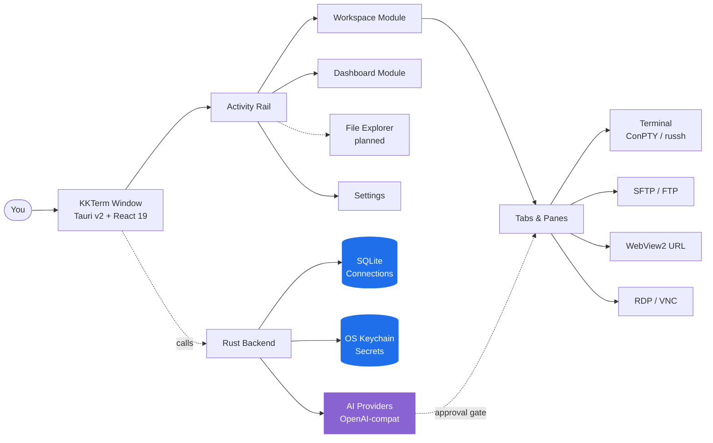

<p align="center">
  
</p>

<h1 align="center">KKTerm</h1>

<p align="center">
  <strong>The native Windows admin workspace the AI-tools era forgot to build — terminals, SSH, SFTP, RDP/VNC, dashboards, and an AI that builds your own tool widgets.</strong>
</p>

<p align="center">
  <em>Because your taskbar shouldn't look like a Vegas slot machine.</em>
</p>

<p align="center">
  <sub>Named after <strong>乖乖 (Kuāi Kuāi)</strong>, the green coconut snack Taiwanese sysadmins place on servers to keep them well-behaved. We hope this app earns its place on the rack.</sub>
</p>

<p align="center">
  <a href="https://github.com/ryantsai/KKTerm/stargazers">
    
  </a>
  <a href="https://github.com/ryantsai/KKTerm/network/members">
    
  </a>
  <a href="https://github.com/ryantsai/KKTerm/issues">
    
  </a>
  <a href="https://github.com/ryantsai/KKTerm/blob/main/LICENSE">
    
  </a>
  <br />
  
  
  
  
  
  <br />
  <sub>
    <strong>English</strong> ·
    <a href="README.zh-TW.md">繁體中文</a> ·
    <a href="README.zh-CN.md">简体中文</a> ·
    <a href="README.ja.md">日本語</a> ·
    <a href="README.ko.md">한국어</a> ·
    <a href="README.fr.md">Français</a> ·
    <a href="README.de.md">Deutsch</a> ·
    <a href="README.es.md">Español</a> ·
    <a href="README.es-MX.md">Español (MX)</a> ·
    <a href="README.it.md">Italiano</a> ·
    <a href="README.pt-BR.md">Português (BR)</a> ·
    <a href="README.th.md">ไทย</a> ·
    <a href="README.id.md">Bahasa Indonesia</a> ·
    <a href="README.vi.md">Tiếng Việt</a>
  </sub>
</p>

---

## The Pitch (45 seconds)

You're a sysadmin / DevOps / homelab / vibe-coder person. Right now you have:

- A terminal emulator
- A separate SSH client (with a profile list it took you a weekend to build)
- An SFTP client from 2007 that somehow still ships
- Remote Desktop in a window you keep losing on the wrong monitor
- A VNC viewer for that one Linux box
- A browser tab for the router admin UI
- A `claude` / `codex` session running on a remote dev box that drops every time your Wi-Fi sneezes
- A sticky note with passwords *(don't worry, we won't tell)*

**KKTerm is one window for all of that.** Native on Windows — *on purpose, while the rest of the dev tools world ships mac-first and treats your OS like a footnote* — written in Rust + Tauri v2, ships as a single installer, and refuses to phone home.

Plus a few things you didn't know you wanted:

- A **Dashboard** where you tell an AI *"build me a widget that pings my router every 30 seconds"* and it appears, sandboxed, on your grid.
- **SSH panes that auto-attach to named tmux sessions** so your remote `claude` / `codex` session survives every Wi-Fi tantrum your laptop throws.
- An **AI Coding usage widget** that shows your Claude Code and Codex quotas — 5-hour window, weekly window, current plan, account email — on the **Dashboard** and in the status bar, so you stop being surprised by the rate-limit wall at 3 AM.
- A **built-in MCP server** (`kkterm-cli`) that lets external coding agents (Claude Code, Codex, Copilot, Antigravity, OpenCode) drive your Workspace and Dashboard — list Connections, read terminal buffers, place widgets — over a curated, safety-gated tool surface. AI-to-AI, on your machine, no cloud relay.
- Twenty-one **animated canvas backgrounds** (yes, including `matrix`) for the dashboard, because we are not above it.

Oh, and the AI assistant can turn a sentence into a tiny dashboard tool you actually keep using.

> ⭐ **If this sounds like the app you've been meaning to build for the last six years — star the repo so we know someone's watching. It genuinely helps.**

---

## Why "KKTerm"?

Walk into any Taiwanese data center and look at the top of the racks. Past TSMC fabs, Taipei Metro control rooms, Cathay Bank server halls, Chunghwa Telecom switching gear — you will spot a small green bag of 乖乖 (Kuāi Kuāi), a coconut-flavored corn snack from the 1960s.

The name literally means **"be good"**, **"behave"**. The IT tradition is straightforward and absolutely serious:

- **Must be green flavor (coconut).** Yellow (curry) means *stay home from work*; red (spicy) makes the server angry. Green only.
- **Must be unexpired.** A stale Kuai Kuai works against you. Engineers diligently swap them out.
- **Must be visible.** The server has to know it's there.
- **Do not eat it.** That bag is on duty.

Some of the largest, most boring, most uptime-obsessed systems in Asia run with a bag of corn puffs taped to the chassis. It works because the people who maintain them believe it works, which is a remarkably honest description of most IT culture.

**KKTerm** is **Kuai Kuai Term** — an admin workspace that aspires to the same job as the snack: to sit quietly next to your important machines and help them behave. Local-first. No telemetry. Approval-gated AI. The boring, dependable kind of software.

We have not yet been able to ship an actual bag of Kuai Kuai with the installer. That's a v2 item.

---

## See It Move

<p align="center">
  <a href="https://github.com/ryantsai/KKTerm">
    
  </a>
</p>

<p align="center"><sub><em>(Demo GIF goes here. A picture is worth a thousand bullet points, and we ran out of bullet points.)</em></sub></p>

---

## Why People Keep It Open All Day

### Windows-first, on purpose

Look around the 2026 dev tooling landscape. Claude Code: ships mac/linux first, Windows is "use WSL." Codex CLI: same. `gemini-cli`, half of Homebrew, every shiny new TUI: mac/linux first, Windows users get a `# Windows: contributions welcome` comment in the README and a fish-completion script that doesn't run.

Meanwhile, the people who actually keep companies online — corporate IT, MSPs, anyone running Hyper-V or AD or SCCM or IIS or a domain controller older than some interns — are sitting at Windows boxes wondering why every new tool acts like their OS is an inconvenience.

**KKTerm is the opposite trade.** We build native Windows first, and macOS / Linux ports follow. That means we get to use the Windows APIs that actually matter, instead of papering over them with a portability layer:

- **ConPTY** for local shells — the real Windows pseudo-console, not a translation shim. PowerShell, `cmd.exe`, WSL distros, all hosted as proper PTYs with focus, resize, and VT sequence handling that match the platform's behavior.
- **WebView2** for the entire UI and embedded URL **Connections** — in-process Chromium using the system runtime, which is one of the reasons the installer is small and starts fast.
- **Microsoft RDP ActiveX (`mstscax.dll`)** for RDP — *the actual one Microsoft ships*. Same control as Remote Desktop Connection (`mstsc.exe`). Not a third-party reimplementation, not FreeRDP-in-a-wrapper. RDP people will notice the difference in five seconds.
- **Windows Credential Manager** for all secrets. SSH passwords, FTP passwords, API keys, URL Connection credentials — they live in the OS keychain and `credwiz.exe` can audit them.
- **NSIS current-user installer** with a matching SHA-256, native tray menu, Don't-Sleep power assertion, host CPU/RAM/network sampling, native Tauri context menus with real PNG icons, native Open/Save dialogs. Not a single one of these is mocked.
- **WSL is a first-class shell, not a workaround.** Spin up Ubuntu next to a PowerShell pane next to an SSH session next to an RDP **Tab** in the same window.

The macOS and Linux builds are on the roadmap and will get the same care. But if you've been waiting for someone to build the *good* Windows admin tool first instead of last — that's the deal.

### Local-first means actually local

Your saved **Connections** live in a SQLite file on your machine. Passwords live in the **Windows Credential Manager**, not in a JSON next to the binary. The app does not ship analytics, does not call home on startup, and does not need a cloud account to launch. There is no "sign in to sync" because there is no sync.

If your network cable catches fire, KKTerm still opens.

### One workspace, every connection type

| You wanted to… | KKTerm has |
| --- | --- |
| Open a local PowerShell / cmd / WSL shell | ConPTY-backed local terminal **Sessions** |
| SSH into a server | Native `russh` with agent / key / password auth, host-key trust flow, ProxyJump, port forwarding |
| Browse files on that server | SFTP launched from the SSH **Connection**, dual-pane, recursive transfers, chmod/chown |
| FTP to a NAS from 2012 | FTP / FTPS **Connections** in the same SFTP-style browser |
| Telnet to ancient gear | Yes, fine, Telnet is in there too |
| Talk to a serial port | Serial **Connection** kind, COM port + baud, no extra tooling |
| Remote into a Windows box | Native RDP via the Microsoft ActiveX control (the real one, not a clone) |
| VNC into a Pi | Rust `vnc-rs` framebuffer rendered straight into the workspace |
| Open the router's web UI | Embedded WebView2 **URL Connection** with credential fill |
| Watch CPU on the host | Live status bar + a **Dashboard** module with drag/resize widgets |

It's all the same app. Same window. Same hotkeys. Same hopefully-not-eye-bleeding theme.

### Terminals that don't lose their minds

- Split panes inside a **Tab**.
- WebGL-accelerated xterm.js rendering, falling back gracefully when it can't.
- Scrollback search.
- tmux-backed SSH panes that can attach to stable per-pane sessions, so reconnecting actually means *reconnecting*, not "starting over and pretending the last hour didn't happen."
- Switching **Tabs** does **not** kill the **Session**. Closing the **Tab** does. This distinction was a religious war internally; we won.

### An AI Assistant that builds your tools

Most "AI in your terminal" demos stop at chat. KKTerm's assistant can also build small, durable dashboard widgets for the way you actually work. It still keeps the dangerous stuff behind two switches:

- **Tool families** (Dashboard / Connections / Live Sessions) — toggle them on or off per category.
- **Permission mode** in the composer — `Prompt` (default, asks every time) or `Allow All` (you're an adult, you signed the waiver).

Talk to OpenAI, Anthropic, OpenRouter, DeepSeek, Grok, Azure OpenAI, LiteLLM, GitHub Copilot, Ollama, NVIDIA, or anything OpenAI-compatible. API keys go to the OS keychain. Models that propose `rm -rf` get classified as dangerous and require explicit human approval. The AI cannot quietly run a destructive command because somebody got clever with a prompt injection in a man page.

### A Dashboard that doesn't pretend to be Grafana

The **Dashboard** module is a 12-column drag/resize grid of widget instances. It's not for petabyte observability — it's for "I want a button to launch my five favorite apps and a panel showing my SSH host's uptime, *next to* my chat."

#### AI-Created Widgets — describe it, get it

This is the part we are genuinely excited about. You don't pick from a marketplace and you don't write JavaScript. You **tell the AI assistant what you want**, and it builds the widget right there on your dashboard:

> *"Add a widget showing the last 5 commits on my main repo as a list."*
> *"Make me a sticky-note widget that holds my on-call cheat sheet."*
> *"Build a widget that pings my home router every 30 seconds and shows green/red."*
> *"I need a stopwatch. Surprise me on the styling."*

Two flavors:

- **Content widgets** — declarative JSON: markdown, kv lists, checklists, single big stat. Safe by construction, no script. Most "I just need this on my dashboard" requests land here.
- **Script widgets** — JavaScript hosted inside an isolated `iframe srcdoc` sandbox with explicit, declared permissions (`network` allowlist, `pollSeconds` budget). The AI writes the script, you approve the permissions, the widget runs in a box that cannot reach the rest of the app.

Every widget you keep is yours. They persist in SQLite next to your **Connections**, with their own visual preset (`panel` / `ambient` / `hero`), accent color, icon, and title. Multiple instances of the same widget can coexist with totally different sizes and styling. Delete them with a right-click when the magic wears off.

#### Animated dashboard backgrounds (because we wanted to)

The dashboard has twenty-one canvas-animated backgrounds you can pick per **Dashboard View**:

| Mood | Backgrounds |
| --- | --- |
| Calm | `aurora`, `clouds`, `ocean`, `raindrops`, `snow`, `sakura`, `fireflies`, `bubbles`, `ricefield`, `lanterns` |
| Spacey | `starfield`, `nebula` |
| Warm | `embers`, `lava` |
| Geeky | `matrix`, `topo`, `synthwave` |
| Erratic | `cyberpunk`, `taipei101`, `thunderstorm`, `confetti` |

They run on a single shared `requestAnimationFrame` and respect window focus, so they cost roughly nothing when you're elsewhere. Pair `matrix` with your AI assistant for a vibe that says "I am extremely productive and also possibly in a Wachowski film." Or pick `ocean` and look like a serious person. We do not judge either choice.

### Running AI coding agents on a server, the right way

This is the second feature people fall in love with. KKTerm's SSH terminals can launch directly into a **named tmux session** on the remote host — by default, an auto-generated friendly id like `kkterm-cockpit001` that survives reconnect:

- Open an SSH **Connection** with tmux enabled.
- Inside the pane, start `claude`, `codex`, `gemini-cli`, `cursor-agent`, or whatever long-running coding agent you prefer. They are full-screen TUI apps; tmux is exactly where they want to live.
- Close the laptop. Open it again. The pane silently re-attaches to the same tmux session. The agent is still running, still has its scrollback, still in the middle of whatever it was doing.
- Network blip on the SSH transport? KKTerm makes a bounded silent reattach attempt to the same tmux id without bothering you.
- Want the AI assistant to see what the agent is doing? "Add terminal buffer to context" calls `capture_tmux_pane` over SSH and pulls the full tmux scrollback — not just what's on-screen, the whole session — into the conversation. Your local assistant can now reason about your remote agent's work.

If you have ever lost a six-hour `claude` or `codex` session to a flaky hotel Wi-Fi, this single feature pays for the app. The app is free. The feature is still worth it.

### Knowing how much AI you have left

Coding agents charge by plan window, not by month. Claude Code has a 5-hour window and a weekly window. Codex does its own version. Both will happily eat your quota in the background while you're in a meeting.

The **AI Coding Usage** widget keeps that visible:

- A Dashboard widget showing **Claude Code** and **Codex** side-by-side: connected account, plan tier, percent used in the current 5-hour window, percent used this week, and the next reset time.
- A compact **status-bar indicator** that mirrors the same numbers, so even with the Dashboard closed you can tell at a glance whether you still have headroom before you kick off the next big refactor.
- Auth state is surfaced directly (`connected` / `expired` / `error`) so you find out *before* a long task that you need to re-login, not in the middle of one.
- Refresh policy respects rate limits; the widget polls on its own cadence instead of hammering the upstream APIs whenever you look at it.

### A built-in MCP server — let other AIs drive KKTerm

Your terminal is also where Claude Code, Codex, Copilot agent mode, Antigravity, and the rest of the MCP-speaking world want to do work. So KKTerm ships its own **stdio MCP server**, [`kkterm-cli`](docs/MCP.md), that exposes a curated slice of the app:

- **Workspace Module** (`kkterm.workspace.*`): list saved **Connections**, open a Connection by id, list live **Sessions**, send input to a terminal pane, read a terminal buffer snapshot.
- **Dashboard Module** (`kkterm.dashboard.*`): load Dashboard state, read AI-Created Widget source, create / update / remove views, place / move / remove widget instances, apply bulk layouts.
- **Dangerous sub-namespaces** (`kkterm.<module>.dangerous.*`): mutating the executable surface — creating script widgets, clicking into remote desktops, wiping the Dashboard — is gated behind a single setting (`built_in_mcp_allow_all_dangerous`), defaulting **off**.

`kkterm-cli` is a thin forwarder. It speaks stdio JSON-RPC to your MCP client and talks to the running KKTerm window over a per-launch authenticated Windows named pipe. When KKTerm is closed, `tools/list` still works (so clients can introspect the surface), but `tools/call` returns a structured `app_not_running` error instead of doing anything.

Wire it into your favorite client and your AI can now use KKTerm the way you do:

```json
{
  "mcpServers": {
    "kkterm": { "command": "<path-to-kkterm-cli>", "args": [] }
  }
}
```

Settings → AI Assistant → **Built-in MCP Server** has a one-click "Show config" dialog with JSON and TOML snippets pre-filled with the resolved binary path, plus copyable `claude mcp add` / `codex mcp add` commands.

---

## How It Fits Together



The shape that matters: durable saved data (**Connection**) is separate from live runtime state (**Session**), which is separate from the UI container (**Tab**). Closing a **Tab** ends the **Session**. Switching **Tabs** does not. This is the rule that keeps the app sane.

---

## Current Feature Map

| Area | Implemented today |
| --- | --- |
| **Connections** | SQLite-backed tree, folders/subfolders, search, drag/drop order, rename, duplicate, delete, **Quick Connect**, custom icons, pinned/active rail shortcuts |
| **Terminal** | Local shells, SSH, Telnet, Serial, split panes, xterm.js + opportunistic WebGL, scrollback search, local startup directory/script |
| **SSH** | Native `russh`, agent/key/password auth, host-key trust flow, optional system SSH fallback, ProxyJump, port forwarding, **auto-named tmux sessions (`kkterm-<scifi-name><n>`) with silent reattach on transport blip** — perfect for long-running remote coding agents (Claude Code, Codex, gemini-cli, etc.) |
| **SFTP / FTP** | SSH-launched SFTP plus FTP/FTPS **Connections**, dual-pane browser, recursive transfers, queue/cancel/clear history, conflicts, properties, chmod/chown where supported |
| **URL WebView** | Embedded WebView2 URL **Sessions**, navigation toolbar, favicon capture, stored website credential metadata/fill, data partition metadata |
| **Remote Desktop** | RDP through Windows ActiveX with geometry-scoped overlay parking; VNC through `vnc-rs` framebuffer rendered in the workspace canvas |
| **Dashboard** | Durable views, widget instances, edit mode, drag/resize, App Launcher, **AI-authored content/script widgets** (declarative JSON or sandboxed iframe JS with permissions), per-widget presets / accent / icon / title, **21 animated canvas backgrounds** (aurora, clouds, ocean, raindrops, snow, sakura, fireflies, bubbles, ricefield, lanterns, starfield, nebula, embers, lava, matrix, topo, synthwave, cyberpunk, taipei101, thunderstorm, confetti) |
| **AI Assistant** | Streaming chat, OpenAI-compatible runtime, provider registry, command proposal safety classification, screenshot/context attachments, **Dashboard widget authoring (content + sandboxed script)**, **tmux pane capture** as conversation context for remote sessions, **Connection** management tools, and live **Session** tools for terminal, RDP/VNC, and SFTP/FTP |
| **AI Coding Usage** | **Dashboard widget + status-bar indicator** tracking **Claude Code** and **Codex** quota usage: connected account, plan tier, 5-hour and weekly window percentages, next reset time, auth state (`connected` / `expired` / `error`), rate-limit-aware refresh policy |
| **Built-in MCP Server** | Stdio MCP server (`kkterm-cli`) exposing curated Workspace and Dashboard tools to external coding agents (Claude Code, Codex, Copilot, Antigravity, OpenCode); authenticated named-pipe bridge; per-Module `dangerous.*` namespaces gated behind a single safety toggle; Settings dialog with one-click JSON / TOML snippets and `claude mcp add` / `codex mcp add` commands |
| **Settings** | General, Appearance, Credentials, AI, SSH, Terminal, URL, RDP, VNC, Dashboard, About; custom UI fonts; minimize-to-tray; Don't Sleep; backup/import |
| **Localization** | i18next UI with English source and dynamic locale bundles: zh-TW, zh-CN, ja, ko, fr, de, es, es-MX, it, pt-BR, th, id, vi |

### AI Providers

OpenAI · Anthropic · OpenRouter · DeepSeek · Grok · Azure OpenAI · LiteLLM · GitHub Copilot · Ollama · NVIDIA · any OpenAI-compatible endpoint.

Provider metadata lives in [`src/ai/providerRegistry/`](src/ai/providerRegistry/); Rust adapters in [`src-tauri/src/ai/providers/`](src-tauri/src/ai/providers/). API keys go through the OS keychain, never SQLite.

---

## Quick Start

You need:

- **Windows** (primary supported platform)
- **Node.js + npm**
- **Rust toolchain**
- **Tauri v2 prerequisites for Windows** including **WebView2**

```bash
npm install
npm run tauri dev
```

That should produce a real native window. If it produces a stack trace instead, please file an issue — we love a good repro.

### Common checks

```bash
npm run check                                              # TypeScript
npm run build                                              # Vite build
cargo check --manifest-path src-tauri/Cargo.toml           # Rust
cargo test  --manifest-path src-tauri/Cargo.toml           # Rust tests
```

### Build the Windows installer

```bash
npm run package:installer
```

The installer script writes `artifacts/kkterm-<version>-windows-x64-setup.exe` and a matching `.sha256` file. It is currently **unsigned** — release signing is on the roadmap, but until then your antivirus may give you a stern look. That's normal.

---

## What KKTerm Is Not

A short list, because honesty earns trust:

- **Not a cloud product.** No sync, no team accounts, no SaaS tier. If you ever see a "Sign in to KKTerm" dialog, something has gone catastrophically wrong.
- **Not pretending to be cross-platform.** We are Windows-first on purpose; macOS and Linux are on the roadmap and will use the same Tauri v2 shell. If you need a mac-first tool today, you have hundreds of options. We're building the one Windows admins have been quietly waiting for.
- **Not an autonomous AI agent.** The assistant proposes; the human disposes. `Allow All` is a choice you make, not a default.
- **Not a Grafana / Datadog replacement.** The Dashboard is for personal control surfaces, not 10k-host observability.
- **Not a Kubernetes IDE.** It is a terminal-first admin workspace. Please don't ask it to render a Helm chart.

If any of those *was* a dealbreaker — fair enough, we'll see you in v2.

---

## Native Debugging

Use the real Tauri runtime for validation:

```bash
npm run tauri dev
```

A Vite browser preview is useful for some frontend inspection, but it does **not** host a real WebView2, ConPTY, RDP ActiveX, VNC framebuffer, keychain, or native menu surface. If a feature touches any of those, validate it in the actual desktop runtime.

VS Code users: the `Run KKTerm exe` launch config starts `src-tauri/target/debug/kkterm.exe` with `RUST_BACKTRACE=1`. The paired `Attach KKTerm WebView2` config gives you DevTools inside the real WebView2 host.

---

## Current Limits (yes, we know)

- The installer is currently unsigned. Update checks are disabled until release signing is configured.
- SFTP over ProxyJump is not yet supported in the native SFTP path.
- File transfer resume, folder sync/diff, archive/extract, and remote editing are deferred.
- SSH config import is implemented but the user-facing entry in Settings is not yet exposed.
- RDP and VNC are shipping; richer clipboard/device sync and quality controls are still evolving.
- macOS and Linux builds are on the roadmap. They are coming, and they will be done properly — not rushed out as a "we also kinda work over there" port.
- The AI assistant proposes and can operate enabled tools within the configured permission boundary — please do not treat it as an unattended robot. It does not, in fact, know what your CEO wants.

---

## Roadmap (the short version)

- macOS + Linux builds
- Signed installer + auto-update
- SFTP over ProxyJump in the native path
- File transfer resume, folder sync, archive/extract
- Richer RDP clipboard/device redirection
- More built-in **Dashboard** widgets (and a public schema for AI-authored ones)

Full and frequently-updated version: [`docs/ROADMAP.md`](docs/ROADMAP.md).

---

## Contributing

We would love a hand. Genuinely. Even small things matter:

- **Try the dev build** and file an issue when something feels off. "It felt off" is a legitimate bug report; we'll dig with you.
- **Translate a locale.** English is the source of truth at [`src/i18n/locales/en.json`](src/i18n/locales/en.json); 12 other locales live next to it and load on demand. Pending strings are tracked per-key under [`docs/localization_todo/`](docs/localization_todo/) — pick one, translate it, delete the file.
- **Add a Dashboard widget.** Built-in widgets live in [`src/modules/dashboard/widgets/builtin/`](src/modules/dashboard/widgets/builtin/). Pick a small idea, ship it, learn the pattern.
- **Tighten the AI tool surface.** Provider adapters live in [`src-tauri/src/ai/providers/`](src-tauri/src/ai/providers/); the frontend registry is in [`src/ai/providerRegistry/`](src/ai/providerRegistry/).
- **Improve the manual.** End-user docs live in [`docs/manual/`](docs/manual/). One chapter per UI module. If you used a feature and the docs didn't help, a PR fixing that is gold.

Full setup, project layout, PR checklist, and the list of "please do not break these" rules live in [`CONTRIBUTING.md`](CONTRIBUTING.md). The 30-second highlights:

- **Read [`CONTEXT.md`](CONTEXT.md) before renaming user-facing terms.** **Connection**, **Session**, **Tab**, and **Quick Connect** mean specific things; please don't drift.
- **Every user-visible string goes through `t()`.** No bare English text in JSX.
- **No frontend close hooks.** Tauri v2's title-bar close has been broken by `onCloseRequested` patterns a half-dozen times. We finally have a working shape; please don't reintroduce them.
- **Run the checks** (`npm run check && npm run build && cargo check && cargo test`) before opening a PR.

Looking for an entry point? Filter open issues by [`good first issue`](https://github.com/ryantsai/KKTerm/issues?q=is%3Aissue+is%3Aopen+label%3A%22good+first+issue%22) or [`help wanted`](https://github.com/ryantsai/KKTerm/issues?q=is%3Aissue+is%3Aopen+label%3A%22help+wanted%22). If there aren't any tagged yet, open an issue describing what you'd like to work on and we'll help scope it.

---

## Project Docs

- [Product context](CONTEXT.md) — the domain language you should match
- [Architecture](docs/ARCHITECTURE.md) — module map, where to put new code
- [Roadmap](docs/ROADMAP.md)
- [Dashboard architecture](docs/DASHBOARD.md)
- [AI provider guide](docs/AI_PROVIDERS.md)
- [Performance notes](docs/PERFORMANCE.md)
- [Release notes and gates](docs/RELEASE.md)

---

## Stack

Rust · Tauri v2 · React 19 · TypeScript · Vite · Tailwind CSS · Zustand · xterm.js · SQLite · WebView2 · `russh` · `russh-sftp` · `vnc-rs` · `suppaftp` · OS keychain storage.

---

## Star History

<a href="https://www.star-history.com/#ryantsai/KKTerm&Date">
  <picture>
    <source media="(prefers-color-scheme: dark)" srcset="https://api.star-history.com/svg?repos=ryantsai/KKTerm&type=Date&theme=dark" />
    <source media="(prefers-color-scheme: light)" srcset="https://api.star-history.com/svg?repos=ryantsai/KKTerm&type=Date" />
    
  </picture>
</a>

If you got this far and you haven't starred it yet — what are you waiting for, a personal invitation? Consider this the personal invitation.

⭐ **[Star KKTerm on GitHub](https://github.com/ryantsai/KKTerm)** — it costs one click and makes the maintainer's whole week. Think of it as a digital 乖乖 on the rack.

---

## License

MIT. See [LICENSE](LICENSE). Use it, fork it, ship it, put it in a homelab nobody else can find — that's the deal.
