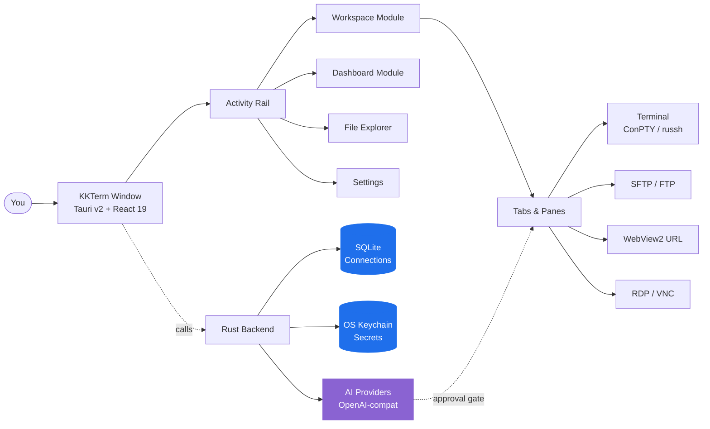

<p align="center">
  
</p>

<h1 align="center">KKTerm</h1>

<p align="center">
  <strong>O workspace nativo para administradores Windows que a era das ferramentas de IA esqueceu de criar — terminais, SSH, SFTP, RDP/VNC, dashboards, e uma IA que pede permissão antes de tocar em qualquer coisa.</strong>
</p>

<p align="center">
  <em>Porque a sua barra de tarefas não deveria parecer uma caça-níqueis em Las Vegas.</em>
</p>

<p align="center">
  <sub>Batizado em homenagem à <strong>乖乖 (Kuāi Kuāi)</strong>, o salgadinho de coco verde que os sysadmins taiwaneses colocam em cima dos servidores para que se comportem bem. Esperamos que este app mereça um lugar no rack.</sub>
</p>

<p align="center">
  <a href="https://github.com/ryantsai/KKTerm/stargazers">
    
  </a>
  <a href="https://github.com/ryantsai/KKTerm/network/members">
    
  </a>
  <a href="https://github.com/ryantsai/KKTerm/issues">
    
  </a>
  <a href="https://github.com/ryantsai/KKTerm/blob/main/LICENSE">
    
  </a>
  <br />
  
  
  
  
  
  <br />
  <sub>
    <a href="README.md">English</a> ·
    <a href="README.zh-TW.md">繁體中文</a> ·
    <a href="README.zh-CN.md">简体中文</a> ·
    <a href="README.ja.md">日本語</a> ·
    <a href="README.ko.md">한국어</a> ·
    <a href="README.fr.md">Français</a> ·
    <a href="README.de.md">Deutsch</a> ·
    <a href="README.es.md">Español</a> ·
    <a href="README.es-MX.md">Español (MX)</a> ·
    <a href="README.it.md">Italiano</a> ·
    <strong>Português (BR)</strong> ·
    <a href="README.th.md">ไทย</a> ·
    <a href="README.id.md">Bahasa Indonesia</a> ·
    <a href="README.vi.md">Tiếng Việt</a>
  </sub>
</p>

---

## O Argumento (45 segundos)

Você é sysadmin / DevOps / homelab / aquele que programa no feeling. Neste exato momento, você tem aberto:

- Um emulador de terminal
- Um cliente SSH separado (com uma lista de perfis que levou um fim de semana inteiro para montar)
- Um cliente SFTP de 2007 que milagrosamente ainda funciona
- Remote Desktop numa janela que você vive perdendo no monitor errado
- Um VNC viewer para aquela máquina Linux
- Uma aba do navegador com a interface de administração do roteador
- Uma sessão do `aider` / `claude` / `codex` rodando num servidor remoto que cai toda vez que o Wi-Fi espirra
- Um post-it com senhas *(não se preocupa, a gente não conta)*

**KKTerm é uma janela só para tudo isso.** Nativo no Windows — *de propósito, enquanto o resto do mundo das ferramentas de dev lança tudo pro mac primeiro e trata o seu sistema operacional como nota de rodapé* — escrito em Rust + Tauri v2, distribuído como um único instalador, e que não liga pra casa.

Mais algumas coisas que você não sabia que queria:

- Um **Dashboard** onde você fala pra uma IA *"cria um widget que faz ping no meu roteador a cada 30 segundos"* e ele aparece, em sandbox, na sua grade.
- **Panes de SSH com auto-attach a sessões tmux nomeadas** para que sua sessão remota do `claude` / `codex` / `aider` sobreviva a qualquer birra de Wi-Fi que o seu notebook resolver ter.
- Nove **fundos animados em canvas** (sim, incluindo `matrix`) para o dashboard, porque a gente não tem vergonha disso não.

Ah, e a IA assistente precisa pedir permissão antes de fazer qualquer coisa que possa encerrar a sua carreira.

> ⭐ **Se isso parece o app que você sempre quis mas nunca teve tempo de construir — dá uma estrela no repositório pra gente saber que tem alguém por aí. Ajuda de verdade.**

---

## Por que "KKTerm"?

Entre em qualquer datacenter taiwanês e olhe para o topo dos racks. Nas fábricas da TSMC, nas salas de controle do Metrô de Taipei, nos halls de servidores do Cathay Bank, nos equipamentos de switching da Chunghwa Telecom — você vai encontrar um saquinho verde de 乖乖 (Kuāi Kuāi), um salgadinho de milho com sabor de coco dos anos 1960.

O nome significa literalmente **"seja bonzinho"**, **"se comporte"**. A tradição de TI é direta e absolutamente séria:

- **Precisa ser o sabor verde (coco).** Amarelo (curry) significa *fica em casa*; vermelho (picante) deixa o servidor nervoso. Verde somente.
- **Precisa estar dentro do prazo de validade.** Um Kuai Kuai vencido trabalha contra você. Os engenheiros os trocam com diligência.
- **Precisa estar visível.** O servidor precisa saber que está lá.
- **Não pode comer.** Aquele saquinho está de plantão.

Alguns dos maiores, mais entediantes e mais obcecados com uptime sistemas da Ásia funcionam com um saquinho de pipoca de milho colado no chassi. Funciona porque as pessoas que os mantêm acreditam que funciona — o que é uma descrição surpreendentemente honesta da maior parte da cultura de TI.

**KKTerm** é **Kuai Kuai Term** — um workspace de administração que aspira ao mesmo papel do salgadinho: sentar quietinho do lado das suas máquinas importantes e ajudá-las a se comportar. Local-first. Sem telemetria. IA com aprovação obrigatória. O tipo de software chato e confiável.

Ainda não conseguimos incluir um saquinho de Kuai Kuai de verdade com o instalador. Isso vai para a v2.

---

## Veja em Movimento

<!--
  TODO: Substitua este placeholder por um GIF de demonstração real.
  Recomendado:
    - 5-10 segundos, em loop
    - Mostrar: abrir uma Connection -> dividir um pane -> upload SFTP -> IA propondo um comando
    - Cerca de 5 MB para que o GitHub renderize inline sem lazy-loading
  Caminho sugerido: docs/assets/demo.gif
  Depois altere o  abaixo para: src="docs/assets/demo.gif"
-->

<p align="center">
  <a href="https://github.com/ryantsai/KKTerm">
    
  </a>
</p>

<p align="center"><sub><em>(O GIF de demo vai aqui. Uma imagem vale mil bullet points, e a gente ficou sem bullet points.)</em></sub></p>

---

## Por que as Pessoas Mantêm Aberto o Dia Todo

### Windows-first, de propósito

Dê uma olhada no ecossistema de ferramentas de dev em 2026. Claude Code: lança para mac/linux primeiro, Windows é "usa o WSL." Codex CLI: a mesma coisa. `aider`, `gemini-cli`, metade do Homebrew, todo novo TUI bacana: mac/linux primeiro, e os usuários Windows ganham um comentário `# Windows: contributions welcome` no README e um script de fish-completion que não roda.

Enquanto isso, as pessoas que de fato mantêm empresas no ar — TI corporativo, MSPs, qualquer um rodando Hyper-V ou AD ou SCCM ou IIS ou um domain controller mais velho que alguns estagiários — estão em frente a máquinas Windows se perguntando por que toda ferramenta nova age como se o sistema operacional deles fosse um inconveniente.

**KKTerm é a aposta contrária.** A gente constrói nativo para Windows primeiro, e os ports para macOS / Linux vêm depois. Isso significa que podemos usar as APIs do Windows que realmente importam, em vez de cobri-las com uma camada de portabilidade:

- **ConPTY** para shells locais — o pseudoconsole real do Windows, não um shim de tradução. PowerShell, `cmd.exe`, distribuições WSL, todos hospedados como PTYs de verdade com foco, resize e tratamento de sequências VT que batem com o comportamento da plataforma.
- **WebView2** para toda a interface e **Connections** de URL embutidas — Chromium em processo usando o runtime do sistema, que é um dos motivos pelo qual o instalador é pequeno e inicia rápido.
- **Microsoft RDP ActiveX (`mstscax.dll`)** para RDP — *o mesmo que a Microsoft distribui*. Mesmo controle que o Remote Desktop Connection (`mstsc.exe`). Não é uma reimplementação de terceiros, não é FreeRDP dentro de um wrapper. Quem mexe com RDP percebe a diferença em cinco segundos.
- **Windows Credential Manager** para todos os segredos. Senhas de SSH, senhas de FTP, chaves de API, credenciais de URL Connection — tudo vive no OS keychain e o `credwiz.exe` pode auditá-los.
- **Instalador NSIS para o usuário atual** com SHA-256 correspondente, menu de bandeja nativo, asserção de energia Don't-Sleep, amostragem de CPU/RAM/rede do host, menus de contexto Tauri nativos com ícones PNG reais, diálogos Open/Save nativos. Nenhum deles é simulado.
- **WSL é um shell de primeira classe, não um paliativo.** Abra Ubuntu ao lado de um pane PowerShell ao lado de uma sessão SSH ao lado de uma **Tab** RDP, tudo na mesma janela.

Os builds para macOS e Linux estão no roadmap e receberão o mesmo cuidado. Mas se você estava esperando alguém construir a ferramenta de administração Windows *boa* — em vez de deixá-la por último — esse é o acordo.

### Local-first significa realmente local

Suas **Connections** salvas ficam num arquivo SQLite na sua máquina. As senhas ficam no **Windows Credential Manager**, não num JSON ao lado do binário. O app não inclui analytics, não liga pra casa ao iniciar e não precisa de uma conta em nuvem para abrir. Não existe "faça login para sincronizar" porque não existe sincronização.

Se o cabo de rede pegar fogo, o KKTerm ainda abre.

### Um workspace, todo tipo de conexão

| Você queria… | KKTerm tem |
| --- | --- |
| Abrir um shell PowerShell / cmd / WSL local | **Sessions** de terminal local com ConPTY |
| Entrar por SSH num servidor | `russh` nativo com auth por agente / chave / senha, fluxo de confiança de host-key, ProxyJump, port forwarding |
| Navegar pelos arquivos desse servidor | SFTP aberto pela **Connection** SSH, painel duplo, transferências recursivas, chmod/chown |
| FTP num NAS de 2012 | **Connections** FTP / FTPS no mesmo navegador estilo SFTP |
| Telnet para equipamento antigo | Sim, pronto, Telnet está lá também |
| Falar com uma porta serial | Tipo de **Connection** serial, COM port + baud, sem ferramentas extras |
| Acessar remotamente uma máquina Windows | RDP nativo via controle Microsoft ActiveX (o de verdade, não um clone) |
| VNC num Raspberry Pi | Framebuffer Rust `vnc-rs` renderizado direto no workspace |
| Abrir a interface web do roteador | **URL Connection** WebView2 embutido com preenchimento de credenciais |
| Monitorar CPU do host | Barra de status em tempo real + módulo **Dashboard** com widgets arrastáveis e redimensionáveis |

É tudo o mesmo app. Mesma janela. Mesmos atalhos de teclado. Mesmo tema que esperamos não agredir seus olhos.

### Terminais que não enlouquecem

- Panes divididos dentro de uma **Tab**.
- Renderização xterm.js acelerada por WebGL, com fallback gracioso quando não está disponível.
- Busca no scrollback.
- Panes de SSH com tmux que fazem attach a sessões estáveis por pane, de forma que reconectar realmente significa *reconectar*, e não "começar do zero e fingir que a última hora não aconteceu."
- Trocar de **Tab** **não** mata a **Session**. Fechar a **Tab** sim. Essa distinção foi uma guerra religiosa internamente; a gente ganhou.

### Um AI Assistant que respeita a câmara de ar

A maioria das demos de "IA no seu terminal" ficam ótimas em vídeo e são aterrorizantes em produção. O assistente do KKTerm é construído em torno de dois controles:

- **Famílias de ferramentas** (Dashboard / Connections / Live Sessions) — ative ou desative por categoria.
- **Modo de permissão** no composer — `Prompt` (padrão, pergunta sempre) ou `Allow All` (você é adulto, assinou o termo de responsabilidade).

Converse com OpenAI, Anthropic, OpenRouter, DeepSeek, Grok, Azure OpenAI, LiteLLM, GitHub Copilot, Ollama, NVIDIA, ou qualquer endpoint compatível com OpenAI. As chaves de API vão para o OS keychain. Modelos que propõem `rm -rf` são classificados como perigosos e exigem aprovação humana explícita. A IA não consegue silenciosamente executar um comando destrutivo porque alguém achou graça numa injeção de prompt em uma página de manual.

### Um Dashboard que não finge ser o Grafana

O módulo **Dashboard** é uma grade de 12 colunas arrastável e redimensionável de instâncias de widget. Não é para observabilidade de petabytes — é para "quero um botão para abrir meus cinco apps favoritos e um painel mostrando o uptime do meu host SSH, *ao lado* do meu chat."

#### Widgets criados pela IA — descreva e receba

Essa é a parte que a gente está genuinamente animado. Você não escolhe num marketplace e não escreve JavaScript. Você **fala para o AI assistant o que quer**, e ele constrói o widget ali mesmo no seu dashboard:

> *"Adiciona um widget mostrando os últimos 5 commits do meu repositório principal como uma lista."*
> *"Me faz um widget de sticky note para o meu roteiro de plantão."*
> *"Constrói um widget que faz ping no meu roteador doméstico a cada 30 segundos e mostra verde/vermelho."*
> *"Preciso de um cronômetro. Me surpreende no estilo."*

Dois sabores:

- **Content widgets** — JSON declarativo: markdown, listas chave-valor, checklists, stat grande único. Seguros por construção, sem script. A maioria dos pedidos "só preciso disso no dashboard" cai aqui.
- **Script widgets** — JavaScript hospedado dentro de um sandbox `iframe srcdoc` isolado com permissões explícitas e declaradas (lista de permissões de `network`, orçamento de `pollSeconds`). A IA escreve o script, você aprova as permissões, o widget roda numa caixa que não consegue alcançar o resto do app.

Todo widget que você mantém é seu. Eles persistem no SQLite ao lado das suas **Connections**, com seu próprio preset visual (`panel` / `ambient` / `hero`), cor de destaque, ícone e título. Múltiplas instâncias do mesmo widget podem coexistir com tamanhos e estilos completamente diferentes. Delete-os com botão direito quando a magia acabar.

#### Fundos animados para o dashboard (porque a gente quis)

O dashboard tem nove fundos animados em canvas que você pode escolher por **Dashboard View**:

| Clima | Fundos |
| --- | --- |
| Calmo | `aurora`, `raindrops` |
| Espacial | `starfield`, `nebula` |
| Aconchegante | `embers`, `lava` |
| Nerd | `matrix`, `synthwave` |
| Caótico | `confetti` |

Eles rodam num único `requestAnimationFrame` compartilhado e respeitam o foco da janela, então custam praticamente nada quando você está em outra janela. Combine `matrix` com seu assistente de IA para um visual que diz "sou extremamente produtivo e possivelmente estou num filme dos Wachowski." Ou escolha `mist` e pareça uma pessoa séria. A gente não julga nenhuma das opções.

### Rodando agentes de IA em servidor, do jeito certo

Essa é a segunda funcionalidade de que as pessoas se apaixonam. Os terminais SSH do KKTerm podem ser abertos diretamente numa **sessão tmux nomeada** no host remoto — por padrão, um id amigável gerado automaticamente como `kkterm-cockpit001` que sobrevive à reconexão:

- Abra uma **Connection** SSH com tmux habilitado.
- Dentro do pane, inicie `claude`, `codex`, `aider`, `gemini-cli`, `cursor-agent`, ou qualquer agente de código de longa duração que você preferir. São apps TUI de tela cheia; tmux é exatamente onde eles querem estar.
- Feche o notebook. Abra de novo. O pane silenciosamente faz re-attach à mesma sessão tmux. O agente ainda está rodando, ainda tem seu scrollback, ainda no meio do que estava fazendo.
- Queda de rede na conexão SSH? O KKTerm faz uma tentativa silenciosa e limitada de re-attach ao mesmo id tmux sem te incomodar.
- Quer que o AI assistant veja o que o agente está fazendo? "Add terminal buffer to context" chama `capture_tmux_pane` via SSH e puxa o scrollback completo do tmux — não só o que está na tela, a sessão inteira — para a conversa. Seu assistente local agora consegue raciocinar sobre o trabalho do seu agente remoto.

Se você já perdeu uma sessão de seis horas do `aider` por causa do Wi-Fi ruim de um hotel, essa única funcionalidade já valeria o preço do app. O app é gratuito. A funcionalidade ainda assim vale.

---

## Como Tudo Se Encaixa



O que importa nessa forma: dados salvos duráveis (**Connection**) são separados do estado em tempo de execução (**Session**), que é separado do contêiner de interface (**Tab**). Fechar uma **Tab** encerra a **Session**. Trocar de **Tab** não. Essa é a regra que mantém o app sensato.

---

## Mapa de Funcionalidades Atual

| Área | Implementado hoje |
| --- | --- |
| **Connections** | Árvore com SQLite, pastas/subpastas, busca, ordenação por arrastar/soltar, renomear, duplicar, deletar, **Quick Connect**, ícones personalizados, atalhos fixados/ativos no rail |
| **Terminal** | Shells locais, SSH, Telnet, Serial, panes divididos, xterm.js + WebGL oportunístico, busca no scrollback, diretório/script de inicialização local |
| **SSH** | `russh` nativo, auth por agente/chave/senha, fluxo de confiança de host-key, fallback opcional para SSH do sistema, ProxyJump, port forwarding, **sessões tmux com nome automático (`kkterm-<scifi-name><n>`) com re-attach silencioso em queda de transporte** — perfeito para agentes de código remotos de longa duração (Claude Code, Codex, aider, etc.) |
| **SFTP / FTP** | SFTP via SSH mais **Connections** FTP/FTPS, navegador de painel duplo, transferências recursivas, fila/cancelamento/histórico, conflitos, propriedades, chmod/chown onde suportado |
| **URL WebView** | **Sessions** de URL WebView2 embutidas, barra de navegação, captura de favicon, metadados/preenchimento de credenciais de site salvas, metadados de partição de dados |
| **Remote Desktop** | RDP via ActiveX Windows com parking de overlay com escopo geométrico; VNC via framebuffer `vnc-rs` renderizado no canvas do workspace |
| **Dashboard** | Views duráveis, instâncias de widget, modo de edição, arrastar/redimensionar, App Launcher, **widgets de conteúdo/script criados pela IA** (JSON declarativo ou iframe JS sandboxed com permissões), presets / destaque / ícone / título por widget, **9 fundos animados em canvas** (aurora, raindrops, starfield, nebula, embers, lava, matrix, synthwave, confetti) |
| **AI Assistant** | Chat em streaming, runtime compatível com OpenAI, registro de provedores, classificação de segurança de propostas de comandos, anexos de screenshot/contexto, **criação de widgets para Dashboard (conteúdo + script sandboxed)**, **captura de pane tmux** como contexto de conversa para sessões remotas, ferramentas de gerenciamento de **Connection** e ferramentas de **Session** ao vivo para terminal, RDP/VNC e SFTP/FTP |
| **Settings** | Geral, Aparência, Credenciais, IA, SSH, Terminal, URL, RDP, VNC, Dashboard, Sobre; fontes de interface personalizadas; minimizar para bandeja; Don't Sleep; backup/importação |
| **Localization** | Interface i18next com inglês como fonte original e pacotes de locale dinâmicos: zh-TW, zh-CN, ja, ko, fr, de, es, es-MX, it, pt-BR, th, id, vi |

### Provedores de IA

OpenAI · Anthropic · OpenRouter · DeepSeek · Grok · Azure OpenAI · LiteLLM · GitHub Copilot · Ollama · NVIDIA · qualquer endpoint compatível com OpenAI.

Os metadados de provedores ficam em [`src/ai/providerRegistry/`](src/ai/providerRegistry/); adaptadores Rust em [`src-tauri/src/ai/providers/`](src-tauri/src/ai/providers/). As chaves de API passam pelo OS keychain, nunca pelo SQLite.

---

## Quick Start

Você precisa de:

- **Windows** (plataforma primária suportada)
- **Node.js + npm**
- **Rust toolchain**
- **Pré-requisitos do Tauri v2 para Windows** incluindo **WebView2**

```bash
npm install
npm run tauri dev
```

Isso deve gerar uma janela nativa de verdade. Se gerar um stack trace em vez disso, abra uma issue — adoramos uma boa reprodução.

### Verificações comuns

```bash
npm run check                                              # TypeScript
npm run build                                              # Vite build
cargo check --manifest-path src-tauri/Cargo.toml           # Rust
cargo test  --manifest-path src-tauri/Cargo.toml           # Rust tests
```

### Build do instalador Windows

```bash
npm run package:installer
```

O script do instalador grava `artifacts/kkterm-<version>-windows-x64-setup.exe` e um arquivo `.sha256` correspondente. Atualmente está **sem assinatura** — a assinatura para release está no roadmap, mas até lá seu antivírus pode te olhar torto. Isso é normal.

---

## O que KKTerm Não É

Uma lista curta, porque honestidade gera confiança:

- **Não é um produto em nuvem.** Sem sincronização, sem contas de equipe, sem camada SaaS. Se você algum dia ver um diálogo "Entrar no KKTerm", algo deu terrivelmente errado.
- **Não finge ser cross-platform.** Somos Windows-first de propósito; macOS e Linux estão no roadmap e usarão o mesmo shell Tauri v2. Se você precisa de uma ferramenta mac-first hoje, tem centenas de opções. A gente está construindo aquela que os admins Windows ficaram quietinhos esperando.
- **Não é um agente de IA autônomo.** O assistente propõe; o humano decide. `Allow All` é uma escolha que você faz, não um padrão.
- **Não é substituto do Grafana / Datadog.** O Dashboard é para painéis de controle pessoais, não para observabilidade de 10 mil hosts.
- **Não é uma IDE para Kubernetes.** É um workspace de administração voltado para terminal. Por favor, não peça pra ele renderizar um Helm chart.

Se alguma dessas *foi* um dealbreaker — sem problemas, a gente se vê na v2.

---

## Debug Nativo

Use o runtime Tauri de verdade para validação:

```bash
npm run tauri dev
```

Uma prévia do Vite no navegador é útil para alguma inspeção de frontend, mas **não** hospeda um WebView2 real, ConPTY, RDP ActiveX, framebuffer VNC, keychain ou superfície de menu nativo. Se uma funcionalidade toca qualquer um desses, valide-a no runtime desktop de verdade.

Usuários do VS Code: a config de launch `Run KKTerm exe` inicia `src-tauri/target/debug/kkterm.exe` com `RUST_BACKTRACE=1`. A config pareada `Attach KKTerm WebView2` oferece DevTools dentro do host WebView2 real.

---

## Limitações Atuais (sim, a gente sabe)

- O instalador está atualmente sem assinatura. As verificações de atualização estão desativadas até que a assinatura para release seja configurada.
- SFTP via ProxyJump ainda não é suportado no caminho SFTP nativo.
- Retomada de transferência de arquivos, sincronização/diff de pastas, compactação/extração e edição remota foram adiados.
- A importação de config SSH está implementada, mas a entrada para o usuário nas Settings ainda não está exposta.
- RDP e VNC estão disponíveis; sincronização mais rica de área de transferência/dispositivos e controles de qualidade ainda estão evoluindo.
- Os builds para macOS e Linux estão no roadmap. Estão chegando, e serão feitos da forma correta — não às pressas como um port "a gente também funciona mais ou menos por aí".
- O AI assistant propõe e pode operar ferramentas habilitadas dentro do limite de permissão configurado — por favor, não o trate como um robô sem supervisão. Ele, de fato, não sabe o que seu CEO quer.

---

## Roadmap (versão curta)

- Builds para macOS + Linux
- Instalador assinado + atualização automática
- SFTP via ProxyJump no caminho nativo
- Retomada de transferência de arquivos, sincronização de pastas, compactação/extração
- Redirecionamento mais rico de área de transferência/dispositivos do RDP
- Mais widgets integrados ao **Dashboard** (e um schema público para os criados pela IA)

Versão completa e atualizada frequentemente: [`docs/ROADMAP.md`](docs/ROADMAP.md).

---

## Contribuindo

Adoraríamos uma ajuda. De verdade. Até coisas pequenas importam:

- **Teste o build de desenvolvimento** e abra uma issue quando algo parecer errado. "Parecia estranho" é um bug report legítimo; vamos investigar com você.
- **Traduza um locale.** O inglês é a fonte da verdade em [`src/i18n/locales/en.json`](src/i18n/locales/en.json); outros 12 locales ficam ao lado e carregam sob demanda. Strings pendentes são rastreadas por chave em [`docs/localization_todo/`](docs/localization_todo/) — escolha uma, traduza, delete o arquivo.
- **Adicione um widget ao Dashboard.** Os widgets integrados ficam em [`src/dashboard/widgets/`](src/dashboard/widgets/). Escolha uma ideia pequena, entregue, aprenda o padrão.
- **Aperte a superfície de ferramentas da IA.** Adaptadores de provedores ficam em [`src-tauri/src/ai/providers/`](src-tauri/src/ai/providers/); o registro do frontend está em [`src/ai/providerRegistry/`](src/ai/providerRegistry/).
- **Melhore o manual.** A documentação para usuários finais fica em [`docs/manual/`](docs/manual/). Um capítulo por módulo de interface. Se você usou uma funcionalidade e a documentação não ajudou, um PR corrigindo isso vale ouro.

Setup completo, estrutura do projeto, checklist de PR e a lista de regras "por favor não quebre essas" ficam em [`CONTRIBUTING.md`](CONTRIBUTING.md). Os destaques em 30 segundos:

- **Leia [`CONTEXT.md`](CONTEXT.md) antes de renomear termos visíveis ao usuário.** **Connection**, **Session**, **Tab** e **Quick Connect** têm significados específicos; por favor, não desvie.
- **Toda string visível ao usuário passa pelo `t()`.** Sem texto em inglês puro em JSX.
- **Sem hooks de fechamento no frontend.** O fechamento da barra de título do Tauri v2 foi quebrado por padrões `onCloseRequested` meia dúzia de vezes. Finalmente temos uma forma que funciona; por favor, não a reintroduza.
- **Rode as verificações** (`npm run check && npm run build && cargo check && cargo test`) antes de abrir um PR.

Procurando um ponto de entrada? Filtre as issues abertas por [`good first issue`](https://github.com/ryantsai/KKTerm/issues?q=is%3Aissue+is%3Aopen+label%3A%22good+first+issue%22) ou [`help wanted`](https://github.com/ryantsai/KKTerm/issues?q=is%3Aissue+is%3Aopen+label%3A%22help+wanted%22). Se não houver nenhuma marcada ainda, abra uma issue descrevendo o que você gostaria de trabalhar e a gente ajuda a definir o escopo.

---

## Documentação do Projeto

- [Contexto do produto](CONTEXT.md) — a linguagem de domínio que você deve seguir
- [Arquitetura](docs/ARCHITECTURE.md) — mapa de módulos, onde colocar novo código
- [Roadmap](docs/ROADMAP.md)
- [Arquitetura do Dashboard](docs/DASHBOARD.md)
- [Guia de provedores de IA](docs/AI_PROVIDERS.md)
- [Notas de performance](docs/PERFORMANCE.md)
- [Notas de release e gates](docs/RELEASE.md)

---

## Stack

Rust · Tauri v2 · React 19 · TypeScript · Vite · Tailwind CSS · Zustand · xterm.js · SQLite · WebView2 · `russh` · `russh-sftp` · `vnc-rs` · `suppaftp` · OS keychain storage.

---

## Histórico de Estrelas

<a href="https://www.star-history.com/#ryantsai/KKTerm&Date">
  <picture>
    <source media="(prefers-color-scheme: dark)" srcset="https://api.star-history.com/svg?repos=ryantsai/KKTerm&type=Date&theme=dark" />
    <source media="(prefers-color-scheme: light)" srcset="https://api.star-history.com/svg?repos=ryantsai/KKTerm&type=Date" />
    
  </picture>
</a>

Se você chegou até aqui e ainda não deu estrela — o que está esperando, um convite pessoal? Considere este o convite pessoal.

⭐ **[Dê uma estrela no KKTerm no GitHub](https://github.com/ryantsai/KKTerm)** — custa um clique e faz a semana do mantenedor. Pense nisso como um 乖乖 digital no rack.

---

## Licença

MIT. Veja [LICENSE](LICENSE). Use, faça fork, distribua, coloque num homelab que mais ninguém consegue achar — esse é o acordo.
