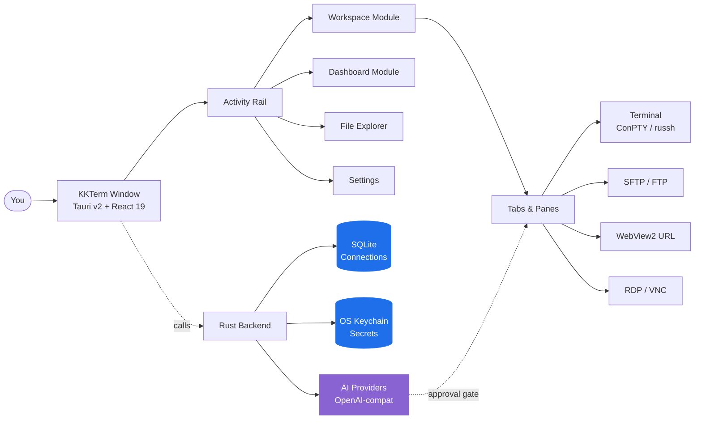

<p align="center">
  
</p>

<h1 align="center">KKTerm</h1>

<p align="center">
  <strong>Workspace สำหรับแอดมิน Windows แบบ native ที่ยุค AI tools ลืมสร้าง — terminal, SSH, SFTP, RDP/VNC, dashboard, และ AI ที่สร้าง widget เครื่องมือของคุณเอง</strong>
</p>

<p align="center">
  <em>เพราะ taskbar ของคุณไม่ควรดูเหมือนตู้สล็อตในลาสเวกัส</em>
</p>

<p align="center">
  <sub>ตั้งชื่อตาม <strong>乖乖 (Kuāi Kuāi / กวาย กวาย)</strong> ขนมข้าวโพดรสมะพร้าวสีเขียวที่ sysadmin ชาวไต้หวันวางไว้บนเซิร์ฟเวอร์เพื่อให้มันอยู่ดีมีสุข หวังว่าแอปนี้จะสมควรได้นั่งบน rack ของคุณเช่นกัน</sub>
</p>

<p align="center">
  <a href="https://github.com/ryantsai/KKTerm/stargazers">
    
  </a>
  <a href="https://github.com/ryantsai/KKTerm/network/members">
    
  </a>
  <a href="https://github.com/ryantsai/KKTerm/issues">
    
  </a>
  <a href="https://github.com/ryantsai/KKTerm/blob/main/LICENSE">
    
  </a>
  <br />
  
  
  
  
  
  <br />
  <sub>
    <a href="README.md">English</a> ·
    <a href="README.zh-TW.md">繁體中文</a> ·
    <a href="README.zh-CN.md">简体中文</a> ·
    <a href="README.ja.md">日本語</a> ·
    <a href="README.ko.md">한국어</a> ·
    <a href="README.fr.md">Français</a> ·
    <a href="README.de.md">Deutsch</a> ·
    <a href="README.es.md">Español</a> ·
    <a href="README.es-MX.md">Español (MX)</a> ·
    <a href="README.it.md">Italiano</a> ·
    <a href="README.pt-BR.md">Português (BR)</a> ·
    <strong>ไทย</strong> ·
    <a href="README.id.md">Bahasa Indonesia</a> ·
    <a href="README.vi.md">Tiếng Việt</a>
  </sub>
</p>

---

## Pitch สั้น ๆ (45 วินาที)

คุณเป็น sysadmin / DevOps / homelab / vibe-coder ตอนนี้คุณมี:

- Terminal emulator
- SSH client แยกต่างหาก (พร้อม profile list ที่คุณใช้เวลาทั้งวีกเอนด์สร้าง)
- SFTP client จากปี 2007 ที่ยังไม่ยอมตาย
- Remote Desktop ใน window ที่คุณวางผิดจอเป็นประจำ
- VNC viewer สำหรับกล่อง Linux ตัวนั้นโดยเฉพาะ
- Browser tab สำหรับ admin UI ของ router
- Session `aider` / `claude` / `codex` ที่รันบน remote dev box แล้วหลุดทุกครั้งที่ Wi-Fi จาม
- โพสต์อิทที่มีรหัสผ่านเขียนไว้ *(ไม่เป็นไร เราจะไม่บอกใคร)*

**KKTerm คือหน้าต่างเดียวสำหรับทั้งหมดนั้น** Native บน Windows — *โดยตั้งใจ ในขณะที่เครื่องมือ dev ส่วนใหญ่ออก mac ก่อนแล้วมองข้าม OS ของคุณเหมือนหัวข้อย่อย* — เขียนด้วย Rust + Tauri v2, ติดตั้งด้วยไฟล์เดียว และไม่ยอมโทรหาบ้าน

พร้อมสิ่งที่คุณไม่รู้ว่าอยากได้อีกสองสามอย่าง:

- **Dashboard** ที่คุณบอก AI ว่า *"สร้าง widget ping router ทุก 30 วินาทีให้หน่อย"* แล้วมันก็โผล่ขึ้น sandbox บน grid ของคุณเลย
- **SSH pane ที่ auto-attach เข้า tmux session ที่ตั้งชื่อไว้** ให้ session remote `claude` / `codex` / `aider` ของคุณรอดจากทุก Wi-Fi tantrum ที่แล็ปท็อปพ่น
- Nine **animated canvas background** (ใช่ รวม `matrix` ด้วย) สำหรับ dashboard เพราะเราไม่ได้ถือตัวเกินไปขนาดนั้น

แถม AI assistant ยังเปลี่ยนประโยคเดียวให้เป็นเครื่องมือ dashboard เล็ก ๆ ที่คุณใช้งานต่อจริงได้

> ⭐ **ถ้านี่ฟังดูเหมือนแอปที่คุณตั้งใจจะสร้างมาหกปีแล้ว — กด star ให้ repo หน่อยเพื่อให้รู้ว่ามีคนดูอยู่ มันช่วยได้จริง ๆ**

---

## ทำไมถึงชื่อ "KKTerm"?

เดินเข้าไปใน data center ของไต้หวันสักแห่งแล้วมองไปที่ด้านบนของ rack โรงงาน TSMC, ห้องควบคุม Taipei Metro, ห้อง server ของ Cathay Bank, อุปกรณ์ switching ของ Chunghwa Telecom — คุณจะเห็นถุงสีเขียวเล็ก ๆ ของ 乖乖 (Kuāi Kuāi / กวาย กวาย) ขนมข้าวโพดรสมะพร้าวจากยุค 1960s

ชื่อแปลตรง ๆ ว่า **"เชื่องๆ ดีๆ"** **"อยู่นิ่ง ๆ"** ธรรมเนียม IT นั้นตรงไปตรงมาและจริงจังมาก:

- **ต้องเป็นรสเขียว (มะพร้าว)** รสเหลือง (แกง) หมายถึง *อยู่บ้านเสีย*; รสแดง (เผ็ด) ทำให้เซิร์ฟเวอร์โกรธ ต้องเขียวเท่านั้น
- **ต้องยังไม่หมดอายุ** กวาย กวายเก่าจะย้อนมาหลอกหลอนคุณ วิศวกรสลับถุงใหม่อย่างสม่ำเสมอ
- **ต้องมองเห็นได้** เซิร์ฟเวอร์ต้องรู้ว่ามันอยู่ที่นั่น
- **ห้ามกิน** ถุงนั้นกำลังปฏิบัติหน้าที่อยู่

ระบบที่ใหญ่ที่สุด น่าเบื่อที่สุด และหมกมุ่นกับ uptime มากที่สุดในเอเชียทำงานอยู่กับถุงข้าวโพดพองติดอยู่ที่ chassis มันได้ผลเพราะคนที่ดูแลระบบเหล่านั้นเชื่อว่ามันได้ผล ซึ่งเป็นคำอธิบายวัฒนธรรม IT ที่ซื่อสัตย์ที่สุดเท่าที่จะมีได้

**KKTerm** คือ **Kuai Kuai Term** — admin workspace ที่มุ่งมั่นทำหน้าที่เดียวกับขนมนั้น: นั่งอยู่เงียบ ๆ ข้างเครื่องสำคัญของคุณและช่วยให้ทุกอย่างเป็นระเบียบ Local-first ไม่มี telemetry AI ที่ต้องขออนุมัติ ซอฟต์แวร์แบบน่าเบื่อ น่าเชื่อถือ

เรายังส่งถุงกวาย กวายจริง ๆ มาพร้อม installer ไม่ได้ นั่นเป็นไอเทมของ v2

---

## ดูมันขยับ

<!--
  TODO: Replace this placeholder with a real demo GIF.
  Recommended:
    - 5-10 seconds, looped
    - Show: open a Connection -> split a pane -> SFTP upload -> AI proposes a command
    - Target ~5 MB so GitHub renders it inline without lazy-loading
  Suggested path: docs/assets/demo.gif
  Then change the  below to: src="docs/assets/demo.gif"
-->

<p align="center">
  <a href="https://github.com/ryantsai/KKTerm">
    
  </a>
</p>

<p align="center"><sub><em>(Demo GIF ไปอยู่ที่นี่ ภาพหนึ่งภาพมีค่าเท่ากับ bullet point พันตัว แล้วเราหมด bullet point แล้ว)</em></sub></p>

---

## ทำไมคนถึงเปิดมันทิ้งไว้ทั้งวัน

### Windows-first โดยตั้งใจ

มองดูแนวโน้ม dev tooling ปี 2026 สักครั้ง Claude Code: ออก mac/linux ก่อน Windows คือ "ใช้ WSL ไป" Codex CLI: เหมือนกัน `aider`, `gemini-cli`, ครึ่งหนึ่งของ Homebrew, TUI ใหม่ ๆ ทุกตัว: mac/linux ก่อน ผู้ใช้ Windows ได้ comment `# Windows: contributions welcome` ใน README กับ fish-completion script ที่รันไม่ได้

ในขณะเดียวกัน คนที่ทำให้บริษัทออนไลน์อยู่ได้จริง ๆ — IT องค์กร, MSP, ใครก็ตามที่รัน Hyper-V หรือ AD หรือ SCCM หรือ IIS หรือ domain controller ที่เก่ากว่า intern บางคน — ยังนั่งอยู่หน้า Windows box และสงสัยว่าทำไมเครื่องมือใหม่ทุกตัวทำเหมือน OS ของพวกเขาเป็นความไม่สะดวก

**KKTerm คือด้านตรงข้าม** เราสร้าง native Windows ก่อน แล้ว macOS / Linux ก็ตามมา นั่นหมายความว่าเราได้ใช้ Windows API ที่สำคัญจริง ๆ แทนที่จะทาทับด้วย portability layer:

- **ConPTY** สำหรับ local shell — pseudo-console Windows จริง ๆ ไม่ใช่ translation shim PowerShell, `cmd.exe`, WSL distro, ทั้งหมดรันเป็น PTY จริงพร้อม focus, resize, และ VT sequence handling ที่ตรงกับพฤติกรรมของ platform
- **WebView2** สำหรับ UI ทั้งหมดและ **Connection** URL แบบ embedded — Chromium in-process ที่ใช้ system runtime ซึ่งเป็นหนึ่งในเหตุผลที่ installer เล็กและเปิดเร็ว
- **Microsoft RDP ActiveX (`mstscax.dll`)** สำหรับ RDP — *ตัวที่ Microsoft ส่งมาจริง ๆ* ตัวควบคุมเดียวกับ Remote Desktop Connection (`mstsc.exe`) ไม่ใช่ reimplementation จากบุคคลที่สาม ไม่ใช่ FreeRDP ห่อด้วยอะไรสักอย่าง คนใช้ RDP จะรู้สึกได้ภายในห้าวินาที
- **Windows Credential Manager** สำหรับทุก secret SSH password, FTP password, API key, URL Connection credential — อยู่ใน OS keychain และ `credwiz.exe` สามารถ audit ได้
- **NSIS current-user installer** พร้อม SHA-256 คู่กัน, native tray menu, Don't-Sleep power assertion, host CPU/RAM/network sampling, native Tauri context menu พร้อมไอคอน PNG จริง, native Open/Save dialog ไม่มีตัวไหนที่ mock
- **WSL เป็น shell ชั้นหนึ่ง ไม่ใช่ workaround** เปิด Ubuntu ข้าง PowerShell pane ข้าง SSH session ข้าง RDP **Tab** ในหน้าต่างเดียวกัน

บิลด์ macOS และ Linux อยู่ใน roadmap และจะได้รับการดูแลเหมือนกัน แต่ถ้าคุณรอใครมาสร้าง Windows admin tool ที่ดีก่อนแทนที่จะหลัง — นั่นคือข้อตกลง

### Local-first แปลว่า local จริง ๆ

**Connection** ที่บันทึกไว้อยู่ใน SQLite file บนเครื่องของคุณ Password อยู่ใน **Windows Credential Manager** ไม่ใช่ใน JSON ข้าง binary แอปไม่ส่ง analytics ไม่โทรหาบ้านตอน startup และไม่ต้องการ cloud account เพื่อเปิด ไม่มี "sign in to sync" เพราะไม่มี sync

ถ้าสาย LAN ของคุณไฟไหม้ KKTerm ก็ยังเปิดได้

### Workspace เดียว ทุก connection type

| คุณอยากจะ… | KKTerm มี |
| --- | --- |
| เปิด local PowerShell / cmd / WSL shell | Local terminal **Session** พร้อม ConPTY |
| SSH เข้า server | Native `russh` พร้อม agent / key / password auth, host-key trust flow, ProxyJump, port forwarding |
| Browse file บน server นั้น | SFTP เปิดจาก SSH **Connection**, dual-pane, recursive transfer, chmod/chown |
| FTP เข้า NAS จากปี 2012 | FTP / FTPS **Connection** ในรูปแบบ browser เหมือน SFTP |
| Telnet เข้าอุปกรณ์โบราณ | ใช่แล้ว Telnet อยู่ในนั้นด้วย |
| คุยกับ serial port | Serial **Connection** แบบ COM port + baud ไม่ต้องลง tool เพิ่ม |
| Remote เข้า Windows box | Native RDP ผ่าน Microsoft ActiveX control (ของจริง ไม่ใช่ clone) |
| VNC เข้า Pi | Rust `vnc-rs` framebuffer render ตรงเข้า workspace |
| เปิด web UI ของ router | Embedded WebView2 **URL Connection** พร้อม credential fill |
| ดู CPU บน host | Status bar แบบ live + **Dashboard** module พร้อม widget drag/resize |

ทั้งหมดคือแอปเดียวกัน หน้าต่างเดียวกัน hotkey เดียวกัน theme เดียวกันที่หวังว่าจะไม่ทำให้ตาพัง

### Terminal ที่ไม่เสียสติ

- แบ่ง pane ใน **Tab** ได้
- xterm.js rendering เร่งด้วย WebGL ถ้าทำไม่ได้ก็ fallback อย่างสง่างาม
- ค้นหาใน scrollback
- SSH pane พร้อม tmux ที่ attach เข้า session ต่อ pane แบบ stable ได้ ให้การ reconnect หมายถึง *การกลับมาต่อจริง ๆ* ไม่ใช่ "เริ่มใหม่และแกล้งทำเป็นว่าชั่วโมงที่แล้วไม่เคยเกิดขึ้น"
- การสลับ **Tab** **ไม่** kill **Session** การปิด **Tab** ถึงจะ kill ความแตกต่างนี้เคยเป็นสงครามศาสนาภายใน เราชนะ

### AI Assistant ที่สร้างเครื่องมือของคุณ

Demo "AI ใน terminal" ส่วนใหญ่หยุดอยู่ที่ chat แต่ assistant ของ KKTerm ยังสร้าง widget dashboard เล็ก ๆ ที่คงอยู่และเข้ากับวิธีทำงานจริงของคุณได้ด้วย ส่วนที่อันตรายยังถูกคุมไว้หลังสวิตช์สองตัว:

- **Tool family** (Dashboard / Connections / Live Sessions) — toggle เปิด/ปิดแต่ละหมวด
- **Permission mode** ใน composer — `Prompt` (ค่าเริ่มต้น ถามทุกครั้ง) หรือ `Allow All` (คุณเป็นผู้ใหญ่ คุณเซ็น waiver แล้ว)

คุยกับ OpenAI, Anthropic, OpenRouter, DeepSeek, Grok, Azure OpenAI, LiteLLM, GitHub Copilot, Ollama, NVIDIA, หรืออะไรก็ตามที่ compatible กับ OpenAI API key ไปอยู่ใน OS keychain Model ที่เสนอ `rm -rf` จะถูกจัดว่าอันตรายและต้องการการอนุมัติจากมนุษย์อย่างชัดเจน AI ไม่สามารถรัน command ที่ทำลายข้อมูลแบบเงียบ ๆ ได้เพราะใครบางคนฉลาดแกมโกงด้วย prompt injection ใน man page

### Dashboard ที่ไม่แกล้งทำเป็น Grafana

**Dashboard** module คือ grid 12-column แบบ drag/resize ของ widget instance ไม่ได้ใช้สำหรับ observability ระดับ petabyte — มันสำหรับ "ฉันอยากมีปุ่ม launch แอปโปรดห้าตัวและ panel แสดง uptime ของ SSH host *ข้าง ๆ* แชทของฉัน"

#### Widget ที่ AI สร้าง — บอกมา แล้วได้รับ

นี่คือส่วนที่เราตื่นเต้นจริง ๆ คุณไม่ต้องเลือกจาก marketplace และไม่ต้องเขียน JavaScript คุณ **บอก AI assistant ว่าต้องการอะไร** แล้วมันสร้าง widget ขึ้นบน dashboard ของคุณเลย:

> *"เพิ่ม widget แสดง commit ล่าสุด 5 รายการบน repo หลักของฉันเป็นรายการ"*
> *"สร้าง sticky-note widget ที่เก็บ cheat sheet on-call ของฉัน"*
> *"สร้าง widget ping home router ทุก 30 วินาทีและแสดงสีเขียว/แดง"*
> *"ฉันต้องการ stopwatch ตกแต่งสไตล์ตามใจเลย"*

สองรูปแบบ:

- **Content widget** — declarative JSON: markdown, kv list, checklist, stat ตัวใหญ่หนึ่งตัว ปลอดภัยโดยการออกแบบ ไม่มี script คำขอส่วนใหญ่แบบ "ฉันแค่อยากมีมันบน dashboard" ลงเอยที่นี่
- **Script widget** — JavaScript ที่รันใน `iframe srcdoc` sandbox แบบ isolated พร้อม permission ที่ประกาศไว้อย่างชัดเจน (`network` allowlist, `pollSeconds` budget) AI เขียน script คุณอนุมัติ permission widget รันใน box ที่ไม่สามารถเข้าถึงส่วนอื่นของแอปได้

Widget ทุกตัวที่คุณเก็บไว้เป็นของคุณ มันอยู่ใน SQLite ข้าง **Connection** พร้อม visual preset ของตัวเอง (`panel` / `ambient` / `hero`), accent color, icon, และ title หลาย instance ของ widget เดียวกันสามารถอยู่ร่วมกันได้พร้อมขนาดและสไตล์ที่ต่างกันสิ้นเชิง ลบด้วย right-click เมื่อความมหัศจรรย์หมดอายุ

#### Animated dashboard background (เพราะเราอยากทำ)

Dashboard มี nine canvas-animated background ให้เลือกต่อ **Dashboard View**:

| อารมณ์ | Background |
| --- | --- |
| เงียบสงบ | `aurora`, `raindrops` |
| อวกาศ | `starfield`, `nebula` |
| อบอุ่น | `embers`, `lava` |
| geek | `matrix`, `synthwave` |
| คาดเดาไม่ได้ | `confetti` |

รันบน `requestAnimationFrame` ร่วมกันตัวเดียวและเคารพ window focus ดังนั้นแทบไม่กินทรัพยากรเมื่อคุณไปทำอย่างอื่น จับคู่ `matrix` กับ AI assistant เพื่อ vibe ที่บอกว่า "ฉัน productive มากและอาจจะอยู่ในหนัง Wachowski ด้วย" หรือเลือก `mist` แล้วดูเป็นคนจริงจัง เราไม่ตัดสินทั้งสองตัวเลือก

### รัน AI coding agent บน server อย่างถูกต้อง

นี่คือ feature ที่สองที่คนตกหลุมรัก SSH terminal ของ KKTerm สามารถ launch ตรงเข้า **named tmux session** บน remote host ได้ — โดยค่าเริ่มต้นคือ id ที่สร้างอัตโนมัติแบบ friendly เช่น `kkterm-cockpit001` ที่รอดจากการ reconnect:

- เปิด SSH **Connection** พร้อม tmux ที่เปิดใช้งาน
- ใน pane เริ่ม `claude`, `codex`, `aider`, `gemini-cli`, `cursor-agent`, หรือ coding agent ที่รันนานที่คุณชอบ พวกมันเป็นแอป TUI full-screen; tmux คือที่ที่พวกมันอยากอยู่
- ปิดแล็ปท็อป เปิดใหม่ Pane จะ re-attach เข้า tmux session เดิมอย่างเงียบ ๆ Agent ยังรันอยู่ ยังมี scrollback อยู่ ยังทำอะไรอยู่ตรงกลางนั้น
- Wi-Fi กระพริบบน SSH transport? KKTerm พยายาม reattach เงียบ ๆ แบบ bounded เข้า tmux id เดิมโดยไม่รบกวนคุณ
- อยากให้ AI assistant เห็นว่า agent ทำอะไรอยู่? "Add terminal buffer to context" เรียก `capture_tmux_pane` ผ่าน SSH และดึง tmux scrollback ทั้งหมด — ไม่ใช่แค่ที่แสดงบนหน้าจอ แต่ session ทั้งหมด — เข้าสู่การสนทนา Local assistant ของคุณตอนนี้สามารถวิเคราะห์งานของ remote agent ได้แล้ว

ถ้าคุณเคยสูญเสีย `aider` session หกชั่วโมงเพราะ Wi-Fi โรงแรมห่วย feature เดียวนี้คุ้มค่าแอปแล้ว แอปฟรีอยู่แล้ว feature นั้นก็ยังคุ้มค่า

---

## มันทำงานร่วมกันอย่างไร



รูปแบบที่สำคัญ: ข้อมูลที่บันทึกถาวร (**Connection**) แยกจาก live runtime state (**Session**) ซึ่งแยกจาก UI container (**Tab**) การปิด **Tab** จบ **Session** การสลับ **Tab** ไม่จบ นี่คือกฎที่ทำให้แอปไม่เสียสติ

---

## แผนที่ Feature ปัจจุบัน

| หมวด | ที่ implement แล้ววันนี้ |
| --- | --- |
| **Connections** | tree ที่พึ่ง SQLite, folder/subfolder, ค้นหา, drag/drop order, เปลี่ยนชื่อ, duplicate, ลบ, **Quick Connect**, icon custom, rail shortcut แบบ pinned/active |
| **Terminal** | Local shell, SSH, Telnet, Serial, split pane, xterm.js + WebGL แบบ opportunistic, scrollback search, local startup directory/script |
| **SSH** | Native `russh`, agent/key/password auth, host-key trust flow, optional system SSH fallback, ProxyJump, port forwarding, **auto-named tmux session (`kkterm-<scifi-name><n>`) พร้อม silent reattach เมื่อ transport มีปัญหา** — เหมาะมากสำหรับ remote coding agent ที่รันนาน (Claude Code, Codex, aider, ฯลฯ) |
| **SFTP / FTP** | SSH-launched SFTP พร้อม FTP/FTPS **Connection**, dual-pane browser, recursive transfer, queue/cancel/clear history, conflict, properties, chmod/chown ตามที่รองรับ |
| **URL WebView** | Embedded WebView2 URL **Session**, navigation toolbar, favicon capture, website credential metadata/fill ที่บันทึกไว้, data partition metadata |
| **Remote Desktop** | RDP ผ่าน Windows ActiveX พร้อม geometry-scoped overlay parking; VNC ผ่าน `vnc-rs` framebuffer render ใน workspace canvas |
| **Dashboard** | Durable view, widget instance, edit mode, drag/resize, App Launcher, **AI-authored content/script widget** (declarative JSON หรือ sandboxed iframe JS พร้อม permission), per-widget preset / accent / icon / title, **9 animated canvas background** (aurora, raindrops, starfield, nebula, embers, lava, matrix, synthwave, confetti) |
| **AI Assistant** | Streaming chat, OpenAI-compatible runtime, provider registry, command proposal safety classification, screenshot/context attachment, **Dashboard widget authoring (content + sandboxed script)**, **tmux pane capture** เป็น conversation context สำหรับ remote session, **Connection** management tool, และ live **Session** tool สำหรับ terminal, RDP/VNC, และ SFTP/FTP |
| **Settings** | General, Appearance, Credentials, AI, SSH, Terminal, URL, RDP, VNC, Dashboard, About; custom UI font; minimize-to-tray; Don't Sleep; backup/import |
| **Localization** | i18next UI พร้อม English source และ dynamic locale bundle: zh-TW, zh-CN, ja, ko, fr, de, es, es-MX, it, pt-BR, th, id, vi |

### AI Provider

OpenAI · Anthropic · OpenRouter · DeepSeek · Grok · Azure OpenAI · LiteLLM · GitHub Copilot · Ollama · NVIDIA · ทุก OpenAI-compatible endpoint

Provider metadata อยู่ใน [`src/ai/providerRegistry/`](src/ai/providerRegistry/); Rust adapter ใน [`src-tauri/src/ai/providers/`](src-tauri/src/ai/providers/) API key ผ่าน OS keychain ไม่เคยผ่าน SQLite

---

## เริ่มต้นเร็ว

คุณต้องการ:

- **Windows** (platform หลักที่รองรับ)
- **Node.js + npm**
- **Rust toolchain**
- **Tauri v2 prerequisites for Windows** รวมถึง **WebView2**

```bash
npm install
npm run tauri dev
```

ควรจะได้ native window จริง ๆ ถ้าได้ stack trace แทน กรุณา file an issue — เราชอบ repro ที่ดี

### ตรวจสอบทั่วไป

```bash
npm run check                                              # TypeScript
npm run build                                              # Vite build
cargo check --manifest-path src-tauri/Cargo.toml           # Rust
cargo test  --manifest-path src-tauri/Cargo.toml           # Rust tests
```

### Build Windows installer

```bash
npm run package:installer
```

Script installer เขียน `artifacts/kkterm-<version>-windows-x64-setup.exe` และไฟล์ `.sha256` คู่กัน ปัจจุบัน **ยังไม่ได้ sign** — release signing อยู่ใน roadmap แต่จนกว่านั้น antivirus ของคุณอาจจ้องมองอย่างเข้มงวด เรื่องปกติ

---

## สิ่งที่ KKTerm ไม่ใช่

รายการสั้น ๆ เพราะความซื่อสัตย์สร้างความไว้วางใจ:

- **ไม่ใช่ cloud product** ไม่มี sync ไม่มี team account ไม่มี SaaS tier ถ้าคุณเห็น dialog "Sign in to KKTerm" บางอย่างเกิดขึ้นอย่างหายนะ
- **ไม่ได้แกล้งทำเป็น cross-platform** เราเป็น Windows-first โดยตั้งใจ; macOS และ Linux อยู่ใน roadmap และจะใช้ Tauri v2 shell เดิม ถ้าคุณต้องการ mac-first tool วันนี้ คุณมีตัวเลือกหลายร้อยตัว เรากำลังสร้างตัวที่ Windows admin รอคอยอย่างเงียบ ๆ
- **ไม่ใช่ autonomous AI agent** assistant เสนอ มนุษย์ตัดสินใจ `Allow All` คือตัวเลือกที่คุณทำ ไม่ใช่ค่าเริ่มต้น
- **ไม่ใช่ตัวแทน Grafana / Datadog** Dashboard สำหรับ personal control surface ไม่ใช่ observability ระดับ 10k host
- **ไม่ใช่ Kubernetes IDE** มันเป็น terminal-first admin workspace กรุณาอย่าขอให้มัน render Helm chart

ถ้าสิ่งใดสิ่งหนึ่งเหล่านั้น *เป็น* dealbreaker — โอเค เจอกันใน v2

---

## Native Debugging

ใช้ Tauri runtime จริงสำหรับการ validate:

```bash
npm run tauri dev
```

Vite browser preview มีประโยชน์สำหรับ frontend inspection บางส่วน แต่มัน **ไม่ได้** host WebView2 จริง, ConPTY, RDP ActiveX, VNC framebuffer, keychain, หรือ native menu surface ถ้า feature แตะสิ่งใดสิ่งหนึ่งเหล่านั้น validate ใน desktop runtime จริง

VS Code users: launch config `Run KKTerm exe` เริ่ม `src-tauri/target/debug/kkterm.exe` พร้อม `RUST_BACKTRACE=1` config `Attach KKTerm WebView2` คู่กันให้ DevTools ใน WebView2 host จริง

---

## ข้อจำกัดปัจจุบัน (ใช่ เรารู้)

- Installer ยังไม่ได้ sign ปัจจุบัน Update check ปิดอยู่จนกว่าจะ configure release signing
- SFTP over ProxyJump ยังไม่รองรับใน native SFTP path
- File transfer resume, folder sync/diff, archive/extract, และ remote editing ถูก defer ออกไป
- SSH config import implement แล้วแต่ยังไม่ expose user-facing entry ใน Settings
- RDP และ VNC กำลัง ship; clipboard/device sync ที่ดีกว่าและ quality control ยังพัฒนาต่อ
- macOS และ Linux build อยู่ใน roadmap กำลังมา และจะทำอย่างถูกต้อง — ไม่รีบออกมาเป็น port แบบ "เราก็ทำงานได้อยู่บ้างนะ"
- AI assistant เสนอและสามารถใช้ tool ที่เปิดใช้งานตาม permission boundary ที่กำหนด — กรุณาอย่าปฏิบัติกับมันเหมือน robot ไร้คนดูแล มันไม่รู้จริง ๆ ว่า CEO ของคุณต้องการอะไร

---

## Roadmap (เวอร์ชั่นสั้น)

- macOS + Linux build
- Signed installer + auto-update
- SFTP over ProxyJump ใน native path
- File transfer resume, folder sync, archive/extract
- RDP clipboard/device redirection ที่ดีกว่า
- **Dashboard** widget built-in เพิ่มเติม (และ public schema สำหรับ AI-authored)

เวอร์ชั่นเต็มและอัพเดตบ่อย: [`docs/ROADMAP.md`](docs/ROADMAP.md)

---

## การมีส่วนร่วม

เราอยากได้มือช่วย จริง ๆ แม้แต่เรื่องเล็กน้อยก็มีความหมาย:

- **ลอง dev build** แล้ว file an issue เมื่อรู้สึกว่ามีอะไรผิด "รู้สึกแปลก" คือ bug report ที่ถูกต้อง เราจะขุดหาสาเหตุด้วยกัน
- **แปล locale** English เป็น source of truth ที่ [`src/i18n/locales/en.json`](src/i18n/locales/en.json); locale อื่นอีก 12 ตัวอยู่ข้าง ๆ และโหลดตาม demand string ที่ยังค้างอยู่ติดตามต่อ key ใน [`docs/localization_todo/`](docs/localization_todo/) — เลือกตัว แปล ลบไฟล์
- **เพิ่ม Dashboard widget** Built-in widget อยู่ใน [`src/dashboard/widgets/`](src/dashboard/widgets/) เลือก idea เล็ก ๆ ship มัน เรียนรู้ pattern
- **ทำให้ AI tool surface แน่นขึ้น** Provider adapter อยู่ใน [`src-tauri/src/ai/providers/`](src-tauri/src/ai/providers/); frontend registry อยู่ใน [`src/ai/providerRegistry/`](src/ai/providerRegistry/)
- **ปรับปรุง manual** End-user doc อยู่ใน [`docs/manual/`](docs/manual/) หนึ่ง chapter ต่อ UI module ถ้าคุณใช้ feature แล้ว doc ไม่ช่วย PR ที่แก้ปัญหานั้นถือว่าทองคำ

Setup เต็ม, project layout, PR checklist, และรายการ "กรุณาอย่าทำลายสิ่งเหล่านี้" อยู่ใน [`CONTRIBUTING.md`](CONTRIBUTING.md) highlight 30 วินาที:

- **อ่าน [`CONTEXT.md`](CONTEXT.md) ก่อนเปลี่ยนชื่อ term ที่ user เห็น** **Connection**, **Session**, **Tab**, และ **Quick Connect** มีความหมายเฉพาะ กรุณาอย่าเบี่ยงเบน
- **ทุก string ที่ user เห็นผ่าน `t()`** ไม่มี text ภาษาอังกฤษโล่ง ๆ ใน JSX
- **ไม่มี frontend close hook** Tauri v2's title-bar close พังด้วย `onCloseRequested` pattern มาครึ่งโหลครั้งแล้ว ตอนนี้เรามี shape ที่ทำงานได้ กรุณาอย่า reintroduce
- **รัน check** (`npm run check && npm run build && cargo check && cargo test`) ก่อนเปิด PR

หา entry point? กรอง open issue ด้วย [`good first issue`](https://github.com/ryantsai/KKTerm/issues?q=is%3Aissue+is%3Aopen+label%3A%22good+first+issue%22) หรือ [`help wanted`](https://github.com/ryantsai/KKTerm/issues?q=is%3Aissue+is%3Aopen+label%3A%22help+wanted%22) ถ้ายังไม่มีติด tag เปิด issue อธิบายว่าอยากทำอะไรแล้วเราจะช่วย scope

---

## เอกสาร Project

- [Product context](CONTEXT.md) — ภาษา domain ที่คุณควรใช้ให้ตรงกัน
- [Architecture](docs/ARCHITECTURE.md) — module map, วางโค้ดใหม่ที่ไหน
- [Roadmap](docs/ROADMAP.md)
- [Dashboard architecture](docs/DASHBOARD.md)
- [AI provider guide](docs/AI_PROVIDERS.md)
- [Performance notes](docs/PERFORMANCE.md)
- [Release notes and gates](docs/RELEASE.md)

---

## Stack

Rust · Tauri v2 · React 19 · TypeScript · Vite · Tailwind CSS · Zustand · xterm.js · SQLite · WebView2 · `russh` · `russh-sftp` · `vnc-rs` · `suppaftp` · OS keychain storage

---

## Star History

<a href="https://www.star-history.com/#ryantsai/KKTerm&Date">
  <picture>
    <source media="(prefers-color-scheme: dark)" srcset="https://api.star-history.com/svg?repos=ryantsai/KKTerm&type=Date&theme=dark" />
    <source media="(prefers-color-scheme: light)" srcset="https://api.star-history.com/svg?repos=ryantsai/KKTerm&type=Date" />
    
  </picture>
</a>

ถ้าคุณอ่านมาถึงตรงนี้แล้วยังไม่ได้กด star — รอเชิญส่วนตัวอยู่หรือไง? นี่คือเชิญส่วนตัวแล้ว

⭐ **[Star KKTerm บน GitHub](https://github.com/ryantsai/KKTerm)** — ใช้แค่คลิกเดียวและทำให้ maintainer ดีใจทั้งสัปดาห์ คิดว่ามันเหมือนถุง乖乖ดิจิทัลบน rack

---

## License

MIT ดู [LICENSE](LICENSE) ใช้มัน, fork มัน, ship มัน, วางมันไว้ใน homelab ที่ไม่มีใครหาเจอ — นั่นคือข้อตกลง
