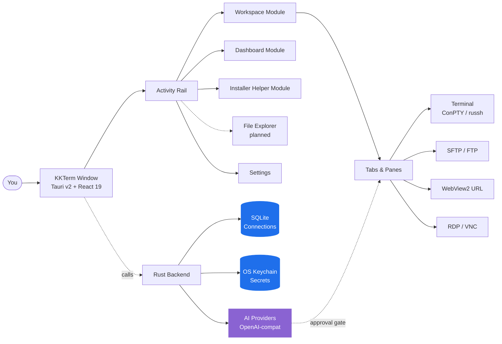

<p align="center">
  
</p>

<h1 align="center">KKTerm</h1>

<p align="center">
  <strong>Không gian quản trị Windows native mà kỷ nguyên AI-tools đã quên xây — terminal, SSH, SFTP, RDP/VNC, dashboard, và một AI build các widget công cụ của riêng bạn.</strong>
</p>

<p align="center">
  <em>Vì thanh taskbar của bạn không nên trông như máy đánh bạc ở Vegas.</em>
</p>

<p align="center">
  <sub>Đặt tên theo <strong>乖乖 (Kuāi Kuāi)</strong>, gói snack bắp vị dừa màu xanh mà các sysadmin Đài Loan đặt lên máy chủ để cầu cho chúng "ngoan". Hy vọng app này cũng xứng đáng có một chỗ trên rack.</sub>
</p>

<p align="center">
  <strong><a href="https://github.com/ryantsai/KKTerm/releases/latest">Tải trình cài đặt Windows mới nhất (.exe)</a></strong>
</p>

<p align="center">
  <a href="https://github.com/ryantsai/KKTerm/stargazers">
    
  </a>
  <a href="https://github.com/ryantsai/KKTerm/network/members">
    
  </a>
  <a href="https://github.com/ryantsai/KKTerm/releases">
    
  </a>
  <a href="https://github.com/ryantsai/KKTerm/issues">
    
  </a>
  <a href="https://github.com/ryantsai/KKTerm/blob/main/LICENSE">
    
  </a>
  <br />
  
  
  
  
  
  <br />
  <sub>
    <a href="README.md">English</a> ·
    <a href="README.zh-TW.md">繁體中文</a> ·
    <a href="README.zh-CN.md">简体中文</a> ·
    <a href="README.ja.md">日本語</a> ·
    <a href="README.ko.md">한국어</a> ·
    <a href="README.fr.md">Français</a> ·
    <a href="README.de.md">Deutsch</a> ·
    <a href="README.es.md">Español</a> ·
    <a href="README.es-MX.md">Español (MX)</a> ·
    <a href="README.it.md">Italiano</a> ·
    <a href="README.pt-BR.md">Português (BR)</a> ·
    <a href="README.th.md">ไทย</a> ·
    <a href="README.id.md">Bahasa Indonesia</a> ·
    <strong>Tiếng Việt</strong>
  </sub>
</p>

---

## Pitch trong 45 giây

Bạn là sysadmin / DevOps / dân homelab / vibe-coder. Hiện tại bạn đang có:

- Một terminal emulator
- Một SSH client riêng (với danh sách profile bạn phải dành nguyên một cuối tuần để dựng lên)
- Một SFTP client từ năm 2007 mà không hiểu sao vẫn chạy
- Remote Desktop nằm trong một cửa sổ bạn cứ lạc mất sang sai màn hình
- Một VNC viewer chỉ để dùng cho đúng một con Linux nào đó
- Một tab trình duyệt mở trang admin của router
- Một phiên `claude` / `codex` đang chạy trên dev box từ xa, rớt mạng mỗi khi Wi-Fi của bạn hắt hơi
- Một tờ giấy nhớ ghi mật khẩu *(yên tâm, chúng tôi không nói ra đâu)*

**KKTerm gom tất cả vào một cửa sổ.** Native trên Windows — *cố tình, trong khi cả thế giới dev tools còn lại ra mac-first và coi OS của bạn như một footnote* — viết bằng Rust + Tauri v2, đóng gói thành một installer duy nhất, và từ chối "gọi điện về nhà".

Cộng thêm vài thứ bạn còn không biết là mình muốn:

- Một **Dashboard** nơi bạn bảo AI *"build cho tôi một widget ping router mỗi 30 giây"* và nó hiện ra ngay trên grid của bạn, chạy trong sandbox.
- **SSH pane tự động attach vào tmux session có tên** để phiên `claude` / `codex` từ xa sống sót qua mọi cơn dỗi hờn của Wi-Fi laptop.
- Một **widget theo dõi mức dùng AI Coding** hiển thị quota Claude Code và Codex của bạn — cửa sổ 5 giờ, cửa sổ tuần, gói hiện tại, email tài khoản — trên **Dashboard** và status bar, để bạn không còn bị đập vào tường rate-limit lúc 3 giờ sáng.
- Một Module **Installer Helper** phát hiện, cài đặt, cập nhật, gỡ cài đặt và launch một catalog công cụ developer Windows được tuyển chọn — Node, Python, Docker, WSL, AI coding CLI và các tiện ích nhỏ mà bình thường bạn phải lục qua nhiều tab trình duyệt.
- Một **MCP server tích hợp sẵn** (`kkterm-cli`) cho phép các coding agent bên ngoài (Claude Code, Codex, Copilot, Antigravity, OpenCode) điều khiển Workspace và Dashboard của bạn — list Connection, đọc buffer terminal, đặt widget — qua bề mặt tool được tuyển chọn và có safety gate. AI-tới-AI, trên máy bạn, không qua relay cloud.
- Hai mươi mốt nền **canvas có animation** (vâng, gồm cả `matrix`) cho dashboard, vì chúng tôi không ngại làm chuyện đó.

À, và AI assistant có thể biến một câu thành một công cụ dashboard nhỏ mà bạn thực sự tiếp tục dùng.

> ⭐ **Nếu đây nghe giống cái app bạn đã ấp ủ định viết trong sáu năm qua — hãy star repo để chúng tôi biết có người đang theo dõi. Nó thực sự rất giúp ích.**

---

## Tại sao là "KKTerm"?

Bước vào bất kỳ data center nào ở Đài Loan và nhìn lên đỉnh các rack. Đi qua các nhà máy TSMC, phòng điều khiển Taipei Metro, sảnh server Cathay Bank, thiết bị chuyển mạch Chunghwa Telecom — bạn sẽ thấy một gói nhỏ màu xanh lá: 乖乖 (Kuāi Kuāi), một loại snack bắp vị dừa từ những năm 1960.

Cái tên dịch sát nghĩa là **"ngoan ngoãn"**, **"biết nghe lời"**. Truyền thống IT cực kỳ thẳng thắn và rất nghiêm túc:

- **Phải là vị xanh (dừa).** Vàng (cà ri) nghĩa là *nghỉ ở nhà đi làm gì*; đỏ (cay) sẽ làm server nổi giận. Chỉ xanh thôi.
- **Phải còn hạn.** Gói Kuai Kuai hết hạn sẽ chống lại bạn. Các kỹ sư siêng năng thay gói mới.
- **Phải nhìn thấy được.** Server phải biết là nó ở đó.
- **Đừng ăn.** Gói đó đang làm nhiệm vụ.

Một số hệ thống lớn nhất, chán nhất, ám ảnh uptime nhất ở châu Á đang chạy với một bịch snack bắp dán vào khung máy. Nó hiệu quả vì những người duy trì nó tin rằng nó hiệu quả — đó cũng là mô tả thẳng thắn đến đáng ngạc nhiên về phần lớn văn hóa IT.

**KKTerm** là **Kuai Kuai Term** — một không gian quản trị có cùng tham vọng với gói snack đó: ngồi yên cạnh những cỗ máy quan trọng của bạn và giúp chúng cư xử tử tế. Local-first. Không telemetry. AI cần được phê duyệt. Loại phần mềm chán nhưng đáng tin.

Chúng tôi chưa thể đính kèm một gói Kuai Kuai thật vào installer. Đó là việc của v2.

---

## Xem nó chạy

<p align="center">
  <a href="https://github.com/ryantsai/KKTerm">
    
  </a>
</p>

<p align="center"><sub><em>(Demo GIF sẽ ở đây. Một bức ảnh đáng giá hơn một ngàn bullet point, và chúng tôi cũng đã sắp hết bullet point.)</em></sub></p>

---

## Tại sao người ta để nó mở cả ngày

### Windows-first, có chủ đích

Nhìn quanh thế giới dev tooling năm 2026. Claude Code: ra mac/linux trước, Windows là "dùng WSL đi". Codex CLI: y chang. `gemini-cli`, một nửa Homebrew, mọi TUI mới bóng bẩy: mac/linux trước, người dùng Windows nhận được một dòng `# Windows: contributions welcome` trong README và một script fish-completion không chạy được.

Trong khi đó, những người thực sự giữ cho công ty còn online — IT doanh nghiệp, MSP, bất cứ ai chạy Hyper-V hay AD hay SCCM hay IIS hay một domain controller già hơn vài intern — đang ngồi trước máy Windows và tự hỏi tại sao mọi công cụ mới đều cư xử như OS của họ là sự bất tiện.

**KKTerm đi ngược lại.** Chúng tôi build native Windows trước, macOS / Linux port theo sau. Điều đó nghĩa là chúng tôi được dùng các Windows API thực sự quan trọng, thay vì che đậy chúng bằng một lớp portability:

- **ConPTY** cho shell local — pseudo-console Windows thật, không phải lớp dịch giả lập. PowerShell, `cmd.exe`, các distro WSL, đều được host như PTY đúng nghĩa với focus, resize, và xử lý VT sequence khớp với hành vi của nền tảng.
- **WebView2** cho toàn bộ UI và **URL Connection** nhúng — Chromium in-process dùng runtime của hệ thống, một trong những lý do installer nhỏ và khởi động nhanh.
- **Microsoft RDP ActiveX (`mstscax.dll`)** cho RDP — *đúng cái mà Microsoft ship*. Cùng control với Remote Desktop Connection (`mstsc.exe`). Không phải re-implementation của bên thứ ba, không phải FreeRDP đóng gói lại. Dân RDP sẽ nhận ra sự khác biệt trong 5 giây.
- **Windows Credential Manager** cho mọi bí mật. Mật khẩu SSH, mật khẩu FTP, API key, credential cho URL Connection — chúng sống trong OS keychain và `credwiz.exe` có thể audit chúng.
- **NSIS current-user installer** kèm SHA-256, tray menu native, Don't-Sleep power assertion, sampling CPU/RAM/network của host, native Tauri context menu với icon PNG thật, dialog Open/Save native. Không một thứ nào trong số này bị mock.
- **WSL là shell hạng nhất, không phải workaround.** Mở Ubuntu cạnh một pane PowerShell cạnh một SSH session cạnh một **Tab** RDP, tất cả trong cùng một cửa sổ.

Các bản macOS và Linux nằm trong roadmap và sẽ được chăm chút tương tự. Nhưng nếu bạn đã chờ ai đó build công cụ admin Windows *tử tế* trước thay vì sau cùng — đây chính là deal.

### Local-first nghĩa là thật sự local

Các **Connection** đã lưu của bạn nằm trong một file SQLite trên máy bạn. Mật khẩu nằm trong **Windows Credential Manager**, không phải trong một JSON cạnh binary. App không ship analytics, không gọi về nhà khi khởi động, và không cần tài khoản cloud để chạy. Không có "Sign in to sync" vì không có sync.

Nếu dây mạng nhà bạn cháy, KKTerm vẫn mở lên được.

### Một workspace, mọi loại kết nối

| Bạn muốn… | KKTerm có |
| --- | --- |
| Mở shell local PowerShell / cmd / WSL | Terminal **Session** local dựa trên ConPTY |
| SSH vào server | `russh` native với auth agent / key / password, host-key trust flow, ProxyJump, port forwarding |
| Duyệt file trên server đó | SFTP khởi động từ SSH **Connection**, dual-pane, transfer đệ quy, chmod/chown |
| FTP vào một NAS từ 2012 | FTP / FTPS **Connection** trong cùng trình duyệt phong cách SFTP |
| Telnet vào thiết bị cổ đại | Có, Telnet cũng nằm đây |
| Nói chuyện với cổng serial | Loại **Connection** Serial, chọn COM port + baud, không cần tool phụ |
| Remote vào máy Windows | RDP native qua Microsoft ActiveX control (đồ thật, không phải clone) |
| VNC vào con Pi | Framebuffer `vnc-rs` của Rust render thẳng vào workspace |
| Mở UI web của router | **URL Connection** WebView2 nhúng với fill credential |
| Theo dõi CPU host | Status bar live + module **Dashboard** với widget kéo/thả/resize |

Tất cả là cùng một app. Cùng cửa sổ. Cùng phím tắt. Cùng theme hy-vọng-không-làm-mắt-chảy-máu.

### Terminal không phát điên

- Split pane trong một **Tab**.
- Render xterm.js gia tốc WebGL, fallback mềm khi không thể.
- Tìm kiếm scrollback.
- SSH pane dựa trên tmux có thể attach vào session per-pane bền vững, nên reconnect thực sự có nghĩa là *reconnect*, không phải "bắt đầu lại và giả vờ một tiếng vừa qua không tồn tại".
- Chuyển **Tab** **không** giết **Session**. Đóng **Tab** thì có. Sự phân biệt này từng là chiến tranh tôn giáo nội bộ; chúng tôi đã thắng.

### Một AI Assistant build công cụ của bạn

Hầu hết demo "AI trong terminal của bạn" dừng ở chat. Assistant của KKTerm cũng có thể build những widget dashboard nhỏ, bền vững, theo đúng cách bạn làm việc. Những việc nguy hiểm vẫn được giữ sau hai công tắc:

- **Tool families** (Dashboard / Connections / Live Sessions) — bật/tắt theo từng loại.
- **Permission mode** trong composer — `Prompt` (mặc định, hỏi mọi lần) hoặc `Allow All` (bạn là người lớn, bạn đã ký waiver).

Nói chuyện với OpenAI, Anthropic, OpenRouter, DeepSeek, Grok, Azure OpenAI, LiteLLM, GitHub Copilot, Ollama, NVIDIA, hoặc bất cứ endpoint OpenAI-compatible nào. API key vào OS keychain. Model nào đề xuất `rm -rf` sẽ bị phân loại nguy hiểm và cần con người phê duyệt rõ ràng. AI không thể âm thầm chạy một lệnh phá hủy chỉ vì có ai đó khéo léo nhét prompt injection vào một man page.

### Một Dashboard không giả vờ làm Grafana

Module **Dashboard** là một grid widget instance 12 cột có kéo/resize. Nó không dành cho observability petabyte — nó dành cho "tôi muốn một nút launch năm app yêu thích và một panel hiển thị uptime của SSH host, *bên cạnh* chat của tôi."

#### Widget do AI tạo — mô tả là có

Đây là phần chúng tôi thực sự hào hứng. Bạn không chọn từ marketplace và bạn không viết JavaScript. Bạn **nói cho AI assistant biết bạn muốn gì**, và nó build widget ngay trên dashboard:

> *"Thêm widget hiển thị 5 commit cuối trên repo main của tôi dưới dạng list."*
> *"Làm cho tôi widget sticky-note giữ cheat sheet on-call."*
> *"Build widget ping router nhà tôi mỗi 30 giây và hiện xanh/đỏ."*
> *"Tôi cần một đồng hồ bấm giờ. Surprise tôi về styling."*

Hai vị:

- **Content widget** — JSON khai báo: markdown, danh sách kv, checklist, một con số to. An toàn từ trong thiết kế, không script. Phần lớn yêu cầu "tôi chỉ cần cái này trên dashboard" rơi vào đây.
- **Script widget** — JavaScript host trong sandbox `iframe srcdoc` cách ly với permission khai báo rõ (`network` allowlist, ngân sách `pollSeconds`). AI viết script, bạn duyệt permission, widget chạy trong một hộp không thể với tới phần còn lại của app.

Mỗi widget bạn giữ là của bạn. Chúng tồn tại trong SQLite cạnh các **Connection**, với preset thị giác riêng (`panel` / `ambient` / `hero`), accent color, icon, và title. Nhiều instance cùng một widget có thể cùng tồn tại với kích thước và phong cách hoàn toàn khác nhau. Xóa bằng click phải khi phép màu đã hết.

#### Nền dashboard có animation (vì chúng tôi muốn)

Dashboard có hai mươi mốt nền canvas có animation bạn có thể chọn cho từng **Dashboard View**:

| Tâm trạng | Nền |
| --- | --- |
| Tĩnh lặng | `aurora`, `clouds`, `ocean`, `raindrops`, `snow`, `sakura`, `fireflies`, `bubbles`, `ricefield`, `lanterns` |
| Vũ trụ | `starfield`, `nebula` |
| Ấm áp | `embers`, `lava` |
| Mọt sách | `matrix`, `topo`, `synthwave` |
| Loạn | `cyberpunk`, `taipei101`, `thunderstorm`, `confetti` |

Chúng chạy trên một `requestAnimationFrame` chia sẻ duy nhất và tôn trọng focus cửa sổ, nên gần như không tốn gì khi bạn ở chỗ khác. Ghép `matrix` với AI assistant để có vibe "tôi cực kỳ năng suất và có thể đang ở trong phim của anh em Wachowski". Hoặc chọn `ocean` và trông như người nghiêm túc. Chúng tôi không phán xét lựa chọn nào.

### Chạy AI coding agent trên server, đúng cách

Đây là tính năng thứ hai khiến người ta phải lòng. Terminal SSH của KKTerm có thể khởi động trực tiếp vào **tmux session có tên** trên host từ xa — mặc định là một id thân thiện được tự sinh như `kkterm-cockpit001` sống sót qua reconnect:

- Mở **Connection** SSH với tmux bật.
- Trong pane, khởi động `claude`, `codex`, `gemini-cli`, `cursor-agent`, hoặc bất kỳ coding agent chạy dài nào bạn thích. Chúng là app TUI full-screen; tmux đúng là nơi chúng muốn sống.
- Đóng laptop. Mở lại. Pane âm thầm re-attach vào cùng tmux session. Agent vẫn đang chạy, vẫn giữ scrollback, vẫn đang dở việc.
- Mạng SSH chớp tắt? KKTerm thực hiện một lần silent reattach có giới hạn vào cùng tmux id mà không làm phiền bạn.
- Muốn AI assistant thấy agent đang làm gì? "Add terminal buffer to context" gọi `capture_tmux_pane` qua SSH và kéo toàn bộ scrollback tmux — không chỉ những gì trên màn hình, mà cả session — vào cuộc hội thoại. Assistant local của bạn giờ có thể suy luận về công việc của agent từ xa.

Nếu bạn từng mất một phiên `claude` hay `codex` sáu tiếng vì Wi-Fi khách sạn chập chờn, riêng tính năng này đã đủ giá trị. App miễn phí. Tính năng vẫn đáng giá.

### Biết bạn còn bao nhiêu AI

Coding agent tính tiền theo cửa sổ gói, không phải theo tháng. Claude Code có cửa sổ 5 giờ và cửa sổ tuần. Codex có phiên bản riêng. Cả hai đều có thể ngấu nghiến quota của bạn trong background trong khi bạn đang họp.

Widget **Mức dùng AI Coding** giữ điều đó hiển thị:

- Một widget Dashboard hiển thị **Claude Code** và **Codex** cạnh nhau: tài khoản đã kết nối, mức gói, phần trăm đã dùng trong cửa sổ 5 giờ hiện tại, phần trăm đã dùng tuần này, thời gian reset kế tiếp.
- Một **chỉ báo status bar gọn gàng** phản ánh cùng các con số, để ngay cả khi Dashboard đóng bạn vẫn nhìn một cái biết còn dư không trước khi khởi động đợt refactor lớn tiếp theo.
- Trạng thái auth hiển thị trực tiếp (`connected` / `expired` / `error`) để bạn biết *trước* một task dài rằng cần đăng nhập lại, không phải đang giữa chừng.
- Policy refresh tôn trọng rate limit; widget poll theo nhịp riêng thay vì đập API upstream mỗi lần bạn nhìn.

### Một MCP server tích hợp sẵn — để AI khác điều khiển KKTerm

Terminal của bạn cũng là nơi Claude Code, Codex, chế độ agent của Copilot, Antigravity và phần còn lại của thế giới biết nói MCP muốn làm việc. Nên KKTerm có **MCP server stdio** riêng, [`kkterm-cli`](docs/MCP.md), expose một lát cắt được tuyển chọn của app:

- **Workspace Module** (`kkterm.workspace.*`): list **Connection** đã lưu, mở Connection theo id, list **Session** đang sống, gửi input đến terminal pane, đọc snapshot buffer.
- **Dashboard Module** (`kkterm.dashboard.*`): load state Dashboard, đọc source AI-Created Widget, tạo / cập nhật / xóa view, đặt / di chuyển / xóa instance widget, apply layout hàng loạt.
- **Sub-namespace nguy hiểm** (`kkterm.<module>.dangerous.*`): mutate bề mặt executable — tạo widget script, click vào remote desktop, wipe Dashboard — được gate sau một setting duy nhất (`built_in_mcp_allow_all_dangerous`), mặc định **tắt**.

`kkterm-cli` là forwarder mỏng. Nó nói stdio JSON-RPC với MCP client của bạn và giao tiếp với window KKTerm đang chạy qua named pipe Windows được xác thực theo mỗi lần khởi động. Khi KKTerm đóng, `tools/list` vẫn chạy (client có thể introspect bề mặt), nhưng `tools/call` trả về lỗi có cấu trúc `app_not_running` thay vì làm gì.

Nối nó vào client yêu thích và AI của bạn giờ dùng KKTerm như bạn:

```json
{
  "mcpServers": {
    "kkterm": { "command": "<đường-dẫn-tới-kkterm-cli>", "args": [] }
  }
}
```

Settings → AI Assistant → **Built-in MCP Server** có dialog "Show config" một-click với snippet JSON và TOML đã pre-fill đường dẫn binary đã resolve, cộng với command `claude mcp add` / `codex mcp add` có thể copy.

---

## Mọi thứ ráp lại thế nào



Hình dạng quan trọng: dữ liệu lưu trữ bền vững (**Connection**) tách biệt khỏi trạng thái runtime sống (**Session**), tách biệt khỏi container UI (**Tab**). Đóng một **Tab** kết thúc **Session**. Chuyển **Tab** thì không. Đây là quy tắc giữ cho app tỉnh táo.

---

## Bản đồ tính năng hiện tại

| Khu vực | Đã có hôm nay |
| --- | --- |
| **Connections** | Tree dựa trên SQLite, folder/subfolder, search, kéo/thả sắp xếp, rename, duplicate, delete, **Quick Connect**, icon tùy chỉnh, shortcut pinned/active trên rail |
| **Terminal** | Local shell, SSH, Telnet, Serial, split pane, xterm.js + WebGL cơ hội, search scrollback, thư mục/script khởi động local |
| **SSH** | `russh` native, auth agent/key/password, flow trust host-key, fallback system SSH tùy chọn, ProxyJump, port forwarding, **tmux session tự đặt tên (`kkterm-<scifi-name><n>`) với silent reattach khi transport chớp tắt** — hoàn hảo cho coding agent từ xa chạy dài (Claude Code, Codex, gemini-cli, v.v.) |
| **SFTP / FTP** | SFTP khởi động bởi SSH cộng với **Connection** FTP/FTPS, trình duyệt dual-pane, transfer đệ quy, queue/cancel/clear history, conflict, properties, chmod/chown nơi hỗ trợ |
| **URL WebView** | URL **Session** WebView2 nhúng, navigation toolbar, capture favicon, metadata/fill credential website đã lưu, metadata data partition |
| **Remote Desktop** | RDP qua Windows ActiveX với overlay parking phạm vi geometry; VNC qua framebuffer `vnc-rs` render trong canvas workspace |
| **Dashboard** | View bền vững, widget instance, edit mode, kéo/resize, App Launcher, **content/script widget do AI viết** (JSON khai báo hoặc JS iframe sandbox với permission), preset / accent / icon / title per-widget, **23 nền canvas có animation** (aurora, clouds, ocean, raindrops, rainywindow, snow, sakura, fireflies, bubbles, ricefield, lanterns, starfield, nebula, embers, lava, matrix, topo, synthwave, cyberpunk, taipei101, thunderstorm, confetti, particleCursor) |
| **AI Assistant** | Streaming chat, runtime OpenAI-compatible, provider registry, phân loại an toàn đề xuất lệnh, đính kèm screenshot/context, **viết widget cho Dashboard (content + script sandbox)**, **capture tmux pane** làm context hội thoại cho session từ xa, tool quản lý **Connection**, và tool live **Session** cho terminal, RDP/VNC, và SFTP/FTP |
| **Mức dùng AI Coding** | **Widget Dashboard + chỉ báo status bar** theo dõi mức dùng quota của **Claude Code** và **Codex**: tài khoản đã kết nối, mức gói, phần trăm cửa sổ 5 giờ và tuần, thời gian reset kế tiếp, trạng thái auth (`connected` / `expired` / `error`), policy refresh nhận biết rate-limit |
| **MCP Server tích hợp** | MCP server stdio (`kkterm-cli`) expose tool Workspace và Dashboard được tuyển chọn cho coding agent bên ngoài (Claude Code, Codex, Copilot, Antigravity, OpenCode); bridge named pipe có xác thực; sub-namespace `dangerous.*` theo Module được gate sau một safety toggle duy nhất; dialog Settings với snippet JSON / TOML một-click và command `claude mcp add` / `codex mcp add` |
| **Installer Helper** | Activity Rail Module cho catalog công cụ developer Windows được bundling: phát hiện tool đã cài, so sánh version mới nhất, install/update/uninstall, pin tool khỏi Update all, stream command log, và launch managed app được hỗ trợ |
| **Settings** | General, Appearance, Credentials, AI, SSH, Terminal, nền terminal, URL, RDP, VNC, Dashboard, Installer Helper, About; font UI tùy chỉnh; minimize-to-tray; Don't Sleep; backup/import |
| **Localization** | UI i18next với nguồn tiếng Anh và bundle locale tải động: zh-TW, zh-CN, ja, ko, fr, de, es, es-MX, it, pt-BR, th, id, vi |

### AI Providers

OpenAI · Anthropic · OpenRouter · DeepSeek · Grok · Azure OpenAI · LiteLLM · GitHub Copilot · Ollama · NVIDIA · bất kỳ endpoint OpenAI-compatible nào.

Metadata provider nằm ở [`src/ai/providerRegistry/`](src/ai/providerRegistry/); adapter Rust ở [`src-tauri/src/ai/providers/`](src-tauri/src/ai/providers/). API key đi qua OS keychain, không bao giờ SQLite.

---

## Quick Start

Bạn cần:

- **Windows** (nền tảng được hỗ trợ chính)
- **Node.js + npm**
- **Rust toolchain**
- **Tauri v2 prerequisites cho Windows** gồm **WebView2**

```bash
npm install
npm run tauri dev
```

Lý tưởng là nó sẽ ra một cửa sổ native thật. Nếu thay vào đó là một stack trace, vui lòng mở issue — chúng tôi yêu một repro tốt.

### Kiểm tra thường gặp

```bash
npm run check                                              # TypeScript
npm run build                                              # Vite build
cargo check --manifest-path src-tauri/Cargo.toml           # Rust
cargo test  --manifest-path src-tauri/Cargo.toml           # Rust tests
```

### Build installer Windows

```bash
npm run package:installer
```

Script installer ghi `artifacts/kkterm-<version>-windows-x64-setup.exe` và file `.sha256` tương ứng. Hiện **chưa ký** — release signing nằm trong roadmap, nhưng đến lúc đó antivirus của bạn có thể nhìn bạn nghiêm khắc. Bình thường thôi.

---

## KKTerm Không Phải Là Gì

Một danh sách ngắn, vì sự thẳng thắn tạo lòng tin:

- **Không phải sản phẩm cloud.** Không sync, không tài khoản team, không tier SaaS. Nếu bạn thấy dialog "Sign in to KKTerm", có gì đó đã sai cực kỳ thảm khốc.
- **Không giả vờ cross-platform.** Chúng tôi Windows-first có chủ đích; macOS và Linux nằm trong roadmap và sẽ dùng cùng shell Tauri v2. Nếu hôm nay bạn cần công cụ mac-first, bạn có hàng trăm lựa chọn. Chúng tôi đang xây cái mà admin Windows đã âm thầm chờ đợi.
- **Không phải AI agent tự động.** Assistant đề xuất; con người quyết định. `Allow All` là một lựa chọn bạn đưa ra, không phải mặc định.
- **Không thay thế Grafana / Datadog.** Dashboard là cho mặt điều khiển cá nhân, không phải observability 10k-host.
- **Không phải Kubernetes IDE.** Đây là không gian admin lấy terminal làm trung tâm. Vui lòng đừng yêu cầu nó render Helm chart.

Nếu bất kỳ điều nào ở trên *là* dealbreaker — không sao, gặp lại ở v2.

---

## Debug Native

Dùng runtime Tauri thật để validate:

```bash
npm run tauri dev
```

Vite browser preview hữu ích cho một số inspection frontend, nhưng nó **không** host WebView2 thật, ConPTY, RDP ActiveX, framebuffer VNC, keychain, hay bề mặt menu native. Nếu một tính năng chạm vào bất kỳ thứ nào trong số đó, validate nó trong desktop runtime thực sự.

Người dùng VS Code: launch config `Run KKTerm exe` khởi động `src-tauri/target/debug/kkterm.exe` với `RUST_BACKTRACE=1`. Config đi cặp `Attach KKTerm WebView2` cho bạn DevTools bên trong host WebView2 thật.

---

## Giới hạn hiện tại (vâng, chúng tôi biết)

- Installer hiện chưa ký. Update check bị tắt cho đến khi release signing được cấu hình.
- SFTP qua ProxyJump chưa được hỗ trợ trong đường dẫn SFTP native.
- Resume transfer file, đồng bộ/diff folder, archive/extract, và chỉnh sửa từ xa bị hoãn lại.
- Import SSH config đã implement nhưng entry user-facing trong Settings chưa lộ ra.
- RDP và VNC đang được ship; clipboard/device sync phong phú hơn và quality control vẫn đang tiến hóa.
- Build macOS và Linux nằm trong roadmap. Chúng đang đến và sẽ được làm tử tế — không vội vàng tung ra như port kiểu "chúng tôi cũng hơi chạy được trên đó".
- AI assistant đề xuất và có thể vận hành tool đã bật trong ranh giới permission đã cấu hình — vui lòng đừng coi nó như robot không người trông coi. Nó thực sự không biết CEO của bạn muốn gì.

---

## Roadmap (bản ngắn)

- Build macOS + Linux
- Installer đã ký + auto-update
- SFTP qua ProxyJump trên đường dẫn native
- Resume transfer file, đồng bộ folder, archive/extract
- RDP clipboard/device redirection phong phú hơn
- Thêm **Dashboard** widget tích hợp sẵn (và schema công khai cho widget do AI viết)

Phiên bản đầy đủ và cập nhật thường xuyên: [`docs/ROADMAP.md`](docs/ROADMAP.md).

---

## Đóng góp

Chúng tôi rất muốn có thêm tay giúp. Thật lòng. Cả việc nhỏ cũng quan trọng:

- **Thử dev build** và mở issue khi thấy gì đó kỳ lạ. "Thấy kỳ kỳ" là một bug report hợp lệ; chúng tôi sẽ đào cùng bạn.
- **Dịch một locale.** Tiếng Anh là source of truth tại [`src/i18n/locales/en.json`](src/i18n/locales/en.json); 12 locale khác sống cạnh nó và load theo nhu cầu. Chuỗi pending được track per-key dưới [`docs/localization_todo/`](docs/localization_todo/) — chọn một, dịch nó, xóa file.
- **Thêm widget Dashboard.** Widget tích hợp sống ở [`src/modules/dashboard/widgets/builtin/`](src/modules/dashboard/widgets/builtin/). Chọn một ý tưởng nhỏ, ship nó, học pattern.
- **Siết chặt bề mặt AI tool.** Provider adapter sống ở [`src-tauri/src/ai/providers/`](src-tauri/src/ai/providers/); registry frontend ở [`src/ai/providerRegistry/`](src/ai/providerRegistry/).
- **Cải thiện manual.** Docs cho người dùng cuối ở [`docs/manual/`](docs/manual/). Mỗi chương cho một module UI. Nếu bạn dùng một tính năng và docs không giúp gì, một PR sửa lại là vàng.

Setup đầy đủ, layout dự án, PR checklist, và danh sách "vui lòng không làm hỏng" sống ở [`CONTRIBUTING.md`](CONTRIBUTING.md). Tóm tắt 30 giây:

- **Đọc [`CONTEXT.md`](CONTEXT.md) trước khi đổi tên thuật ngữ user-facing.** **Connection**, **Session**, **Tab**, và **Quick Connect** mang ý nghĩa cụ thể; vui lòng đừng trôi.
- **Mọi chuỗi user-visible đi qua `t()`.** Không có text tiếng Anh trần trong JSX.
- **Không hook close ở frontend.** Title-bar close của Tauri v2 đã bị pattern `onCloseRequested` phá vỡ nửa tá lần. Chúng tôi cuối cùng đã có hình dạng hoạt động; vui lòng đừng đưa chúng trở lại.
- **Chạy checks** (`npm run check && npm run build && cargo check && cargo test`) trước khi mở PR.

Tìm điểm bắt đầu? Lọc issue mở theo [`good first issue`](https://github.com/ryantsai/KKTerm/issues?q=is%3Aissue+is%3Aopen+label%3A%22good+first+issue%22) hoặc [`help wanted`](https://github.com/ryantsai/KKTerm/issues?q=is%3Aissue+is%3Aopen+label%3A%22help+wanted%22). Nếu chưa có cái nào được gắn tag, mở một issue mô tả điều bạn muốn làm và chúng tôi sẽ giúp xác định phạm vi.

---

## Docs Dự Án

- [Product context](CONTEXT.md) — ngôn ngữ domain bạn nên khớp
- [Architecture](docs/ARCHITECTURE.md) — bản đồ module, đặt code mới ở đâu
- [Roadmap](docs/ROADMAP.md)
- [Dashboard architecture](docs/DASHBOARD.md)
- [AI provider guide](docs/AI_PROVIDERS.md)
- [Performance notes](docs/PERFORMANCE.md)
- [Release notes and gates](docs/RELEASE.md)

---

## Stack

Rust · Tauri v2 · React 19 · TypeScript · Vite · Tailwind CSS · Zustand · xterm.js · SQLite · WebView2 · `russh` · `russh-sftp` · `vnc-rs` · `suppaftp` · OS keychain storage.

---

## Lịch sử Star

<a href="https://www.star-history.com/#ryantsai/KKTerm&Date">
  <picture>
    <source media="(prefers-color-scheme: dark)" srcset="https://api.star-history.com/svg?repos=ryantsai/KKTerm&type=Date&theme=dark" />
    <source media="(prefers-color-scheme: light)" srcset="https://api.star-history.com/svg?repos=ryantsai/KKTerm&type=Date" />
    
  </picture>
</a>

Nếu bạn đọc đến đây mà chưa star — bạn đang chờ lời mời cá nhân à? Coi như đây là lời mời cá nhân.

⭐ **[Star KKTerm trên GitHub](https://github.com/ryantsai/KKTerm)** — tốn một click và làm maintainer vui cả tuần. Coi nó như một gói 乖乖 kỹ thuật số trên rack.

---

## License

MIT. Xem [LICENSE](LICENSE). Dùng nó, fork nó, ship nó, đặt nó vào một homelab không ai khác tìm thấy — đó là deal.
