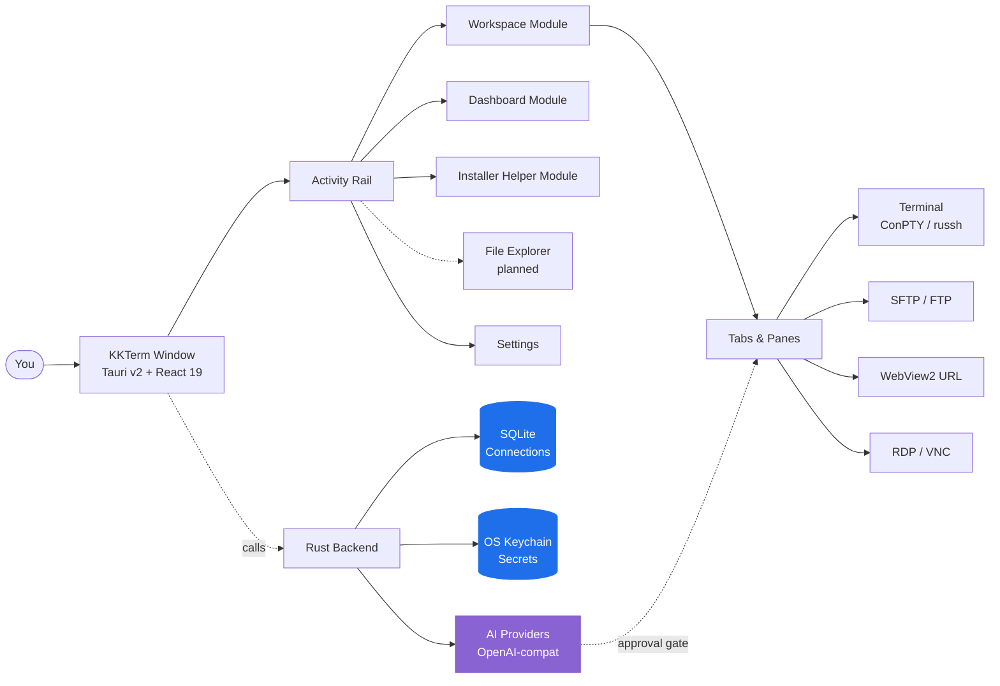

<p align="center">
  
</p>

<h1 align="center">KKTerm</h1>

<p align="center">
  <strong>AI 工具时代忘记打造的原生 Windows 管理工作台——终端、SSH、SFTP、RDP/VNC、Dashboard，以及一个能为你打造专属工具 Widget 的 AI。</strong>
</p>

<p align="center">
  <em>因为你的任务栏不该长得像拉斯维加斯的老虎机。</em>
</p>

<p align="center">
  <sub>命名灵感来自 <strong>乖乖 (Guāi Guāi)</strong>——台湾系统管理员放在服务器上祈求乖乖运行的绿色椰子口味零食。希望这款应用也能在机架上赢得它的位置。</sub>
</p>

<p align="center">
  <a href="https://github.com/ryantsai/KKTerm/stargazers">
    
  </a>
  <a href="https://github.com/ryantsai/KKTerm/network/members">
    
  </a>
  <a href="https://github.com/ryantsai/KKTerm/issues">
    
  </a>
  <a href="https://github.com/ryantsai/KKTerm/blob/main/LICENSE">
    
  </a>
  <br />
  
  
  
  
  
  <br />
  <sub>
    <a href="README.md">English</a> ·
    <a href="README.zh-TW.md">繁體中文</a> ·
    <strong>简体中文</strong> ·
    <a href="README.ja.md">日本語</a> ·
    <a href="README.ko.md">한국어</a> ·
    <a href="README.fr.md">Français</a> ·
    <a href="README.de.md">Deutsch</a> ·
    <a href="README.es.md">Español</a> ·
    <a href="README.es-MX.md">Español (MX)</a> ·
    <a href="README.it.md">Italiano</a> ·
    <a href="README.pt-BR.md">Português (BR)</a> ·
    <a href="README.th.md">ไทย</a> ·
    <a href="README.id.md">Bahasa Indonesia</a> ·
    <a href="README.vi.md">Tiếng Việt</a>
  </sub>
</p>

---

## 45 秒卖点

你是一名系统管理员 / DevOps 工程师 / 家庭实验室爱好者 / 氛围感程序员。现在你的桌面上有：

- 一个终端模拟器
- 一个独立的 SSH 客户端（那份配置列表你花了整整一个周末才建好）
- 一个 2007 年的 SFTP 客户端，不知为何还在存活
- 一个老是在错误显示器上迷路的远程桌面窗口
- 一个专门用来连那台 Linux 机器的 VNC 查看器
- 一个路由器管理界面的浏览器标签页
- 一个跑在远程开发机上的 `claude` / `codex` Session，Wi-Fi 一打喷嚏就断线
- 一张写满密码的便利贴 *(别担心，我们不会说的)*

**KKTerm 把这一切塞进同一个窗口。** 原生 Windows 应用——*有意为之，而其他开发工具都在优先支持 Mac，把你的操作系统当脚注*——用 Rust + Tauri v2 编写，单个安装包搞定，从不偷偷打电话回家。

此外还有几个你以为自己不需要、却会爱上的功能：

- 一个 **Dashboard**，你只需告诉 AI *"给我建一个每 30 秒 ping 一次路由器的 Widget"*，它就出现在你的网格上，完全沙盒隔离。
- **SSH Pane 自动挂载到命名 tmux Session**，让你远程跑的 `claude` / `codex` Session 扛得住笔记本每一次 Wi-Fi 发脾气。
- 一个 **AI 编程用量 Widget**，在 **Dashboard** 和状态栏上展示你的 Claude Code 和 Codex 配额——5 小时窗口、每周窗口、当前套餐、账号邮箱——让你不会在凌晨 3 点撞上限速墙才一脸懵。
- 一个 **Installer Helper** 模块，用来检测、安装、更新、卸载并启动精选的 Windows 开发工具目录——Node、Python、Docker、WSL、AI 编程 CLI，以及那些平时要翻好几个浏览器标签才找得到的小工具。
- 一个**内置 MCP 服务器**（`kkterm-cli`），让外部编程 Agent（Claude Code、Codex、Copilot、Antigravity、OpenCode）能操控你的 Workspace 和 Dashboard——列出 Connection、读取终端缓冲区、放置 Widget——通过精选的、带安全门控的工具表面。AI 对 AI，全在你机器上，不走云端中转。
- 二十一种 **动态 Canvas 背景**（是的，包括 `matrix`）可用于 Dashboard，因为我们就是有这个审美品位。

哦对了，AI 助手可以把一句话变成一个你真的会继续用的小型 Dashboard 工具。

> ⭐ **如果这听起来正是你打算自己造了六年却一直没动手的工具——给仓库点个 Star 让我们知道有人在看。真的有用。**

---

## 为什么叫"KKTerm"？

走进任何一家台湾数据中心，看看机架顶端。无论是台积电厂房、台北捷运控制室、国泰银行机房、中华电信的交换设备——你都会发现一小袋绿色的乖乖 (Guāi Guāi)，1960 年代就有的椰子口味玉米脆片。

这个名字字面意思是**"听话"**、**"乖乖的"**。这项 IT 传统简单明了，也相当认真：

- **必须是绿色口味（椰子）。** 黄色（咖喱）意味着*今天请假在家*；红色（辣味）会让服务器发火。只用绿色。
- **必须在保质期内。** 过期的乖乖会适得其反。工程师会勤勤恳恳地定期更换。
- **必须摆在看得见的地方。** 服务器要知道它在那里。
- **不能吃掉它。** 那袋零食在执勤。

亚洲一些规模最大、最无聊、最在乎在线时间的系统，机箱上都贴着一袋玉米脆片。它之所以有效，是因为维护它们的人相信它有效——这对大多数 IT 文化来说是一个相当诚实的描述。

**KKTerm** 就是 **Kuai Kuai Term**——一个管理工作台，立志与那袋零食完成同样的使命：安静地陪在你重要的机器旁边，帮它们好好运行。本地优先。零遥测。需要审批的 AI。那种枯燥但可靠的软件。

我们目前还无法随安装包一起寄出一袋真正的乖乖。这是 v2 的事项。

---

## 看它动起来

<p align="center">
  <a href="https://github.com/ryantsai/KKTerm">
    
  </a>
</p>

<p align="center"><sub><em>（Demo GIF 放这里。一张图胜过一千条要点，而我们的要点已经写完了。）</em></sub></p>

---

## 为什么大家会一直开着它

### Windows 优先，有意为之

看看 2026 年的开发工具市场。Claude Code：先出 Mac/Linux，Windows 版是"用 WSL 凑合"。Codex CLI：一样。`gemini-cli`、Homebrew 的一半、每一个光鲜的新 TUI：先出 Mac/Linux，Windows 用户在 README 里得到一行 `# Windows: contributions welcome` 注释，外加一个跑不起来的 fish 补全脚本。

与此同时，那些真正让公司保持在线的人——企业 IT、MSP、运行着 Hyper-V、AD、SCCM、IIS 或某台比部分实习生还老的域控制器的人——坐在 Windows 机器前，疑惑为什么每个新工具都把他们的操作系统当成一种麻烦。

**KKTerm 选择了反方向。** 我们先做原生 Windows，macOS / Linux 版本随后跟上。这意味着我们能使用真正有用的 Windows API，而不是用兼容层糊弄过去：

- **ConPTY** 用于本地 Shell——真正的 Windows 伪终端，不是翻译垫片。PowerShell、`cmd.exe`、WSL 发行版，全都作为标准 PTY 托管，焦点、调整大小、VT 序列处理都与平台行为一致。
- **WebView2** 驱动整个 UI 和嵌入式 URL **Connection**——使用系统运行时的进程内 Chromium，这也是安装包体积小、启动快的原因之一。
- **Microsoft RDP ActiveX（`mstscax.dll`）** 用于 RDP——*微软自带的那个*。与远程桌面连接（`mstsc.exe`）使用同一个控件。不是第三方重实现，不是套壳 FreeRDP。用过 RDP 的人五秒钟就能感受到区别。
- **Windows 凭据管理器** 存储所有密钥。SSH 密码、FTP 密码、API 密钥、URL Connection 凭据——全都住在 OS keychain 里，`credwiz.exe` 可以审计它们。
- **NSIS 当前用户安装程序**，附带匹配的 SHA-256、原生托盘菜单、阻止休眠的电源申请、宿主 CPU/内存/网络采样、带真实 PNG 图标的原生 Tauri 右键菜单、原生打开/保存对话框。没有一个是模拟出来的。
- **WSL 是一等公民 Shell，不是备选方案。** 同一个窗口里，Ubuntu 挨着 PowerShell Pane，挨着 SSH Session，挨着 RDP **Tab**。

macOS 和 Linux 版本在路线图上，会得到同等用心的对待。但如果你一直在等有人先把*好的* Windows 管理工具做出来而不是最后才做——这就是了。

### 本地优先，是真的本地

你保存的 **Connection** 住在机器上的 SQLite 文件里。密码住在 **Windows 凭据管理器**里，不是放在二进制文件旁边的 JSON 里。应用不内置分析，不在启动时打电话回家，不需要云账号才能启动。没有"登录以同步"，因为没有同步这回事。

就算你的网线着火了，KKTerm 照样能打开。

### 一个工作台，覆盖所有连接类型

| 你想要… | KKTerm 提供 |
| --- | --- |
| 打开本地 PowerShell / cmd / WSL Shell | 基于 ConPTY 的本地终端 **Session** |
| SSH 连接到服务器 | 原生 `russh`，支持代理 / 密钥 / 密码认证、主机密钥信任流程、ProxyJump、端口转发 |
| 浏览那台服务器上的文件 | 从 SSH **Connection** 启动的 SFTP，双栏面板、递归传输、chmod/chown |
| FTP 连接到 2012 年的 NAS | FTP / FTPS **Connection**，与 SFTP 同款浏览器界面 |
| Telnet 连接老旧设备 | 好的，Telnet 也在里面 |
| 连接串口 | Serial **Connection** 类型，COM 口 + 波特率，无需额外工具 |
| 远程登录 Windows 机器 | 通过 Microsoft ActiveX 控件实现的原生 RDP（真正的那个，不是克隆版） |
| VNC 连接树莓派 | Rust `vnc-rs` framebuffer 直接渲染到工作台 |
| 打开路由器的 Web 界面 | 嵌入式 WebView2 **URL Connection**，支持凭据自动填写 |
| 监控宿主机 CPU | 实时状态栏 + 带拖拽/调整大小 Widget 的 **Dashboard** 模块 |

全是同一个应用。同一个窗口。同一套快捷键。同一套希望不会让你眼睛流血的主题。

### 终端不再丢了魂

- 在 **Tab** 内分割 Pane。
- WebGL 加速的 xterm.js 渲染，不支持时优雅降级。
- 滚动搜索。
- tmux 加持的 SSH Pane，可以挂载到稳定的按 Pane 命名的 Session，重连真的意味着*重连*，而不是"从头开始假装上一个小时什么都没发生"。
- 切换 **Tab** **不会**终止 **Session**。关闭 **Tab** 才会。这个区分在内部是一场宗教战争；我们赢了。

### AI 助手会打造你的工具

大多数"终端里的 AI"演示止步于聊天。KKTerm 的助手还可以根据你的真实工作方式，打造小型、持久的 Dashboard Widget。危险操作仍然放在两个开关后面：

- **工具家族**（Dashboard / Connections / 实时 Session）——按类别独立开关。
- **Composer 中的权限模式**——`Prompt`（默认，每次都问）或 `Allow All`（你是成年人，你签了免责声明）。

可对接 OpenAI、Anthropic、OpenRouter、DeepSeek、Grok、Azure OpenAI、LiteLLM、GitHub Copilot、Ollama、NVIDIA，或任何 OpenAI 兼容接口。API 密钥进 OS keychain。提出 `rm -rf` 的模型会被标记为危险并要求人工明确审批。AI 不能悄悄执行破坏性命令，哪怕有人在 man page 里玩了什么提示词注入的花样。

### Dashboard 不假装自己是 Grafana

**Dashboard** 模块是一个 12 列的可拖拽/调整大小的 Widget 实例网格。它不是用来做 PB 级可观测性的——它是用来做"我想要一个启动我五个常用应用的按钮，和一个显示 SSH 主机运行时间的面板，*就放在*我的聊天旁边"这种需求的。

#### AI 创建的 Widget——描述需求，即刻生成

这是我们真正兴奋的部分。你不用从市场里挑，也不用自己写 JavaScript。你**告诉 AI 助手你想要什么**，它就直接在你的 Dashboard 上构建出来：

> *"添加一个显示我主仓库最近 5 次提交列表的 Widget。"*
> *"给我做一个便利贴 Widget，用来存放我的值班备忘。"*
> *"做一个每 30 秒 ping 我家路由器并显示绿色/红色的 Widget。"*
> *"我需要一个秒表。样式随你发挥。"*

两种类型：

- **Content Widget**——声明式 JSON：Markdown、键值列表、清单、单一大数字统计。构造上安全，无脚本。大多数"我只是需要这个放在 Dashboard 上"的需求都在这里解决。
- **Script Widget**——JavaScript 托管在隔离的 `iframe srcdoc` 沙盒内，具有明确声明的权限（`network` 白名单、`pollSeconds` 预算）。AI 写脚本，你审批权限，Widget 在一个无法触及应用其余部分的盒子里运行。

你保留的每个 Widget 都是你的。它们与你的 **Connection** 一起持久化在 SQLite 里，有自己的视觉预设（`panel` / `ambient` / `hero`）、强调色、图标和标题。同一个 Widget 的多个实例可以共存，尺寸和样式完全不同。新鲜感退去后，右键单击删除即可。

#### 动态 Dashboard 背景（因为我们就是想要）

Dashboard 提供二十一种可按 **Dashboard View** 独立选择的 Canvas 动态背景：

| 心情 | 背景 |
| --- | --- |
| 平静 | `aurora`、`clouds`、`ocean`、`raindrops`、`snow`、`sakura`、`fireflies`、`bubbles`、`ricefield`、`lanterns` |
| 宇宙感 | `starfield`、`nebula` |
| 温暖 | `embers`、`lava` |
| 极客 | `matrix`、`topo`、`synthwave` |
| 混乱 | `cyberpunk`、`taipei101`、`thunderstorm`、`confetti` |

它们运行在单个共享的 requestAnimationFrame 上，并尊重窗口焦点，所以你去干别的事的时候它们几乎不消耗资源。用 `matrix` 配上你的 AI 助手，打造出一种"我极度高效，同时可能正身处沃卓斯基电影中"的氛围。或者选 `ocean`，看起来像个严肃的人。我们两种选择都不评判。

### 在服务器上跑 AI 编程 Agent，正确的方式

这是第二个让人一用就爱上的功能。KKTerm 的 SSH 终端可以直接启动到远程主机上的**命名 tmux Session**——默认会自动生成一个像 `kkterm-cockpit001` 这样的友好 ID，重连后依然存在：

- 开启一个启用了 tmux 的 SSH **Connection**。
- 在 Pane 里启动 `claude`、`codex`、`gemini-cli`、`cursor-agent`，或任何你喜欢的长时间运行的编程 Agent。它们都是全屏 TUI 应用；tmux 正是它们想要的归宿。
- 合上笔记本，再打开。Pane 会静默地重新挂载到同一个 tmux Session。Agent 还在跑，滚动历史还在，还在做着它之前做的事。
- SSH 传输层发生网络抖动？KKTerm 会在不打扰你的情况下有限次地静默尝试重连同一个 tmux ID。
- 想让 AI 助手看到 Agent 在做什么？"将终端缓冲区加入上下文"会通过 SSH 调用 `capture_tmux_pane`，将完整的 tmux 滚动历史——不只是屏幕上显示的内容，而是整个 Session——拉入对话。你的本地助手现在可以对你远程 Agent 的工作进行推理了。

如果你曾经因为酒店 Wi-Fi 不稳定而丢失过一个跑了六小时的 `claude` 或 `codex` Session，这一个功能就值回应用的票价。这个应用是免费的。这个功能依然值。

### 知道你还剩多少 AI 可用

编程 Agent 是按套餐窗口计费的，不是按月。Claude Code 有一个 5 小时窗口和一个每周窗口。Codex 有自己的版本。两者都能在你开会的时候，在后台悠闲地把你的配额吃光。

**AI 编程用量** Widget 把这事摆在明面上：

- 一个 Dashboard Widget，把 **Claude Code** 和 **Codex** 并排显示：已连接账号、套餐等级、当前 5 小时窗口已用百分比、本周已用百分比、下次重置时间。
- 一个**紧凑的状态栏指示器**，镜像同样的数字，即使关掉 Dashboard 你也能一眼看出在启动下一次大重构之前是否还有余量。
- 认证状态直接可见（`connected` / `expired` / `error`），让你在长任务**之前**就发现需要重新登录，而不是任务跑到一半才发现。
- 刷新策略遵守限速；Widget 按自己的节奏轮询，而不是每次你看它就去敲上游 API。

### 内置 MCP 服务器 — 让其他 AI 来操作 KKTerm

你的终端也是 Claude Code、Codex、Copilot 的 Agent 模式、Antigravity 以及其余说 MCP 的世界想干活的地方。所以 KKTerm 自带一个 **stdio MCP 服务器**，[`kkterm-cli`](docs/MCP.md)，对外暴露 App 的一个精选切面：

- **Workspace 模块**（`kkterm.workspace.*`）：列出已保存的 **Connection**、按 id 打开 Connection、列出活动 **Session**、向终端 Pane 发送输入、读取一份终端缓冲区快照。
- **Dashboard 模块**（`kkterm.dashboard.*`）：加载 Dashboard 状态、读取 AI 创建的 Widget 源码、创建 / 更新 / 删除 View、放置 / 移动 / 删除 Widget 实例、批量应用布局。
- **危险子命名空间**（`kkterm.<module>.dangerous.*`）：修改可执行表面——创建脚本 Widget、点击进入远程桌面、清空 Dashboard——被一个单一设置（`built_in_mcp_allow_all_dangerous`）门控，默认**关闭**。

`kkterm-cli` 是一个轻量转发器。它通过 stdio JSON-RPC 与你的 MCP 客户端对话，并通过一个按启动认证的 Windows 命名管道与运行中的 KKTerm 窗口通信。当 KKTerm 关闭时，`tools/list` 仍能工作（客户端可以做内省），但 `tools/call` 会返回一个结构化的 `app_not_running` 错误，而不是真的去执行。

把它接到你喜欢的客户端上，你的 AI 现在就能像你一样使用 KKTerm：

```json
{
  "mcpServers": {
    "kkterm": { "command": "<kkterm-cli-路径>", "args": [] }
  }
}
```

设置 → AI Assistant → **内置 MCP 服务器** 有一个一键"显示配置"对话框，里面预填了已解析二进制路径的 JSON 和 TOML 片段，外加可复制的 `claude mcp add` / `codex mcp add` 命令。

---

## 整体架构



关键的结构是：持久化保存的数据（**Connection**）与运行时活动状态（**Session**）分离，后者再与 UI 容器（**Tab**）分离。关闭 **Tab** 会终止 **Session**。切换 **Tab** 不会。这条规则让应用保持了理智。

---

## 当前功能清单

| 领域 | 已实现 |
| --- | --- |
| **Connections** | SQLite 树结构、文件夹/子文件夹、搜索、拖拽排序、重命名、复制、删除、**Quick Connect**、自定义图标、固定/活跃的 Activity Rail 快捷方式 |
| **终端** | 本地 Shell、SSH、Telnet、Serial、分割 Pane、xterm.js + 机会性 WebGL、滚动搜索、本地启动目录/脚本 |
| **SSH** | 原生 `russh`、代理/密钥/密码认证、主机密钥信任流程、可选系统 SSH 回退、ProxyJump、端口转发、**自动命名 tmux Session（`kkterm-<科幻名><n>`），传输层抖动时静默重连**——完美适配长时间运行的远程编程 Agent（Claude Code、Codex、gemini-cli 等） |
| **SFTP / FTP** | SSH 启动的 SFTP 加上 FTP/FTPS **Connection**、双栏浏览器、递归传输、队列/取消/清除历史、冲突处理、属性、chmod/chown（支持时） |
| **URL WebView** | 嵌入式 WebView2 URL **Session**、导航工具栏、favicon 捕获、存储的网站凭据元数据/填充、数据分区元数据 |
| **远程桌面** | 通过 Windows ActiveX 实现的 RDP，含几何范围遮罩停靠；通过 `vnc-rs` framebuffer 在工作台 Canvas 中渲染的 VNC |
| **Dashboard** | 持久化视图、Widget 实例、编辑模式、拖拽/调整大小、App Launcher、**AI 创作的 Content/Script Widget**（声明式 JSON 或带权限的沙盒 iframe JS）、按 Widget 的预设/强调色/图标/标题、**21 种动态 Canvas 背景**（aurora、clouds、ocean、raindrops、snow、sakura、fireflies、bubbles、ricefield、lanterns、starfield、nebula、embers、lava、matrix、topo、synthwave、cyberpunk、taipei101、thunderstorm、confetti） |
| **AI 助手** | 流式聊天、OpenAI 兼容运行时、提供商注册表、命令提案安全分级、截图/上下文附件、**Dashboard Widget 创作（Content + 沙盒 Script）**、将 **tmux Pane 捕获**作为远程 Session 的对话上下文、**Connection** 管理工具，以及终端、RDP/VNC 和 SFTP/FTP 的实时 **Session** 工具 |
| **AI 编程用量** | **Dashboard Widget + 状态栏指示器**，追踪 **Claude Code** 和 **Codex** 的配额使用情况：已连接账号、套餐等级、5 小时和每周窗口百分比、下次重置时间、认证状态（`connected` / `expired` / `error`）、限速友好的刷新策略 |
| **内置 MCP 服务器** | stdio MCP 服务器（`kkterm-cli`），向外部编程 Agent（Claude Code、Codex、Copilot、Antigravity、OpenCode）暴露精选的 Workspace 和 Dashboard 工具；带认证的命名管道桥接；每个模块的 `dangerous.*` 命名空间由单一安全开关门控；设置中的对话框提供一键 JSON / TOML 片段以及 `claude mcp add` / `codex mcp add` 命令 |
| **Installer Helper** | 活动轨道模块，提供随应用打包的 Windows 开发工具目录：检测已安装工具、比较最新版本、安装/更新/卸载、将工具排除在 Update all 之外、流式显示命令日志，并启动支持的受管理应用 |
| **Settings** | 通用、外观、凭据、AI、SSH、终端、URL、RDP、VNC、Dashboard、Installer Helper、关于；自定义 UI 字体；最小化到托盘；阻止休眠；备份/导入 |
| **本地化** | 基于 i18next 的 UI，英文为源，动态语言包：zh-TW、zh-CN、ja、ko、fr、de、es、es-MX、it、pt-BR、th、id、vi |

### AI 提供商

OpenAI · Anthropic · OpenRouter · DeepSeek · Grok · Azure OpenAI · LiteLLM · GitHub Copilot · Ollama · NVIDIA · 任何 OpenAI 兼容接口。

提供商元数据位于 [`src/ai/providerRegistry/`](src/ai/providerRegistry/)；Rust 适配器位于 [`src-tauri/src/ai/providers/`](src-tauri/src/ai/providers/)。API 密钥经由 OS keychain，绝不进入 SQLite。

---

## 快速开始

你需要：

- **Windows**（主要支持平台）
- **Node.js + npm**
- **Rust 工具链**
- **Tauri v2 的 Windows 前置条件**，包括 **WebView2**

```bash
npm install
npm run tauri dev
```

正常情况下会弹出一个真实的原生窗口。如果弹出的是堆栈跟踪——请提 Issue，我们喜欢好的复现步骤。

### 常用检查

```bash
npm run check                                              # TypeScript
npm run build                                              # Vite build
cargo check --manifest-path src-tauri/Cargo.toml           # Rust
cargo test  --manifest-path src-tauri/Cargo.toml           # Rust tests
```

### 打包 Windows 安装程序

```bash
npm run package:installer
```

安装程序脚本会生成 `artifacts/kkterm-<version>-windows-x64-setup.exe` 及配套的 `.sha256` 文件。目前**未签名**——发布签名在路线图上，但在此之前你的杀毒软件可能会瞪你一眼。这是正常的。

---

## KKTerm 不是什么

简短说明，因为诚实能赢得信任：

- **不是云产品。** 没有同步，没有团队账户，没有 SaaS 层级。如果你看到"登录 KKTerm"的对话框，说明有什么事情严重出错了。
- **不假装自己跨平台。** 我们有意将 Windows 放在首位；macOS 和 Linux 在路线图上，会使用同一个 Tauri v2 外壳。如果你今天需要一个 Mac 优先的工具，你有几百个选择。我们在打造 Windows 管理员一直在默默等待的那一个。
- **不是自主 AI Agent。** 助手提议，人类决策。`Allow All` 是你主动做出的选择，不是默认设置。
- **不是 Grafana / Datadog 的替代品。** Dashboard 是个人控制面板，不是万台主机的可观测性平台。
- **不是 Kubernetes IDE。** 它是一个终端优先的管理工作台。请不要让它渲染 Helm chart。

如果上面某条确实是你的硬性需求——没关系，v2 再见。

---

## 原生调试

使用真实的 Tauri 运行时进行验证：

```bash
npm run tauri dev
```

Vite 浏览器预览对前端检查有一定用处，但它**不会**托管真实的 WebView2、ConPTY、RDP ActiveX、VNC framebuffer、keychain 或原生菜单界面。如果某个功能涉及这些，请在实际的桌面运行时中验证。

VS Code 用户：`Run KKTerm exe` 启动配置会以 `RUST_BACKTRACE=1` 启动 `src-tauri/target/debug/kkterm.exe`。配套的 `Attach KKTerm WebView2` 配置让你在真实 WebView2 宿主内使用 DevTools。

---

## 当前限制（是的，我们知道）

- 安装程序目前未签名。在配置发布签名之前，更新检查已禁用。
- 原生 SFTP 路径尚不支持通过 ProxyJump 进行 SFTP。
- 文件传输断点续传、文件夹同步/差异、归档/解压、远程编辑已延期。
- SSH 配置导入已实现，但 Settings 中面向用户的入口尚未开放。
- RDP 和 VNC 已上线；更丰富的剪贴板/设备同步和画质控制仍在完善中。
- macOS 和 Linux 版本在路线图上。它们会来的，而且会做得正规——不会草草移植成一个"我们在那边也勉强能跑"的版本。
- AI 助手可在配置的权限范围内提议并操作已启用的工具——请不要把它当成无人值守的机器人。它事实上并不知道你的 CEO 想要什么。

---

## 路线图（简版）

- macOS + Linux 版本
- 签名安装程序 + 自动更新
- 原生路径中的 ProxyJump SFTP
- 文件传输断点续传、文件夹同步、归档/解压
- 更丰富的 RDP 剪贴板/设备重定向
- 更多内置 **Dashboard** Widget（以及 AI 创作 Widget 的公开 Schema）

完整且频繁更新的版本：[`docs/ROADMAP.md`](docs/ROADMAP.md)。

---

## 贡献

我们真的很欢迎帮忙。真的。哪怕是小事也有意义：

- **试用开发版本**，遇到任何感觉不对劲的地方就提 Issue。"感觉哪里不对"是合法的 Bug 报告；我们会和你一起深挖。
- **翻译一个语言包。** 英文是主源，位于 [`src/i18n/locales/en.json`](src/i18n/locales/en.json)；12 个其他语言包在旁边，按需加载。待翻译字符串按键名追踪于 [`docs/localization_todo/`](docs/localization_todo/)——挑一个，翻译它，删掉文件。
- **添加一个 Dashboard Widget。** 内置 Widget 位于 [`src/modules/dashboard/widgets/builtin/`](src/modules/dashboard/widgets/builtin/)。想一个小点子，发布它，学习这个模式。
- **收紧 AI 工具面。** 提供商适配器在 [`src-tauri/src/ai/providers/`](src-tauri/src/ai/providers/)；前端注册表在 [`src/ai/providerRegistry/`](src/ai/providerRegistry/)。
- **改进手册。** 用户文档位于 [`docs/manual/`](docs/manual/)。每个 UI 模块一章。如果你用了某个功能但文档没有帮到你，修复这个问题的 PR 就是黄金贡献。

完整的开发环境搭建、项目结构、PR 检查清单，以及"请不要破坏这些"规则列表，都在 [`CONTRIBUTING.md`](CONTRIBUTING.md) 里。30 秒重点：

- **重命名面向用户的术语前，先读 [`CONTEXT.md`](CONTEXT.md)。** **Connection**、**Session**、**Tab** 和 **Quick Connect** 各有特定含义；请不要随意漂移。
- **每一条用户可见的字符串都要经过 `t()`。** JSX 里不出现裸英文文本。
- **不要加前端关闭钩子。** Tauri v2 的标题栏关闭已经被 `onCloseRequested` 模式搞坏过好几次了。我们终于有了一个可用的形态；请不要重新引入它们。
- **提 PR 前运行检查**（`npm run check && npm run build && cargo check && cargo test`）。

在找入手点？按 [`good first issue`](https://github.com/ryantsai/KKTerm/issues?q=is%3Aissue+is%3Aopen+label%3A%22good+first+issue%22) 或 [`help wanted`](https://github.com/ryantsai/KKTerm/issues?q=is%3Aissue+is%3Aopen+label%3A%22help+wanted%22) 筛选 Issue。如果还没有打标签的，开一个 Issue 描述你想做的事，我们会帮你界定范围。

---

## 项目文档

- [产品背景](CONTEXT.md) — 你应该匹配的领域语言
- [架构](docs/ARCHITECTURE.md) — 模块图，新代码放哪里
- [路线图](docs/ROADMAP.md)
- [Dashboard 架构](docs/DASHBOARD.md)
- [AI 提供商指南](docs/AI_PROVIDERS.md)
- [性能说明](docs/PERFORMANCE.md)
- [发布说明与门控](docs/RELEASE.md)

---

## 技术栈

Rust · Tauri v2 · React 19 · TypeScript · Vite · Tailwind CSS · Zustand · xterm.js · SQLite · WebView2 · `russh` · `russh-sftp` · `vnc-rs` · `suppaftp` · OS keychain 存储。

---

## Star 历史

<a href="https://www.star-history.com/#ryantsai/KKTerm&Date">
  <picture>
    <source media="(prefers-color-scheme: dark)" srcset="https://api.star-history.com/svg?repos=ryantsai/KKTerm&type=Date&theme=dark" />
    <source media="(prefers-color-scheme: light)" srcset="https://api.star-history.com/svg?repos=ryantsai/KKTerm&type=Date" />
    
  </picture>
</a>

你都看到这儿了还没点 Star——你还在等什么，需要个人邀请函吗？这就是你的个人邀请函。

⭐ **[在 GitHub 上 Star KKTerm](https://github.com/ryantsai/KKTerm)** — 只需一次点击，就能让维护者开心一整周。把它想成放在机架上的一个数字乖乖。

---

## 许可证

MIT。详见 [LICENSE](LICENSE)。用它，fork 它，发布它，把它藏进一个没人能找到的家庭实验室——就是这么回事。
