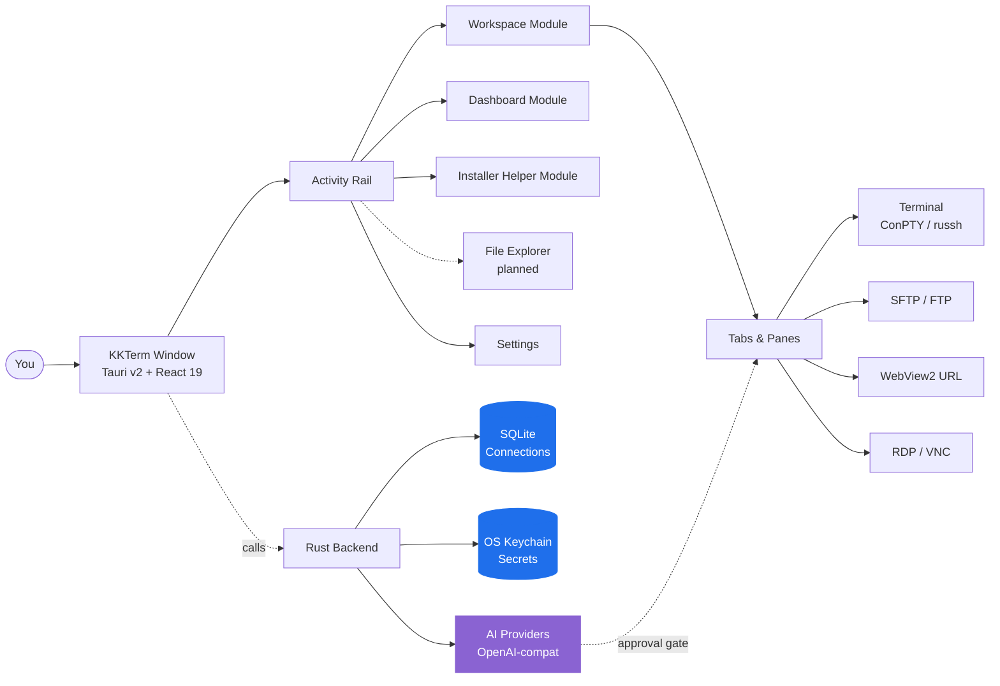

<p align="center">
  
</p>

<h1 align="center">KKTerm</h1>

<p align="center">
  <strong>AI 工具當道的年代裡沒人想動手寫的那款 Windows 原生管理工作區 — 終端機、SSH、SFTP、RDP/VNC、Dashboard，加上一個能幫你打造專屬工具 Widget 的 AI。</strong>
</p>

<p align="center">
  <em>因為你的工作列不該長得像拉斯維加斯的吃角子老虎。</em>
</p>

<p align="center">
  <sub>名稱來自 <strong>乖乖</strong>，那包台灣系統管理員放在伺服器上、希望它好好工作的綠色椰子口味玉米點心。希望這個 app 也能爭取到它在機架上的一席之地。</sub>
</p>

<p align="center">
  <strong><a href="https://github.com/ryantsai/KKTerm/releases/latest">下載最新版 Windows 安裝程式（.exe）</a></strong>
</p>

<p align="center">
  <a href="https://github.com/ryantsai/KKTerm/stargazers">
    
  </a>
  <a href="https://github.com/ryantsai/KKTerm/network/members">
    
  </a>
  <a href="https://github.com/ryantsai/KKTerm/releases">
    
  </a>
  <a href="https://github.com/ryantsai/KKTerm/issues">
    
  </a>
  <a href="https://github.com/ryantsai/KKTerm/blob/main/LICENSE">
    
  </a>
  <br />
  
  
  
  
  
  <br />
  <sub>
    <a href="README.md">English</a> ·
    <strong>繁體中文</strong> ·
    <a href="README.zh-CN.md">简体中文</a> ·
    <a href="README.ja.md">日本語</a> ·
    <a href="README.ko.md">한국어</a> ·
    <a href="README.fr.md">Français</a> ·
    <a href="README.de.md">Deutsch</a> ·
    <a href="README.es.md">Español</a> ·
    <a href="README.es-MX.md">Español (MX)</a> ·
    <a href="README.it.md">Italiano</a> ·
    <a href="README.pt-BR.md">Português (BR)</a> ·
    <a href="README.th.md">ไทย</a> ·
    <a href="README.id.md">Bahasa Indonesia</a> ·
    <a href="README.vi.md">Tiếng Việt</a>
  </sub>
</p>

---

## 45 秒簡報

你是 sysadmin / DevOps / 玩 homelab 的人 / vibe coder。現在你手上有：

- 一個終端機模擬器
- 一個獨立的 SSH client（裡面那份 profile 清單花了你整個週末才整理出來）
- 一個 2007 年的 SFTP client，不知為何還活著
- 遠端桌面開在一個你一直在錯誤螢幕上找的視窗
- 一個 VNC viewer，只為了那一台 Linux 主機
- 一個瀏覽器分頁，開著路由器後台
- 一個跑在遠端開發機上的 `claude` / `codex` session，每次 Wi-Fi 一打噴嚏就斷
- 一張寫著密碼的便利貼*（沒事，我們不會說出去）*

**KKTerm 把這些塞進同一扇視窗。** 原生 Windows — *沒錯，是故意的，當整個開發工具圈都先做 mac 版、把你的作業系統當成備註處理的時候* — 用 Rust + Tauri v2 寫的，一個安裝程式就搞定，而且絕不回家報告。

順便還幫你做了幾件你不知道自己需要的事：

- 一個 **Dashboard**，你可以對 AI 說 *「幫我做一個每 30 秒 ping 一次路由器的 widget」*，它就會在你的網格上憑空出現，而且關在沙箱裡。
- **可以自動 attach 到指定 tmux session 的 SSH pane**，這樣你那個跑在遠端的 `claude` / `codex` 就不會因為筆電每次鬧脾氣的 Wi-Fi 而陣亡。
- 一個 **AI 編程用量 Widget**，在 **Dashboard** 和狀態列上秀出你的 Claude Code 與 Codex 配額——5 小時視窗、每週視窗、目前方案、帳號 Email——讓你不會凌晨三點才被 rate-limit 牆撞個正著。
- 一個 **Installer Helper** 模組，幫你偵測、安裝、更新、解除安裝並啟動精選的 Windows 開發工具目錄——Node、Python、Docker、WSL、AI coding CLI，還有那些平常得翻好幾個瀏覽器分頁才找得到的小工具。
- 一個**內建 MCP 伺服器**（`kkterm-cli`），讓外部編程 Agent（Claude Code、Codex、Copilot、Antigravity、OpenCode）能透過精選且有安全閘的工具表面操控你的 Workspace 與 Dashboard——列出 Connection、讀取終端機 buffer、放置 Widget。AI 對 AI，全在你機器上，沒有雲端中繼。
- 二十一種 **canvas 動畫背景**（對，包括 `matrix`）給 Dashboard 用，因為我們也沒在客氣。

喔對了，AI 助理可以把一句話變成一個你真的會繼續使用的小型 Dashboard 工具。

> ⭐ **如果這聽起來就是你過去六年一直想做的那個 app — 請按個星星，讓我們知道有人在看。這真的很有幫助。**

---

## 為什麼叫「KKTerm」？

走進任何一座台灣的資料中心，抬頭看機架頂端。從台積電晶圓廠、台北捷運控制室、國泰銀行的伺服器機房、中華電信的交換機房 — 你都會看到一小包綠色的 **乖乖**，那是 1960 年代就有的椰子口味玉米點心。

名字字面上就是「**乖乖的**」、「**聽話**」。IT 圈的傳統很簡單，而且大家絕對是認真的：

- **必須是綠色（椰子口味）。** 黃色（咖哩）代表*今天請假*；紅色（辣味）會把伺服器惹毛。只有綠色。
- **不能過期。** 過期的乖乖會反過來害你。工程師會勤奮地汰舊換新。
- **必須看得到。** 伺服器必須知道它在那裡。
- **不要吃它。** 那包乖乖正在值勤。

亞洲一些最大、最無聊、最執著於 uptime 的系統，就是這樣靠著一包貼在機殼上的玉米脆果在運作。它有效，是因為維護它的人相信它有效 — 這也算是對 IT 文化最誠實的描述了。

**KKTerm** 就是 **Kuai Kuai Term** — 一個跟那包點心一樣有抱負的管理工作區：安靜地坐在你那些重要機器旁邊，幫它們乖一點。本地優先。零遙測。AI 全程要審批。那種無聊但可靠的軟體。

我們目前還沒辦法在 installer 裡塞一包真正的乖乖。那是 v2 的待辦事項。

---

## 親眼看看

<p align="center">
  <a href="https://github.com/ryantsai/KKTerm">
    
  </a>
</p>

<p align="center"><sub><em>（demo GIF 放這裡。一張圖勝過一千個列點，而我們列點也快用完了。）</em></sub></p>

---

## 為什麼有人會整天開著它

### 原生 Windows，刻意為之

看看 2026 年的開發者工具版圖。Claude Code：先做 mac/linux，Windows 是「請用 WSL」。Codex CLI：一樣。`gemini-cli`、Homebrew 一半的內容、每個閃亮新出的 TUI：mac/linux 優先，Windows 使用者拿到的是 README 裡那一句 `# Windows: contributions welcome`，外加一個跑不起來的 fish-completion script。

可是真的把公司業務撐起來的那些人 — 企業 IT、MSP、跑 Hyper-V 或 AD 或 SCCM 或 IIS 或那台比某些實習生還老的 domain controller 的人 — 他們坐在 Windows 機器前，不懂為什麼每個新工具都當他們的 OS 是麻煩。

**KKTerm 走的是反向路線。** 我們先做原生 Windows，macOS / Linux 之後跟上。這代表我們可以用上 Windows 真正重要的 API，而不是套一層 portability layer 矇混過去：

- 本地 shell 用 **ConPTY** — 真正的 Windows pseudo-console，不是翻譯墊片。PowerShell、`cmd.exe`、各種 WSL distro，都用正規 PTY 承載，focus、resize、VT 序列處理全照平台規矩來。
- 整個 UI 與內嵌 URL **Connection** 用 **WebView2** — 系統 runtime 提供的 in-process Chromium，這也是 installer 體積小、啟動快的原因之一。
- RDP 用 **Microsoft RDP ActiveX（`mstscax.dll`）** — *就是微軟自己出貨的那個*。跟遠端桌面連線（`mstsc.exe`）用的是同一個元件。不是第三方重寫，也不是 FreeRDP 套殼。玩過 RDP 的人五秒內就感覺得出差別。
- 所有密碼用 **Windows Credential Manager**。SSH 密碼、FTP 密碼、API key、URL Connection 憑證 — 全部住在 OS keychain 裡，`credwiz.exe` 可以幫你稽核。
- **NSIS current-user installer** 附對應的 SHA-256，原生 tray menu、Don't-Sleep power assertion、主機 CPU/RAM/網路取樣、帶真實 PNG 圖示的原生 Tauri context menu、原生開啟/儲存對話框。沒有一項是用假的。
- **WSL 是頭等公民 shell，不是替代方案。** 在同一個視窗裡，PowerShell pane 旁邊開一個 Ubuntu，再旁邊開一個 SSH session，再旁邊開一個 RDP **Tab**。

macOS 與 Linux 版本在 roadmap 上，會用一樣的標準做出來。但如果你一直在等有人**先**好好做一個 Windows 管理工具、而不是最後才做 — 機會來了。

### Local-first，是真的「本地」

你儲存的 **Connection** 住在你電腦上的 SQLite 檔案。密碼住在 **Windows Credential Manager**，不是放在執行檔旁邊的 JSON。app 不出貨 analytics、啟動時不打電話回家、要跑也不需要雲端帳號。沒有「Sign in to sync」是因為根本沒有 sync。

就算你的網路線著火，KKTerm 還是開得起來。

### 一個工作區，包辦所有連線類型

| 你想做的事… | KKTerm 提供 |
| --- | --- |
| 開本機 PowerShell / cmd / WSL shell | ConPTY 後端的本地終端 **Session** |
| SSH 到伺服器 | 原生 `russh`，支援 agent / key / password 驗證、host-key 信任流程、ProxyJump、port forwarding |
| 瀏覽該伺服器的檔案 | 從 SSH **Connection** 啟動 SFTP，雙欄、遞迴傳輸、chmod/chown |
| FTP 到一台 2012 年的 NAS | 同樣的 SFTP 風格瀏覽器，FTP / FTPS **Connection** 都吃 |
| Telnet 到上古機器 | 是，Telnet 也在裡面 |
| 跟序列埠講話 | Serial **Connection** 類型，COM port + baud，不用額外工具 |
| 遠端到 Windows 機器 | 透過 Microsoft ActiveX 控制項的原生 RDP（真貨，不是仿的） |
| VNC 到 Pi | Rust `vnc-rs` framebuffer 直接畫進工作區 |
| 開路由器後台 | 內嵌 WebView2 **URL Connection**，可填憑證 |
| 看主機 CPU | 即時狀態列 + **Dashboard** 模組，含可拖曳/可縮放的 widget |

全在同一個 app。同一扇視窗。同一組快捷鍵。同一個（希望）不刺眼的主題。

### 終端機不會抽風

- **Tab** 裡可以分割 pane。
- WebGL 加速的 xterm.js 渲染，撐不住時會優雅降級。
- Scrollback 搜尋。
- tmux 後端的 SSH pane 可以 attach 到穩定的 per-pane session，重新連線真的是*重新連線*，不是「重新開始假裝過去一小時不存在」。
- 切 **Tab** **不會** 殺掉 **Session**。關 **Tab** 才會。這個區分我們內部吵過一場宗教戰爭；我們贏了。

### 一個會打造你工具的 AI 助理

大部分「AI 在你終端機裡」的 demo 都停在聊天。KKTerm 的助理也能依照你實際工作的方式，打造小型、持久的 Dashboard Widget。危險操作仍然放在兩個開關後面：

- **工具家族**（Dashboard / Connection / Live Session）— 每個類別分別開關。
- composer 裡的 **Permission mode** — `Prompt`（預設，每次都問）或 `Allow All`（你是大人，自己簽過免責聲明）。

可以接 OpenAI、Anthropic、OpenRouter、DeepSeek、Grok、Azure OpenAI、LiteLLM、GitHub Copilot、Ollama、NVIDIA，或任何 OpenAI-compatible 端點。API key 收到 OS keychain。模型如果提議 `rm -rf` 會被歸類為危險，必須人類明確核可。AI 不可能因為有人在 man page 裡塞了 prompt injection 而偷偷跑掉破壞性指令。

### 一個不假裝自己是 Grafana 的 Dashboard

**Dashboard** 模組是 12 欄、可拖曳/縮放的 widget instance 網格。它不是給你做 petabyte 級觀測用的 — 它是給「我想要一個按鈕一鍵打開五個常用 app，旁邊還有一個顯示 SSH 主機 uptime 的面板，*再旁邊*是我的聊天視窗」用的。

#### AI 建立的 Widget — 用講的，它就出現

這部分我們是真的興奮。你不用從某個 marketplace 挑，也不用寫 JavaScript。你**直接告訴 AI 助理你要什麼**，它就在你的 dashboard 上把 widget 蓋出來：

> *「加一個 widget，把我 main repo 上最近 5 個 commit 用清單顯示。」*
> *「給我一個便利貼 widget，裡面放我的 on-call 備忘錄。」*
> *「做一個 widget，每 30 秒 ping 一次我家路由器，顯示綠燈或紅燈。」*
> *「我需要一個碼錶。樣式你自己看著辦。」*

兩種口味：

- **Content widget** — 宣告式 JSON：markdown、kv 清單、checklist、單一大數字。先天安全，沒有 script。大部分「我只是想把這個東西放在 dashboard 上」的需求都落在這裡。
- **Script widget** — JavaScript，跑在隔離的 `iframe srcdoc` 沙箱裡，權限明確宣告（`network` allowlist、`pollSeconds` 預算）。AI 把 script 寫好，你核准權限，widget 就跑在一個碰不到 app 其他部分的盒子裡。

每個你留下來的 widget 都是你的。它們跟 **Connection** 一起存在 SQLite，帶有自己的視覺 preset（`panel` / `ambient` / `hero`）、accent 色、圖示、標題。同一個 widget 可以同時有多個 instance，大小與樣式都可以完全不同。新鮮感過了就右鍵刪除。

#### Dashboard 動畫背景（因為我們想要）

Dashboard 有二十一種 canvas 動畫背景，每個 **Dashboard View** 都可以挑：

| 氛圍 | 背景 |
| --- | --- |
| 沉靜 | `aurora`、`clouds`、`ocean`、`raindrops`、`snow`、`sakura`、`fireflies`、`bubbles`、`ricefield`、`lanterns` |
| 太空 | `starfield`、`nebula` |
| 溫暖 | `embers`、`lava` |
| 阿宅 | `matrix`、`topo`、`synthwave` |
| 失控 | `cyberpunk`、`taipei101`、`thunderstorm`、`confetti` |

它們共用一個 `requestAnimationFrame`，會跟著視窗 focus 暫停，所以你不在的時候幾乎不耗資源。`matrix` 配 AI 助理可以散發出「我超有生產力，而且可能在駭客任務裡」的氣場。或者選 `ocean`，看起來像個正經人。兩種選擇我們都不會評判。

### 在伺服器上跑 AI coding agent，用對的方式

這是大家會愛上的第二個功能。KKTerm 的 SSH 終端可以直接啟動到遠端主機上的 **named tmux session** — 預設會自動生成一個友善 id，像 `kkterm-cockpit001`，斷線重連也活著：

- 開一個啟用 tmux 的 SSH **Connection**。
- 在 pane 裡跑 `claude`、`codex`、`gemini-cli`、`cursor-agent`，或你愛用的任何長時間運行的 coding agent。它們是全螢幕 TUI app；tmux 就是它們最舒服的家。
- 把筆電蓋上。再打開。Pane 會悄悄地重新 attach 到同一個 tmux session。Agent 還在跑，scrollback 還在，還在做它原本在做的事。
- SSH 傳輸層斷線？KKTerm 會用同一個 tmux id 嘗試有界次數的靜默 reattach，不會煩你。
- 想讓 AI 助理看看那個 agent 在幹什麼？「Add terminal buffer to context」會透過 SSH 呼叫 `capture_tmux_pane`，把完整的 tmux scrollback — 不只是螢幕上看得到的，是整個 session — 拉進對話。你本地的助理就可以對你遠端 agent 的工作進行推理。

如果你曾經因為飯店爛 Wi-Fi 弄丟過六小時的 `claude` 或 `codex` session，光這一個功能就值回票價了。Btw，app 是免費的。但這功能還是值得。

### 知道你的 AI 還剩多少額度

Coding agent 是用方案的「視窗」收費的，不是按月。Claude Code 有 5 小時視窗跟每週視窗。Codex 有自己的版本。兩者都能在你開會的時候，在背景把你的配額吃光光。

**AI 編程用量** Widget 把這件事擺在你面前：

- 一個 Dashboard Widget，把 **Claude Code** 跟 **Codex** 並排顯示：已連結帳號、方案等級、目前 5 小時視窗已用百分比、本週已用百分比、下次 reset 時間。
- 一個**緊湊的狀態列指示器**，把同樣的數字鏡像顯示，所以就算關掉 Dashboard，你也能一眼看出在開下一個大重構之前還剩多少餘裕。
- Auth 狀態直接顯示（`connected` / `expired` / `error`），讓你在長任務**之前**就發現要重登，而不是跑到一半才發現。
- Refresh 策略尊重 rate limit；Widget 用自己的節奏 poll，而不是你每次看它就去敲上游 API。

### 內建 MCP 伺服器 — 讓其他 AI 來開 KKTerm

你的終端機也是 Claude Code、Codex、Copilot 的 Agent 模式、Antigravity，以及其餘所有講 MCP 的世界想做事的地方。所以 KKTerm 自己附了一個 **stdio MCP 伺服器** [`kkterm-cli`](docs/MCP.md)，把 App 的精選切面開放出來：

- **Workspace 模組**（`kkterm.workspace.*`）：列出已儲存的 **Connection**、用 id 開啟 Connection、列出活著的 **Session**、對終端機 Pane 送入輸入、讀一份終端機 buffer 的 snapshot。
- **Dashboard 模組**（`kkterm.dashboard.*`）：載入 Dashboard 狀態、讀取 AI 建立的 Widget 原始碼、建立 / 更新 / 刪除 View、放置 / 移動 / 移除 Widget instance、批次套用佈局。
- **危險子命名空間**（`kkterm.<module>.dangerous.*`）：變動可執行表面——建立 script Widget、點進遠端桌面、清空 Dashboard——一律被單一設定（`built_in_mcp_allow_all_dangerous`）擋著，預設**關閉**。

`kkterm-cli` 是個薄薄的轉發器。它用 stdio JSON-RPC 跟你的 MCP client 對話，並透過每次啟動都會認證的 Windows 命名管道跟跑著的 KKTerm 視窗溝通。當 KKTerm 關起來時，`tools/list` 仍然能用（client 可以 introspect 表面），但 `tools/call` 會回一個結構化的 `app_not_running` 錯誤，而不是真的去做事。

把它接到你喜歡的 client 上，你的 AI 從此就能像你一樣使用 KKTerm：

```json
{
  "mcpServers": {
    "kkterm": { "command": "<kkterm-cli-路徑>", "args": [] }
  }
}
```

設定 → AI Assistant → **內建 MCP 伺服器** 有一個一鍵「顯示設定」對話框，裡面預填好已解析的 binary 路徑的 JSON 與 TOML 片段，外加可複製的 `claude mcp add` / `codex mcp add` 指令。

---

## 整體是怎麼湊在一起的



關鍵分界：耐久儲存資料（**Connection**）獨立於 live runtime 狀態（**Session**），也獨立於 UI 容器（**Tab**）。關 **Tab** 會結束 **Session**。切 **Tab** 不會。這條規則是讓整個 app 保持清醒的關鍵。

---

## 目前功能地圖

| 區域 | 目前已實作 |
| --- | --- |
| **Connection** | SQLite 樹狀資料、資料夾/子資料夾、搜尋、拖放排序、重新命名、複製、刪除、**Quick Connect**、自訂圖示、釘選/作用中 rail 捷徑 |
| **Terminal** | 本機 shell、SSH、Telnet、Serial、分割窗格、xterm.js + 機會性 WebGL、scrollback 搜尋、本機啟動目錄/啟動 script |
| **SSH** | 原生 `russh`、agent/key/password 驗證、host-key 信任流程、可選 system SSH fallback、ProxyJump、port forwarding、**自動命名 tmux session（`kkterm-<scifi-name><n>`）並在傳輸層斷線時靜默 reattach** — 跑長期遠端 coding agent（Claude Code、Codex、gemini-cli 等）的完美搭檔 |
| **SFTP / FTP** | 從 SSH 啟動的 SFTP 加上 FTP/FTPS **Connection**、雙欄瀏覽器、遞迴傳輸、佇列/取消/清除紀錄、衝突、屬性、支援的場合可 chmod/chown |
| **URL WebView** | 內嵌 WebView2 URL **Session**、導覽工具列、favicon 擷取、儲存的網站憑證 metadata/fill、data partition metadata |
| **Remote Desktop** | 透過 Windows ActiveX 的 RDP，含 geometry-scoped overlay parking；VNC 透過 `vnc-rs` framebuffer 繪製到工作區 canvas |
| **Dashboard** | 持久 view、widget instance、edit mode、拖放/縮放、App Launcher、**AI 撰寫的 content/script widget**（宣告式 JSON 或帶權限的沙箱 iframe JS）、每個 widget 的 preset / accent / 圖示 / 標題、**23 種 canvas 動畫背景**（aurora、clouds、ocean、raindrops、rainywindow、snow、sakura、fireflies、bubbles、ricefield、lanterns、starfield、nebula、embers、lava、matrix、topo、synthwave、cyberpunk、taipei101、thunderstorm、confetti、particleCursor） |
| **AI Assistant** | 串流聊天、OpenAI-compatible runtime、provider registry、指令提案安全分類、截圖/context 附件、**Dashboard widget 撰寫（content + 沙箱 script）**、把遠端 session 的 **tmux pane 捕捉**作為對話 context、**Connection** 管理工具，以及給終端、RDP/VNC、SFTP/FTP 的 live **Session** 工具 |
| **AI 編程用量** | **Dashboard Widget + 狀態列指示器**，追蹤 **Claude Code** 與 **Codex** 的配額用量：已連結帳號、方案等級、5 小時與每週視窗百分比、下次 reset 時間、auth 狀態（`connected` / `expired` / `error`）、尊重 rate-limit 的 refresh 策略 |
| **內建 MCP 伺服器** | stdio MCP 伺服器（`kkterm-cli`），對外部 coding agent（Claude Code、Codex、Copilot、Antigravity、OpenCode）開放精選的 Workspace 與 Dashboard 工具；經認證的 named pipe bridge；各模組的 `dangerous.*` 命名空間統一掛在單一安全切換之後；設定中的對話框提供一鍵 JSON / TOML 片段，以及 `claude mcp add` / `codex mcp add` 指令 |
| **Installer Helper** | 活動軌道模組，提供打包隨附的 Windows 開發工具目錄：偵測已安裝工具、比對最新版本、安裝/更新/解除安裝、將工具排除於 Update all、串流指令日誌，並啟動支援的受管理 app |
| **Settings** | General、Appearance、Credentials、AI、SSH、Terminal、終端機背景、URL、RDP、VNC、Dashboard、Installer Helper、About；自訂 UI 字型；minimize-to-tray；Don't Sleep；備份/匯入 |
| **Localization** | i18next UI，英文為來源並動態載入 locale bundle：zh-TW、zh-CN、ja、ko、fr、de、es、es-MX、it、pt-BR、th、id、vi |

### AI Provider

OpenAI · Anthropic · OpenRouter · DeepSeek · Grok · Azure OpenAI · LiteLLM · GitHub Copilot · Ollama · NVIDIA · 任何 OpenAI-compatible 端點。

Provider metadata 位於 [`src/ai/providerRegistry/`](src/ai/providerRegistry/)；Rust adapter 位於 [`src-tauri/src/ai/providers/`](src-tauri/src/ai/providers/)。API key 走 OS keychain，絕不進 SQLite。

---

## 快速開始

需要：

- **Windows**（主要支援平台）
- **Node.js + npm**
- **Rust toolchain**
- **Windows 的 Tauri v2 prerequisites**，包含 **WebView2**

```bash
npm install
npm run tauri dev
```

正常情況下應該會跑出一個原生視窗。如果跑出來的是 stack trace — 拜託開個 issue，我們愛看好用的重現步驟。

### 常用檢查

```bash
npm run check                                              # TypeScript
npm run build                                              # Vite build
cargo check --manifest-path src-tauri/Cargo.toml           # Rust
cargo test  --manifest-path src-tauri/Cargo.toml           # Rust tests
```

### 打包 Windows installer

```bash
npm run package:installer
```

Installer script 會產生 `artifacts/kkterm-<version>-windows-x64-setup.exe` 與對應的 `.sha256`。它目前**沒有簽章** — release signing 在 roadmap 上，但在那之前你的防毒軟體可能會對你投以嚴肅的眼神。屬於正常現象。

---

## KKTerm 不是什麼

簡短的清單，因為誠實才能換到信任：

- **不是雲端產品。** 沒有 sync、沒有團隊帳號、沒有 SaaS 方案。如果你哪天看到「Sign in to KKTerm」對話框，那就出大事了。
- **不假裝是跨平台。** 我們是刻意 Windows-first；macOS 與 Linux 在 roadmap 上，會用同樣的 Tauri v2 shell。如果你今天就需要一個 mac-first 的工具，你有幾百個選擇。我們在做的是 Windows 管理員默默等了很久的那一個。
- **不是自主 AI agent。** 助理只提案；人類做決定。`Allow All` 是一個你主動做的選擇，不是預設。
- **不是 Grafana / Datadog 的替代品。** Dashboard 是給你的個人控制面板用的，不是給萬台主機級觀測用的。
- **不是 Kubernetes IDE。** 它是一個以終端為核心的管理工作區。拜託不要叫它幫你 render Helm chart。

如果上面有任何一條對你是 dealbreaker — 沒關係，我們 v2 見。

---

## 原生除錯

請用真正的 Tauri runtime 驗證：

```bash
npm run tauri dev
```

Vite 瀏覽器 preview 對部分前端檢查有用，但它**不會**承載真正的 WebView2、ConPTY、RDP ActiveX、VNC framebuffer、keychain 或原生選單。任何摸到這些的功能，請在真正的桌面 runtime 裡驗證。

VS Code 使用者：`Run KKTerm exe` 啟動設定會帶 `RUST_BACKTRACE=1` 啟動 `src-tauri/target/debug/kkterm.exe`。搭配的 `Attach KKTerm WebView2` 設定會讓你在真正的 WebView2 host 裡開 DevTools。

---

## 目前的限制（沒錯，我們知道）

- Installer 目前沒簽。Update check 在 release signing 設定好之前是關閉的。
- 原生 SFTP 路徑還不支援 ProxyJump。
- 檔案傳輸續傳、資料夾同步/diff、archive/extract、遠端編輯都還在後面排隊。
- SSH config import 後端已實作，Settings 裡的入口還沒對外露出。
- RDP 與 VNC 已出貨；更完整的 clipboard/裝置同步、品質控制仍在演進。
- macOS 與 Linux 版本在 roadmap 上。它們會來，而且會用心做 — 不會以「我們在那邊也勉強能跑」的態度趕出來。
- AI 助理會提案，並可以在設定的 permission 邊界內操作已啟用的工具 — 請不要把它當無人值守的機器人。它真的不知道你 CEO 在想什麼。

---

## Roadmap（短版）

- macOS + Linux 版本
- 已簽章 installer + 自動更新
- 原生路徑的 SFTP over ProxyJump
- 檔案傳輸續傳、資料夾同步、archive/extract
- 更完整的 RDP clipboard / 裝置 redirection
- 更多內建 **Dashboard** widget（以及一份給 AI 撰寫用的公開 schema）

完整、經常更新的版本：[`docs/ROADMAP.md`](docs/ROADMAP.md)。

---

## 一起來貢獻

我們真的需要幫忙。小事也算數：

- **試試 dev build**，覺得哪裡怪就開 issue。「總覺得怪怪的」是合法的 bug report；我們會陪你挖。
- **翻一個 locale。** 來源真相是 [`src/i18n/locales/en.json`](src/i18n/locales/en.json)；旁邊住著另外 12 個 locale，按需載入。待翻譯字串以 per-key 形式追蹤在 [`docs/localization_todo/`](docs/localization_todo/) — 挑一個翻完，刪掉那個檔。
- **加一個 Dashboard widget。** 內建 widget 在 [`src/modules/dashboard/widgets/builtin/`](src/modules/dashboard/widgets/builtin/)。挑個小點子，出貨它，順便學會 pattern。
- **收緊 AI 工具的範圍。** Provider adapter 在 [`src-tauri/src/ai/providers/`](src-tauri/src/ai/providers/)；前端 registry 在 [`src/ai/providerRegistry/`](src/ai/providerRegistry/)。
- **改善使用手冊。** 給終端使用者看的文件在 [`docs/manual/`](docs/manual/)。每個 UI 模組一章。如果你用了某個功能、文件卻幫不上忙，一個修正它的 PR 就是金。

完整的設定、專案結構、PR checklist 與「請不要弄壞這些」的清單，全在 [`CONTRIBUTING.md`](CONTRIBUTING.md)。30 秒精華版：

- **改動 user-facing 名詞之前，先讀 [`CONTEXT.md`](CONTEXT.md)。** **Connection**、**Session**、**Tab**、**Quick Connect** 各有特定意義；請不要漂移。
- **每一個 user-visible 字串都要走 `t()`。** JSX 裡不要寫光禿禿的英文文字。
- **不要在前端加 close hook。** Tauri v2 的標題列關閉行為被 `onCloseRequested` 模式弄壞過十幾次。我們終於有一個可運作的形狀；請不要把它們再請回來。
- **PR 前跑檢查**（`npm run check && npm run build && cargo check && cargo test`）。

找入口？篩選 [`good first issue`](https://github.com/ryantsai/KKTerm/issues?q=is%3Aissue+is%3Aopen+label%3A%22good+first+issue%22) 或 [`help wanted`](https://github.com/ryantsai/KKTerm/issues?q=is%3Aissue+is%3Aopen+label%3A%22help+wanted%22) 的 issue。如果還沒人貼這些標籤，開一個 issue 描述你想做什麼，我們會幫你拆分範圍。

---

## 專案文件

- [Product context](CONTEXT.md) — 你應該照著用的領域語言
- [Architecture](docs/ARCHITECTURE.md) — 模組地圖、新程式碼放哪裡
- [Roadmap](docs/ROADMAP.md)
- [Dashboard architecture](docs/DASHBOARD.md)
- [AI provider guide](docs/AI_PROVIDERS.md)
- [Performance notes](docs/PERFORMANCE.md)
- [Release notes and gates](docs/RELEASE.md)

---

## 技術棧

Rust · Tauri v2 · React 19 · TypeScript · Vite · Tailwind CSS · Zustand · xterm.js · SQLite · WebView2 · `russh` · `russh-sftp` · `vnc-rs` · `suppaftp` · OS keychain storage。

---

## Star 紀錄

<a href="https://www.star-history.com/#ryantsai/KKTerm&Date">
  <picture>
    <source media="(prefers-color-scheme: dark)" srcset="https://api.star-history.com/svg?repos=ryantsai/KKTerm&type=Date&theme=dark" />
    <source media="(prefers-color-scheme: light)" srcset="https://api.star-history.com/svg?repos=ryantsai/KKTerm&type=Date" />
    
  </picture>
</a>

如果你看到這裡都還沒按星 — 是在等人家親自來邀請嗎？這就是親自邀請。

⭐ **[在 GitHub 為 KKTerm 點星](https://github.com/ryantsai/KKTerm)** — 一個 click，能讓 maintainer 開心整個禮拜。當作幫機架上放一包數位的乖乖。

---

## 授權

MIT。詳見 [LICENSE](LICENSE)。用它、fork 它、出貨它、塞進一個別人找不到的 homelab — 這就是 deal。
