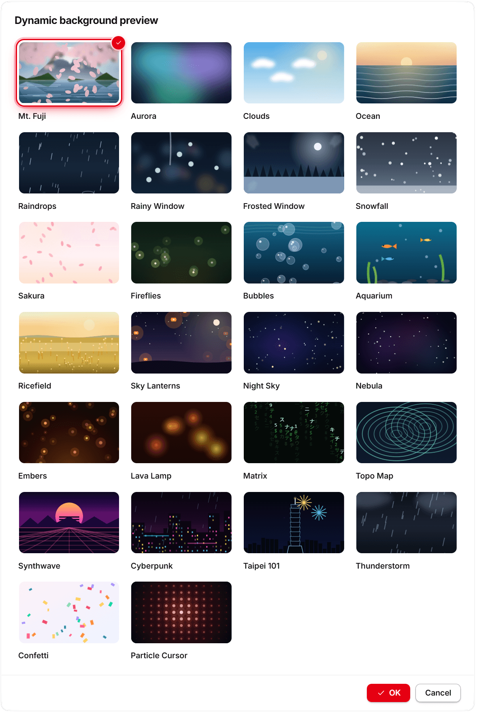

  

<h1 align="center">KKTerm</h1>

  <strong>一扇 Windows 原生視窗，搞定終端機、SSH、SFTP、RDP/VNC 和 Dashboard — 還附一個能照你要求打造專屬小工具的 AI。</strong>

  <em>因為你的工作列不該長得像拉斯維加斯的吃角子老虎。</em>

  名稱來自 <strong>乖乖</strong>，那包台灣系統管理員放在伺服器上、希望它好好工作的綠色椰子口味玉米點心。希望這個 app 也能爭取到它在機架上的一席之地。

  <strong><a href="https://github.com/ryantsai/KKTerm/releases/latest">下載最新版 KKTerm</a></strong>

  
  
  
  
  
   
  
  
   
  
    <a href="README.md">English</a> ·
    <strong>繁體中文</strong> ·
    <a href="README.zh-CN.md">简体中文</a> ·
    <a href="README.ja.md">日本語</a> ·
    <a href="README.ko.md">한국어</a> ·
    <a href="README.fr.md">Français</a> ·
    <a href="README.de.md">Deutsch</a> ·
    <a href="README.es.md">Español</a> ·
    <a href="README.es-MX.md">Español (MX)</a> ·
    <a href="README.it.md">Italiano</a> ·
    <a href="README.pt-BR.md">Português (BR)</a> ·
    <a href="README.th.md">ไทย</a> ·
    <a href="README.id.md">Bahasa Indonesia</a> ·
    <a href="README.vi.md">Tiếng Việt</a>
  

---

## 45 秒簡報

你是 sysadmin / DevOps / 玩 homelab 的人 / vibe coder。現在你手上有：

- 一個終端機模擬器
- 一個獨立的 SSH client（裡面那份 profile 清單花了你整個週末才整理出來）
- 一個 2007 年的 SFTP client，不知為何還活著
- 遠端桌面開在一個你一直在錯誤螢幕上找的視窗
- 一個 VNC viewer，只為了那一台 Linux 主機
- 一個瀏覽器分頁，開著路由器後台
- 一個檔案管理器用來翻翻本機磁碟，還有一個文字編輯器只為了那一份你一直在 tail 的 log
- 一個跑在遠端主機上的 `claude` / `codex` session，每次 Wi-Fi 一打噴嚏就斷
- 一張寫著密碼的便利貼*（沒事，我們不會說出去）*

**KKTerm 把這些塞進同一扇視窗。** 原生 Windows — *沒錯，是故意的，當整個開發工具圈都先做 mac 版、把你的作業系統當成備註處理的時候* — 一個安裝程式就搞定，而且絕不回家報告。

順便還幫你做了幾件你不知道自己需要的事：

- 一個 **Dashboard**，你可以對 AI 說 *「幫我做一個每 30 秒 ping 一次路由器的 widget」*，它就會在你的網格上憑空出現，而且關在自己的沙箱裡。
- **能自動 attach 回遠端 `claude` / `codex` session 的 SSH pane**，這樣每次 Wi-Fi 鬧脾氣，你那個跑了六小時的工作也不會陣亡。
- **工作區（Workspaces）**，把你的 homelab、正職工作、還有那個客戶的伺服器分別關在可以一鍵切換的獨立容器裡。
- 一個 **Install Helper**，幫你找到、安裝、更新並啟動那些平常得翻十個瀏覽器分頁才找得到的 Windows 開發工具。
- Dashboard *和你的終端機*用的**二十五種 canvas 動畫背景**（對，包括 `matrix`），因為我們也沒在客氣。

而最棒的部分：AI 助理可以把一句話變成一個你真的會繼續使用的小型 Dashboard 工具。

> ⭐ **如果這聽起來就是你過去六年一直想做的那個 app — 請按個星星，讓我們知道有人在看。這真的很有幫助。**

對接下來該做什麼有想法嗎？來公開回饋串聊聊：
**[KKTerm 該為跨平台管理工作流優先做什麼？](https://github.com/ryantsai/KKTerm/discussions/141)**

---

## 為什麼叫「KKTerm」？

走進任何一座台灣的資料中心，抬頭看機架頂端。從台積電晶圓廠、台北捷運控制室、國泰銀行的伺服器機房、中華電信的交換機房 — 你都會看到一小包綠色的 **乖乖**，那是 1960 年代就有的椰子口味玉米點心。

名字字面上就是「**乖乖的**」、「**聽話**」。IT 圈的傳統很簡單，而且大家絕對是認真的：

- **必須是綠色（椰子口味）。** 黃色（咖哩）代表*今天請假*；紅色（辣味）會把伺服器惹毛。只有綠色。
- **不能過期。** 過期的乖乖會反過來害你。工程師會勤奮地汰舊換新。
- **必須看得到。** 伺服器必須知道它在那裡。
- **不要吃它。** 那包乖乖正在值勤。

亞洲一些最大、最無聊、最執著於 uptime 的系統，就是這樣靠著一包貼在機殼上的玉米脆果在運作。它有效，是因為維護它的人相信它有效 — 這也算是對 IT 文化最誠實的描述了。

**KKTerm** 就是 **Kuai Kuai Term** — 一個跟那包點心一樣有抱負的管理工作區：安靜地坐在你那些重要機器旁邊，幫它們乖一點。本地優先。零遙測。AI 全程要審批。那種無聊但可靠的軟體。

我們目前還沒辦法在 installer 裡塞一包真正的乖乖。那是 v2 的待辦事項。

---

## 親眼看看

  

<em>（demo GIF。一張圖勝過一千個列點，而我們列點也快用完了。）</em>

---

## 一扇視窗，所有連線

| 你想要… | KKTerm 幫你做到 |
| --- | --- |
| 開一個本機 PowerShell / cmd / WSL shell | 本機終端機，並排擺著 |
| SSH 進伺服器 | SSH 支援金鑰、agent、密碼、跳板主機與 port forwarding |
| 瀏覽那台伺服器上的檔案 | 從 SSH 連線直接開 SFTP — 雙窗格、拖曳就能傳 |
| FTP 到 2012 年的 NAS | FTP / FTPS，同一個檔案瀏覽器 |
| Telnet 連上古董設備 | 對，Telnet 也在裡面 |
| 跟序列埠對話 | Serial 連線 — 選個 COM port 和 baud 就好 |
| 遠端進一台 Windows 機器 | 內建貨真價實的微軟遠端桌面 |
| VNC 進一台 Pi | VNC，直接畫進工作區 |
| 開路由器的網頁後台 | 內嵌瀏覽器分頁，還會幫你帶入登入資訊 |
| 翻自己的本機磁碟 | 一個本機 File Explorer pane，和 SFTP 同一套雙窗格外殼 |
| 開一份 log、CSV、圖片或 PDF | 內建 Document 檢視器，還有真正能 tail 跟隨的 log 模式 |
| 看主機的 CPU | 即時狀態列，加上一個你可以自己堆東西的 Dashboard |

同一個 app。同一扇視窗。同一組快捷鍵。同一套但願不會讓你眼睛流血的主題。

  

---

## 為什麼大家整天開著它

### 下載很小，啟動像閃電

KKTerm 做得像一個工具，而不是一整個平台。現在的桌面版不到 20 MB，安裝很快，啟動也快到不像是在開第二套作業系統。

這種小體積在跳板機、老筆電、VM 裡很重要；每多一個背景服務，就多一個值得懷疑的東西。KKTerm 打開、恢復你的工作區，然後安靜退到背景。

### 多窗格格線，想怎麼混都行

一個 Tab 可以放一組 Pane 格線，而且這些 Pane 不必是同一種。SSH 旁邊放 SFTP、RDP Session 下面放本機 PowerShell、VNC 旁邊放路由器 Web UI，或把檔案瀏覽器放在正在搬檔案的終端機旁邊。

這是一個能容納真實管理工作混亂形狀的工作區：混搭 Connection 類型、調整格線大小、讓 live Sessions 繼續活著，別再在一堆視窗之間 Alt-Tab。

  

### 一個會幫你操控終端機的 AI 助理

大多數「終端機裡的 AI」demo 都停在聊天。KKTerm 的助理是在你的 session *裡面*運作：你把畫面上現有的內容當 context 交給它，它就對你連著的那些機器動手 — 而且全程有人類在審批迴圈裡。

**直接把 context 交給它。** 不必複製貼上來回搬：

- **把終端機 buffer 加進 context** 會把一個正在跑的本機或遠端 session 的 scrollback 直接拉進對話，這樣「為什麼這次 build 失敗了？」就變成它真的讀得到的問題。
- **截圖選單**框一塊區域或整個 Pane，把圖片丟進對話，這樣「為什麼這個對話框長得怪怪的？」就變成它答得出來的問題。
- **附加檔案**以及目前的 **Dashboard / IT Ops 頁面 context**，讓它根據你真正在看的東西推理，而不是一段含糊的描述。

**讓它動手 — 但要過審批。** 助理可以在你的終端機裡跑指令、打開 Connection、把 widget 放到 Dashboard 上，但有風險的部分仍然受控：

- **決定它能碰什麼** — 整類工具（Dashboard / Connections / Live Sessions）可以一鍵開關。
- **決定它怎麼問** — `Prompt`（預設，每次都問）或 `Allow All`（你是成年人，你簽了切結書）。
- 任何看起來像 `rm -rf` 的東西都會被標記為危險 — 並在審批卡片上顯示原因 — 然後等一個人類明確點頭。AI 不會因為有人在某份 man page 裡塞了 prompt injection，就偷偷跑一個破壞性指令。

**自帶你的大腦。** 它能對接 OpenAI、Anthropic、OpenRouter、DeepSeek、Grok、Azure OpenAI、LiteLLM、GitHub Copilot、Ollama、NVIDIA，或任何 OpenAI 相容的端點 — 也可以用 **Claude Code CLI** 或 **Codex CLI** 當後端，直接沿用你現有的 `claude` / `codex` 登入與訂閱，而不必另外給一把 API 金鑰。你的 API 金鑰會進到 OS keychain。

  

### 一個不假裝自己是 Grafana 的 Dashboard

Dashboard 是一個可拖曳、可縮放的 widget 網格。它不是給你做 PB 級觀測用的 — 它是給「我想要一個按鈕啟動我最愛的五個 app，旁邊一個面板顯示我 SSH 主機的 uptime，*再旁邊*就是我的聊天視窗」用的。

#### AI 打造的 Widget — 用講的，它就生出來

這部分是我們真心興奮的。你不用從市集挑，也不用寫 JavaScript。你**告訴 AI 助理你要什麼**，它就直接在你的 Dashboard 上把 widget 做出來：

> *「加一個 widget，把我主 repo 最近 5 筆 commit 列成清單。」*
> *「幫我做一個便利貼 widget，放我的 on-call 小抄。」*
> *「做一個 widget，每 30 秒 ping 一次我家路由器，顯示綠燈/紅燈。」*
> *「我要一個碼錶。樣式你自己發揮，給我點驚喜。」*

有些是單純的顯示面板（markdown、checklist、一個大大的數字）；有些則在你核准過的隔離沙箱裡跑即時程式碼。每個你留下的 widget 都是你的 — 它會帶著自己的顏色、圖示、標題保存下來，而且你可以放好幾份不同大小。膩了就右鍵刪掉。

  

#### Dashboard／終端機動畫背景（因為我們就是想要）

可以挑一種心情 — 給每個 Dashboard view，*或是放在任何終端機後面* — 從**二十五種** canvas 動畫背景裡選：

| 心情 | 背景 |
| --- | --- |
| 平靜 | `aurora`、`clouds`、`ocean`、`raindrops`、`rainywindow`、`frostedWindow`、`snow`、`sakura`、`fireflies`、`bubbles`、`aquarium`、`ricefield`、`lanterns` |
| 太空 | `starfield`、`nebula` |
| 溫暖 | `embers`、`lava` |
| 極客 | `matrix`、`topo`、`synthwave` |
| 躁動 | `cyberpunk`、`taipei101`、`thunderstorm`、`confetti`、`particleCursor` |

同一個挑選器也支援你的終端機 pane，所以你可以把 `matrix` 放在一個正在跑的 SSH session 後面。你切走的時候它們會暫停，所以幾乎不耗資源。把 `matrix` 配上你的 AI 助理，氣氛瞬間變成「我極度有生產力，而且大概人在華卓斯基的電影裡」。或者選 `ocean`，看起來像個正經人。兩種選擇我們都不評判。

  

### 讓你的 AI agent 活著

這是大家愛上的第二個功能。KKTerm 的 SSH 終端機可以直接把你丟進遠端主機上一個**命名的 tmux session**，而且它撐得過重連：

- 開一個啟用 tmux 的 SSH 連線，然後啟動 `claude`、`codex`、`gemini-cli`、`cursor-agent`，或任何你愛用的長時間 agent。
- 闔上筆電。再打開。Pane 會悄悄重新 attach — agent 還在跑，scrollback 還在，還在做它剛才在做的事。
- 網路抖了一下？KKTerm 會默默重連回同一個 session，不來煩你。
- 想讓助理幫忙？「把終端機 buffer 加進 context」會把整個遠端 session 拉進對話，讓你的本地 AI 能推理你的遠端 agent 在做什麼。

如果你曾經因為飯店那爛 Wi-Fi 而丟掉一個跑了六小時的 `claude` 或 `codex` session，光這一個功能就值回票價。（這 app 是免費的。但這功能還是值得。）

本機 shell 在 Windows 上也有同樣的把戲：PowerShell pane 可以跑在 **psmux**（原生 tmux 複製品）裡，讓你的本機長時間工作，也能像遠端那樣撐過 Pane 被關掉。

  

### 用工作區把不同世界分開

homelab、正職工作、還有那個客戶的伺服器，本來就不該擠在同一份清單裡。**工作區（Workspaces）**是命名、彼此隔離的 Connection 容器，你可以從 Activity Rail 一鍵切換。切換只會重新框定連線樹 — 你打開的 Sessions、Dashboard 和設定都原地不動 — 所以換情境只花一下點擊，而不是重開 app。

  

### 換上你喜歡的配色（色彩主題）

背景是好玩的部分；**色彩主題**才是你一整天真正盯著看的東西。KKTerm 內建**十四種**色彩配色，會重新妝點整個 app 外殼 — Activity Rail、連線樹、分頁、對話框 — 在設定 ▸ 外觀裡每一種都有即時迷你預覽：

| 風格 | 配色 |
| --- | --- |
| 中性 | `Default`、`Dark`、`Light`、`Match OS`（跟隨系統明暗）、`Mac` |
| 繽紛 | `Orange`、`Purple`、`Pink`、`Confetti`、`Bubble Tea` |
| 在地風味 | `Green Kuai Kuai`（對，就是那個乖乖）、`Blue See`、`Blue, Green and White`、`Semiconductor` |

不管你選哪一種配色，終端機都維持它自己的深色調色盤，所以你的 shell 永遠清楚易讀，而 app 的其他部分則配合你的心情。

  

### Install Helper（僅限 Windows）

把一台全新的 Windows 機器設定成開發環境，通常等於十個瀏覽器分頁加上一堆「下一步、下一步、完成」。**Install Helper** 是一個內建的工具目錄，幫你找到、安裝、更新並移除那些你本來得手動追的工具 — 全程不用離開 KKTerm：

- **Essentials（必備）** — winget、Node（透過 nvm-windows）、Python（透過 uv）、Git。
- **AI Agents** — Claude Code、Codex、Antigravity、OpenCode，以及其他編程 agent CLI 與桌面 app。
- **AI Platforms** — 本機／自架的 stack，像 Ollama、n8n、Open WebUI、Flowise、Langflow，幫你啟動並託管。
- **Development（開發）** — 編輯器、容器、API 工具、WSL 及其發行版、Rustup。
- **Windows Power User** — PowerToys、PowerShell 7、psmux、Sysinternals、Everything、Ditto。
- **Remote Access（遠端存取）** — Tailscale、RustDesk。
- **Utilities（工具）** — Notepad++、ripgrep、jq、fzf、7-Zip、Oh My Posh、FFmpeg 等等。

它會偵測哪些已經裝好、標出哪些有更新，**全部更新**還會幫你把整個佇列跑完。UAC 提示維持明確，沒有東西會默默安裝，整份目錄就附在 app 裡 — 不用額外帳號，沒有背景遙測。

> macOS 和 Linux 已經有你愛用的套件管理器，所以 Install Helper 是 Windows 限定的便利功能，不包含在那些版本裡。

  

---

## KKTerm 不是什麼

一份簡短清單，因為誠實才能換到信任：

- **不是雲端產品。** 沒有同步、沒有團隊帳號、沒有 SaaS 方案。如果你哪天看到「登入 KKTerm」對話框，那一定是出了什麼天大的差錯。
- **不假裝所有作業系統都一樣。** KKTerm 發行 Windows、macOS 和 Linux 版本，但平台特定功能會保持誠實：Windows 有原生 RDP ActiveX 路徑和 Install Helper 目錄，macOS 和 Linux 則使用這些系統上可用的可攜路徑。
- **不是自主 AI agent。** 助理提議，人類決定。`Allow All` 是你自己做的選擇，不是預設值。
- **不是 Grafana / Datadog 的替代品。** Dashboard 是給個人控制面板用的，不是給一萬台主機觀測用的。
- **不是 Kubernetes IDE。** 它是一個以終端機為核心的管理工作區。拜託別叫它畫 Helm chart。

如果上面任何一條*曾經*是你的雷點 — 公道，那我們 v2 見。

---

## 取得 KKTerm

**[下載最新版 KKTerm](https://github.com/ryantsai/KKTerm/releases/latest)**，選擇適用於你平台的發行檔並開啟它。Windows 安裝程式目前**未簽章** — 發行簽章在 roadmap 上，在那之前你的防毒軟體可能會對你投以嚴厲的眼神。這是正常的。

想從原始碼建置或貢獻？你需要的一切都在 [`CONTRIBUTING.md`](CONTRIBUTING.md)。

---

## Roadmap（精簡版）

- 跨平台發行打磨
- 發行簽章完善
- 更強的檔案傳輸（續傳、資料夾同步、壓縮/解壓）
- 更完整的遠端桌面剪貼簿與裝置共享
- 更多內建 Dashboard widget
- 更多 IT Ops 自動化功能

完整且時常更新的版本：[`docs/ROADMAP.md`](docs/ROADMAP.md)。

---

## 參與貢獻

我們很歡迎有人幫忙。真心的。小事也算數：

- **跑跑 dev 版本**，覺得哪裡怪怪的就開個 issue。「感覺怪怪的」是合法的 bug 回報；我們會陪你一起挖。
- **翻譯一個語系。** 英文是 source of truth；旁邊還住著另外十三種語言。
- **加一個 Dashboard widget。** 挑個小點子，做出來，學會這套模式。
- **改善手冊。** 如果你用了某個功能、但文件幫不上忙，一個修好它的 PR 就是黃金。

完整的環境設定、專案結構與 PR 檢查清單都在 [`CONTRIBUTING.md`](CONTRIBUTING.md)。在找切入點嗎？用 [`good first issue`](https://github.com/ryantsai/KKTerm/issues?q=is%3Aissue+is%3Aopen+label%3A%22good+first+issue%22) 或 [`help wanted`](https://github.com/ryantsai/KKTerm/issues?q=is%3Aissue+is%3Aopen+label%3A%22help+wanted%22) 篩選 open issues。

---

## 專案文件

- [產品脈絡](CONTEXT.md) — 你該對齊的領域語言
- [架構](docs/ARCHITECTURE.md) — 模組地圖、新程式碼該放哪
- [使用手冊](docs/manual/INDEX.md) — 一個功能一個功能走過一遍
- [Roadmap](docs/ROADMAP.md)
- [Dashboard 架構](docs/DASHBOARD.md)
- [內建 MCP 伺服器](docs/MCP.md)
- [AI provider 指南](docs/AI_PROVIDERS.md)

---

## Star 歷史

<a href="https://www.star-history.com/#ryantsai/KKTerm&Date">
  <picture>
    <source media="(prefers-color-scheme: dark)" srcset="https://api.star-history.com/svg?repos=ryantsai/KKTerm&type=Date&theme=dark" />
    <source media="(prefers-color-scheme: light)" srcset="https://api.star-history.com/svg?repos=ryantsai/KKTerm&type=Date" />
    
  </picture>
</a>

如果你看到這裡卻還沒按星星 — 你在等什麼，等一張親筆邀請函嗎？這就是那張親筆邀請函。

⭐ **[在 GitHub 上幫 KKTerm 按星星](https://github.com/ryantsai/KKTerm)** — 只要點一下，就能讓維護者開心一整週。把它想成放在機架上的一包數位乖乖。

---

## 授權

MIT。見 [LICENSE](LICENSE)。用它、fork 它、拿去出貨、把它放進一個沒人找得到的 homelab — 這就是那個交易。
